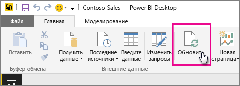
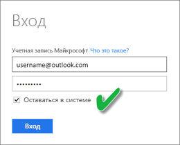

# Обновление набора данных, хранимого в OneDrive или SharePoint Online
Импорт файлов из OneDrive или SharePoint Online в службу Power BI — это отличный способ синхронизировать данные между **Power BI Desktop** и Power BI.

## Преимущества хранения файла Power BI Desktop в OneDrive или SharePoint Online
Когда вы храните файл **Power BI Desktop** в службе OneDrive или SharePoint Online, все загруженные в модель файла данные импортируются в набор данных, а все отчеты, созданные вами в файле, загружаются в область **отчетов** в Power BI. Когда вы внесете и сохраните изменения в файл в OneDrive или SharePoint Online, например добавляете новые меры, изменяете имена столбцов или визуализаций, эти изменения также будут обновлены и в службе Power BI. Как правило, это происходит в течение одного часа.

Вы можете выполнить однократное ручное обновление прямо в Power BI Desktop, нажав кнопку "Обновить" на вкладке "Главная" ленты. При нажатии этой кнопки "Обновить" данные в модели *файла* обновляются измененными данными из исходного источника данных. Такое обновление, выполняемое прямо из приложения Power BI Desktop, отличается от ручного или запланированного обновления в Power BI, и важно понимать, чем именно они различаются.

При импорте файла Power BI Desktop из OneDrive или SharePoint Online данные вместе с другими сведениями о модели загружаются в набор данных в Power BI. В службе Power BI (не Power BI Desktop) требуется обновлять данные в наборе данных, так как именно на нем основаны ваши отчеты в службе Power BI. Так как источники данных являются внешними, вы можете вручную обновить набор данных с помощью функции **Обновить сейчас** или настроить **расписание обновления** с помощью соответствующей функции.

При обновлении набора данных служба Power BI не подключается к файлу в OneDrive или SharePoint Online для запроса обновленных данных. Она использует данные в наборе данных для подключения непосредственно к источникам данных, чтобы получить обновленные данные, которые затем загружает в набор данных. Эти обновленные данные в наборе данных не синхронизированы с файлом в OneDrive или SharePoint Online.

## Что поддерживается?
В Power BI поддерживаются функции "Обновить сейчас" и "Расписание обновлений" для наборов данных, которые созданы из файлов Power BI Desktop, импортированных с локального диска, когда операция "Получение данных" или редактор запросов используется для подключения и загрузки данных из любого из следующих источников данных.

### Шлюз Power BI — персональный
* Все источники данных в сети, отображаемые в редакторе запросов и разделе "Получение данных" в Power BI Desktop.
* Все локальные источники данных, отображаемые в редакторе запросов и разделе "Получение данных" в Power BI Desktop, кроме файла Hadoop (HDFS) и Microsoft Exchange.

<!-- Refresh Data sources-->
[!INCLUDE [refresh-datasources](./includes/refresh-datasources.md)]

> [!NOTE]
> Следует установить и запустить шлюз, чтобы служба Power BI могла подключаться к локальным источникам данных и обновлять набор данных.
> 
> 

## OneDrive или OneDrive для бизнеса. В чем разница?
При наличии личного OneDrive и OneDrive для бизнеса рекомендуется хранить все файлы, которые нужно импортировать в Power BI, в OneDrive для бизнеса. И вот почему. Скорее всего, для доступа к этим хранилищам вы используете две учетные записи.

Подключение к OneDrive для бизнеса в Power BI обычно выполняется автоматически, поскольку чаще всего для входа в Power BI и в OneDrive для бизнеса используется одна и та же учетная запись. Однако в личное хранилище OneDrive вы, скорее всего, входите с помощью другой [учетной записи Майкрософт](http://www.microsoft.com/account/default.aspx).

При выполнении входа с использованием учетной записи Майкрософт обязательно установите флажок "Оставаться в системе". После этого Power BI сможет синхронизировать все обновления, внесенные в файл в Power BI Desktop, с наборами данных в Power BI.  
    

При внесении изменений в файл в OneDrive, который не удается синхронизировать с набором данных или отчетами в Power BI из-за изменения учетных данных вашей учетной записи Майкрософт, потребуется подключиться и снова импортировать файл из своего личного хранилища OneDrive.

## Как составить расписание обновления?
При настройке расписания обновления служба Power BI будет подключаться непосредственно к источникам данных, используя сведения о подключении и учетные данные в наборе данных для запроса обновленных данных и последующей их загрузки в набор данных. Также обновляются все визуализации в отчетах и информационных панелях, основанных на этом наборе данных в службе Power BI.

Дополнительные сведения о настройке запланированного обновления см. в разделе [Настройка запланированного обновления](refresh-scheduled-refresh.md).

## Действия в случае возникновения проблем
Возникающие проблемы обычно вызваны тем, что Power BI не удается выполнить вход в источники данных либо набор данных подключается к локальному источнику данных, а шлюз находится вне сети. Убедитесь, что служба Power BI может выполнить вход в источники данных. Если изменяется пароль, который вы используете для входа в источник данных или Power BI выполняет выход из источника данных, не забудьте повторно войти в источники данных в разделе «Учетные данные источника данных».

Если вы вносите изменения в файл Power BI Desktop в OneDrive, сохраняете его, а соответствующие изменения не отражаются в Power BI примерно в течение одного часа, это может быть вызвано тем, что Power BI не удается подключиться к OneDrive. Повторите попытку подключения к файлу в OneDrive. Если отображается запрос на вход, обязательно установите флажок "Оставаться в системе". Поскольку службе Power BI не удалось подключиться к OneDrive для синхронизации с файлом Power BI, вам потребуется импортировать файл еще раз.

Не забудьте оставить флажок **Отправлять мне уведомления по электронной почте об ошибке обновления** установленным. Вам необходимо оперативно получать информацию о сбое запланированного обновления.

## Устранение неполадок
Иногда обновление данных может завершиться неправильно. Как правило, проблема связана со шлюзом. Ознакомьтесь со статьями об устранении неполадок со шлюзом и узнайте о соответствующих средствах и известных проблемах.

[Устранение неполадок локального шлюза данных](service-gateway-onprem-tshoot.md)

[Устранение неполадок с Power BI Gateway — Personal](service-admin-troubleshooting-power-bi-personal-gateway.md)

Появились дополнительные вопросы? [Попробуйте задать вопрос в сообществе Power BI.](http://community.powerbi.com/)

