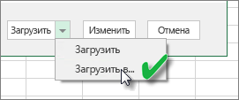
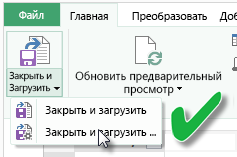

# Обновление набора данных, созданного из книги Excel на локальном диске
## Что поддерживается?
В Power BI поддерживаются функции "Обновить сейчас" и "Расписание обновлений" для наборов данных, которые созданы из книг Excel, импортированных с локального диска, когда Power Query (раздел "Скачать & преобразовать" в Excel 2016) или Power Pivot используется для подключения к какому-либо из следующих источников данных и загрузки данных в модель данных Excel.  

### Шлюз Power BI — персональный
* Все источники данных в сети, отображаемые в Power Query.
* Все локальные источники данных, отображаемые в Power Query, кроме файла Hadoop (HDFS) и Microsoft Exchange.
* Все источники данных в сети, отображаемые в Power Pivot.\*
* Все локальные источники данных, отображаемые в Power Pivot, кроме файла Hadoop (HDFS) и Microsoft Exchange.

<!-- Refresh Data sources-->
[!INCLUDE [refresh-datasources](./includes/refresh-datasources.md)]

> **Примечания**  
> 
> * Следует установить и запустить шлюз, чтобы служба Power BI могла подключаться к локальным источникам данных и обновлять набор данных.
> * При использовании Excel 2013 убедитесь, что компонент Power Query обновлен до самой последней версии.
> * Обновление не поддерживается для книг Excel, импортированных с локального диска, где данные существуют только в форме листов или связанных таблиц. Обновление поддерживается для данных листа, если они хранятся в OneDrive и импортируются оттуда. Дополнительные сведения см. в разделе [Обновление набора данных, созданного из книги Excel в OneDrive или SharePoint Online](refresh-excel-file-onedrive.md).
> * При обновлении набора данных, созданного из книги Excel, которая была импортирована с локального диска, обновляются только данные, запрошенные из источников данных. Если вы изменяете структуру модели данных в Excel или Power Pivot, например создаете новую меру или изменяете имя столбца, такие изменения не копируются в набор данных. При внесении указанных изменений необходимо повторно отправить или повторно опубликовать книгу. Если вы собираетесь регулярно вносить изменения в структуру книги и хотите, чтобы они отображались в наборе данных в Power BI без необходимости повторной отправки, рассмотрите возможность помещения книги в OneDrive. Power BI автоматически обновляет данные структуры и листов из книг, которые хранятся в OneDrive и импортируются оттуда.
> 
> 

## Как убедиться, что данные загружены в модель данных Excel?
При использовании Power Query (получение и преобразование данных в Excel 2016) для подключения к источнику данных у вас есть несколько расположений для загрузки данных. Чтобы загрузить данные в модель данных, необходимо выбрать параметр **Добавить эти данные в модель данных** в диалоговом окне **Load To** (Загрузить в).

> [!NOTE]
> На приведенных здесь рисунках показана программа Excel 2016.
> 
> 

В окне **Навигатор** щелкните **Загрузить в…**.  
    

Или, если щелкнуть элемент **Изменить** в навигаторе, открывается редактор запросов. В нем можно щелкнуть **Закрыть и загрузить в…**.  
    

Затем в окне **Load To**(Загрузить в) необходимо выбрать параметр **Добавить эти данные в модель данных**.  
    

### Что будет, если использовать получение внешних данных в Power Pivot?
Это не проблема. Каждый раз, когда вы используете Power Pivot для подключения и запроса данных из локального источника данных или источника данных в сети, данные автоматически загружаются в модель данных.

## Как составить расписание обновления?
При настройке расписания обновления служба Power BI будет подключаться непосредственно к источникам данных, используя сведения о подключении и учетные данные в наборе данных для запроса обновленных данных и последующей их загрузки в набор данных. Также обновляются все визуализации в отчетах и информационных панелях, основанных на этом наборе данных в службе Power BI.

Дополнительные сведения о настройке запланированного обновления см. в разделе [Настройка запланированного обновления](refresh-scheduled-refresh.md).

## Действия в случае возникновения проблем
Возникающие проблемы обычно вызваны тем, что Power BI не удается выполнить вход в источники данных либо набор данных подключается к локальному источнику данных, а шлюз находится вне сети. Убедитесь, что служба Power BI может выполнить вход в источники данных. Если изменяется пароль, который вы используете для входа в источник данных или Power BI выполняет выход из источника данных, не забудьте повторно войти в источники данных в разделе «Учетные данные источника данных».

Не забудьте оставить флажок **Отправлять мне уведомления по электронной почте об ошибке обновления**установленным. Вам необходимо оперативно получать информацию о сбое запланированного обновления.

>[!IMPORTANT]
>Обновление не поддерживается для веб-каналов OData, которые подключены к Power Pivot и получают оттуда запросы. При использовании веб-канала OData в качестве источника данных воспользуйтесь Power Query.

## Устранение неполадок
Иногда обновление данных может завершиться неправильно. Как правило, проблема связана со шлюзом. Ознакомьтесь со статьями об устранении неполадок со шлюзом и узнайте о соответствующих средствах и известных проблемах.

[Устранение неполадок локального шлюза данных](service-gateway-onprem-tshoot.md)

[Устранение неполадок с Power BI Gateway — Personal](service-admin-troubleshooting-power-bi-personal-gateway.md)

## Дальнейшие действия
Появились дополнительные вопросы? [Ответы на них см. в сообществе Power BI.](http://community.powerbi.com/)

