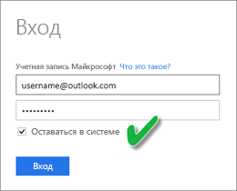
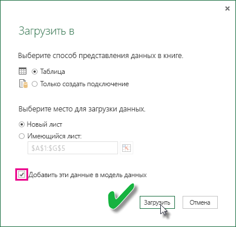

# Обновление набора данных, созданного из книги Excel в OneDrive или SharePoint Online
Можно импортировать книги Excel, которые хранятся на локальном компьютере или в облаке, например в OneDrive для бизнеса или SharePoint Online. Мы рассмотрим преимущества использования облачного хранилища для файлов Excel. Дополнительные сведения об импорте файлов Excel в Power BI см. в разделе [Получение данных из файлов книг Excel](service-excel-workbook-files.md).

## Каковы преимущества?
Импорт файлов из OneDrive или SharePoint Online — это отличный способ убедиться, что ваша работа в Excel остается синхронизированной со службой Power BI. Все данные, которые вы загрузили в модель файла, импортируются в набор данных, а все отчеты, созданные вами в файле, загружаются в область отчетов в Power BI. При внесении изменений в файл в OneDrive или SharePoint Online, например при добавлении новых мер, изменении имен столбцов или изменении визуализаций, после сохранения эти изменения также обновляются и в Power BI, обычно в течение одного часа.

При импорте книги Excel из личного хранилища OneDrive все ее данные, такие как таблицы на листах и данные, загруженные в модель данных Excel, и структура самой модели данных, импортируются в новый набор данных в Power BI. Все визуализации Power View создаются повторно в области отчетов. Power BI автоматически подключается к книге в OneDrive или SharePoint Online примерно один раз в час, чтобы проверить наличие обновлений. Если книга была изменена, Power BI обновит набор данных и отчеты в службе Power BI.

Можно обновить набор данных в службе Power BI. При обновлении набора данных — вручную или по расписанию — служба Power BI подключается непосредственно к внешним источникам данных для запроса обновленных данных, которые она затем загружает в набор данных. Обновление набора данных в Power BI не приводит к обновлению данных в книге в OneDrive или SharePoint Online. 

## Что поддерживается?
В Power BI поддерживаются функции "Обновить сейчас" и "Расписание обновлений" для наборов данных, которые созданы из файлов Power BI Desktop, импортированных с локального диска, когда операция "Получение данных" или редактор запросов используется для подключения и загрузки данных из любого из следующих источников данных.  

### Шлюз Power BI — персональный
* Все источники данных в сети, отображаемые в редакторе запросов и разделе "Получение данных" в Power BI Desktop.
* Все локальные источники данных, отображаемые в редакторе запросов и разделе "Получение данных" в Power BI Desktop, кроме файла Hadoop (HDFS) и Microsoft Exchange.

<!-- Refresh Data sources-->
[!INCLUDE [refresh-datasources](./includes/refresh-datasources.md)]

> [!NOTE]
> Следует установить и запустить шлюз, чтобы служба Power BI могла подключаться к локальным источникам данных и обновлять набор данных.
> 
> 

## OneDrive или OneDrive для бизнеса. В чем разница?
При наличии личного OneDrive и OneDrive для бизнеса рекомендуется хранить все файлы, которые нужно импортировать в Power BI, в OneDrive для бизнеса. И вот почему. Скорее всего, для доступа к этим хранилищам вы используете две учетные записи.

Подключение к OneDrive для бизнеса в Power BI обычно выполняется автоматически, поскольку чаще всего для входа в Power BI и в OneDrive для бизнеса используется одна и та же учетная запись. Однако в личное хранилище OneDrive вы, скорее всего, входите с помощью другой [учетной записи Майкрософт](http://www.microsoft.com/account/default.aspx).

При выполнении входа с использованием учетной записи Майкрософт обязательно установите флажок "Оставаться в системе". После этого Power BI сможет синхронизировать все обновления, внесенные в файл в Power BI Desktop, с наборами данных в Power BI.  
    

При внесении изменений в файл в OneDrive, который не удается синхронизировать с набором данных или отчетами в Power BI из-за изменения учетных данных вашей учетной записи Майкрософт, потребуется подключиться и снова импортировать файл из своего личного хранилища OneDrive.

## Параметры для подключения к файлу Excel
При подключении к книге Excel в OneDrive для бизнеса или SharePoint Online у вас есть два варианта переноса содержимого книги в Power BI.

[**Импорт данных Excel в Power BI**](service-excel-workbook-files.md#import-or-connect-to-an-excel-workbook-from-power-bi). При импорте книги Excel из OneDrive для бизнеса или SharePoint Online все происходит, как описано выше.

[**Подключение к данным Excel, а также управление ими и просмотр в Power BI**](service-excel-workbook-files.md#one-excel-workbook--two-ways-to-use-it). При использовании этого варианта вы создаете подключение из Power BI прямо к книге в OneDrive для бизнеса или SharePoint Online.

При таком подключении к книге Excel набор данных в Power BI не создается. Тем не менее книга будет отображаться на сайте Power BI в области "Отчеты" со значком Excel рядом с именем. Если при подключении к книге из Power BI (в отличие от Excel Online) книга имеет подключения к внешним источникам данных, которые загружают данные в модель данных Excel, можно настроить расписание обновления.

При такой настройке расписания обновления единственное отличие заключается в том, что обновленные данные попадают в модель данных книги в OneDrive или SharePoint Online, а не в набор данных в Power BI.

## Как убедиться, что данные загружены в модель данных Excel?
При использовании Power Query (получение и преобразование данных в Excel 2016) для подключения к источнику данных у вас есть несколько расположений для загрузки данных. Чтобы загрузить данные в модель данных, необходимо выбрать параметр **Добавить эти данные в модель данных** в диалоговом окне **Load To** (Загрузить в).

> [!NOTE]
> На приведенных здесь рисунках показана программа Excel 2016.
> 
> 

В окне **Навигатор** щелкните **Загрузить в…**.  
    

Или, если щелкнуть элемент **Изменить** в навигаторе, открывается редактор запросов. В нем можно щелкнуть **Закрыть и загрузить в…**.  
    

Затем в окне **Load To**(Загрузить в) необходимо выбрать параметр **Добавить эти данные в модель данных**.  
    

### Что будет, если использовать получение внешних данных в Power Pivot?
Это не проблема. Каждый раз, когда вы используете Power Pivot для подключения и запроса данных из локального источника данных или источника данных в сети, данные автоматически загружаются в модель данных.

## Как составить расписание обновления?
При настройке расписания обновления служба Power BI будет подключаться непосредственно к источникам данных, используя сведения о подключении и учетные данные в наборе данных для запроса обновленных данных и последующей их загрузки в набор данных. Также обновляются все визуализации в отчетах и информационных панелях, основанных на этом наборе данных в службе Power BI.

Дополнительные сведения о настройке запланированного обновления см. в разделе [Настройка запланированного обновления](refresh-scheduled-refresh.md).

## Действия в случае возникновения проблем
Возникающие проблемы обычно вызваны тем, что Power BI не удается выполнить вход в источники данных либо набор данных подключается к локальному источнику данных, а шлюз находится вне сети. Убедитесь, что служба Power BI может выполнить вход в источники данных. Если изменяется пароль, который вы используете для входа в источник данных или Power BI выполняет выход из источника данных, не забудьте повторно войти в источники данных в разделе «Учетные данные источника данных».

Не забудьте оставить флажок **Отправлять мне уведомления по электронной почте об ошибке обновления**установленным. Вам необходимо оперативно получать информацию о сбое запланированного обновления.

## Важные примечания
\* Обновление не поддерживается для веб-каналов OData, которые подключены к Power Pivot и получают оттуда запросы. При использовании веб-канала OData в качестве источника данных воспользуйтесь Power Query.

## Устранение неполадок
Иногда обновление данных может завершиться неправильно. Как правило, проблема связана со шлюзом. Ознакомьтесь со статьями об устранении неполадок со шлюзом и узнайте о соответствующих средствах и известных проблемах.

[Устранение неполадок локального шлюза данных](service-gateway-onprem-tshoot.md)

[Устранение неполадок с Power BI Gateway — Personal](service-admin-troubleshooting-power-bi-personal-gateway.md)

Появились дополнительные вопросы? [Ответы на них см. в сообществе Power BI.](http://community.powerbi.com/)

