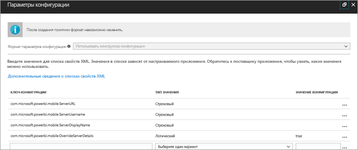
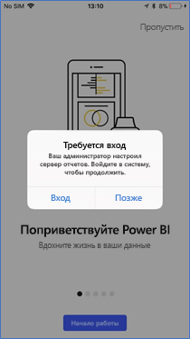

# Удаленная настройка доступа мобильных приложений Power BI для iOS к серверу отчетов

В этой статье вы узнаете, как настроить доступ мобильных приложений Power BI для iOS к серверу отчетов с помощью средства MDM организации. Для этого ИТ-администратор создает политику настройки приложения с требуемыми сведениями, которые должны быть переданы в приложение. 

 После этого пользователям мобильного приложения Power BI для iOS будет проще подключаться к серверу отчетов организации, так как подключение к нему уже настроено. 

## Создание политики настройки приложения в средстве MDM 

Чтобы создать политику настройки приложения, администратору необходимо выполнить в Microsoft Intune указанные ниже действия. В других средствах MDM процедура, необходимая для создания политики настройки приложения, может быть иной. 

1. Подключите средство MDM. 
2. Создайте политику настройки приложения и присвойте ей имя. 
3. Выберите пользователей, к которым будет применена эта политика. 
4. Создайте пары "ключ — значение". 

Эти пары представлены в таблице ниже.

|Ключ  |Тип  |Описание  |
|---------|---------|---------|
| com.microsoft.powerbi.mobile.ServerURL | String | URL-адрес сервера отчетов   Должен начинаться с префикса http или https |
| com.microsoft.powerbi.mobile.ServerUsername | String | [необязательно]   Имя пользователя для подключения к серверу.   Если оно отсутствует, в приложении будет выведен запрос на ввод имени пользователя.| 
| com.microsoft.powerbi.mobile.ServerDisplayName | String | [необязательно]   Значение по умолчанию — "Сервер отчетов"   Понятное имя, представляющее сервер в приложении | 
| com.microsoft.powerbi.mobile.OverrideServerDetails | Boolean | Значение по умолчанию — True   Если задано значение True, имеющееся на мобильном устройстве определение сервера отчетов переопределяется (уже настроенные серверы будут удалены).   Кроме того, пользователь не может удалить данную конфигурацию.   Если задано значение False, передаваемые значения добавляются, но существующие параметры сохраняются.   Если в мобильном приложении уже настроен данный URL-адрес сервера, его конфигурация сохраняется и пользователю не предлагается повторно пройти проверку подлинности для этого сервера. |

Ниже приведен пример настройки политики конфигурации с помощью Intune.

## Подключение конечных пользователей к серверу отчетов

После публикации политики настройки приложения пользователи и устройства, включенные в список рассылки, определенный для этой политики, проходят через описанную ниже процедуру при запуске мобильного приложения Power BI для iOS. 

1. Появляется сообщение о том, что для мобильного приложения настроен доступ к серверу отчетов. Пользователю необходимо коснуться элемента **Вход**.

    

2.  На странице **Подключение к серверу** сведения о сервере отчетов уже заполнены. Необходимо коснуться элемента **Подключиться**.

    

3. Необходимо ввести пароль, чтобы пройти проверку подлинности, а затем коснуться элемента **Вход**. 

    

Теперь пользователи могут просматривать ключевые показатели эффективности и отчеты Power BI, хранящиеся на сервере отчетов, и взаимодействовать с ними.

## Дальнейшие действия
[Обзор функций администратора](admin-handbook-overview.md)  
[Установка сервера отчетов Power BI](install-report-server.md)  

Появились дополнительные вопросы? [Попробуйте задать вопрос в сообществе Power BI.](https://community.powerbi.com/)

