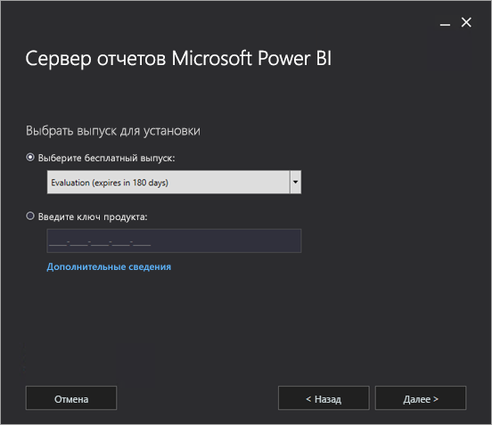
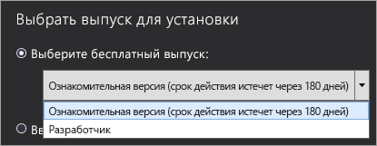
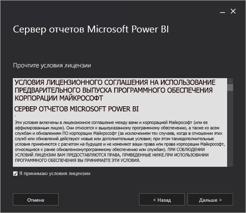
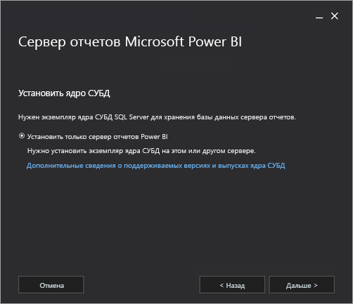
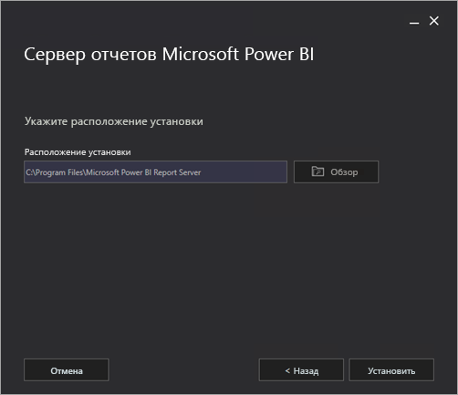
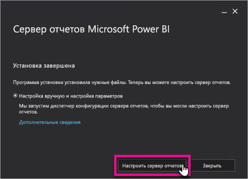
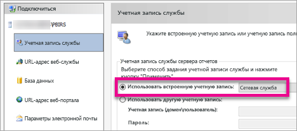
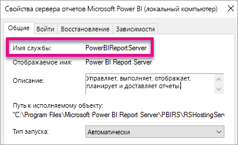

# Установка сервера отчетов Power BI

Узнайте, как установить сервер отчетов Power BI.

 **Скачать** 

Чтобы скачать Сервер отчетов Power BI, перейдите к разделу [Локальная работа с отчетами с использованием сервера Power BI Report Server](https://powerbi.microsoft.com/report-server/) и выберите **Download free trial** (Скачать бесплатную пробную версию). 

## Подготовка

Прежде чем устанавливать Сервер отчетов Power BI, рекомендуем ознакомиться с [требованиями к оборудованию и программному обеспечению для установки Сервера отчетов Power BI](system-requirements.md).

 > [!IMPORTANT]
 > Сервер отчетов Power BI можно установить в среде, имеющей контроллер домена только для чтения (RODC), но для правильной работы ему необходим доступ к контроллеру домена для чтения и записи. Если Сервер отчетов Power BI имеет доступ только к RODC, при попытке администрирования службы могут возникнуть ошибки.

### Ключ продукта сервера отчетов Power BI

#### Power BI Premium

Если вы приобрели Power BI Premium, то на вкладке **Параметры Premium** портала администрирования Power BI сможете получить ключ продукта для сервера отчетов Power BI. Это доступно только глобальным администраторам или пользователям, которым назначена роль администратора службы Power BI.

Нажмите **Ключ сервера отчетов Power**, и появится диалоговое окно с вашим ключом продукта. Вы можете скопировать его и использовать при установке.

#### SQL Server Enterprise Software Assurance (SA)

Если вы заключили соглашение SQL Server Enterprise SA, то можете получить ключ продукта на веб-сайте [Volume Licensing Service Center](https://www.microsoft.com/Licensing/servicecenter/).

## Установка сервера отчетов

Сама по себе установка Сервера отчетов Power BI выполняется очень легко. Чтобы установить его, нужно выполнить совсем немного действий.

Для установки вам не требуется ядро СУБД SQL Server. После установки нужно будет настроить службы отчетов Reporting Services.

1. Найдите папку с файлом PowerBIReportServer.exe и запустите установщик.

2. Выберите **Install Power BI Report Server** (Установить сервер отчетов Power BI).

    
3. Выберите выпуск, который нужно установить, и нажмите кнопку **Далее**.

    

    Вы можете выбрать выпуск Evaluation или Developer из раскрывающегося списка.

    

    Кроме того, можно ввести ключ продукта для сервера, полученный из службы Power BI или на сайте Volume License Service Center. Дополнительные сведения о получении ключа продукта см. в разделе [Подготовка](#before-you-begin).
4. Прочтите и примите условия лицензионного соглашения, а затем нажмите кнопку **Далее**.

    
5. Для хранения базы данных сервера отчетов требуется ядро СУБД. Нажмите кнопку **Далее**, чтобы установить только сервер отчетов.

    
6. Укажите расположение установки для сервера отчетов. Нажмите кнопку **Установить**, чтобы продолжить.

    

    Путь по умолчанию: C:\Program Files\Microsoft Power BI Report Server.

7. После успешной установки нажмите кнопку **Настроить сервер отчетов**, чтобы запустить диспетчер конфигурации служб Reporting Services.

    

## Настройка сервера отчетов

Если нажать кнопку **Настроить сервер отчетов** в программе установки, откроется диспетчер конфигурации служб Reporting Services. Дополнительные сведения см. в статье о [диспетчере конфигурации служб Reporting Services](https://docs.microsoft.com/sql/reporting-services/install-windows/reporting-services-configuration-manager-native-mode).

Для завершения начальной настройки служб Reporting Services необходимо [создать базу данных сервера отчетов](https://docs.microsoft.com/sql/reporting-services/install-windows/ssrs-report-server-create-a-report-server-database). Для выполнения этого шага требуется сервер базы данных SQL Server.

### Создание базы данных на другом сервере

Если вы создаете базу данных сервера отчетов на сервере базы данных на другом компьютере, необходимо изменить учетную запись службы сервера отчетов на учетные данные, которые распознает сервер базы данных. 

По умолчанию сервер отчетов использует учетную запись виртуальной службы. При попытке создать базу данных на другом сервере может появиться следующая ошибка на этапе применения прав на подключение.

`System.Data.SqlClient.SqlException (0x80131904): Windows NT user or group '(null)' not found. Check the name again.`

Чтобы устранить эту ошибку, измените учетную запись службы на учетную запись сетевой службы или домена. Если изменить учетную запись службы на учетную запись сетевой службы, будут применены права в контексте учетной записи компьютера сервера отчетов.

Дополнительные сведения см. в статье, посвященной [настройке учетной записи службы сервера отчетов](https://docs.microsoft.com/sql/reporting-services/install-windows/configure-the-report-server-service-account-ssrs-configuration-manager).

## Служба Windows

Служба Windows создается в процессе установки. Она отображается как **сервер отчетов Power BI**. Имя службы — **PowerBIReportServer**.

## Резервирование URL-адресов по умолчанию

Резервирование URL-адреса состоит из префикса, имени узла, порта и виртуального каталога.

| Часть | Описание |
| --- | --- |
| Префикс |Префикс по умолчанию — HTTP. Если сертификат Secure Sockets Layer (SSL) уже установлен, программа установки пытается создать резервирование URL-адреса с префиксом HTTPS. |
| Имя узла |Имя узла по умолчанию является строгим подстановочным знаком (+). Оно указывает, что сервер отчетов принимает любой HTTP-запрос к указанному порту для любого имени узла, которое соответствует компьютеру, включая `http://<computername>/reportserver`, `http://localhost/reportserver` или`http://<IPAddress>/reportserver.`. |
| Порт |Порт по умолчанию — 80. Если используется порт, отличный от порта 80, необходимо явно добавить его в URL-адрес при открытии веб-портала в окне браузера. |
| Виртуальный каталог |По умолчанию виртуальные каталоги создаются в формате ReportServer для веб-службы сервера отчетов и Reports — для веб-портала. Для веб-службы сервера отчетов виртуальный каталог по умолчанию — **reportserver**. Для веб-портала виртуальный каталог по умолчанию — **reports**. |

Пример полной строки URL-адреса может выглядеть следующим образом:

* `http://+:80/reportserver` — предоставляет доступ к серверу отчетов;
* `http://+:80/reports` — предоставляет доступ к веб-порталу.

## Брандмауэр

При доступе к серверу отчетов с удаленного компьютера необходимо убедиться, что вы настроили правила брандмауэра (если используется брандмауэр).

Необходимо открыть TCP-порт, который определен для URL-адреса веб-службы и URL-адреса веб-портала. По умолчанию для них настроено использование TCP-порта 80.

## Дополнительная настройка

* Чтобы настроить интеграцию со службой Power BI и иметь возможность закреплять элементы отчета на панели мониторинга Power BI, см. статью об [интеграции со службой Power BI](https://docs.microsoft.com/sql/reporting-services/install-windows/power-bi-report-server-integration-configuration-manager).
* Чтобы настроить электронную почту для обработки подписок, см. статьи о [параметрах электронной почты](https://docs.microsoft.com/sql/reporting-services/install-windows/e-mail-settings-reporting-services-native-mode-configuration-manager) и [доставке электронной почты на сервере отчетов](https://docs.microsoft.com/sql/reporting-services/subscriptions/e-mail-delivery-in-reporting-services).
* Чтобы настроить веб-портал и иметь возможность открывать его на компьютере отчетов для просмотра отчетов и управления ими, см. статьи о [настройке брандмауэра для доступа к серверу отчетов](https://docs.microsoft.com/sql/reporting-services/report-server/configure-a-firewall-for-report-server-access) и [настройке сервера отчетов для удаленного администрирования](https://docs.microsoft.com/sql/reporting-services/report-server/configure-a-report-server-for-remote-administration).

## Дальнейшие действия

[Обзор функций администратора](admin-handbook-overview.md)  
[Как найти ключ продукта сервера отчетов](find-product-key.md)  
[Установка приложения Power BI Desktop, оптимизированного для сервера отчетов Power BI](install-powerbi-desktop.md)  
[Verify a Reporting Services Installation](https://docs.microsoft.com/sql/reporting-services/install-windows/verify-a-reporting-services-installation) (Проверка установки служб Reporting Services)  
[Configure the Report Server Service Account (SSRS Configuration Manager)](https://docs.microsoft.com/sql/reporting-services/install-windows/configure-the-report-server-service-account-ssrs-configuration-manager) (Настройка учетной записи службы сервера отчетов (System Center Configuration Manager))  
[Configure Report Server URLs (SSRS Configuration Manager)](https://docs.microsoft.com/sql/reporting-services/install-windows/configure-report-server-urls-ssrs-configuration-manager) (Настройка URL-адресов сервера отчетов (System Center Configuration Manager))  
[Configure a Report Server Database Connection (SSRS Configuration Manager)](https://docs.microsoft.com/sql/reporting-services/install-windows/configure-a-report-server-database-connection-ssrs-configuration-manager) (Настройка подключения к базе данных сервера отчетов (System Center Configuration Manager))  
[SSRS Encryption Keys — Initialize a Report Server](https://docs.microsoft.com/sql/reporting-services/install-windows/ssrs-encryption-keys-initialize-a-report-server) (Ключи шифрования SSRS — инициализация сервера отчетов)  
[Configure SSL Connections on a Native Mode Report Server](https://docs.microsoft.com/sql/reporting-services/security/configure-ssl-connections-on-a-native-mode-report-server) (Настройка подключений SSL на сервере отчетов в основном режиме)  
[Configure Windows Service Accounts and Permissions](https://docs.microsoft.com/sql/database-engine/configure-windows/configure-windows-service-accounts-and-permissions) (Настройка учетных записей и разрешений службы Windows)  
[Поддержка браузера для сервера отчетов Power BI](browser-support.md)

Появились дополнительные вопросы? [Попробуйте задать вопрос в сообществе Power BI.](https://community.powerbi.com/)