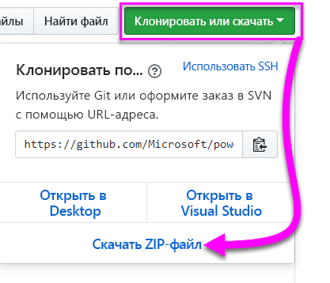
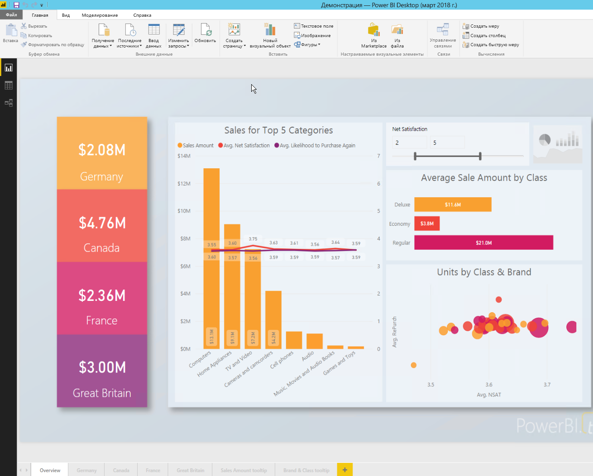
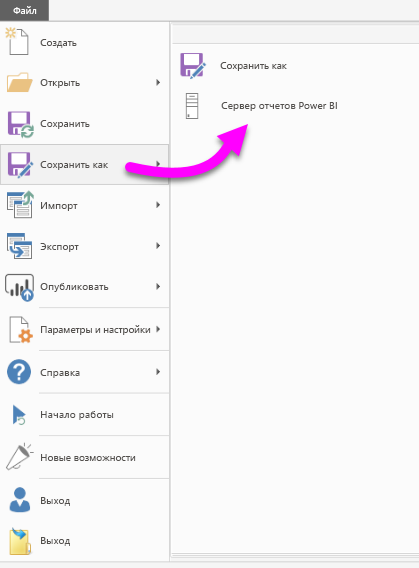
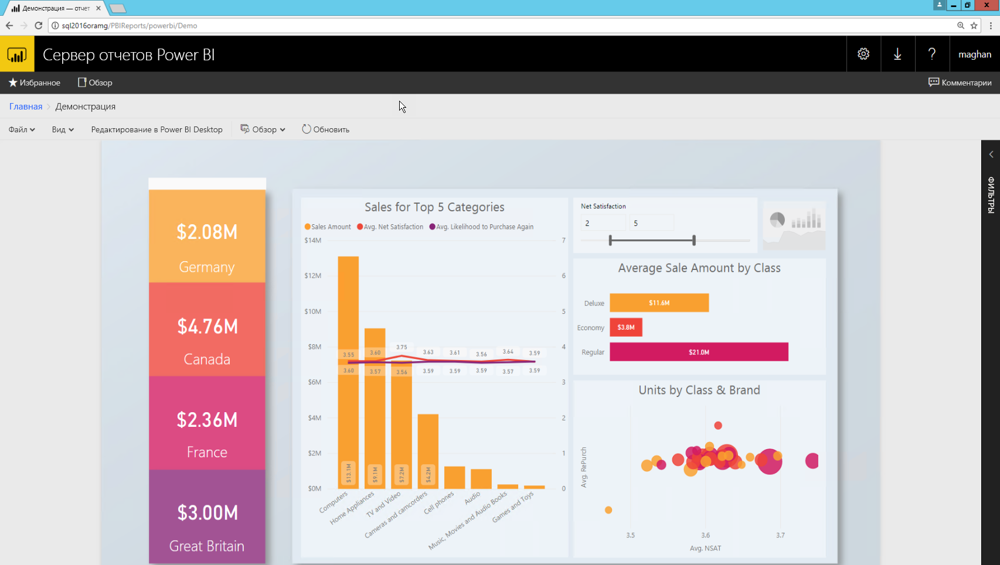
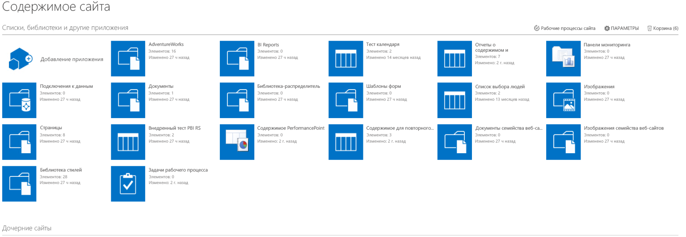
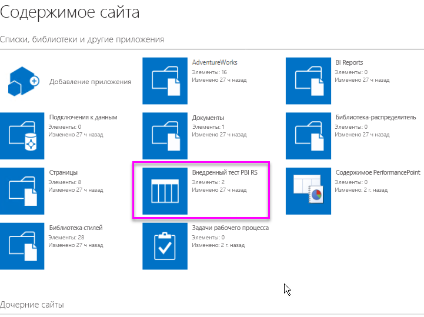
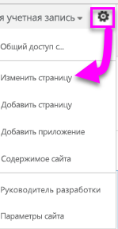
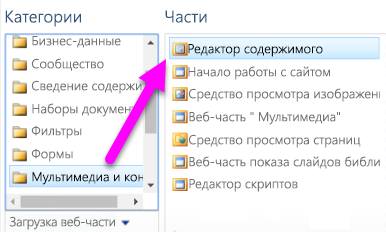
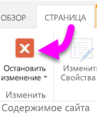

# <a name="quickstart-embed-a-power-bi-report-server-report-using-an-iframe-in-sharepoint-server"></a>Краткое руководство. По внедрению отчета решения "Сервер отчетов Power BI" с помощью iFrame в SharePoint Server

Из этого краткого руководства вы узнаете, как внедрить отчет решения "Сервер отчетов Power BI" с помощью iFrame на страницу SharePoint. Если вы используете SharePoint Online, решение "Сервер отчетов Power BI" должно быть общедоступным. В SharePoint Online веб-часть Power BI, которая работает со службой Power BI, не совместима с решением "Сервер отчетов Power BI". 


## <a name="prerequisites"></a>Предварительные требования
* Требуется установленное и настроенное решение [Сервер отчетов Power BI](https://powerbi.microsoft.com/en-us/report-server/).
* Должен быть установлено [приложение Power BI Desktop, оптимизированное для решения "Сервер отчетов Power BI"](install-powerbi-desktop.md).
* Требуется установленная и настроенная среда [SharePoint](https://docs.microsoft.com/sharepoint/install/install).

## <a name="creating-the-power-bi-report-server-report-url"></a>Создание URL-адреса для отчета решения "Сервер отчетов Power BI"

1. Скачайте из GitHub пример [Демонстрационный блог](https://github.com/Microsoft/powerbi-desktop-samples).

    

2. Отройте пример PBIX-файла, размещенный на GitHub в разделе **приложения Power BI Desktop, оптимизированного для решения "Сервер отчетов Power BI"**.

    

3. Сохраните отчет в решении **Сервер отчетов Power BI**. 

    

4. Просмотрите отчет на **веб-портале**.

    

### <a name="capturing-the-url-parameter"></a>Запись параметра URL-адреса

Получив URL-адрес, вы можете создать iFrame для размещения отчета на веб-странице SharePoint. Вы можете добавить параметр строки запроса `?rs:embed=true` к любому URL-адресу отчета решения "Сервер отчетов Power BI", чтобы внедрить этот отчет в iFrame. 

   Например:
    ``` 
    http://myserver/reports/powerbi/Sales?rs:embed=true
    ```
## <a name="embedding-a-power-bi-report-server-report-in-a-sharepoint-iframe"></a>Внедрение отчета решения "Сервер отчетов Power BI" в SharePoint iFrame

1. Перейдите к странице **Содержимое сайта** в SharePoint.

    

2. Выберите страницу, на которую нужно добавить отчет.

    

3. Щелкните значок шестеренки в верхней правой части страницы и выберите **Изменить страницу**.

    

4. Выберите **Добавить веб-часть**.

    

5. В разделе **Категории** выберите **Среда и контент**, затем в разделе **Части** выберите **Редактор содержимого** и щелкните **Добавить**.

     и 

6. Выберите **Click here to add new content** (Щелкните здесь, чтобы добавить новое содержимое).

    

7. На ленте выберите вкладку **Форматирование текста**, а затем щелкните **Изменить источник**.

     

8. В окне изменения источника вставьте код для iFrame и нажмите кнопку "ОК".

    

     Например:
     ```
     <iframe width="800" height="600" src="http://myserver/reports/powerbi/Sales?rs:embed=true" frameborder="0" allowFullScreen="true"></iframe>
     ```

9. На ленте выберите вкладку **Страница**, затем щелкните **Остановить изменение**.

    

10. Теперь вы увидите отчет на странице.

    

## <a name="next-steps"></a>Дальнейшие действия

[Краткое руководство. Создание отчета Power BI для Сервера отчетов Power BI](quickstart-create-powerbi-report.md)  
[Краткое руководство. Создание отчета с разбивкой на страницы для Сервера отчетов Power BI](quickstart-create-paginated-report.md)  

Появились дополнительные вопросы? [Попробуйте задать вопрос в сообществе Power BI.](https://community.powerbi.com/) 