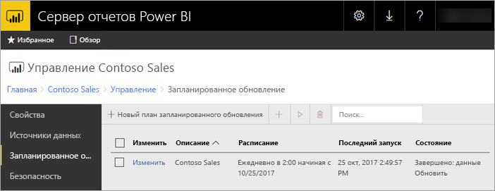

# Запланированное обновление отчета Power BI в решении "Сервер отчетов Power BI"
Запланированное обновление дает возможность использовать актуальные данные для отчетов Power BI.

Запланированное обновление можно реализовать для отчетов Power BI с внедренной моделью. Это означает, что вместо активного подключения или DirectQuery используется импорт данных. При импорте отчет отключен от исходного источника данных, и актуальность информации поддерживается за счет обновления. Запланированное обновление обеспечивает своевременное поступление новейших данных.

Настроить запланированное обновление можно в разделе управления отчета. Дополнительные сведения о настройке запланированного обновления см. в разделе [How to configure Power BI report scheduled refresh](configure-scheduled-refresh.md) (Как настроить запланированное обновление отчета Power BI).

## Принцип работы
Для запланированного обновления отчетов Power BI задействуется несколько компонентов.

* Агент SQL Server, который используется в качестве таймера и создает запланированные события.
* Запланированные задания добавляются в очередь событий и уведомлений в базе данных на сервере отчетов. В масштабном развертывании очередь совместно используется всеми серверами отчетов в развертывании.
* Обработка всех отчетов в результате запланированного события выполняется как фоновый процесс.
* Модель данных загружается в экземпляре служб Analysis Services.
* Для некоторых источников данных используется подсистема гибридных веб-приложений Power Query. Она позволяет подключаться к источникам данных и выполнять преобразование. Другие источники данных могут быть подключены непосредственно из службы Analysis Services, в которой размещены модели данных для решения "Сервер отчетов Power BI".
* Новые данные загружаются в модель данных в службе Analysis Services.
* Служба Analysis Services обрабатывает данные и выполняет все необходимые вычисления.

Решение "Сервер отчетов Power BI" поддерживает очередь событий для всех запланированных операций. В решении регулярно выполняется опрос очереди, чтобы проверить наличие новых событий. По умолчанию очередь проверяется с интервалом в 10 секунд. Чтобы изменить интервал, измените параметры конфигурации **PollingInterval**, **IsNotificationService** и **IsEventService** в файле RSReportServer.config. Кроме того, можно использовать параметр **IsDataModelRefreshService**, чтобы указать, будет ли сервер отчетов обрабатывать запланированные события.

### Службы Analysis Services
Для подготовки отчета Power BI и запланированного обновления нужно загрузить модель данных отчета Power BI в службе Analysis Services. Этот процесс в Analysis Services выполняется с помощью решения "Сервер отчетов Power BI".

## Рекомендации и ограничения
### Когда нельзя использовать запланированное обновление
Запланировать обновление можно не для всех отчетов Power BI. Ниже перечислены отчеты Power BI, для которых нельзя запланировать обновление.

* Отчет с одним или несколькими источниками данных в службе Analysis Services, которые используют активное подключение.
* Отчет с одним или несколькими источниками данных, которые используют DirectQuery.
* Отчет без источников данных. Например, отчет, данные которого вводятся вручную в окне *ввода данных*, или отчет только со статическим содержимым, таким как изображения, текст и т. д.

Кроме того, есть некоторые сценарии с источниками данных в режиме *импорта*, для которых нельзя создать планы обновления.

* Если используется источник данных *Файл* или *Папка* и путь к файлу является локальным (например, C:\Users\user\Documents), план обновления создать нельзя. Нужно использовать путь к расположению, к которому сервер отчетов может подключиться как к общей сетевой папке. Например, *\\myshare\Documents*.
* Если источник данных можно подключить с использованием только OAuth (например, Facebook, Google Analytics, Salesforce и т. д.), план обновления кэша создать нельзя. В настоящее время RS не поддерживает аутентификацию OAuth для любых источников данных — как для отчетов с разбивкой на страницы, так и для мобильных отчетов или отчетов Power BI.

### Ограничения памяти
Рабочая нагрузка для сервера отчетов всегда была аналогична нагрузке веб-приложения. Возможность загрузки отчетов с помощью импорта данных или DirectQuery и запланированного обновления зависит от экземпляра служб Analysis Services, размещенного вместе с сервером отчетов. Это может привести к непредвиденной нехватке памяти на сервере. Планируя развертывание сервера учитывайте то, что служба Analysis Services может использовать память наряду с сервером отчетов.

Сведения о мониторинге экземпляра Analysis Services см. в статье [Наблюдение за экземпляром служб Analysis Services](https://docs.microsoft.com/sql/analysis-services/instances/monitor-an-analysis-services-instance).

Сведения о параметрах памяти служб Analysis Services см. в статье [Свойства памяти](https://docs.microsoft.com/sql/analysis-services/server-properties/memory-properties).

### Аутентификация и Kerberos
Если для источника данных настроено использование учетных данных Windows, для работы может потребоваться настройка ограниченного делегирования Kerberos. Дополнительные сведения см. в разделе о [настройке аутентификации Windows на сервере отчетов](https://docs.microsoft.com/sql/reporting-services/security/configure-windows-authentication-on-the-report-server).

## Дальнейшие действия
Настройте [запланированное обновление](configure-scheduled-refresh.md) для отчета Power BI.

Появились дополнительные вопросы? [Попробуйте задать вопрос в сообществе Power BI.](https://community.powerbi.com/)

