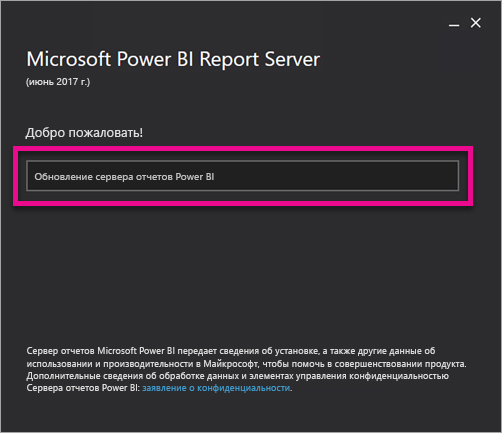
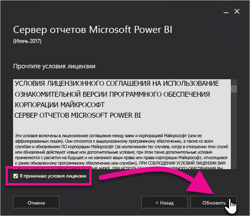

# Обновление сервера отчетов Power BI
Узнайте, как обновлять сервер отчетов Power BI.

 **Скачать** 

Чтобы скачать сервер отчетов Power BI и службу Power BI Desktop, оптимизированную для сервера отчетов Power BI, перейдите на страницу [Локальная работа с отчетами с использованием сервера Power BI Report Server](https://powerbi.microsoft.com/report-server/).

. См. [заметки о текущем выпуске сервера отчетов Power BI](release-notes.md).

## Подготовка
Перед обновлением сервера отчетов советуем выполнить следующие шаги, чтобы создать его резервную копию.

### Архивация ключей шифрования
При настройке установки сервера отчетов в первый раз необходимо архивировать ключи шифрования. Их также нужно архивировать при каждом изменении идентификатора учетных записей службы или переименовании компьютера. Дополнительные сведения см. в статье [Ключи шифрования служб SSRS — резервное копирование и восстановление ключей шифрования](https://docs.microsoft.com/sql/reporting-services/install-windows/ssrs-encryption-keys-back-up-and-restore-encryption-keys).

### Архивация баз данных сервера отчетов
Так как сервер отчетов является сервером без отслеживания состояния, все данные приложений хранятся в базах данных **reportserver** и **reportservertempdb**, выполняющихся на экземпляре ядра СУБД SQL Server. Вы можете создать резервные копии баз данных **reportserver** и **reportservertempdb** с помощью одного из поддерживаемых методов архивации баз данных SQL Server. Ниже приведены рекомендации для баз данных сервера отчетов.

* Используйте модель полного восстановления для архивации базы данных **reportserver**.
* Используйте простую модель восстановления для архивации базы данных **reportservertempdb**.
* Вы можете использовать разные расписания архивации для каждой базы данных. Резервная копия **reportservertempdb** требуется, чтобы избежать необходимости ее повторного создания в случае сбоя оборудования. В случае сбоя оборудования вам не нужно восстанавливать данные в **reportservertempdb**, однако вам необходима структура таблицы. Если вы потеряете базу данных **reportservertempdb**, единственный способ вернуть ее — повторно создать базу данных сервера отчетов. Повторно созданная база данных **reportservertempdb** должна иметь такое же имя, что и имя основной базы данных сервера.

Дополнительные сведения об архивации и восстановлении реляционных баз данных SQL Server см. в [этой статье](https://docs.microsoft.com/sql/relational-databases/backup-restore/back-up-and-restore-of-sql-server-databases).

### Архивация файлов конфигурации
Сервер отчетов Power BI использует файлы конфигурации для хранения настроек приложений. Эти файлы необходимо архивировать при первой настройке сервера и после развертывания каких-либо пользовательских расширений. Требуется архивировать следующие файлы:

* config.json;
* RSHostingService.exe.config;
* Rsreportserver.config;
* Rssvrpolicy.config;
* Reportingservicesservice.exe.config;
* Web.config для приложений ASP.NET сервера отчетов;
* Machine.config для ASP.NET.

## Обновление сервера отчетов
Само по себе обновление сервера отчетов Power BI выполняется очень легко. Чтобы установить его, нужно выполнить совсем немного действий.

1. Найдите папку с файлом PowerBIReportServer.exe и запустите установщик.
2. Щелкните **Обновить сервер отчетов Power BI**.
   
    
3. Прочтите и примите условия лицензионного соглашения, а затем щелкните **Обновить**.
   
    
4. После успешного обновления щелкните **Настроить сервер отчетов**, чтобы запустить диспетчер конфигурации служб Reporting Services, или щелкните **Закрыть**, чтобы выйти из установщика.
   
    

## Обновление Power BI Desktop
После обновления сервера отчетов необходимо, чтобы все авторы отчетов Power BI обновились до версии Power BI Desktop, оптимизированной для сервера отчетов Power BI и соответствующей ему.

## Дальнейшие действия
[Руководство администратора](admin-handbook-overview.md)  
[Установка приложения Power BI Desktop, оптимизированного для сервера отчетов Power BI](install-powerbi-desktop.md)  
[Verify a Reporting Services Installation](https://docs.microsoft.com/sql/reporting-services/install-windows/verify-a-reporting-services-installation) (Проверка установки служб Reporting Services)  
[Configure the Report Server Service Account (SSRS Configuration Manager)](https://docs.microsoft.com/sql/reporting-services/install-windows/configure-the-report-server-service-account-ssrs-configuration-manager) (Настройка учетной записи службы сервера отчетов (System Center Configuration Manager))  
[Configure Report Server URLs (SSRS Configuration Manager)](https://docs.microsoft.com/sql/reporting-services/install-windows/configure-report-server-urls-ssrs-configuration-manager) (Настройка URL-адресов сервера отчетов (System Center Configuration Manager))  
[Configure a Report Server Database Connection (SSRS Configuration Manager)](https://docs.microsoft.com/sql/reporting-services/install-windows/configure-a-report-server-database-connection-ssrs-configuration-manager) (Настройка подключения к базе данных сервера отчетов (System Center Configuration Manager))  
[SSRS Encryption Keys — Initialize a Report Server](https://docs.microsoft.com/sql/reporting-services/install-windows/ssrs-encryption-keys-initialize-a-report-server) (Ключи шифрования SSRS — инициализация сервера отчетов)  
[Configure SSL Connections on a Native Mode Report Server](https://docs.microsoft.com/sql/reporting-services/security/configure-ssl-connections-on-a-native-mode-report-server) (Настройка подключений SSL на сервере отчетов в основном режиме)  
[Configure Windows Service Accounts and Permissions](https://docs.microsoft.com/sql/database-engine/configure-windows/configure-windows-service-accounts-and-permissions) (Настройка учетных записей и разрешений службы Windows)  
[Поддержка браузера для сервера отчетов Power BI](browser-support.md)

Появились дополнительные вопросы? [Попробуйте задать вопрос в сообществе Power BI.](https://community.powerbi.com/)

