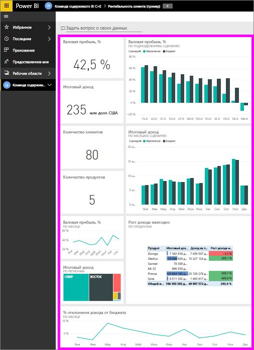
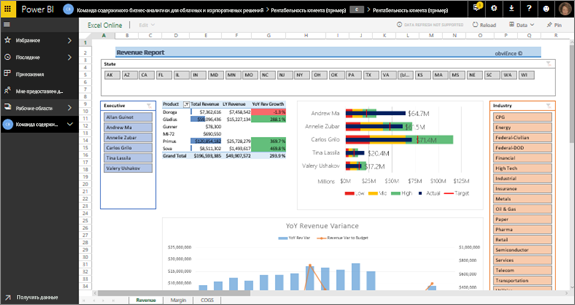
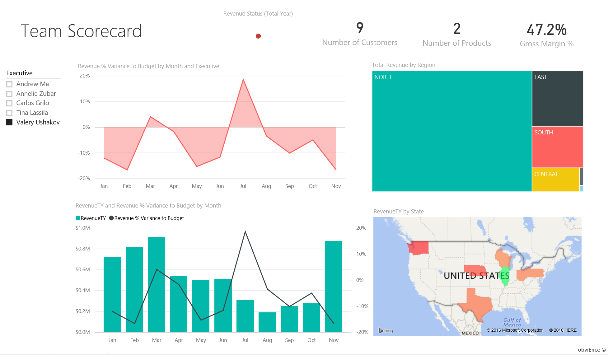
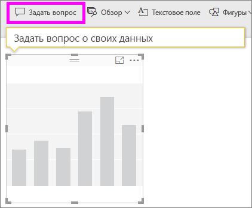
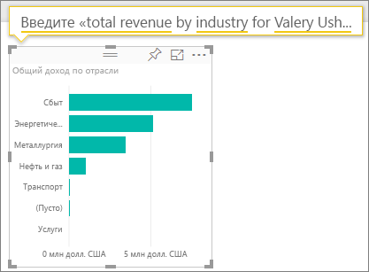
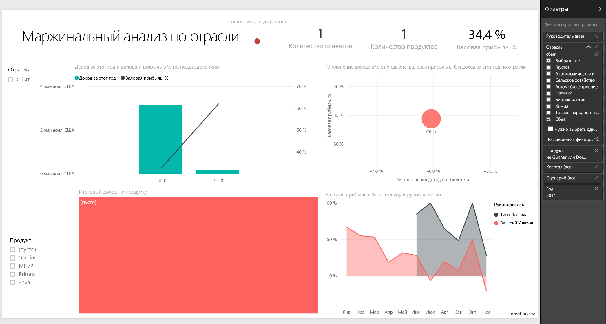
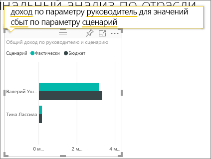

# Пример "Рентабельность клиента" для Power BI: Узнайте о возможностях

## Обзор примера "Рентабельность клиента"
Пакет содержимого "Рентабельность клиента — пример" содержит панель мониторинга, отчет и набор данных для компании, производящей маркетинговые материалы. Эта панель мониторинга была создана финансовым директором для просмотра основных метрик о пяти руководителях подразделения, продуктах, клиентах и валовой прибыли. Здесь можно легко увидеть факторы, влияющие на прибыль.

Этот образец входит в серию, демонстрирующую, как можно использовать Power BI с бизнес-данными, отчетами и информационными панелями. Это реальные данные из obviEnce ([www.obvience.com](http://www.obvience.com/)), которые были обезличены. Данные доступны в нескольких форматах: приложение или пакет содержимого, книга Excel или PBIX-файл (Power BI Desktop). См. статью [Примеры данных, доступные для использования в службе Power BI](sample-datasets.md).

## Предварительные требования
Хотите попробовать? В этом руководстве используется служба Power BI и пример пакета содержимого "Рентабельность клиента".  Так как возможности отчетов очень похожи, вы также можете использовать Power BI Desktop и пример PBIX-файла. Инструкции по подключению к пакету содержимого и PBIX-файлу приведены ниже.

### Получение пакета содержимого для этого примера

1. Откройте службу Power BI (app.powerbi.com) и войдите в систему.
2. В левом нижнем углу выберите **Получить данные**.

    
3. На странице "Получение данных" щелкните значок **Примеры**.

   
4. Выберите **Рентабельность клиента — пример**, затем выберите **Подключиться**.  

   
5. Power BI импортирует пакет содержимого и добавляет новую информационную панель, отчет и набор данных в текущую рабочую область. Новое содержимое отмечено желтой звездочкой. Используйте примеры для тестового запуска Power BI.  

   

### Получение PBIX-файла для этого примера

Также вы можете загрузить пример в виде PBIX-файла, который предназначен для работы с Power BI Desktop.
[Рентабельность клиента — пример](http://download.microsoft.com/download/6/A/9/6A93FD6E-CBA5-40BD-B42E-4DCAE8CDD059/Customer%20Profitability%20Sample%20PBIX.pbix)

### Получение книги Excel для этого примера

При необходимости вы также можете просмотреть источник данных для этого примера, который доступен в виде[книги Excel](http://go.microsoft.com/fwlink/?LinkId=529781). Книга содержит листы Power View, которые можно просматривать и изменять. Чтобы просмотреть необработанные данные выберите элементы **Power Pivot > Управление**.

## Какие данные отображаются на информационной панели?

В разделе **Моя рабочая область** найдите панель мониторинга для примера "Рентабельность клиента":

### Плитки панели мониторинга, охватывающей всю компанию
1. Откройте панель мониторинга в службе Power BI. Плитки панелей мониторинга позволяют нашему финансовому директору отслеживать важные метрики на уровне всей компании.  Когда она видит что-либо интересное, она выбирает плитку, чтобы проанализировать данные более подробно.

2. Просмотрите плитки слева на панели мониторинга.

    

- Валовая прибыль нашей компании составляет 42,5 %.
- У нас 80 клиентов.
- Мы продаем 5 разных продуктов.
- В феврале у нас наблюдалось наименьшее расхождение дохода с бюджетом, а в марте — наибольшее.
- Основная часть нашего дохода поступает из восточного (East) и северного (North) регионов. Валовая прибыль никогда не выходила за пределы бюджета, ER-0 и MA-0 требуется изучить более подробно.
- Итоговый доход за этот год приближается к бюджету.

### Плитки панели мониторинга по отдельным руководителям
Плитки в правой части панели мониторинга содержат показатели команды. Финансовому директору нужно следить за работой своих руководителей, а эти плитки дают общее представление о доходах с использованием доли валовой прибыли (GM%). Если для любого из руководителей возникает неожиданная тенденция по доле валовой прибыли, директор может подробнее изучить данный вопрос.

- Все руководители, за исключением Карлоса, превысили показатели целевых продаж. Но у него самый высокий показатель фактических продаж.
- Руководитель Annelie имеет самую низкую долю валовой прибыли, но с марта этот показатель стабильно увеличивается.
- С другой стороны, у Valery наблюдается значительное снижение показателя GM%.
- У Andrew наблюдается переменный успех.

## Просмотр базовых данных панели мониторинга
На этой панели мониторинга содержатся плитки со ссылками на отчет и книгу Excel.

### Открытие источника данных в Excel Online
На этой панели мониторинга закреплены две плитки из книги Excel: Target vs Actual (Целевые и фактические продажи) и Year Over Year Revenue Growth (Рост дохода в годовом исчислении). Поэтому если вы щелкните любую из этих плиток, Power BI откроет источник данных. В этом случае это Excel Online.

1. Выберите одну из плиток, закрепленных из Excel. Excel Online откроется в службе Power BI.
2. Обратите внимание, что книга содержит три вкладки с собранными данными. Откройте вкладку "Revenue" (Доход).
3. Давайте узнаем, почему Карлос еще не достиг этих показателей.  
    а. В области ползунка "Executive" (Руководитель) выберите **Carlos Grilo**.   
    б. На первой сводной таблице показано, что доход Карлоса за его основной продукт (Primus) снизился на 152 % по сравнению с прошлым годом. На диаграмме роста дохода в годовом исчислении показано, что для большинства месяцев эти показатели ниже суммы, заложенной в бюджете.  

    

    

4. Продолжайте просмотр. Если вы найдете что-то интересное, выберите **Закрепить** в правом верхнем углу, чтобы [закрепить элемент на панели мониторинга](service-dashboard-pin-tile-from-excel.md).

5. Чтобы вернуться на панель мониторинга, нажмите кнопку со стрелкой назад в браузере.

### Открытие основного отчета Power BI
Большинство плиток на панели мониторинга примера "Рентабельность клиента" закреплены из соответствующего базового примера отчета.

1. Выберите одну из этих плиток, чтобы открыть отчет в режиме чтения.

2. Отчет содержит 3 страницы. Каждая вкладка в нижней части отчета представляет страницу.

    

    * Team Scorecard (Командная система показателей) содержит сведения о работе и показателях 5 руководителей.
    * Industry Margin Analysis (Анализ прибыльности по отрасли) позволяет проанализировать нашу рентабельность с учетом состояния дел в отрасли.
    * Executive Scorecard (Система показателей руководства) позволяет просмотреть данные для каждого из руководителей в формате, доступном для Кортаны.

### Страница Team Scorecard (Командная система показателей)

Рассмотрим подробнее двух членов команды и разберемся, какие именно сведения можно получить. В срезе слева выберите имя Andrew, чтобы отфильтровать страницу отчета и отобразить только сведения об Andrew.

* Для быстрого определения ключевого показателя эффективности посмотрите на поле **Revenue Status** (Состояние дохода) Andrew — оно зеленое. Этот руководитель работает хорошо.
* Диаграмма с областями Revenue Var % to Budget by Month (Отклонение дохода от бюджета по месяцам) показывает, что за исключением отставания в феврале Andrew в целом обеспечивает приемлемые показатели. Он в основном работает в восточном регионе и обрабатывает 49 клиентов и 5 (из 7) продуктов. Его показатель GM% не является самым высоким или самым низким.
* RevenueTY and Revenue Var % to Budget by Month (Доход за этот год и отклонение дохода от бюджета по месяцам) показывает, что уровень доходов неуклонно растет. Но если щелкнуть квадрат для центрального региона (**Central**) на диаграмме "дерево", выясняется, что Andrew имеет доход только в марте и только в Индиане. Это запланированное поведение, или стоит разобраться в этом подробнее?

Теперь перейдем к Valery. В срезе выберите имя Valery, чтобы отфильтровать страницу отчета и отобразить только данные об этом руководителе.  

* Обратите внимание на красный ключевой показатель эффективности для **RevenueTY Status**(Состояние дохода за этот год). Это определенно требует более подробного рассмотрения.
* У этого руководителя наблюдаются проблемы и с отклонением дохода, так как установленные границы доходности не соблюдаются.
* Valery имеет всего 9 клиентов, обрабатывает только 2 продукта и работает практически только с клиентами в северном регионе. Такая специализация может объяснять широкие колебания метрик этого руководителя.
* При выборе квадрата **North** (север) на диаграмме-дереве становится видно, что валовая прибыль Valery в северном регионе согласуется с общим уровнем прибыли.
* Выбирая другие квадраты **Region** (Регион), можно узнать о сложившейся ситуации: у этого руководителя показатель GM% колеблется в пределах от 23 % до 79 %, а показатели доходов во всех регионах, за исключением северного, имеют четко выраженный сезонный характер.

Продолжайте анализировать данные, чтобы узнать о причинах низкой производительности Valery. Просмотрите регионы, другие подразделения, а также следующую страницу отчета — Industry Margin Analysis (Маржинальный анализ по отрасли).

### Industry Margin Analysis (Маржинальный анализ по отрасли)
Эта страница отчета содержит другой срез данных. На ней рассматривается валовая прибыль для всей отрасли, разделенной на сегменты. Финансовый директор использует эту страницу для сравнения метрик компании и подразделений с метриками всей отрасли, чтобы выявлять и обеспечивать рентабельность. Вы можете спросить, почему на этой странице приведена диаграмма с областями Gross margin by Month and Executive Name (Валовая прибыль по месяцу и имени руководителя), хотя она относится к конкретной команде. Ее наличие позволяет отфильтровать страницу по руководителю подразделения.  

Как рентабельность зависит от отрасли? Как распределяются продукты и клиенты в зависимости от отрасли? Выберите одну или несколько отраслей в верхней левой части. (Начните с отрасли CPG) Чтобы очистить фильтр, выберите значок очистки.

На пузырьковой диаграмме финансовый директор ищет самые крупные пузырьки, так как именно они оказывают наибольшее влияние на прибыль. Поскольку данные на странице можно отфильтровать по руководителю, щелкнув его имя на диаграмме с областями, это позволяет легко определить влияние каждого руководителя с учетом отраслевого сегмента.

* У руководителя Andrew область влияния распространяется на множество разных отраслевых сегментов, а показатели GM% и Var% изменяются в широких пределах, причем первый больше изменяется в положительную сторону.
* Annelie имеет аналогичную диаграмму, однако данный руководитель работает лишь с несколькими отраслевыми сегментами, специализируясь на федеральном сегменте и продукте Gladius.
* Carlos специализируется на сегменте служб и получает хороший доход. Он значительно улучшил отклонение по высокотехнологичному сегменту, а также продемонстрировал крайне высокие показатели относительно бюджета в новом для себя сегменте — промышленном.
* Tina работает с небольшим количеством сегментов и имеет наибольший показатель GM%, однако небольшой размер пузырьков показывает, что данный руководитель оказывает минимальное влияние на доходы компании.
* Valery, который отвечает только за один продукт, работает всего в 5 отраслевых сегментах. Влияние этого руководителя носит сезонный характер, но всегда дает крупные пузырьки, указывая на ощутимый вклад в доходы компании. Объясняется ли низкая производительность этого руководителя особенностями отрасли?

### Executive Scorecard (Система показателей руководства)
Эта страница имеет формат карты ответов Кортаны. Дополнительные сведения см. в разделе [Создание карты ответов, предназначенной для Кортаны](service-cortana-answer-cards.md).

## Углубленное изучение данных с помощью задания вопросов в поле вопросов и ответов
Для нашего анализа было бы полезно определить, из какой отрасли Valery получает наибольший доход. Давайте воспользуемся вопросами и ответами.

1. Откройте отчет в режиме правки, выбрав пункт **Изменить отчет**. Режим правки доступен только владельцу отчета. Также этот режим иногда называют режимом **автора**. Если же к этому отчету вам предоставлен общий доступ, вы не сможете открыть его в режиме правки.

2.  В верхней строке меню выберите **Задать вопрос**, чтобы открыть поле вопросов и ответов.

    

3. Введите **total revenue by industry for Valery**(Общий доход по отрасли для Valery). Обратите внимание на обновление визуализации по мере ввода вопроса.

    

   Основной областью доходов Valery является распространение.

### Углубленное изучение с помощью фильтров
Давайте рассмотрим отрасль *распространения* .  

1. Откройте страницу отчета Industry Margin Analysis (Маржинальный анализ по отрасли).
2. Не выбирая визуализации на странице отчета, разверните область фильтров справа, если она еще не развернута. В области "Фильтры" должны отобразиться только фильтры уровня страницы.  

   
3. Найдите фильтр для **отрасли** и щелкните стрелку, чтобы развернуть список. Теперь добавим фильтр страницы для отрасли распространения. Сначала очистите все выделения, сняв флажок **Выделить все**. Затем установите только флажок **Распределение**.  

   
4. На диаграмме с областями Gross margin by Month and Executive Name (Валовая прибыль по месяцу и имени руководителя) видно, что клиенты из данной отрасли есть только у Valery и Tina, а Valery работает с этой отраслью только с июня по ноябрь.   
5. Выберите **Tina**, а затем **Valery** в условных обозначениях диаграммы с областями "Gross margin by Month and Executive" (Валовая прибыль по месяцу и имени руководителя). Обратите внимание, что доля Total Revenue by Product (Общий доход по продукту) у Tina гораздо меньше, чем у Valery.
6. Чтобы просмотреть фактический доход, воспользуйтесь полем вопросов и ответов и задайте вопрос об **общем доходе от распространения по сценарию и руководителю**.  

     

    Аналогичным образом можно изучить другие отрасли и даже добавить клиентов в визуальные элементы, чтобы понять причины такого уровня производительности Valery.

В такой безопасной среде можно работать. Отказаться от сохранения изменений можно в любой момент. Однако если изменения сохраняются, всегда можно выбрать функцию **Получить данные** для получения новой копии этого образца.

Вы также можете [скачать только набор данных (книга Excel) для этого примера](http://go.microsoft.com/fwlink/?LinkId=529781).

## Дальнейшие действия: Подключение к данным
Мы надеемся, что в этом обзоре вы узнали, каким образом с помощью информационных панелей, вопросов и ответов и отчетов можно получить представление о данных по клиентам. Теперь ваша очередь — выполните подключение к собственным данным. С помощью Power BI можно подключаться ко многим типам источников данных. Узнайте больше о [начале работы с Power BI](service-get-started.md).

[Назад к примерам в Power BI](sample-datasets.md)  
