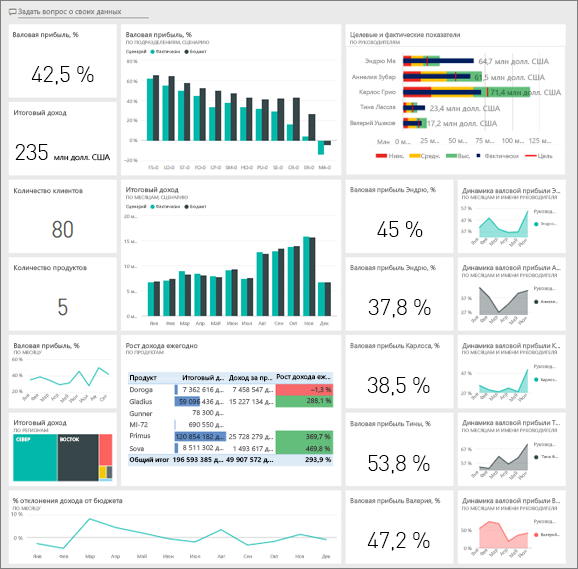
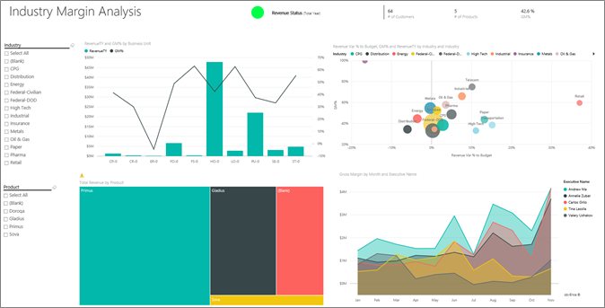

# Пример "Рентабельность клиента" для Power BI: обзор
Пакет содержимого "Рентабельность клиента — пример" содержит панель мониторинга, отчет и набор данных для компании, производящей маркетинговые материалы. Эта панель мониторинга была создана финансовым директором для просмотра основных метрик о пяти руководителях подразделения, продуктах, клиентах и валовой прибыли. Здесь можно легко увидеть факторы, влияющие на прибыль.

Этот образец входит в серию, демонстрирующую, как можно использовать Power BI с бизнес-данными, отчетами и информационными панелями. Это реальные данные из obviEnce ([www.obvience.com](http://www.obvience.com/)), которые были обезличены.

Вы также можете [скачать только набор данных (книга Excel) для этого примера](http://go.microsoft.com/fwlink/?LinkId=529781).  

## Какие данные отображаются на информационной панели?
### Плитки панели мониторинга, охватывающей всю компанию
Эти плитки позволяют нашему финансовому директору отслеживать важные метрики на уровне всей компании.  Когда она видит что-либо интересное, она выбирает плитку, чтобы проанализировать данные более подробно.

1. Валовая прибыль нашей компании составляет 42,5 %.
2. У нас 80 клиентов.
3. Мы продаем 5 разных продуктов.
4. В феврале у нас наблюдалось наименьшее расхождение дохода с бюджетом, а в марте — наибольшее.
5. Основная часть нашего дохода поступает из восточного (East) и северного (North) регионов. Валовая прибыль никогда не выходила за пределы бюджета, ER-0 и MA-0 требуется изучить более подробно.
6. Итоговый доход за этот год приближается к бюджету.

### Плитки панели мониторинга по отдельным руководителям
Эти плитки составляют командную систему показателей. Финансовому директору нужно следить за работой своих руководителей, а эти плитки дают общее представление о доходах с использованием доли валовой прибыли (GM%). Если для любого из руководителей возникает неожиданная тенденция по доле валовой прибыли, директор может подробнее изучить данный вопрос.

Руководитель Annelie имеет самую низкую долю валовой прибыли, но с марта этот показатель стабильно увеличивается. С другой стороны, у Valery наблюдается значительное снижение показателя GM%. У Andrew наблюдается переменный успех. Щелкните любую из плиток по отдельным руководителям, чтобы открыть базовый отчет. Отчет содержит 3 страницы и открывается на странице Industry Margin Analysis (Анализ прибыльности по отрасли).

## Просмотр страниц в отчете
В нашем отчете 3 страницы:

* Team Scorecard (Командная система показателей) содержит сведения о работе и показателях 5 руководителей.
* Industry Margin Analysis (Анализ прибыльности по отрасли) позволяет проанализировать нашу рентабельность с учетом состояния дел в отрасли.
* Executive Scorecard (Система показателей руководства) позволяет просмотреть данные для каждого из руководителей в формате, доступном для Кортаны.

### Страница Team Scorecard (Командная система показателей)

Рассмотрим подробнее двух членов команды и разберемся, какие именно сведения можно получить. В срезе слева выберите имя Andrew, чтобы отфильтровать страницу отчета и отобразить только сведения об Andrew.

* Для быстрого определения ключевого показателя эффективности посмотрите на поле **Revenue Status** (Состояние дохода) Andrew — оно зеленое. Этот руководитель работает хорошо.
* Диаграмма с областями Revenue Var % to Budget by Month (Отклонение дохода от бюджета по месяцам) показывает, что за исключением отставания в феврале Andrew в целом обеспечивает приемлемые показатели. Он в основном работает в восточном регионе и обрабатывает 49 клиентов и 5 (из 7) продуктов. Его показатель GM% не является самым высоким или самым низким.
* RevenueTY and Revenue Var % to Budget by Month (Доход за этот год и отклонение дохода от бюджета по месяцам) показывает, что уровень доходов неуклонно растет. Но если щелкнуть квадрат для центрального региона (**Central**) на диаграмме "дерево", выясняется, что Andrew имеет доход только в марте и только в Индиане. Это запланированное поведение, или стоит разобраться в этом подробнее?

Теперь перейдем к Valery. В срезе выберите имя Valery, чтобы отфильтровать страницу отчета и отобразить только данные об этом руководителе.  

* Обратите внимание на красный ключевой показатель эффективности для **RevenueTY Status**(Состояние дохода за этот год). Это определенно требует более подробного рассмотрения.
* У этого руководителя наблюдаются проблемы и с отклонением дохода, так как установленные границы доходности не соблюдаются.
* Valery имеет всего 9 клиентов, обрабатывает только 2 продукта и работает практически только с клиентами в северном регионе. Такая специализация может объяснять широкие колебания метрик этого руководителя.
* При выборе квадрата **North** (север) на диаграмме-дереве становится видно, что валовая прибыль Valery в северном регионе согласуется с общим уровнем прибыли.
* Выбирая другие квадраты **Region** (Регион), можно узнать о сложившейся ситуации: у этого руководителя показатель GM% колеблется в пределах от 23 % до 79 %, а показатели доходов во всех регионах, за исключением северного, имеют четко выраженный сезонный характер.

Продолжайте анализировать данные, чтобы узнать о причинах низкой производительности Valery. Просмотрите регионы, другие подразделения, а также следующую страницу отчета — Industry Margin Analysis (Маржинальный анализ по отрасли).

### Industry Margin Analysis (Маржинальный анализ по отрасли)
Эта страница отчета содержит другой срез данных. На ней рассматривается валовая прибыль для всей отрасли, разделенной на сегменты. Финансовый директор использует эту страницу для сравнения метрик компании и подразделений с метриками всей отрасли, чтобы выявлять и обеспечивать рентабельность. Вы можете спросить, почему на этой странице приведена диаграмма с областями Gross margin by Month and Executive Name (Валовая прибыль по месяцу и имени руководителя), хотя она относится к конкретной команде. Ее наличие позволяет отфильтровать страницу по руководителю подразделения.  

Как рентабельность зависит от отрасли? Как распределяются продукты и клиенты в зависимости от отрасли? Выберите одну или несколько отраслей в верхней левой части. (Начните с отрасли CPG) Чтобы очистить фильтр, выберите значок очистки.

На пузырьковой диаграмме финансовый директор ищет самые крупные пузырьки, так как именно они оказывают наибольшее влияние на прибыль. Поскольку данные на странице можно отфильтровать по руководителю, щелкнув его имя на диаграмме с областями, это позволяет легко определить влияние каждого руководителя с учетом отраслевого сегмента.

* У руководителя Andrew область влияния распространяется на множество разных отраслевых сегментов, а показатели GM% и Var% изменяются в широких пределах, причем первый больше изменяется в положительную сторону. 
* Annelie имеет аналогичную диаграмму, однако данный руководитель работает лишь с несколькими отраслевыми сегментами, специализируясь на федеральном сегменте и продукте Gladius. 
* Carlos специализируется на сегменте служб и получает хороший доход. Он значительно улучшил отклонение по высокотехнологичному сегменту, а также продемонстрировал крайне высокие показатели относительно бюджета в новом для себя сегменте — промышленном. 
* Tina работает с небольшим количеством сегментов и имеет наибольший показатель GM%, однако небольшой размер пузырьков показывает, что данный руководитель оказывает минимальное влияние на доходы компании. 
* Valery, который отвечает только за один продукт, работает всего в 5 отраслевых сегментах. Влияние этого руководителя носит сезонный характер, но всегда дает крупные пузырьки, указывая на ощутимый вклад в доходы компании. Объясняется ли низкая производительность этого руководителя особенностями отрасли?

### Executive Scorecard (Система показателей руководства)
Эта страница имеет формат карты ответов Кортаны. Дополнительные сведения см. в разделе [Создание карты ответов, предназначенной для Кортаны](service-cortana-answer-cards.md).

## Углубленное изучение данных с помощью задания вопросов в поле вопросов и ответов
Для нашего анализа было бы полезно определить, из какой отрасли Valery получает наибольший доход. Давайте воспользуемся вопросами и ответами.

1. В верхней панели навигации выберите **Power BI** , чтобы вернуться к информационной панели.
2. Выберите поле «Вопросы и ответы» в верхней части панели мониторинга.
   
    
3. Введите **total revenue by industry for Valery**(Общий доход по отрасли для Valery). Обратите внимание на обновление визуализации по мере ввода вопроса.
   
    
   
   Основной областью доходов Valery является распространение.

### Углубленное изучение с помощью фильтров
Давайте рассмотрим отрасль *распространения* .  

1. Вернитесь на панель мониторинга и выберите диаграмму с областями, показывающую тенденцию валовой прибыли для Andrew. При этом отчет открывается на странице Industry Margin Analysis (Маржинальный анализ по отрасли).
2. Не выбирая какие-либо визуализации на странице отчета, разверните область фильтров справа. В области "Фильтры" должны отобразиться только фильтры уровня страницы.  
   
   
3. Найдите фильтр для **отрасли** и щелкните стрелку, чтобы развернуть список. Теперь добавим фильтр страницы для отрасли распространения. Сначала очистите все выделения, сняв флажок **Выделить все**. Затем установите флажок **Distribution** (Распространение).  
   
   
4. На диаграмме с областями Gross margin by Month and Executive Name (Валовая прибыль по месяцу и имени руководителя) видно, что клиенты из данной отрасли есть только у Valery и Tina, а Valery работает с этой отраслью только с июня по ноябрь.   
5. Выберите **Tina**, а затем **Valery** в условных обозначениях диаграммы с областями "Gross margin by Month and Executive" (Валовая прибыль по месяцу и имени руководителя). Обратите внимание, что доля Total Revenue by Product (Общий доход по продукту) у Tina гораздо меньше, чем у Valery. 
6. Чтобы просмотреть фактический доход, вернитесь на панель мониторинга и в поле вопросов и ответов задайте вопрос об **общем доходе от распространения по сценарию и руководителю**.  
   
   

Аналогичным образом можно изучить другие отрасли и даже добавить клиентов в визуальные элементы, чтобы понять причины такого уровня производительности Valery.

В такой безопасной среде можно работать. Отказаться от сохранения изменений можно в любой момент. Однако если изменения сохраняются, всегда можно выбрать функцию **Получить данные** для получения новой копии этого образца.

## Дальнейшие действия: подключение к данным
Мы надеемся, что в этом обзоре вы узнали, каким образом с помощью информационных панелей, вопросов и ответов и отчетов можно получить представление о данных по клиентам. Теперь ваша очередь — выполните подключение к собственным данным. С помощью Power BI можно подключаться ко многим типам источников данных. Узнайте больше о [начале работы с Power BI](service-get-started.md).

[Назад к примерам в Power BI](sample-datasets.md)  

