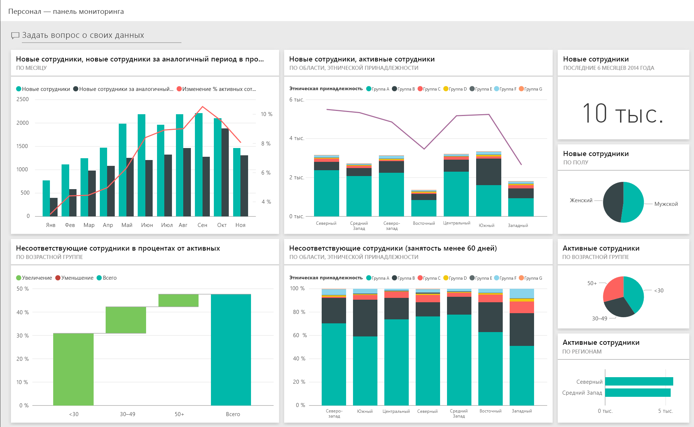
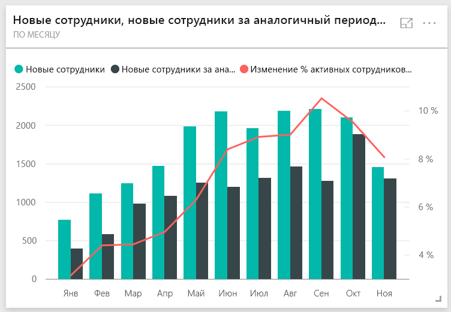
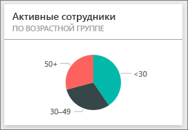
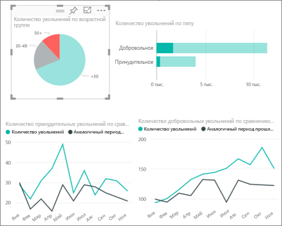
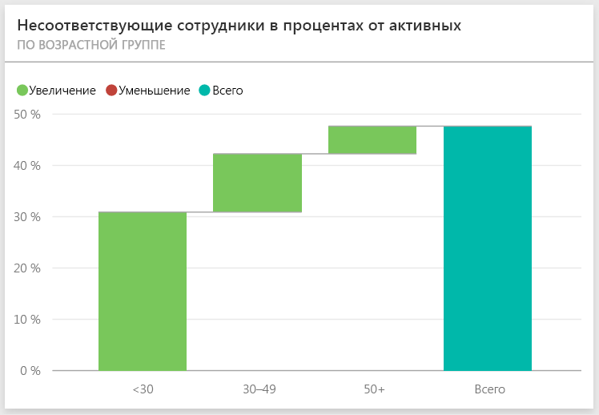
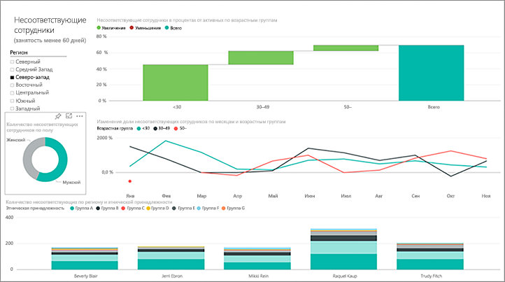
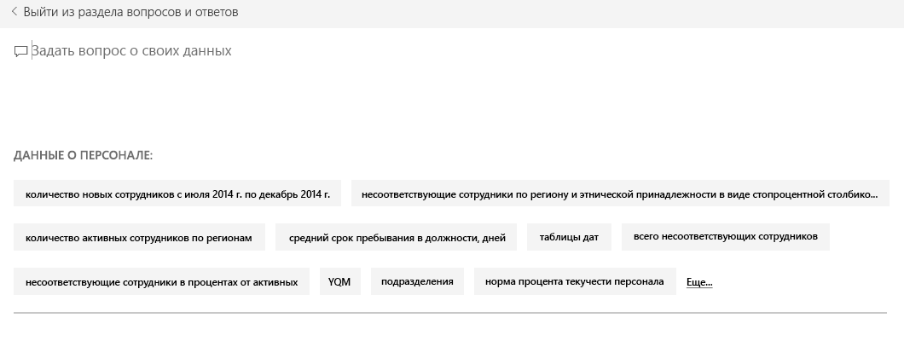
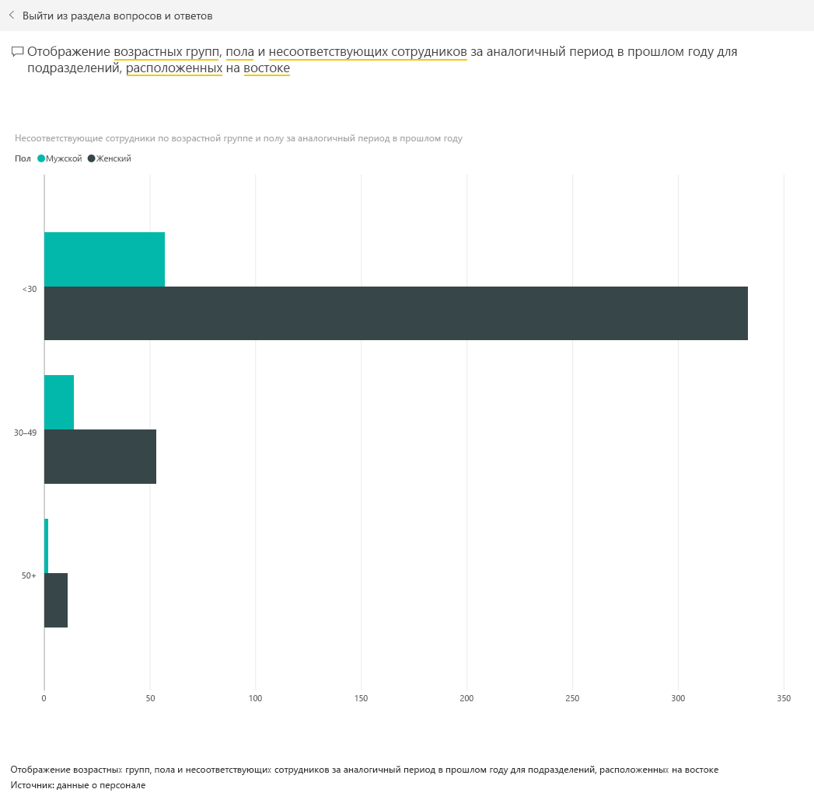

# Пример "Управление персоналом" для Power BI: обзор

## Обзор с примером "Управление персоналом"
Отдел кадров имеет одинаковую модель отчетов в разных компаниях даже в том случае, если они ведут деятельность в разных отраслях или имеют разный размер. В этом примере рассматриваются новые сотрудники, активные сотрудники и уволившиеся сотрудники, а также предпринимается попытка выявить тенденции в стратегии найма персонала. Мы должны понять следующее:

* кого мы нанимаем;
* отклонения от стратегии найма;
* тенденции увольнения по собственному желанию.

Этот образец входит в серию, демонстрирующую, как можно использовать Power BI с бизнес-данными, отчетами и информационными панелями. Это реальные данные из obviEnce ([www.obvience.com)](http://www.obvience.com/), которые были обезличены. Данные доступны в нескольких форматах: приложение или пакет содержимого, книга Excel или PBIX-файл (Power BI Desktop). Дополнительные сведения см. в статье [Примеры наборов данных](sample-datasets.md).

## Предварительные требования

 Прежде чем использовать пример, необходимо скачать его как [пакет содержимого](https://docs.microsoft.com/en-us/power-bi/sample-human-resources#get-the-content-pack-for-this-sample), [PBIX-файл](http://download.microsoft.com/download/6/9/5/69503155-05A5-483E-829A-F7B5F3DD5D27/Human Resources Sample PBIX.pbix) или [книгу Excel](http://go.microsoft.com/fwlink/?LinkId=529780).

### Получение пакета содержимого для этого примера

1. Откройте службу Power BI (app.powerbi.com) и войдите в систему.
2. В левом нижнем углу выберите **Получить данные**.
   
    
3. На странице "Получение данных" щелкните значок **Примеры**.
   
   
4. Выберите **Управление персоналом — пример**, затем выберите **Подключиться**.  
   
   
5. Power BI импортирует пакет содержимого и добавляет новую информационную панель, отчет и набор данных в текущую рабочую область. Новое содержимое отмечено желтой звездочкой. 
   
   
  
### Получение PBIX-файла для этого примера

Также вы можете загрузить пример в виде PBIX-файла, который предназначен для работы с Power BI Desktop. 

 * [Управление персоналом — пример](http://download.microsoft.com/download/6/9/5/69503155-05A5-483E-829A-F7B5F3DD5D27/Human Resources Sample PBIX.pbix)

### Получение книги Excel для этого примера
Вы также можете [скачать только набор данных (книга Excel) для этого примера](http://go.microsoft.com/fwlink/?LinkId=529780). Книга содержит листы Power View, которые можно просматривать и изменять. Чтобы просмотреть необработанные данные выберите элементы **Power Pivot > Управление**.

## Новые сотрудники
Давайте рассмотрим новых сотрудников.

1. В рабочей области перейдите на вкладку **Информационные панели** и откройте информационную панель "Кадры".
2. На информационной панели выберите плитку **New Hire Count, New Hires Same Period Last Year, Actives YoY % Change** **By Month** (Новые сотрудники, новые сотрудники за аналогичный период в прошлом году, изменение % активных сотрудников по сравнению с прошлым годом по месяцам).  
     

   На странице **New Hires** (Новые сотрудники) откроется отчет-пример "Управление персоналом".  

   

Обратите внимание на следующее.

* В комбинированной диаграмме **New Hire Count, New Hires SPLY and Actives YoY % Change by Month** (Новые сотрудники, новые сотрудники за аналогичный период в прошлом году, изменение % активных сотрудников по сравнению с прошлым годом по месяцам) видно, что в этом году мы нанимали больше людей каждый месяц по сравнению с предыдущим годом — в некоторые месяцы это число было значительным.
* В комбинированной диаграмме **New Hire Count and Active Employee Count by Region and Ethnicity**(Новые и активные сотрудники по региону и этнической принадлежности) обратите внимание, что мы нанимаем меньше людей в **восточном** регионе.
* Каскадная диаграмма **New Hires YoY Var by Age Group** (Изменение новых сотрудников по сравнению с прошлым годом по возрастной группе) показывает, что мы в основном нанимаем молодых людей. Это может быть вызвано тем, что предполагается лишь частичная занятость.
* Круговая диаграмма **New Hire Count by Gender** (Число новых сотрудников по полу) показывает довольно равномерное распределение.

Можете ли вы найти дополнительные сведения, например область, где распределение по полу неравномерно? Выбирайте разные возрастные группы и разные половые принадлежности на диаграммах для изучения связей между возрастом, полом, регионом и этнической группой.

Щелкните имя информационной панели на верхней панели навигации, чтобы вернуться к ней.

## Сравнение активных и бывших сотрудников
Рассмотрим данные для текущих активных сотрудников и сотрудников, которые больше не работают на компанию.

На информационной панели выберите плитку **Active Employee Count by Age Group** (Число активных сотрудников по возрастной группе).  

На странице **Active Employees vs. Separations** (Сравнение активных сотрудников с уволившимися) появится отчет-пример "Управление персоналом".  

**Важные элементы:**

* Расположенные слева комбинированные диаграммы показывают погодовое изменение показателей по активным и уволившимся сотрудникам. За счет активного найма мы привлекли больше сотрудников, чем в прошлом году, однако в этом году у нас выше и число уволившихся.
* В августе уволилось больше сотрудников, чем в другие месяцы. Выбирайте разные возрастные группы, половые принадлежности и регионы, чтобы попытаться найти резко выделяющиеся показатели.
* Просмотрев круговые диаграммы, мы заметили, что распределение активных сотрудников по полу и возрасту довольно равномерно. Выбирайте разные возрастные группы для просмотра различий распределения по полу. Имеется ли у нас равномерное распределение по полу в каждой возрастной группе?

## Причины увольнения
Давайте просмотрим отчет в представлении редактирования. Выберите **Изменить отчет** в левом верхнем углу.

Измените круговые диаграммы для отображения данных по уволившимся сотрудникам вместо активных.

1. В круговой диаграмме выберите **Active Employee Count by Age Group** (Число активных сотрудников по возрастной группе).
2. В разделе **Fields** (Поля) щелкните стрелку рядом с **Employees** (Сотрудники), чтобы развернуть таблицу Employees (Сотрудники). Снимите флажок рядом с полем **Active Employee Count** (Число активных сотрудников), чтобы удалить это поле.
3. Установите флажок рядом с элементом **Separation Count** (Уволившиеся сотрудники) в таблице Employees (Сотрудники), чтобы добавить его в поле **Values** (Значения).
4. Вернувшись к холсту отчетов, щелкните элемент **По собственному желанию** на линейчатой диаграмме **Число уволившихся по причине увольнения**. Сотрудники, уволившиеся по собственному желанию, будут выделены в других визуальных элементах в отчете.
5. В круговой диаграмме Separation Count by Age Group (Число уволившихся по возрастной группе) выберите срез "50 +".

   Посмотрите на график Separations by Reason (Увольнения по причине) в правом нижнем углу. Он фильтруется для отображения уволившихся по собственному желанию.  
   

   Вы заметили тенденцию в возрастной группе 50+? В конце года больше сотрудников из возрастной группы 50+ уволились по собственному желанию. Данный аспект следует изучить подробно с привлечением дополнительных данных.
6. Вы можете выполнить аналогичные действия для круговой диаграммы **Active Employee Count by Gender** (Число активных сотрудников по полу), переключив ее с активных сотрудников на уволившихся. Взгляните на данные об увольнениях по собственному желанию в зависимости от пола и попробуйте извлечь из них дополнительную информацию.
7. В верхней панели навигации щелкните **Power BI** , чтобы вернуться к панели мониторинга. Вы можете как сохранить внесенные в отчет изменения, так и отменить их.

## Несоответствующие сотрудники
В завершение следует изучить область несоответствующих сотрудников. Несоответствующими называются сотрудники, которые уволились, проработав в компании менее 60 дней. Мы довольно быстро нанимаем сотрудников. Подбираем ли мы подходящих кандидатов?

1. На информационной панели щелкните плитку **Bad Hires as % of Actives by Age Group** (Доля несоответствующих сотрудников среди активных сотрудников по возрастной группе). При этом на странице 3 открывается отчет Bad Hires (Несоответствующие сотрудники).

     
2. Установите флажок **Northwest** (Северо-запад) на срезе Region (Регион) слева и на секторе **Male** (Мужской пол) на кольцевой диаграмме Bad Hire Count by Gender (Несоответствующие сотрудники по полу).  Посмотрите другие диаграммы на странице Bad Hires (Несоответствующие сотрудники). Среди несоответствующих сотрудников больше мужчин, чем женщин; кроме того, множество таких сотрудников относится к группе A.
     
3. Просмотрев круговую диаграмму **Bad Hires by Gender** (Несоответствующие сотрудники по полу) и щелкнув фрагмент **Region** (Регион), мы заметили, что только в восточном (East) регионе среди несоответствующих сотрудников больше женщин, чем мужчин.  
4. Щелкните имя информационной панели на верхней панели навигации, чтобы вернуться к ней.

## Задание вопроса в поле вопросов и ответов
В окне [Вопросы и ответы](power-bi-tutorial-q-and-a.md) вы вводите вопрос, используя естественный язык. Компонент "Вопросы и ответы" распознает слова при вводе и определяет, где в наборе данных можно найти ответ.

1. Выберите текстовое поле вопросов и ответов. Обратите внимание, что в поле уже содержатся предложения.

   
2. Можно выбрать одно из этих предложений или ввести: **показать сведения о возрастной группе, поле и неэффективных кадровых решениях за аналогичный период предыдущего года в восточном регионе**.  

   

   Обратите внимание, что большинству несоответствующих сотрудников женского пола еще нет 30 лет.

В такой безопасной среде можно работать. Отказаться от сохранения изменений можно в любой момент. Если изменения сохраняются, всегда можно выбрать функцию **Получить данные** для получения новой копии этого примера.

## Дальнейшие действия: подключение к данным
Мы надеемся, что в этом обзоре вы узнали, каким образом с помощью панелей мониторинга, вопросов и ответов и отчетов можно получить представление о данных по персоналу. Теперь ваша очередь — выполните подключение к собственным данным. С помощью Power BI можно подключаться ко многим типам источников данных. Узнайте больше о [начале работы с Power BI](service-get-started.md).  
