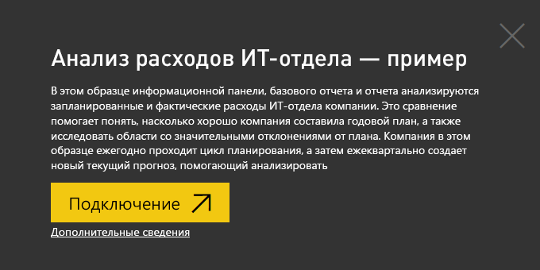
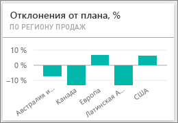
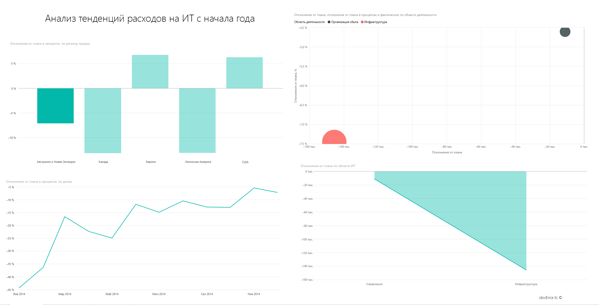
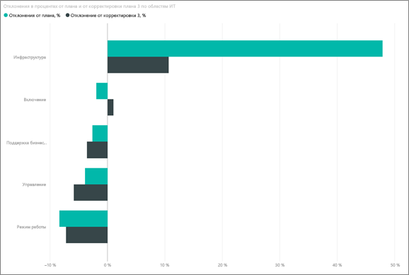
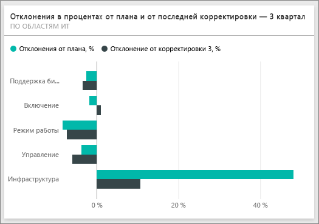
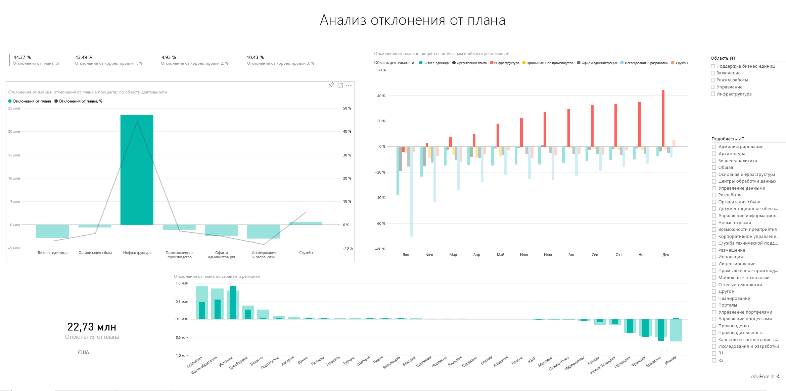

# Образец "Анализ расходов на ИТ" для Power BI: обзор

## Общие сведения о примере "Анализ расходов ИТ-отдела"
[Пакет содержимого](service-organizational-content-pack-introduction.md) "Анализ расходов ИТ-отдела" (информационная панель, отчет и набор данных) позволяет проанализировать запланированные и фактические затраты на ИТ-отдел. Это сравнение помогает понять, насколько хорошо компания составила годовой план, и позволяет исследовать области со значительными отклонениями от плана. Компания в этом образце ежегодно проходит цикл планирования, а затем ежеквартально создает новый текущий прогноз, помогающий анализировать изменения в расходах ИТ-отдела за последний финансовый год.

Этот образец входит в серию, демонстрирующую, как можно использовать Power BI с бизнес-данными, отчетами и информационными панелями. Это реальные данные из obviEnce (<http://obvience.com/>), которые были анонимизированы.

## Предварительные требования

 Прежде чем использовать пример, необходимо скачать его как [пакет содержимого](https://docs.microsoft.com/en-us/power-bi/sample-it-spend#get-the-content-pack-for-this-sample), [PBIX-файл](http://download.microsoft.com/download/E/9/8/E98CEB6D-CEBB-41CF-BA2B-1A1D61B27D87/IT Spend Analysis Sample PBIX.pbix) или [книгу Excel](http://go.microsoft.com/fwlink/?LinkId=529783).

### Получение пакета содержимого для этого примера

1. Откройте службу Power BI (app.powerbi.com) и войдите в систему.
2. В левом нижнем углу выберите **Получить данные**.
   
    
3. На странице "Получение данных" щелкните значок **Примеры**.
   
   
4. Выберите **Анализ расходов ИТ-отдела — пример**, затем выберите **Подключиться**.  
  
   
   
5. Power BI импортирует пакет содержимого и добавляет новую информационную панель, отчет и набор данных в текущую рабочую область. Новое содержимое отмечено желтой звездочкой. 
   
   
  
### Получение PBIX-файла для этого примера

Также вы можете загрузить пример в виде PBIX-файла, который предназначен для работы с Power BI Desktop. 

 * [Анализ расходов ИТ-отдела — пример](http://download.microsoft.com/download/E/9/8/E98CEB6D-CEBB-41CF-BA2B-1A1D61B27D87/IT%20Spend%20Analysis%20Sample%20PBIX.pbix)

### Получение книги Excel для этого примера
Вы также можете [скачать только набор данных (книга Excel) для этого примера](http://go.microsoft.com/fwlink/?LinkId=529783). Книга содержит листы Power View, которые можно просматривать и изменять. Чтобы просмотреть необработанные данные выберите элементы **Power Pivot > Управление**.

## Информационная панель образца "Анализ расходов на ИТ"
На двух плитках с данными — **% отклонения от плана** и **% отклонения от текущего прогноза на 3-й квартал**— содержатся общие сведения о соответствии плану и текущему прогнозу на квартал (LE3 = текущий прогноз на 3-й квартал). В целом мы отстаем от плана примерно на 6 %. Рассмотрим причину отклонения: когда, где и в какой категории?

## Страница "Анализ тенденций расходов на ИТ с начала года"
При выборе на информационной панели плитки **% отклонения от плана по региону продаж** отрывается страница "Анализ тенденций расходов на ИТ" отчета образца анализа расходов на ИТ. Мы сразу видим положительное отклонение в США и Европе и отрицательное отклонение в Канаде, Латинская Америке и Австралии. У США имеется положительное 6-процентное отклонение от текущего прогноза, а у Австралии отрицательное 7-процентное отклонение от текущего прогноза.

Однако, если делать выводы, просто глядя на эту диаграмму, можно сформировать ложное впечатление. Чтобы рассматривать все происходящее в перспективе, нужно обратиться к фактическим денежным суммам.

1. В диаграмме Var Plan % by Sales Region (% отклонения от плана по региону продаж) выберите **Aus and NZ** (Австралия и Новая Зеландия) и просмотрите диаграмму Var Plan by IT Area (Отклонение от плана по области ИТ).

   
2. Теперь выберите **США**. Вам становится ясно, что по сравнению с США на Австралию действительно приходится небольшая доля общих расходов.

    Итак, мы сузили области до США. Что делать теперь? Рассмотрим, какая категория в США является причиной отклонения.

## Вопросы о данных
1. На верхней панели навигации выберите **Анализ расходов ИТ-отдела — пример**, чтобы вернуться к панелям мониторинга.
2. В поле вопроса введите "показать гистограмму с областями ИТ, % отклонения от плана и % отклонения от текущего прогноза за 3-й кв.".

   

   В первой области ИТ — **Инфраструктура**— значительно изменилось значение процента между начальным отклонением от плана и отклонением от текущего прогноза.

## Страница "Расходы по элементам затрат с начала года"
Вернитесь к информационной панели и посмотрите на плитку **% отклонения от плана, % отклонения от текущего прогноза на 3-й квартал** .

Инфраструктура отображается с большим положительным значением отклонения от плана.

1. Щелкните эту плитку, чтобы перейти на страницу "Расходы по элементам затрат с начала года" отчета с образцом анализа расходов на ИТ.
2. Щелкните столбец **Инфраструктура** в диаграмме "% отклонения от плана, % отклонения от текущего прогноза на 3-й квартал по областям ИТ" в нижней левой части панели и просмотрите отклонение от плана в схеме "% отклонения от плана по региону продаж" слева.

    
3. Щелкайте имя каждой группы элементов затрат в срезе, чтобы найти элемент затрат с наибольшим отклонением.
4. Выбрав **Другое** , щелкните **Инфраструктура** в срезе "Область ИТ" и щелкните вложенные области в срезе "Вложенные области ИТ", чтобы найти вложенную область с наибольшим отклонением.  

   Мы видим огромное отклонение в области **Сетевые подключения**.

   Видимо, компания решила в качестве преимущества предоставить своим сотрудникам услуги телефонной связи, но этот момент не был запланирован.

## Страница "Анализ отклонения от плана"
Находясь в отчете, щелкните вкладку "Анализ отклонения от плана" в нижней части отчета, чтобы перейти на страницу 3 отчета.

В комбинированной диаграмме "Отклонение от плана и % отклонения от плана по области деятельности" в левой части щелкните столбец "Инфраструктура", чтобы выделить значения инфраструктуры в остальной части страницы.

Обратите внимание, что на диаграмме "% отклонения от плана по месяцу и области деятельности" в инфраструктуре начало появляться положительное отклонение в феврале, которое продолжает расти. Кроме того, обратите внимание на то, как отклонение от плана для инфраструктуры зависит от страны, если сравнивать со значением для всех областей деятельности. Воспользуйтесь срезами "Область ИТ" и "Вложенные области ИТ" справа, чтобы отфильтровать, а не выделять значения в остальной части страницы. Щелкайте другие области ИТ справа, чтобы изучить данные другим способом. Можно также щелкнуть срез "Вложенные области ИТ" и просмотреть отклонение на этом уровне.

## Редактирование отчета
В верхнем левом углу щелкните **Изменить отчет** и просмотрите отчет в режиме редактирования.

* Изучите компоненты страниц — поля в каждой диаграмме, фильтры на страницах.
* Добавьте страницы и диаграммы на основе тех же данных.
* Измените тип визуализации для каждой диаграммы.
* Прикрепите их к панели мониторинга.

В такой безопасной среде можно работать. Отказаться от сохранения изменений можно в любой момент. Однако если изменения сохраняются, всегда можно выбрать функцию "Получить данные" для получения новой копии этого образца.

## Дальнейшие действия: подключение к данным
Мы надеемся, что в этом обзоре вы узнали, каким образом с помощью информационных панелей, вопросов и ответов и отчетов можно получить представление о данных расходов на ИТ. Теперь ваша очередь — выполните подключение к собственным данным. С помощью Power BI можно подключаться ко многим типам источников данных. Узнайте больше о [начале работы с Power BI](service-get-started.md).
