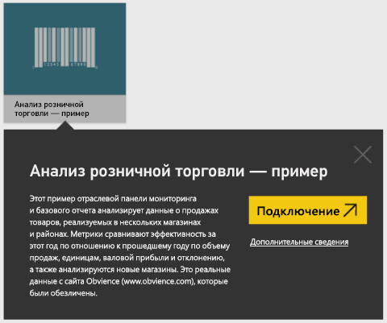
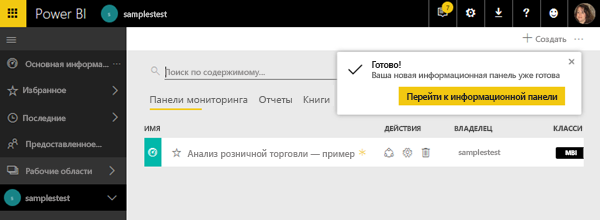
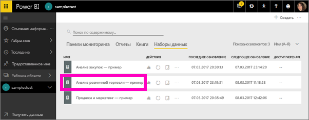
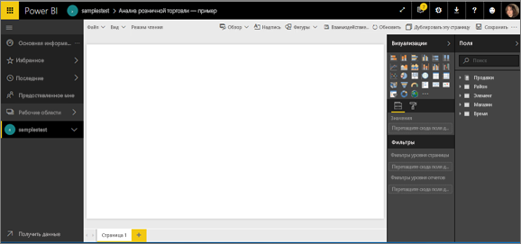

# Руководство по использованию примеров Power BI
<!-- Shared newnav Include -->
[!INCLUDE [newnavbydefault](./includes/newnavbydefault.md)]

Мы рекомендуем для начала ознакомиться с [образцами наборов данных для Power BI](sample-datasets.md). В ней содержатся сведения о примерах, их получении, сохранении и использовании, а также описание каждого примера. После ознакомления с общими сведениями мы приступим к изучению этого руководства.   

## Сведения об этом руководстве
В этом руководстве объясняется, как импортировать примеры пакетов содержимого, добавлять их в службу Power BI и открывать содержимое. *Пакет содержимого* — это тип примера, в котором набор данных входит в состав информационной панели и отчета. Пакеты содержимого с примерами можно получить из Power BI с помощью команды **Получить данные**.

> [!NOTE]
> Информация, приведенная в этом руководстве, относится к службе Power BI, но не к Power BI Desktop.
> 
> 

В этом учебнике используется пакет содержимого с примером *Анализ розничной торговли* , куда входит информационная панель, отчет и набор данных.
Чтобы получить представление об этом пакете содержимого и сценарии его применения до начала работы с руководством, вы можете [ознакомиться с примером "Анализ розничной торговли"](sample-retail-analysis.md).

## Получение данных (в этом случае это пример пакета содержимого)
1. Откройте службу Power BI и выполните вход в нее (app.powerbi.com).
2. Выберите рабочую область и создайте информационную панель.  
   
    
3. Назовите ее **Анализ розничной торговли — пример**.
   
   
4. Нажмите кнопку **Получить данные** в нижней части левой панели навигации. Если команда **Получить данные** отсутствует, разверните панель навигации, выбрав .
   
   
5. Выберите **Образцы**.  
   
   
6. Выберите *Анализ розничной торговли — пример* и нажмите кнопку **Подключить**.   
   
   

## Что конкретно импортируется?
После нажатия кнопки **Подключить** служба Power BI фактически переносит копию пакета содержимого и сохраняет ее в облаке. Пользователь, создавший пакет содержимого, добавил в него набор данных, отчет и информационную панель. Именно это вы и получаете, нажав кнопку **Подключить**.

1. Power BI создает информационную панель и добавляет ее на вкладку **Информационные панели**. Новая информационная панель отмечается желтой звездочкой.
   
   
2. Откройте вкладку **Отчеты**.  Здесь вы увидите новый отчет с именем *Анализ розничной торговли — пример*.
   
   
   
   Затем перейдите на вкладку **Наборы данных**.  Там также появится новый набор данных.
   
   

## Изучение нового содержимого
Теперь самостоятельно изучите информационную панель, набор данных и отчет. Существует много различных способов перехода к информационным панелям, отчетам и наборам данных. Один из них описан ниже.  

> [!TIP]
> Хотите сначала узнать больше?  Ознакомьтесь с пошаговым руководством по использованию примера "Анализ розничной торговли" в [этой статье](sample-retail-analysis.md).
> 
> 

1. Вернитесь на вкладку **Информационные панели** и выберите информационную панель *Анализ розничной торговли — пример*.    
   
   
2. После этого откроется информационная панель.  Она состоит из ряда плиток визуализаций.
   
   
3. Выберите одну из плиток, чтобы открыть соответствующий отчет.  В этом примере мы выбрали диаграмму с областями (на предыдущем рисунке она выделена розовым цветом). После этого на странице, на которой содержится эта диаграмма с областями, откроется отчет.
   
    
   
   > [!NOTE]
   > Если плитка была создана с помощью функции [Вопросы и ответы](service-q-and-a.md) Power BI, вместо отчета откроется страница вопросов и ответов.
   > 
   > 
4. Вернитесь на вкладку **Наборы данных**. Набор данных можно изучить несколькими способами.  Вы не сможете открыть его и просмотреть все строки и столбцы (как это можно сделать в Power BI Desktop или Excel).  Когда пользователи предоставляют коллегам общий доступ к пакету содержимого, обычно они хотят поделиться аналитическими сведениями, а не предоставить прямой доступ к данным. Но это не означает, что вы не можете просматривать этот набор данных.  
   
   
   
   * Один из способов изучения набора данных заключается в создании собственных визуализаций и отчетов с нуля.  Щелкните значок диаграммы , чтобы открыть набор данных в режиме правки отчета.
     
       
   * Другой способ заключается в выполнении [быстрого анализа](service-insights.md). Щелкните многоточие (...) и выберите **Получить аналитику**. После сбора информации выберите **Просмотреть аналитику**.
     
       

## Дальнейшие действия
[Power BI — основные понятия](service-basic-concepts.md)

[Примеры для службы Power BI](sample-datasets.md)

[Источники данных для Power BI](service-get-data.md)

Появились дополнительные вопросы? [Ответы на них см. в сообществе Power BI.](http://community.powerbi.com/)

