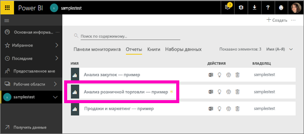
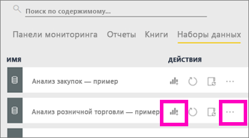
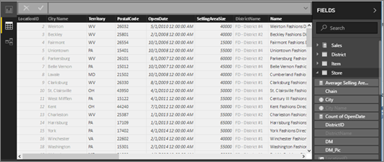
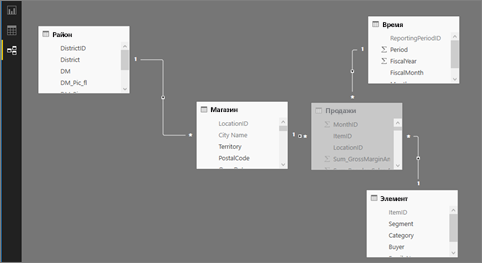

# Образцы Power BI

Мы рекомендуем для начала ознакомиться с [образцами наборов данных для Power BI](sample-datasets.md). В ней содержатся сведения о примерах, их получении, сохранении и использовании, а также описание каждого примера. После ознакомления с общими сведениями мы приступим к изучению этого руководства.   

### Предварительные требования
Примеры доступны как в службе Power BI, так и в Power BI Desktop. Для работы с этим руководством мы будем использовать пример "Анализ розничной торговли".

В этом учебнике используется пакет содержимого с примером *Анализ розничной торговли* , куда входит информационная панель, отчет и набор данных.
Чтобы получить представление об этом пакете содержимого и сценарии его применения до начала работы с руководством, вы можете [ознакомиться с примером "Анализ розничной торговли"](sample-retail-analysis.md).

## Сведения об этом руководстве
Из этого руководства вы узнаете, как выполнять такие задачи: 
- Импорт примера пакета содержимого, его добавление в службу Power BI и открытие содержимого. *Пакет содержимого* — это тип примера, в котором набор данных входит в состав информационной панели и отчета. 
-  Открытие PBIX-файла примера в Power BI Desktop.

## Примеры и служба Power BI

1. Откройте службу Power BI и выполните вход в нее (app.powerbi.com).
2. Нажмите кнопку **Получить данные** в нижней части левой панели навигации. Если команда **Получить данные** отсутствует, разверните панель навигации, выбрав .
   
   
5. Выберите **Образцы**.  
   
   
6. Выберите *Анализ розничной торговли — пример* и нажмите кнопку **Подключить**.   
   
   

## Что конкретно импортируется?
После нажатия кнопки **Подключить** служба Power BI фактически переносит копию пакета содержимого и сохраняет ее в облаке. Пользователь, создавший пакет содержимого, добавил в него набор данных, отчет и информационную панель. Именно это вы и получаете, нажав кнопку **Подключить**. 

1. Power BI создает информационную панель и добавляет ее на вкладку **Информационные панели**. Новая информационная панель отмечается желтой звездочкой.
   
   
2. Откройте вкладку **Отчеты**.  Здесь вы увидите новый отчет с именем *Анализ розничной торговли — пример*.
   
   
   
   Затем перейдите на вкладку **Наборы данных**.  Там также появится новый набор данных.
   
   

## Изучение нового содержимого
Теперь самостоятельно изучите информационную панель, набор данных и отчет. Существует много различных способов перехода к информационным панелям, отчетам и наборам данных. Один из них описан ниже.  

> [!TIP]
> Хотите сначала узнать больше?  Ознакомьтесь с пошаговым руководством по использованию примера "Анализ розничной торговли" в [этой статье](sample-retail-analysis.md).
> 
> 

1. Вернитесь на вкладку **Информационные панели** и выберите информационную панель *Анализ розничной торговли — пример*.    
   
   
2. После этого откроется информационная панель.  Она состоит из ряда плиток визуализаций.
   
   
3. Выберите одну из плиток, чтобы открыть соответствующий отчет.  В этом примере мы выбрали диаграмму с областями (на предыдущем рисунке она выделена розовым цветом). После этого на странице, на которой содержится эта диаграмма с областями, откроется отчет.
   
    
   
   > [!NOTE]
   > Если плитка была создана с помощью функции [Вопросы и ответы](consumer/end-user-q-and-a.md) Power BI, вместо отчета откроется страница вопросов и ответов. Если плитка [закреплена из Excel](service-dashboard-pin-tile-from-excel.md), Excel Online откроется в службе Power BI.
   > 
   > 
1. Вернитесь на вкладку **Наборы данных**. Набор данных можно изучить несколькими способами.  Вы не сможете открыть его и просмотреть все строки и столбцы (как это можно сделать в Power BI Desktop или Excel).  Когда пользователи предоставляют коллегам общий доступ к пакету содержимого, обычно они хотят поделиться аналитическими сведениями, а не предоставить прямой доступ к данным. Но это не означает, что вы не можете просматривать этот набор данных.  
   
   
   
   * Один из способов изучения набора данных заключается в создании собственных визуализаций и отчетов с нуля.  Щелкните значок диаграммы  чтобы открыть набор данных в режиме правки отчета.
     
       
   * Другой способ заключается в выполнении [быстрого анализа](consumer/end-user-insights.md). Щелкните многоточие (...) и выберите **Получить аналитику**. После сбора информации выберите **Просмотреть аналитику**.
     
       

## Примеры и Power BI Desktop 
При первом открытии PBIX-файл примера отображается в представлении отчетов, в котором можно просматривать, создавать и изменять любое количество страниц отчета с визуализациями. Представление отчетов во многом похоже на режим правки отчета в службе Power BI. Вы можете перемещать визуализации, копировать, вставлять, объединять элементы и т. д.

Разница состоит в том, что при использовании Power BI Desktop вы можете работать с запросами и моделями данных, чтобы извлекать самые полезные сведения для отчетов. Затем вы можете сохранить файл Power BI Desktop где угодно — как на локальном диске, так и в облаке.

1. Откройте [PBIX-файл с примером "Анализ розничной торговли"](http://download.microsoft.com/download/9/6/D/96DDC2FF-2568-491D-AAFA-AFDD6F763AE3/Retail%20Analysis%20Sample%20PBIX.pbix) в Power BI Desktop. 

    

1. Файл откроется в представлении отчета. Обратите внимание на 4 вкладки в нижней части редактора отчетов. Это означает, что в этом отчете 4 страницы и что сейчас выбрана страница "Новые магазины". 

    .

3. Подробный обзор редактора отчетов см. в статье [Знакомство с редактором отчетов](service-the-report-editor-take-a-tour.md).

## Что конкретно импортируется?
Когда вы открываете PBIX-файл примера в Power BI Desktop, приложение фактически переносит копию данных и сохраняет ее в облаке. В Power BI Desktop вы имеет доступ к отчету ***и базовому набору данных***. При загрузке данных Power BI Desktop автоматически попытается найти и создать связи.  

1. Переключитесь в [представление данных](desktop-data-view.md), выбрав значок таблицы .
 
    

    Представление данных позволяет проверять, изучать и анализировать данные в модели Power BI Desktop. Оно отличается от просмотра таблиц, столбцов и данных в редакторе запросов. В представлении данных вы видите данные уже после их загрузки в модель.

    При моделировании данных иногда требуется просмотреть фактическое содержимое столбца или таблицы без создания визуального элемента на холсте отчета и часто это требуется сделать на уровне строк. Это особенно характерно для тех случаев, когда вы создаете меры и вычисляемые столбцы или хотите определить тип данных или категорию данных.

1. Переключитесь в режим [представления связей](desktop-relationship-view.md), выбрав значок .
 
    

    В представлении связей показаны все таблицы, столбцы и связи в модели. Здесь вы можете просматривать, изменять и создавать связи.

## Изучение нового содержимого
Теперь самостоятельно изучите набор данных, связи и отчет. Если вам нужна помощь, чтобы приступить к работе, см. руководство [Начало работы с Power BI Desktop](desktop-getting-started.md).    

## Дальнейшие действия
[Power BI — основные понятия](consumer/end-user-basic-concepts.md)

[Примеры для службы Power BI](sample-datasets.md)

[Источники данных для Power BI](service-get-data.md)

Появились дополнительные вопросы? [Ответы на них см. в сообществе Power BI.](http://community.powerbi.com/)

