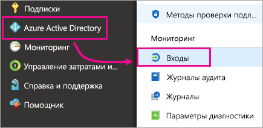

# Поиск пользователей Power BI, выполнивших вход

Если вы — администратор клиента и хотите узнать, кто выполнил вход в Power BI, можно использовать [отчеты о доступе и использовании Azure Active Directory](/azure/active-directory/reports-monitoring/concept-sign-ins), чтобы получить сведения.

<iframe width="640" height="360" src="https://www.youtube.com/embed/1AVgh9w9VM8?showinfo=0" frameborder="0" allowfullscreen></iframe>

> [!NOTE]
> Этот отчет о действиях предоставляет полезную информацию, но не определяет тип лицензии каждого пользователя. Используйте Центр администрирования Microsoft 365 для просмотра лицензий.

## Требования

Любой пользователь (в том числе без прав администратора) может просмотреть отчет о своих событиях входа в систему, но для просмотра отчета для всех пользователей необходимо выполнить следующие требования.

* У клиента должна быть лицензия Azure AD Premium.

* У вас должна быть одна их следующих ролей: глобальный администратор, администратор системы безопасности или читатель сведений о безопасности.

## Просмотр событий входа с помощью портала Azure

Чтобы просмотреть событие входа в систему, выполните следующие действия.

1. На **портале Azure**выберите **Azure Active Directory**.

1. В разделе **Мониторинг** выберите **События входа**.
   
    

1. Отфильтруйте приложение по **Microsoft Power BI** или **Power BI Gateway** и выберите **Применить**.

    Параметр **Microsoft Power BI** отфильтровывает события входа, связанные со службой, тогда как **Power BI Gateway** — конкретные события входа, связанные с локальным шлюзом данных.
   
    

## Экспорт данных

Экспортировать данные входа можно одним из двух способов: скачав файл с расширением .cvs или используя PowerShell. В верхней части отчета о событии входа выберите один из следующих вариантов:

* **Скачать** для скачивания файла с расширением .cvs для текущих отфильтрованных данных.

* **Скрипт** для скачивания скрипта PowerShell для текущих отфильтрованных данных. Вы можете обновить фильтр в скрипте при необходимости.

## Хранение данных

Данные о событиях входа доступны в течение 30 дней. Дополнительные сведения см. в статье [Политики хранения отчетов Azure Active Directory](/azure/active-directory/reports-monitoring/reference-reports-data-retention).

## Дальнейшие действия

[Применение функции аудита в своей организации](service-admin-auditing.md)

Появились дополнительные вопросы? [Попробуйте задать их в сообществе Power BI.](https://community.powerbi.com/)

