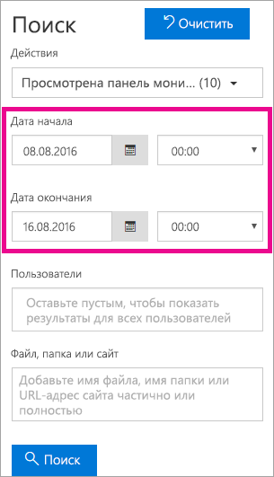
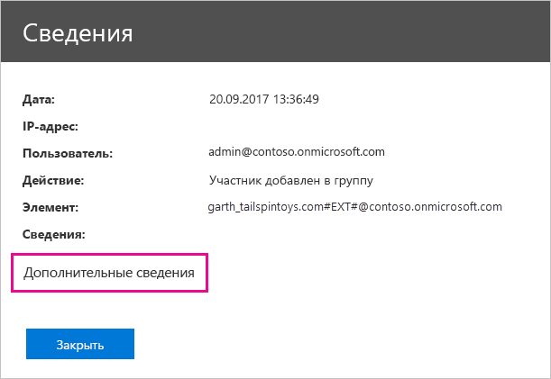

# <a name="using-auditing-within-your-organization"></a>Применение функции аудита в своей организации

Сведения о том, кто выполняет действия в клиенте Power BI, что это за действия и какие элементы они затрагивают, могут быть важными для выполнения требований в организации, например для соблюдения нормативных требований или для управления записями. Функцию аудита Power BI можно использовать для проверки выполнявшихся пользователями действий, таких как просмотр отчета или панели мониторинга. Эту функцию нельзя использовать для аудита разрешений.

Использовать функцию аудита можно в Центре безопасности и соответствия требованиям Microsoft Office 365 или с помощью PowerShell. В этой статье рассматриваются оба способа. Данные аудита можно фильтровать по диапазону дат, пользователю, панели мониторинга, отчету, набору данных и типу действий. Кроме того, можно загрузить информацию о действиях в CSV-файл и проанализировать ее в автономном режиме.

## <a name="requirements"></a>Требования

Чтобы получить доступ к журналам аудита, вы должны удовлетворить следующие требования:

- Для доступа к разделу аудита Центра безопасности и соответствия требованиям Microsoft Office 365 требуется лицензия Exchange Online (включена в подписки Office 365 корпоративный E3 и E5).

- Вы должны быть глобальным администратором или администратором Exchange, который предоставляет доступ к журналу аудита. Ролями администратора Exchange можно управлять в Центре администрирования Exchange. Дополнительные сведения см. в статье [Разрешения в Exchange Online](/exchange/permissions-exo/permissions-exo/).

- Если у вас есть доступ к журналу аудита, но вы не являетесь глобальным администратором или администратором службы Power BI, вы не сможете получить доступ к порталу администрирования Power BI. В таком случае вам нужно получить прямую ссылку на [Центр безопасности и соответствия требованиям Office 365](https://sip.protection.office.com/#/unifiedauditlog).

- Чтобы просмотреть журналы аудита Power BI в клиенте, в нем должна быть хотя бы одна лицензия на почтовый ящик Exchange.

## <a name="accessing-your-audit-logs"></a>Доступ к журналам аудита

Для обращения к журналам сначала убедитесь, что ведение журнала включено в Power BI. Дополнительные сведения см. в разделе [Журналы аудита](service-admin-portal.md#audit-logs) в документации на портале администрирования. После включения аудита его данные могут отобразиться с задержкой до 48 часов. Если данные не отображаются сразу, проверьте журналы аудита позже. Аналогичная задержка возможна при получении разрешения на просмотр журналов аудита: доступ к ним может быть предоставлен не сразу.

Журналы аудита Power BI доступны непосредственно из [Центра безопасности и соответствия требованиям Office 365](https://sip.protection.office.com/#/unifiedauditlog). Также на портале администрирования Power BI есть соответствующая ссылка:

1. В Power BI в правом верхнем углу экрана щелкните **значок шестеренки** и выберите **Портал администрирования**.

   

1. Выберите **Журналы аудита**.

1. Нажмите кнопку **Перейти в Центр администрирования Office 365**.

   

Чтобы предоставить учетным записям без прав администратора доступ к журналу аудита, необходимо назначить соответствующие разрешения в Центре администрирования Exchange Online. Можно назначить пользователя в существующую группу ролей, например "Управление организацией", или создать новую группу ролей "Журналы аудита". Дополнительные сведения см. в статье [Разрешения в Exchange Online](/exchange/permissions-exo/permissions-exo/).

## <a name="search-only-power-bi-activities"></a>Поиск только действий Power BI

Ограничьте результаты поиска только действиями Power BI, выполнив следующие действия. См. дополнительные сведения о [списке действий, проверяемых Power BI](#list-of-activities-audited-by-power-bi) далее в этой статье.

1. На странице **Поиск журналов аудита** в разделе **Поиск** найдите раскрывающийся список **Действия**.

2. Выберите в нем пункт **Действия Power BI**.

   

3. Щелкните в любом месте за пределами поля выбора, чтобы закрыть список.

Теперь в результатах поиска будут отображаться только действия Power BI.

## <a name="search-the-audit-logs-by-date"></a>Поиск журналов аудита по дате

С помощью полей **Дата начала** и **Дата окончания** можно искать журналы по диапазону дат. По умолчанию выбраны последние семь дней. Для даты и времени используется формат UTC. Максимально возможный диапазон дат составляет 90 дней. 

Если выбранный диапазон дат превышает 90 дней, отображается сообщение об ошибке. Если используется максимальный диапазон в 90 дней, выберите текущее время для поля **Дата начала**. В противном случае отобразится сообщение об ошибке, предупреждающее, что дата начала предшествует дате окончания. Если функция аудита была включена в течение последних 90 дней, начало диапазона дат не может предшествовать дате включения этой функции.



## <a name="search-the-audit-logs-by-users"></a>Поиск журналов аудита по пользователям

В записях журнала аудита можно искать действия, выполненные конкретными пользователями. Для этого введите одно или несколько имен пользователей в поле **Пользователи**. Имя пользователя выглядит как адрес электронной почты. Это учетная запись, с помощью которой пользователи входят в Power BI. Чтобы поиск вернул записи для всех пользователей (и учетных записей служб) в организации, оставьте это поле пустым.


## <a name="view-search-results"></a>Просмотр результатов поиска

После нажатия кнопки **Поиск** результаты загружаются и через несколько секунд отображаются в области **Результаты**. По завершении поиска показывается число найденных результатов. Отображается максимум 1000 событий. Если условиям поиска соответствует больше событий, то отображаются последние 1000 событий.

### <a name="view-the-main-results"></a>Просмотр основных результатов

Область **Результаты** содержит следующие сведения о каждом событии, найденном в ходе поиска. Чтобы отсортировать результаты, щелкните заголовок столбца в области **Результаты**.

| **Столбец** | **Определение** |
| --- | --- |
| Даты |Дата и время (в формате UTC) события. |
| IP-адрес |IP-адрес устройства, которое использовалось при регистрации действия. IP-адрес отображается в формате IPv4 или IPv6. |
| User |Пользователь (или учетная запись службы), выполнивший действие, которое вызвало событие. |
| Activity |Действие, выполненное пользователем. Это значение соответствует действиям, выбранным в раскрывающемся списке **Действия**. Для события из журнала аудита администратора Exchange значением в этом столбце является командлет Exchange. |
| Элемент |Объект, который был создан или изменен в результате соответствующего действия. Например просмотренный или измененный файл либо обновленная учетная запись пользователя. Значения в этом столбце отображаются не для всех действий. |
| Подробности |Дополнительные сведения о действии. Аналогичным образом значения в этом столбце отображаются не для всех действий. |

### <a name="view-the-details-for-an-event"></a>Просмотр сведений о событии

Дополнительные сведения о событии можно просмотреть, щелкнув запись о событии в списке результатов поиска. Отобразится страница **Сведения** с подробными свойствами из записи события. Отображаемые свойства зависят от службы Office 365, в которой произошло событие. 

Для отображения этих сведений выберите **Дополнительные сведения**. Свойство RecordType всех записей в Power BI имеет значение 20. См. дополнительные сведения о [свойствах в журнале аудита](/office365/securitycompliance/detailed-properties-in-the-office-365-audit-log/).

   

## <a name="export-search-results"></a>Экспорт результатов поиска

Чтобы экспортировать журнал аудита Power BI в CSV-файл, выполните следующие действия:

1. Выберите команду **Export results** (Экспорт результатов).

1. Выберите пункт **Save loaded results** (Сохранить загруженные результаты) или **Download all results** (Загрузить все результаты).

    

## <a name="use-powershell-to-search-audit-logs"></a>Поиск в журналах аудита с помощью PowerShell

Вы также можете получить доступ к журналам аудита по имени пользователя с помощью PowerShell. В следующем примере показано, как извлечь записи журнала аудита Power BI с помощью команды [Search-UnifiedAuditLog](/powershell/module/exchange/policy-and-compliance-audit/search-unifiedauditlog?view=exchange-ps/).

Чтобы использовать команду [New-PSSession](/powershell/module/microsoft.powershell.core/new-pssession/), требуется назначить учетной записи лицензию Exchange Online и настроить доступ к журналу аудита из вашего клиента. Дополнительные сведения о подключении к Exchange Online см. в разделе [Подключение к Exchange Online с помощью удаленной оболочки PowerShell](/powershell/exchange/exchange-online/connect-to-exchange-online-powershell/connect-to-exchange-online-powershell/).

```powershell
Set-ExecutionPolicy RemoteSigned

$UserCredential = Get-Credential

$Session = New-PSSession -ConfigurationName Microsoft.Exchange -ConnectionUri https://outlook.office365.com/powershell-liveid/ -Credential $UserCredential -Authentication Basic -AllowRedirection

Import-PSSession $Session
Search-UnifiedAuditLog -StartDate 9/11/2018 -EndDate 9/15/2018 -RecordType PowerBI -ResultSize 1000 | Format-Table | More
```

Еще один пример использования PowerShell с журналами аудита описан в руководстве по [использованию журнала аудита Power BI и PowerShell для назначения лицензий Power BI Pro](https://powerbi.microsoft.com/blog/using-power-bi-audit-log-and-powershell-to-assign-power-bi-pro-licenses/).

## <a name="activities-audited-by-power-bi"></a>Список действий, проверяемых Power BI

С помощью Power BI можно выполнять аудит таких действий:

* AddDatasourceToGateway
* AddGroupMembers
* AnalyzedByExternalApplication
* AnalyzeInExcel
* AttachDataflowStorageAccount
* BindToGateway
* ChangeCapacityState
* ChangeGatewayAdministrators
* ChangeGatewayDatasourceUsers
* CreateApp
* CreateDashboard
* CreateDataflow
* CreateDataset
* CreateEmailSubscription
* CreateFolder
* CreateGateway
* CreateGroup
* CreateOrgApp
* CreateReport
* DeleteComment
* DeleteDashboard
* DeleteDataflow
* DeleteDataset
* DeleteEmailSubscription
* DeleteFolder
* DeleteGateway
* DeleteGroup
* DeleteGroupMembers
* DeleteOrgApp
* DeleteReport
* DownloadReport
* EditDataset
* EditReport
* ExportDataflow
* ExportReport
* ExportTile
* GenerateDataflowSasToken
* GenerateEmbedToken
* GetDatasources
* Импорт
* InstallApp
* MigrateWorkspaceIntoCapacity
* OptInForProTrial
* PostComment
* PrintDashboard
* PrintReport
* PublishToWebReport
* RefreshDataset
* RemoveDatasourceFromGateway
* RemoveWorkspacesFromCapacity
* RenameDashboard
* SetAllConnections
* SetScheduledRefresh
* SetScheduledRefreshOnDataflow
* ShareDashboard
* ShareReport
* TakeOverDataset
* TakeOverDatasource
* UnpublishApp
* UpdateApp
* UpdateCapacityAdmins
* UpdateCapacityDisplayName
* UpdateCapacityResourceGovernanceSettings
* UpdateCapacityUsersAssignment
* UpdatedAdminFeatureSwitch
* UpdateDataflow
* UpdateDatasetParameters
* UpdateDatasourceCredentials
* UpdateDatasources
* UpdateEmailSubscription
* UpdateFolder
* UpdateFolderAccess
* ViewDashboard
* ViewDataflow
* ViewReport
* ViewTile
* ViewUsageMetrics

## <a name="next-steps"></a>Дальнейшие действия

[Что такое администрирование Power BI?](service-admin-administering-power-bi-in-your-organization.md)  

[Портал администрирования Power BI](service-admin-portal.md)  

Появились дополнительные вопросы? [Попробуйте задать вопрос в сообществе Power BI.](http://community.powerbi.com/)
