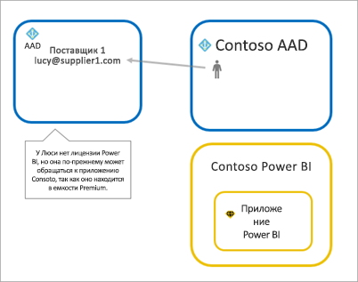
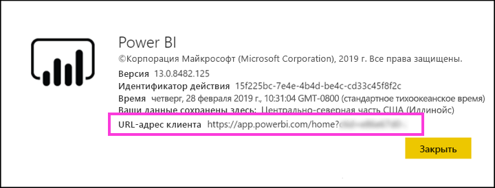

# Предоставление содержимого Power BI внешним гостевым пользователям с помощью Azure AD B2B

Power BI интегрируется с Azure Active Directory B2B (Azure AD B2B), чтобы обеспечить безопасное распространение содержимого Power BI для гостевых пользователей за пределами организации и сохранить контроль над внутренними данными.  

Кроме того вы можете разрешить гостевым пользователям за пределами вашей организации редактировать содержимое в вашей организации и управлять им.

## Предоставление доступа

Прежде чем приглашать гостевых пользователей, включите функцию [Предоставление внешним пользователям общего доступа к содержимому](service-admin-portal.md#export-and-sharing-settings) на портале администрирования Power BI.

Кроме того, функция [Разрешение внешним гостям отслеживать и изменять содержимое в организации](service-admin-portal.md#export-and-sharing-settings) позволяет указать, какой гостевой пользователь может просматривать и создавать содержимое в рабочих областях, включая просмотр данных Power BI в вашей организации.

## Кого вы можете пригласить?

Вы можете приглашать гостевых пользователей, использующих любой адрес электронной почты, включая личные учетные записи, такие как gmail.com, outlook.com или hotmail.com. В Azure AD B2B эти адреса называются *удостоверениями социальных сетей*.

## Приглашение гостевых пользователей

Приглашения нужны только при первом добавлении внешнего гостевого пользователя для вашей организации. Пригласить пользователей можно двумя способами: с использованием плановых приглашений и специализированных приглашений.

### Плановые приглашения

Используйте плановое приглашение, если знаете, каких пользователей нужно пригласить. Вы можете отправлять приглашения с помощью портала Azure или PowerShell. Для этого вам потребуются права администратора клиента.

Чтобы отправить приглашение на портале Azure, выполните следующие действия.

1. На [портале Azure](https://portal.azure.com) выберите **Azure Active Directory**.

1. В разделе **Управление** выберите **Пользователи** > **Все пользователи** > **Новый гостевой пользователь**.

    

1. Введите **адрес электронной почты** и **личное сообщение**.

    

1. Выберите **Пригласить**.

Чтобы пригласить несколько гостевых пользователей, воспользуйтесь PowerShell. Дополнительные сведения см. в статье [Примеры кода и команд PowerShell для службы совместной работы Azure Active Directory B2B](/azure/active-directory/b2b/code-samples/).

В полученном электронном письме с приглашением гостевому пользователю нужно выбрать **Get Started** (Приступить к работе). Затем гостевой пользователь добавляется к клиенту.

### Специализированные приглашения

Чтобы пригласить кого-то в любое время, добавьте этого внешнего пользователя в свою панель мониторинга или свой отчет через общий пользовательский интерфейс либо в свое приложение с помощью страницы доступа. Ниже приведен пример того, что нужно сделать, чтобы пригласить внешнего пользователя для работы с приложением.

Гостевой пользователь получит письмо о том, что ему предоставлен общий доступ к приложению.

Гостевой пользователь должен войти с использованием организационного адреса электронной почты. После входа будет предложено принять приглашение и гостевой пользователь будет перенаправлен к содержимому приложения. Чтобы вернуться в приложение, пользователь может добавить ссылку в закладки или сохранить письмо.

## Лицензирование

Для просмотра содержимого, к которому предоставлен доступ, гостевому пользователю понадобится соответствующая лицензия. Существует три варианта выполнения этой задачи: использовать Power BI Premium, назначить лицензию Power BI Pro или использовать лицензию Power BI Pro гостевого пользователя.

При использовании функции [Разрешение внешним гостям отслеживать и изменять содержимое в организации](service-admin-portal.md#export-and-sharing-settings) гостевым пользователям, которые вносят содержимое в рабочие области или делятся им с другими пользователями, нужна лицензия Power BI Pro.

### Использование Power BI Premium

Если назначить рабочую область приложения для [емкости Power BI Premium](service-premium.md), гостевой пользователь сможет работать с приложением без лицензии Power BI Pro. Power BI Premium также позволяет воспользоваться и другими возможностями для приложений, такими как частые обновления, выделенные емкости и крупные модели.

### Назначение гостевому пользователю лицензии Power BI Pro

Назначенная в клиенте лицензия Power BI Pro позволит гостевому пользователю просматривать содержимое в клиенте.

### Применение лицензии Power BI Pro гостевого пользователя

Гостевому пользователю уже назначена лицензия Power BI Pro в клиенте.

## Гостевые пользователи, которые могут редактировать содержимое и управлять им 

При использовании функции [Разрешение внешним гостям отслеживать и изменять содержимое в организации](service-admin-portal.md#export-and-sharing-settings) указанные гостевые пользователи получают доступ к Power BI вашей организации и могут просматривать любое содержимое, на которое у них есть разрешение. Они могут открывать главную страницу, просматривать рабочие области, устанавливать приложения при условии включения в список доступа, а также вносить содержимое в рабочие области. Они могут создавать или администрировать рабочие области, использующие новые возможности взаимодействия. При этом применяются некоторые ограничения, которые перечислены в разделе "Рекомендации и ограничения".

Чтобы помочь этим пользователям войти в Power BI, предоставьте им URL-адрес клиента. Чтобы найти URL-адрес клиента, выполните указанные ниже действия.

1. В службе Power BI в верхнем меню выберите справку (**?**) и **О Power BI**.

2. Найдите значение рядом с полем **URL-адрес клиента**. Это URL-адрес клиента, которым вы можете поделиться с гостевыми пользователями.

## Рекомендации и ограничения

* По умолчанию внешние гостевые пользователи B2B могут только использовать содержимое. Они имеют право просматривать приложения, панели мониторинга, отчеты, экспортировать данные и создавать подписки на панели мониторинга и отчеты по электронной почте. Они не могут использовать рабочие области и публиковать собственное содержимое. Однако эти ограничения не применяются к гостевым пользователям, для которых активен параметр клиента [Разрешение внешним гостям отслеживать и изменять содержимое в организации](service-admin-portal.md#export-and-sharing-settings).

* Гостевым пользователям, для которых включен параметр [Разрешение внешним гостям отслеживать и изменять содержимое в организации](service-admin-portal.md#export-and-sharing-settings), некоторые возможности недоступны. Чтобы изменять или публиковать отчеты, им нужно использовать пользовательский веб-интерфейс службы Power BI, включая функцию "Получить данные" для отправки файлов Power BI Desktop.  Не поддерживаются следующие возможности:
    * Прямая публикация из Power BI Desktop в службу Power BI.
    * Гостевые пользователи не могут использовать Power BI Desktop для подключения к наборам данных службы в службе Power BI.
    * Классические рабочие области привязаны к Группам Office 365: гостевой пользователь не может создавать или администрировать эти рабочие области. Он может быть их членом.
    * Отправка специализированных приглашений не поддерживается для списков доступа рабочей области.
    * Power BI Publisher для Excel не поддерживается для гостевых пользователей.
    * Гостевые пользователи не могут установить Power BI Gateway и подключить его к вашей организации.
    * Гостевые пользователи не могут устанавливать приложения с публикацией для всей организации.
    * Гостевые пользователи не могут использовать, создавать, изменять или устанавливать пакеты содержимого организации.
    * Гостевые пользователи не могут использовать анализ в Excel.
    * Гостевые пользователи не могут быть @mentioned в комментариях.
    * Гостевые пользователи не могут использовать подписки.
    * Гостевые пользователи, использующие эту возможность, должны иметь рабочую или учебную учетную запись. Для гостевых пользователей с личными учетными записями действуют дополнительные ограничения, связанные со входом.

* Этот компонент сейчас недоступен в веб-части отчетов SharePoint Online в Power BI.

* Существуют параметры Active Directory, позволяющие ограничивать деятельность внешних гостевых пользователей в рамках всей организации, а также применяемые к вашей среде Power BI. Эти параметры описаны в следующей документации:
    * [Управление параметрами внешнего взаимодействия](https://docs.microsoft.com/azure/active-directory/b2b/delegate-invitations#control-who-can-invite)
    * [Разрешение или запрет приглашений для пользователей B2B из определенных организаций](https://docs.microsoft.com/azure/active-directory/b2b/allow-deny-list)  

## Дальнейшие действия

Дополнительные сведения, включая сведения о безопасности на уровне строк, см. в техническом документе о [предоставлении содержимого Power BI внешним гостевым пользователям с помощью Azure AD B2B](https://aka.ms/powerbi-b2b-whitepaper)

Сведения об Azure AD B2B см. в статье [Что представляет собой гостевой доступ в службе совместной работы Azure Active Directory B2B?](/azure/active-directory/active-directory-b2b-what-is-azure-ad-b2b/)
