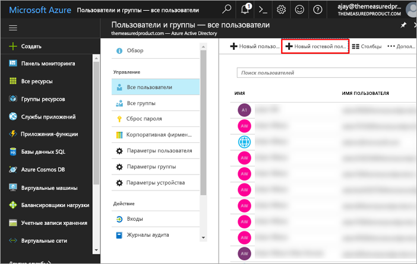
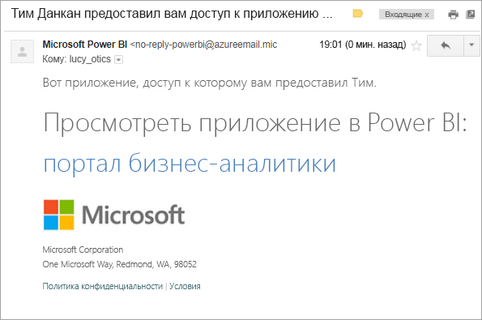
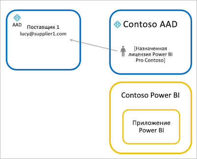
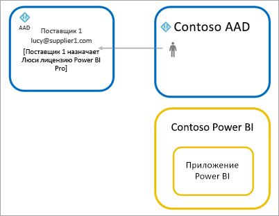

# Предоставление содержимого Power BI внешним гостевым пользователям с помощью Azure AD B2B

Power BI интегрируется с Azure Active Directory B2B (Azure AD B2B), чтобы обеспечить безопасное распространение содержимого Power BI для гостевых пользователей за пределами организации и сохранить контроль над внутренними данными.

## Предоставление доступа

Прежде чем приглашать гостевых пользователей, включите функцию [Параметры экспорта и совместного доступа](service-admin-portal.md#export-and-sharing-settings) на портале администрирования Power BI.

## Кого вы можете пригласить?

Вы можете приглашать гостевых пользователей, использующих любой адрес электронной почты, включая личные учетные записи, такие как gmail.com, outlook.com или hotmail.com. В Azure AD B2B эти адреса называются *удостоверениями социальных сетей*.

## Приглашение гостевых пользователей

Приглашения нужны только при первом добавлении внешнего гостевого пользователя для вашей организации. Пригласить пользователей можно двумя способами: с использованием плановых приглашений и специализированных приглашений.

### Плановые приглашения

Используйте плановое приглашение, если знаете, каких пользователей нужно пригласить. Вы можете отправлять приглашения с помощью портала Azure или PowerShell. Для этого вам потребуются права администратора клиента.

Чтобы отправить приглашение на портале Azure, выполните следующие действия.

1. На [портале Azure](https://portal.azure.com) выберите **Azure Active Directory**.

1. В разделе **Управление** выберите **Пользователи** > **Все пользователи** > **Новый гостевой пользователь**.

    

1. Введите **адрес электронной почты** и **личное сообщение**.

    

1. Выберите **Пригласить**.

Чтобы пригласить несколько гостевых пользователей, воспользуйтесь PowerShell. Дополнительные сведения см. в статье [Примеры кода и команд PowerShell для службы совместной работы Azure Active Directory B2B](/azure/active-directory/b2b/code-samples/).

В полученном электронном письме с приглашением гостевому пользователю нужно выбрать **Get Started** (Приступить к работе). Затем гостевой пользователь добавляется к клиенту.

### Специализированные приглашения

Чтобы пригласить кого-то в любое время, добавьте этого внешнего пользователя в свою панель мониторинга или свой отчет через общий пользовательский интерфейс либо в свое приложение с помощью страницы доступа. Ниже приведен пример того, что нужно сделать, чтобы пригласить внешнего пользователя для работы с приложением.

Гостевой пользователь получит письмо о том, что ему предоставлен общий доступ к приложению.

Гостевой пользователь должен войти с использованием организационного адреса электронной почты. После входа будет предложено принять приглашение и гостевой пользователь будет перенаправлен к содержимому приложения. Чтобы вернуться в приложение, пользователь может добавить ссылку в закладки или сохранить письмо.

## Лицензирование

Для просмотра приложения, к которому предоставлен доступ, гостевому пользователю понадобится соответствующая лицензия. Существует три варианта выполнения этой задачи: использовать Power BI Premium, назначить лицензию Power BI Pro или использовать лицензию Power BI Pro гостевого пользователя.

### Использование Power BI Premium

Если назначить рабочую область приложения для [емкости Power BI Premium](service-premium.md), гостевой пользователь сможет работать с приложением без лицензии Power BI Pro. Power BI Premium также позволяет воспользоваться и другими возможностями для приложений, такими как частые обновления, выделенные емкости и крупные модели.

### Назначение гостевому пользователю лицензии Power BI Pro

Назначенная в клиенте лицензия Power BI Pro позволит гостевому пользователю просматривать содержимое в клиенте.

### Применение лицензии Power BI Pro гостевого пользователя

Гостевому пользователю уже назначена лицензия Power BI Pro в клиенте.

## Рекомендации и ограничения

* Внешние гостевые пользователи B2B могут только использовать содержимое. Они имеют право просматривать приложения, панели мониторинга, отчеты, экспортировать данные и создавать подписки на панели мониторинга и отчеты по электронной почте. Они не могут использовать рабочие области и публиковать собственное содержимое.

* Этот компонент сейчас недоступен в мобильных приложениях Power BI. На мобильных устройствах содержимое Power BI можно просматривать, используя Azure AD B2B в браузере.

* Этот компонент сейчас недоступен в веб-части отчетов SharePoint Online в Power BI.

## Дальнейшие действия

Дополнительные сведения и сведения о безопасности на уровне строк см. в техническом документе [Distribute Power BI content to external guest users using Azure AD B2B](https://aka.ms/powerbi-b2b-whitepaper) (Предоставление содержимого Power BI внешним гостевым пользователям с помощью Azure AD B2B).

Сведения об Azure AD B2B см. в статье [Что представляет собой гостевой доступ в службе совместной работы Azure Active Directory B2B?](/azure/active-directory/active-directory-b2b-what-is-azure-ad-b2b/)
