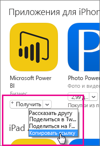
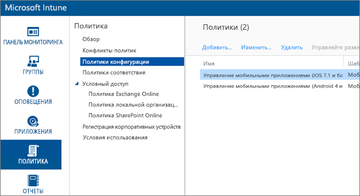
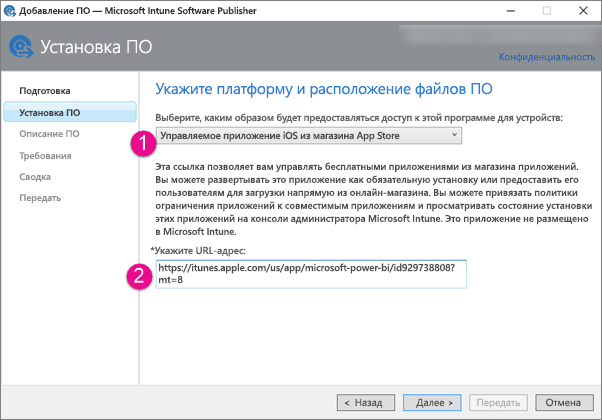
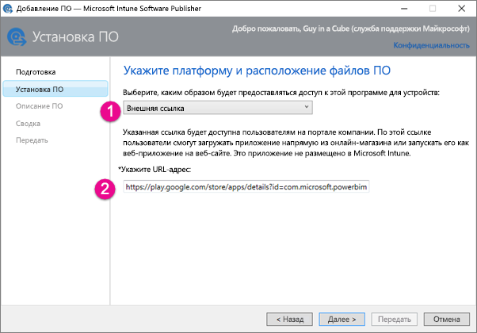
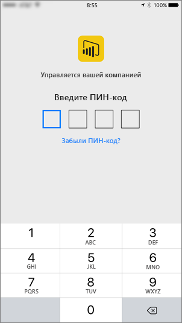

# Настройка мобильных приложений в Microsoft Intune
Microsoft Intune позволяет организациям управлять устройствами и приложениями. Мобильные приложения Power BI для iOS и Android интегрируются с Intune, позволяя управлять приложениями на устройствах и вести контроль безопасности. В политиках конфигурации можно управлять такими элементами, как требование ПИН-кода доступа, управление способом обработки данных в приложении и даже шифрование данных приложения, если приложение не используется.

## Общая конфигурация управления мобильными устройствами
Эта статья не является полным руководством по настройке Microsoft Intune. Если вы не выполняете интеграцию с Intune, следует убедиться, что вы настроили следующее. [Дополнительные сведения](https://technet.microsoft.com/library/jj676587.aspx)

Microsoft Intune может сосуществовать со службой управления мобильными устройствами (MDM) в Office 365. [Дополнительные сведения](https://blogs.technet.microsoft.com/configmgrdogs/2016/01/04/microsoft-intune-co-existence-with-mdm-for-office-365/)

В этой статье предполагается, что служба Intune правильно настроена и у вас есть устройства, зарегистрированные в Intune. Если вы используете службу, сосуществующую с MDM, устройство будет отображаться как зарегистрированное в MDM, и будет доступно для управления в Intune.

> [!NOTE]
> Если в вашей организации настроены возможности Microsoft Intune MAM и вы используете мобильное приложение Power BI на устройстве iOS или Android, фоновое обновление данных будет отключено. Power BI обновит данные из службы Power BI в Интернете при следующем входе в приложение.
> 
> 

## Шаг 1. Получение URL-адреса приложения
Перед тем как создать приложение в Intune, необходимо получить URL-адреса приложений. Для iOS их можно получить в iTunes. Для Android их можно получить на мобильной странице Power BI.

Сохраните URL-адрес, так как он потребуется при создании приложения.

### iOS
URL-адрес приложения для iOS необходимо получить из iTunes.

1. Откройте iTunes.
2. Найдите *Power BI*.
3. Перейдите к пункту **Microsoft Power BI** в списке **Приложения iPhone** или **Приложения iPad**. Вы можете использовать любой из них, так как получите один и тот же URL-адрес.
4. Откройте раскрывающийся список **Получить** и выберите **Копировать ссылку**.
   
    

Она должна выглядеть следующим образом.

    https://itunes.apple.com/us/app/microsoft-power-bi/id929738808?mt=8

### Android
Вы можете получить URL-адрес в Google Play с [мобильной страницы Power BI](https://powerbi.microsoft.com/mobile/). Щелкните значок **Скачать из Google Play** , чтобы перейти на страницу приложения. Вы можете скопировать URL-адрес из адресной строки браузера. Она должна выглядеть следующим образом.

    https://play.google.com/store/apps/details?id=com.microsoft.powerbim

## Шаг 2. Создание политики управления мобильными приложениями
Политика управления мобильными приложениями позволяет вам принудительно использовать такие требования, как ПИН-код доступа. Вы можете создавать их на портале Intune. 

Создать сначала можно либо приложение, либо политику. Порядок добавления не имеет значения. Но и то, и то должно существовать для успешного развертывания.

1. Выберите пункты **Политика** > **Политики конфигурации**.
   
    
2. Нажмите кнопку **Добавить...**.
3. В меню **Программное обеспечение** можно выбрать управление мобильными приложениями для Android или iOS. Чтобы быстро начать работу, можно выбрать команду **Создайте политику с рекомендованными настройками**или создать настраиваемую политику.
4. Измените политику для настройки нужных ограничений в приложении.

## Шаг 3. Создание приложения
Приложение является ссылкой (или пакетом), которая сохраняется в Intune для развертывания. Нам потребуется создать приложение и сослаться на URL-адрес приложения, полученный из Google Play или iTunes.

Создать сначала можно либо приложение, либо политику. Порядок добавления не имеет значения. Но и то, и то должно существовать для успешного развертывания.

1. Перейдите на портал Intune и выберите в меню слева **Приложения** .
2. Щелкните **Добавить приложение**. Запустится приложение **Добавление программного обеспечения** .

### iOS
1. Выберите **Управляемое приложение iOS из App Store** в раскрывающемся списке.
2. Введите URL-адрес приложения, полученный на [шаге 1](#step-1-get-the-url-for-the-application), и нажмите кнопку **Далее**.
   
    
3. Заполните поля **Издатель**, **Имя** и **Описание**. При необходимости можно указать **Значок**. **Категория** предназначена для приложения корпоративного портала. После этого нажмите кнопку **Далее**.
4. Вы можете опубликовать приложение как **Любое** (по умолчанию), **iPad** или **iPhone**. По умолчанию оно отобразится как **Любое** и будет работать для обоих типов устройств. URL-адрес приложения Power BI будет одинаковым как для iPhone, так и для iPad. Нажмите кнопку **Далее**.
5. Выберите команду **Отправить**.

> [!NOTE]
> Возможно, приложение не отобразится в списке приложений, пока вы не обновите страницу. Можно нажать кнопку **Обзор** и вернуться к пункту **Приложения**, чтобы перезагрузить страницу.
> 
> 

### Android
1. Выберите пункт **Внешняя ссылка** в раскрывающемся списке.
2. Введите URL-адрес приложения, полученный на [шаге 1](#step-1-get-the-url-for-the-application), и нажмите кнопку **Далее**.
   
    
3. Заполните поля **Издатель**, **Имя** и **Описание**. При необходимости можно указать **Значок**. **Категория** предназначена для приложения корпоративного портала. После этого нажмите кнопку **Далее**.
4. Выберите команду **Отправить**.

> [!NOTE]
> Возможно, приложение не отобразится в списке приложений, пока вы не обновите страницу. Можно нажать кнопку **Обзор** и вернуться к пункту **Приложения**, чтобы перезагрузить страницу.
> 
> 

## Шаг 4. Развертывание приложения
После добавления приложения потребуется развернуть его, чтобы оно стало доступно конечным пользователям. На этом шаге производится привязка созданной политики к приложению.

### iOS
1. На экране приложений выберите созданное приложение. Затем щелкните ссылку **Управление развертыванием...** .
   
    
2. На экране **Выбор групп** укажите группы, в которых вы хотите развернуть это приложение. Нажмите кнопку **Далее**.
3. На экране **Действие развертывания** укажите способ развертывания этого приложения. Выберите пункт **Доступная установка**или **Обязательная установка**, чтобы предоставить приложение пользователям на корпоративном портале для установки по запросу. После этого нажмите кнопку **Далее**.
   
    
4. На экране **Управление мобильными приложениями** можно выбрать политику управления мобильными приложениями, созданную на [шаге 2](#step-2-create-a-mobile-application-management-policy). По умолчанию будет использоваться созданная вами политика, если она является единственной доступной политикой iOS. Нажмите кнопку **Далее**.
   
    
5. На экране **Профиль VPN** можно выбрать политику для организации, если она есть. Значение по умолчанию — **Нет**. Нажмите кнопку **Далее**.
6. На экране **Настройка мобильного приложения** можно выбрать пункт **Политика настройки приложения** , если вы создали такую политику. Значение по умолчанию — **Нет**. Это необязательное значение. Нажмите кнопку **Завершить**.

После этого для развернутых приложений должно отображаться значение **Да** на странице приложений.

### Android
1. На экране приложений выберите созданное приложение. Затем щелкните ссылку **Управление развертыванием...** .
   
    
2. На экране **Выбор групп** укажите группы, в которых вы хотите развернуть это приложение. Нажмите кнопку **Далее**.
3. На экране **Действие развертывания** укажите способ развертывания этого приложения. Выберите пункт **Доступная установка**или **Обязательная установка**, чтобы предоставить приложение пользователям на корпоративном портале для установки по запросу. После этого нажмите кнопку **Далее**.
   
    
4. На экране **Управление мобильными приложениями** можно выбрать политику управления мобильными приложениями, созданную на [шаге 2](#step-2-create-a-mobile-application-management-policy). По умолчанию будет использоваться созданная вами политика, если она является единственной доступной политикой Android. Нажмите кнопку **Завершить**.
   
    

После этого для развернутых приложений должно отображаться значение **Да** на странице приложений.

## Шаг 5. Установка приложения на устройстве
Приложение устанавливается через приложение корпоративного портала. Если вы не установили приложение корпоративного портала, это можно сделать в магазине приложений на платформах iOS или Android. Войдите на корпоративный портал, используя учетные данные организации.

1. Откройте приложение корпоративного портала.
2. Если приложения Power BI нет в списке популярных приложений, выберите **Приложения организации**.
   
    
3. Выберите развернутое приложение Power BI.
   
    
4. Нажмите кнопку **Установить**.
   
    
5. Если у вас iOS, приложение будет передано вам через push-уведомление. Выберите пункт **Установить** в диалоговом окне push-уведомления.
   
    

После установки вы увидите, что приложение **управляется вашей организацией**. Если вы включили доступ с помощью ПИН-кода, в политике появится следующее.

## Дальнейшие действия
[Настройка и развертывание политик управления мобильными приложениями в консоли Microsoft Intune](https://technet.microsoft.com/library/dn878026.aspx)  
[Приложения Power BI для мобильных устройств](consumer/mobile/mobile-apps-for-mobile-devices.md)  

Появились дополнительные вопросы? [Попробуйте задать вопрос в сообществе Power BI.](http://community.powerbi.com/)

