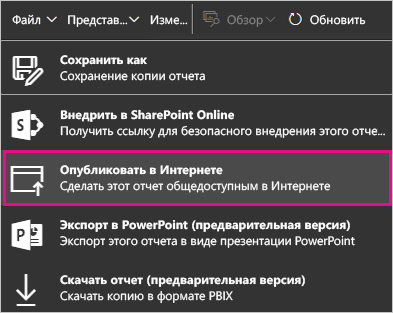
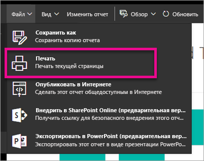
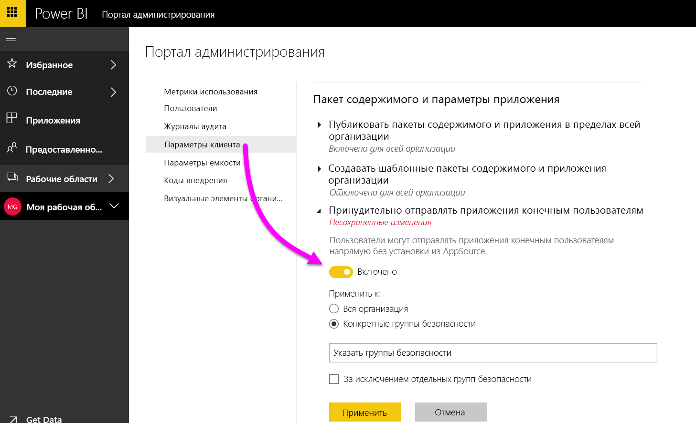
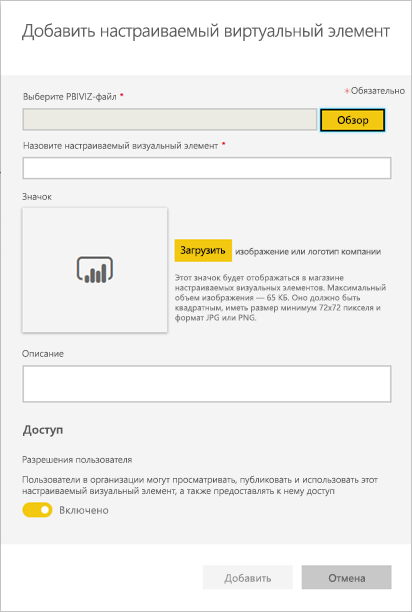

# Портал администрирования Power BI

Портал администрирования служит для управления клиентами Power BI в организации. Он включает такие элементы, как метрики использования, доступ к Центру администрирования Office 365 и настройки.

Управление клиентами Power BI для организации осуществляется через портал администрирования Power BI. Портал администрирования доступен для всех пользователей, которым назначена роль глобального администратора в Office 365 или роль администратора службы Power BI. Дополнительные сведения о роли администратора службы Power BI см. в [этой статье](service-admin-role.md).

Все пользователи будут видеть **портал администрирования** под значком с шестеренкой. Если у них нет административных полномочий, они увидят только раздел **Параметры Premium** и те емкости, на управление которыми у них есть права.

## Переход к порталу администрирования

Чтобы получить доступ к порталу администрирования Power BI, учетная запись в Office 365 или Azure Active Directory должна быть отмечена как **глобальный администратор** или иметь роль администратора службы Power BI. Дополнительные сведения о роли администратора службы Power BI см. в [этой статье](service-admin-role.md). Чтобы перейти к порталу администрирования Power BI, выполните следующие действия.

1. Выберите значок настройки (шестеренка) в верхней правой части окна службы Power BI.
2. Выберите **Портал администрирования**.

На портале есть шесть вкладок. Они описаны ниже.

* [Метрики использования](#usage-metrics)
* [Пользователи](#users)
* [Журналы аудита](#audit-logs)
* [Параметры клиента](#tenant-settings)
* [Параметры Premium](#premium-settings)
* [Коды внедрения](#embed-codes)
* [Визуальные элементы организации](#Organization-visuals).

## Метрики использования
Первая вкладка на портале администрирования — **Метрики использования**. Отчет "Метрики использования" дает возможность отслеживать использование в Power BI для вашей организации. Он также позволяет узнать, какие пользователи и группы наиболее активны в Power BI для вашей организации.

> [!NOTE]
> При первом доступе к панели мониторинга или при ее повторном открытии после длительного периода ее неиспользования отображается экран загрузки, так как загрузка панели мониторинга может занимать некоторое время.

После загрузки панели мониторинга вы увидите два набора плиток. Первый раздел содержит данные об использовании для отдельных пользователей, а второй — аналогичные сведения для групп в организации.

Ниже показано содержимое каждой плитки.

* Точное число всех панелей мониторинга, отчетов и наборов данных в рабочей области пользователя.
  
    

* Самая востребованная панель мониторинга по числу пользователей, которые могут получать к ней доступ. Например, если имеется панель мониторинга, доступ к которой вы предоставили трем пользователям, также добавленная в пакет содержимого, к которому подключены два разных пользователя, для нее будет отображаться число 6 (1 + 3 + 2).
  
    

* Самое популярное содержимое, к которому подключаются пользователи. Это может быть любое содержимое, к которому могут перейти пользователи с помощью функции получения данных, например пакеты содержимого SaaS, пакеты содержимого организации, файлы или базы данных.
  
    

* Представление основных пользователей на основе числа их панелей мониторинга (как созданных ими, так и тех, к которым им предоставлен доступ).
  
    

* Представление основных пользователей на основе числа их отчетов.
  
    

Во втором разделе показаны те же сведения, но для групп. Эти плитки помогают вам понять, какие группы в организации являются наиболее активными и какие сведения они используют.

Эти сведения помогают вам получить реальную информацию о том, как люди используют Power BI в вашей организации, и распознавать самых активных пользователей и группы.

## Пользователи

Вторая вкладка на портале администрирования — **Управление пользователями**. Управление пользователями для Power BI осуществляется через центр администрирования Office 365, поэтому этот раздел позволяет вам быстро перейти к областям управления пользователями, администраторами и группами в Office 365.

Щелкнув ссылку **Перейти в Центр администрирования Office 365**, вы перейдете непосредственно на целевую страницу центра администрирования Office 365 для управления пользователями вашего клиента.

## Журналы аудита

Третья вкладка на портале администрирования — **Журналы аудита**. Журналы находятся в центре безопасности и соответствия требованиям Office 365. Этот раздел позволяет быстро получить доступ к этой области в Office 365.

Дополнительные сведения о журналах аудита см. в разделе [Auditing Power BI in your organization](service-admin-auditing.md) (Аудит Power BI в организации).

## Параметры клиента

Третья вкладка на портале администрирования — **Параметры клиента**. Параметры клиента позволяют вам более точно контролировать функции, предоставляемые для пользователей вашей организации. Если вам необходим высокий уровень конфиденциальности данных или вы хотите предоставить определенную функцию отдельной группе, некоторые функции могут не подходить для вашей организации. В этом случае вы можете отключить их в клиенте.

> [!NOTE]
> Вступление изменения параметров в силу для всех пользователей в клиенте может занять до 10 минут.

Указанные параметры могут иметь 3 состояния.

### Состояние "Отключено для всей организации"

Вы можете отключить функцию и сделать так, чтобы пользователи не могли использовать ее.

### Состояние "Включено для всей организации"

Вы можете включить функцию для всей организации, предоставив к ней доступ всем пользователям.

### Состояние "Включено для части организации"

Функцию также можно включить для определенной части организации. Это можно сделать несколькими способами. Вы можете включить ее для всей организации, за исключением определенной группы пользователей.

Кроме того, ее можно включить только для определенной группы пользователей, за исключением отдельных сотрудников. За счет этого определенные пользователи не будут иметь доступ к функции, даже если они входят в группу с правами доступа к этой функции.

## Вкладка "Параметры экспорта и совместного доступа"

### Параметр "Предоставлять внешним пользователям общий доступ к контенту"

Пользователи в вашей организации могут предоставлять внешним пользователям общий доступ к информационным панелям.

Так выглядит сообщение, отображаемое при предоставлении общего доступа внешнему пользователю.

### Опубликовать в Интернете

Пользователи в организации могут публиковать отчеты в Интернете. [Дополнительные сведения](service-publish-to-web.md)

Пользователи будут видеть разные параметры в пользовательском интерфейсе в зависимости от настроек параметра "Опубликовать в Интернете".

|Избранное |Включена для всей организации |Отключена для всей организации |Конкретные группы безопасности   |
|---------|---------|---------|---------|
|**Опубликовать в Интернете** в меню **Файл** отчета.|Включена для всех|Не отображается никому|Отображается только авторизованным пользователям и группам.|
|**Управление кодами внедрения** в меню **Параметры**|Включена для всех|Включена для всех|Включена для всех  Параметр * **Удалить** доступен для авторизованных пользователей или групп. Параметр * **Получить коды** доступен для всех.|
|Параметр **Коды внедрения** на портале администратора|Состояние может иметь одно из значений: * Активен * Не поддерживается * Заблокирован|Отображается состояние **Отключен**|Состояние может иметь одно из значений: * Активен * Не поддерживается * Заблокирован  Если пользователь не авторизовался в соответствии с настройками клиента, будет отображаться состояние **Нарушено**.|
|Существующие опубликованные отчеты|Все включены|Все отключены|Отчеты продолжают отображаться для всех.|

### Экспорт данных

Пользователи в организации могут экспортировать данные с плитки или из визуализации. [Дополнительные сведения](power-bi-visualization-export-data.md)

> [!NOTE]
> Если отключить параметр **Экспортировать данные**, пользователи не смогут использовать функцию **анализа в Excel**, а также функцию динамического подключения к службе Power BI.

### Экспорт отчетов в виде презентаций PowerPoint

Пользователи в организации могут экспортировать отчеты Power BI как файлы PowerPoint. [Дополнительные сведения](service-publish-to-powerpoint.md)

### Параметр "Печать панелей мониторинга и отчетов"

Пользователи в организации могут распечатывать информационные панели и отчеты. [Дополнительные сведения](service-print.md)

## Вкладка "Параметры пакета содержимого"

### Опубликовать пакеты содержимого для всей организации

Пользователи в организации могут публиковать пакеты содержимого для всей организации.

### Параметр "Создавать шаблонные пакеты содержимого организации"

Пользователи в организации могут создавать пакеты содержимого шаблонов, в которых используются наборы данных, созданные на основе одного источника данных из Power BI Desktop.

### Принудительная отправка приложений конечным пользователям

Администратор клиента включает возможность принудительной отправки приложений в **параметрах клиента**.

   

Вы можете **включить** этот параметр, а затем указать, кому предоставляется эта возможность (всей организации или отдельным группам безопасности).

> [!NOTE]
> Помните, что может пройти некоторое время, прежде чем изменения параметров клиента вступят в силу.

Перейдите сюда, чтобы получить дополнительные сведения о [принудительной отправке приложений](service-create-distribute-apps.md#how-to-install-an-app-automatically-for-end-users).

## Вкладка "Параметры интеграции"

### Параметр "Задавать вопросы о данных с помощью Кортаны"
Пользователи в организации могут задавать вопросы о своих данных с помощью Кортаны.

> [!NOTE]
> Этот параметр применяется ко всей организации и не ограничивается определенными группами.

### Параметр "Использовать анализ в Excel для работы с локальными наборами данных"
Пользователи в организации могут просматривать локальные наборы данных Power BI и взаимодействовать с ними в Excel. [Дополнительные сведения](service-analyze-in-excel.md)

> [!NOTE]
> Если отключить параметр **Экспорт данных**, пользователи не смогут использовать функцию **Анализировать в Excel**.

### Использование ArcGIS Maps for Power BI

Пользователи в организации могут использовать визуализацию ArcGIS Maps for Power BI от Esri. [Дополнительные сведения](power-bi-visualization-arcgis.md)

### Использование глобального поиска для Power BI (предварительная версия)

Пользователи в организации могут использовать внешние функции поиска на основе службы "Поиск Azure". Например, с помощью Кортаны можно получать важные сведения непосредственно из панелей мониторинга и отчетов Power BI. [Дополнительные сведения](service-cortana-intro.md)

## Параметры настраиваемых визуальных элементов
### Включение настраиваемых визуальных элементов для всей организации
Пользователи в организации могут взаимодействовать с настраиваемыми визуальными элементами. [Дополнительные сведения](power-bi-custom-visuals.md)

> [!NOTE]
> Этот параметр применяется ко всей организации и не ограничивается определенными группами.

## Вкладка "Параметры визуальных элементов R"

### Параметр "Взаимодействие с визуальными элементами R и их публикация"

Пользователи в организации могут взаимодействовать с визуальными элементами, созданными при помощи R-скриптов, и делиться ими. [Дополнительные сведения](service-r-visuals.md)

> [!NOTE]
> Этот параметр применяется ко всей организации и не ограничивается определенными группами.

## Вкладка "Параметры аудита"

### Параметр "Создание журналов аудита для аудита внутренних действий и обеспечения соответствия требованиям"

Пользователи в организации могут отслеживать действия других пользователей в Power BI при помощи аудита. [Дополнительные сведения](service-admin-auditing.md)

Для сбора записей журнала аудита этот параметр необходимо включить. После включения аудита его данные могут отобразиться с задержкой до 48 часов. Если данные не отображаются сразу, проверьте журналы аудита позже. Аналогичная задержка возможна при получении разрешения на просмотр журналов аудита: доступ к ним может быть предоставлен не сразу.

> [!NOTE]
> Этот параметр применяется ко всей организации и не ограничивается определенными группами.

## Вкладка "Параметры панели мониторинга"

### Параметр "Классификация данных для панелей мониторинга"

Пользователи в организации могут отмечать информационные панели классификациями, в которых указаны уровни безопасности. [Дополнительные сведения](service-data-classification.md)

> [!NOTE]
> Этот параметр применяется ко всей организации и не ограничивается определенными группами.

## Параметры для разработчика

### Внедрение содержимого в приложениях

Пользователи в организации могут внедрить панели мониторинга и отчеты Power BI в приложения SaaS. Если отключить этот параметр, пользователи не смогут использовать REST API для внедрения содержимого Power BI в приложения.

## Параметры Premium

На вкладке параметров Premium можно управлять любой емкостью Power BI Premium, приобретенной для вашей организации. Вкладка параметров Premium будет отображаться для всех пользователей вашей организации, но они будут видеть ее содержимое, если им назначена роль **администратора емкости** или пользователя с назначенными разрешениями. Если у пользователей нет разрешений, они увидят следующее сообщение.

Дополнительные сведения об управлении параметрами Premium см. в статье [Управление Power BI Premium](service-admin-premium-manage.md).

## Коды внедрения

Как администратор, вы можете просматривать коды внедрения, созданные для вашего клиента. Вы можете просматривать отчет и удалить код внедрения, чтобы отменить его.

## визуальные элементы организации;

Вкладка "Визуальные элементы организации" позволяет развертывать и администрировать пользовательские визуальные элементы в организации. Можно без труда развертывать собственные пользовательские визуальные элементы в организации, чтобы авторы отчетов могли легко находить их и импортировать в отчеты непосредственно из Power BI Desktop.
 
На странице отображаются все пользовательские визуальные элементы, которые развернуты в корпоративном репозитории.
 

### Добавление нового пользовательского визуального элемента

Чтобы добавить пользовательский визуальный элемент в список, выберите **Добавить пользовательский визуальный элемент**.

> [!WARNING]
> Пользовательский визуальный элемент может содержать код, угрожающий безопасности или конфиденциальности. Перед развертыванием в исходном репозитории убедитесь в надежности автора и источника пользовательского визуального элемента.
> 

Заполните поля:
 
* Выберите PBIVIZ-файл (обязательно). Выберите файл пользовательского визуального элемента для передачи. Поддерживаются только пользовательские визуальные элементы API с контролем версий (определение см. в этой статье).
Прежде чем передавать пользовательский визуальный элемент, проверьте его на предмет безопасности, конфиденциальности и соответствия корпоративным стандартам. Ознакомьтесь с дополнительными сведениями о безопасности для настраиваемых визуальных элементов.
 
* Присвойте имена пользовательским визуальным элементам (обязательно). Укажите краткое название визуального элемента, чтобы пользователи Power BI Desktop могли понять его назначение.
 
* Значок (обязательно). Добавьте файл значка, который будет отображаться в пользовательском интерфейсе Power BI Desktop.
 
* Описание. Введите краткое описание визуального элемента, чтобы предоставить пользователю контекст и дополнительные сведения.
 
Выберите "Применить", чтобы инициировать запрос на передачу. При успешном выполнении в списке отобразится новый элемент. В случае сбоя поступит соответствующее сообщение об ошибке.
 
### Удаление пользовательского визуального элемента из списка

Выберите значок корзины, чтобы удалить визуальный элемент из репозитория без возможности восстановления.
Внимание! Удаление необратимо. После удаления визуальный элемент сразу же перестает отображаться в существующих отчетах. Даже если вы передадите визуальный элемент повторно, он не заменит предыдущий удаленный элемент. Пользователям придется снова импортировать визуальный элемент и заменить экземпляр в своих отчетах.
 
### Как обновить визуальный элемент

Чтобы обновить визуальный элемент в репозитории в связи с выпуском его новой версии (например, с исправлением ошибок, новыми функциональными возможностями и т. д.), щелкните значок **обновления** и передайте новый файл. Убедитесь, что идентификатор визуального элемента не изменен. Предыдущий файл заменится новым для всех отчетов в организации. Но если новая версия визуального элемента может нарушить структуру данных или функциональность визуального элемента предыдущей версии, не заменяйте предыдущую версию. Вместо этого создайте запись для новой версии визуального элемента. Например, добавьте новый номер версии (версия X.X) к заголовку нового указанного визуального элемента. Таким образом будет понятно, что это тот же визуальный элемент только с обновленным номером версии. Это позволит не нарушить функциональные возможности существующих отчетов. Еще раз убедитесь, что идентификатор визуального элемента не изменен. При следующем входе в репозиторий организации из Power BI Desktop пользователи смогут импортировать новую версию и получат запрос на замену текущей версии в отчете.

## Дальнейшие действия

[Основные сведения о роли администратора Power BI](service-admin-role.md)  
[Аудит Power BI в организации](service-admin-auditing.md)  
[Управление Power BI Premium](service-admin-premium-manage.md)  
[Администрирование Power BI в организации](service-admin-administering-power-bi-in-your-organization.md)  

Появились дополнительные вопросы? [Попробуйте задать вопрос в сообществе Power BI.](http://community.powerbi.com/)
