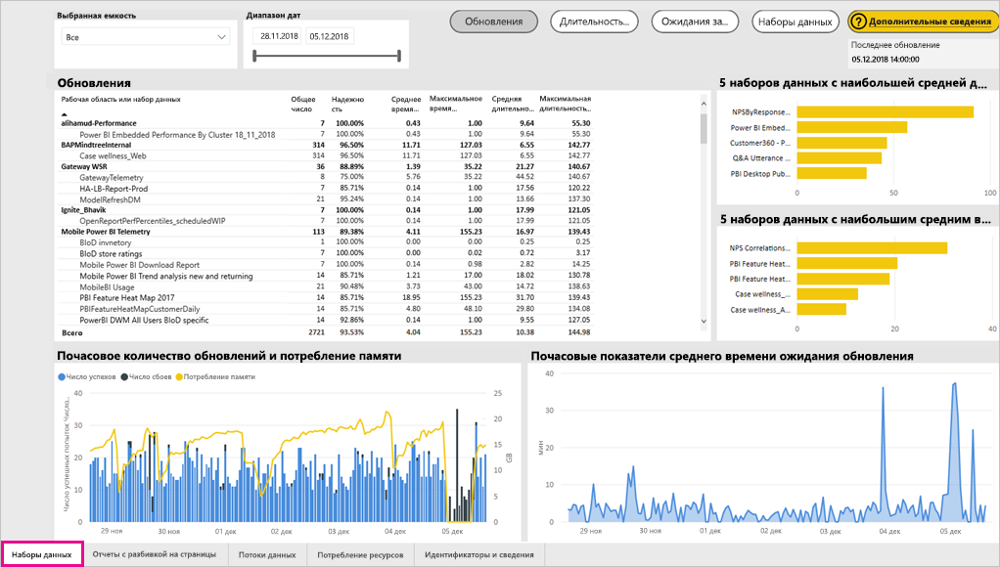
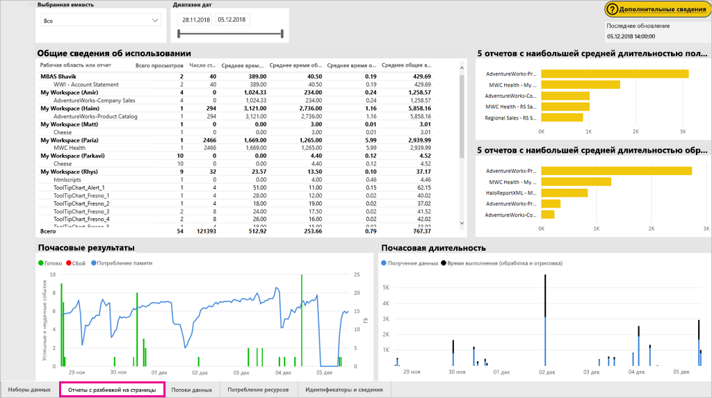
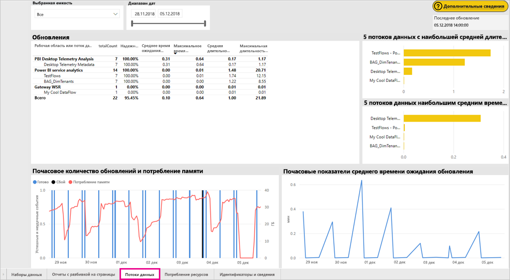
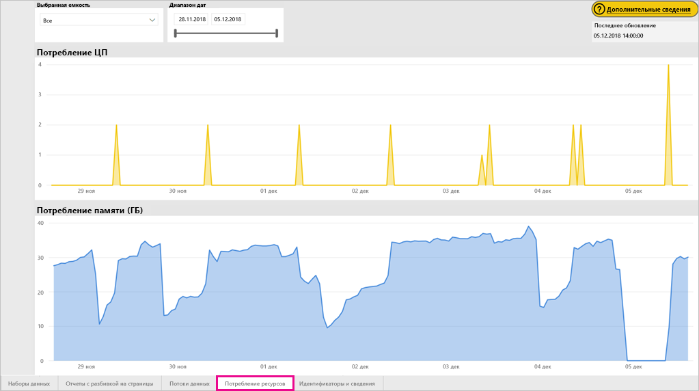
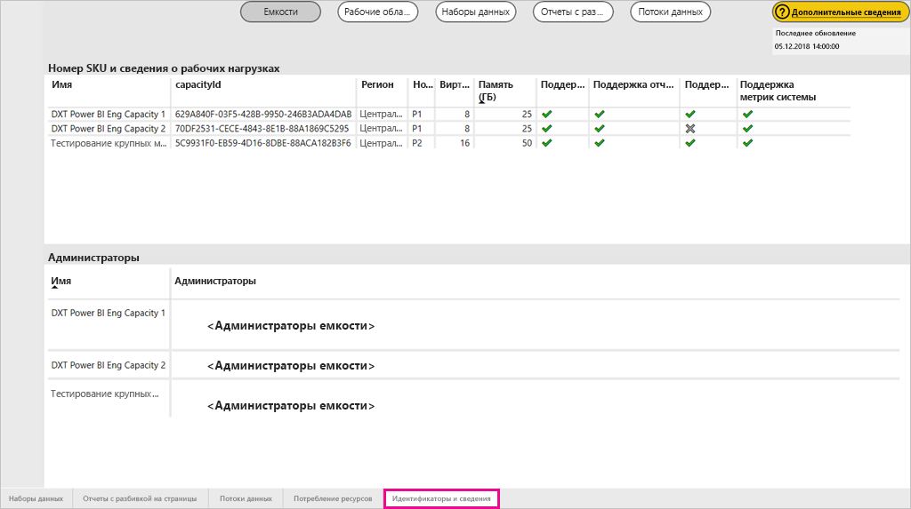

# Мониторинг емкостей Power BI Premium и Power BI Embedded

В этой статье представлен обзор мониторинга метрик емкостей Power BI Premium. Мониторинг емкостей позволяет вам применять обоснованный подход к управлению возможностями.

Вы можете контролировать емкость с помощью приложения Power BI Premium Capacity Metrics или на портале администрирования. Мы рекомендуем приложение, потому что оно предоставляет гораздо больше деталей, но в этой статье рассматриваются оба варианта.

**Текущая версия приложения — 1.10 (выпущена 13 декабря 2018 года).**

.

<iframe width="560" height="315" src="https://www.youtube.com/embed/UgsjMbhi_Bk?rel=0&amp;showinfo=0" frameborder="0" allowfullscreen></iframe>

## Установка приложения Power BI Premium Capacity Metrics

Вы можете перейти к [приложению Premium Capacity Metrics](https://app.powerbi.com/groups/me/getapps/services/capacitymetrics) или установить его так же, как и другие приложения в Power BI.

1. В Power BI щелкните **Приложения**.

    

1. Справа щелкните **Получить приложения**.

1. В категории **Приложения** найдите приложение **Power BI Premium Capacity Metrics**.

1. Подпишитесь, чтобы установить приложение.

Теперь, когда вы установили приложение, вы можете увидеть метрики емкости своей организации. Давайте посмотрим на некоторые из доступных ключевых метрик.

## Использование приложения метрик

### Панель мониторинга метрики

Когда вы открываете приложение, в нем сначала отображается информационная панель с кратким описанием всех возможностей, для которых у вас есть права администратора.

На панели мониторинга отображаются указанные ниже метрики.

| **Раздел отчета** | **Метрики** |
| --- | --- |
| **Сведения о системе** | * Версия приложения  * Количество емкостей, для которых у вас есть права администратора  * Количество рабочих областей в ваших емкостях, которые отправляют отчеты метрики  * Среднее использование памяти в ГБ за последние семь дней  * Максимальное использование памяти в ГБ за последние семь дней  * Местное время, когда был использован максимальный объем памяти  * Количество случаев, когда нагрузка ЦП на 80 % превышала пороговое значение за последние семь дней, разделенных на контейнеры по три минуты  * Наибольшее количество случаев, когда уровень нагрузки ЦП был выше 80 % за последние семь дней, разделенных на контейнеры по часу  * Местное время, когда за час уровень нагрузки ЦП превысил 80 % во много раз |
| **Сведения о наборе данных** | * Общее количество наборов данных во всех рабочих областях в доступных емкостях  * Количество случаев, когда прямой запрос или запросы на активное подключение превысили 80 % порогового значения за последние семь дней, разделенных на контейнеры по три минуты  * Наибольшее количество случаев, когда прямой запрос или запросы на активное подключение превысили 80 % за последние семь дней, разделенных на контейнеры по часу  * Местное время, когда за час прямой запрос или запросы на активное подключение превышали 80 % во много раз  * Общее количество обновлений за последние семь дней  * Среднее время ожидания обновления — средняя задержка между запланированным временем и началом обновления (в минутах)  * Средняя продолжительность обновления — время, необходимое для завершения обновления (в минутах)  * Общее количество запросов за последние семь дней  * Среднее время ожидания запроса — время ожидания на системных ресурсах перед началом выполнения (в миллисекундах)  * Средняя продолжительность запросов — время выполнения запроса (в миллисекундах)  * Общее количество моделей, исключенных из-за нехватки памяти  * Средний размер наборов данных   * Среднее число наборов данных, загруженных в память |
| **Сведения о потоке данных** | * Общее количество потоков данных во всех рабочих областях в емкостях  * Общее количество обновлений за последние семь дней  * Среднее время ожидания обновления — средняя задержка между запланированным временем и началом обновления (в минутах)  * Средняя продолжительность обновления — время, необходимое для завершения обновления (в минутах) |
| **Сведения об отчете с разбивкой на страницы** | * Общее количество отчетов с разбивкой на страницы во всех рабочих областях в емкостях  * Количество случаев, когда все отчеты были доступны для просмотра пользователями  * Общее количество строк данных во всех отчетах  * Общее время, необходимое для всех этапов (получение данных, обработка и отрисовка) всех отчетов (в миллисекундах) |
|  |  |

### Отчет по метрикам

Щелкните панель мониторинга, чтобы перейти к соответствующему отчету. Отчет содержит пять вкладок, которые будут более подробно описаны в следующих разделах.

* **Наборы данных.** Подробные метрики о работоспособности наборов данных Power BI в доступных емкостях.

* **Отчеты с разбивкой на страницы.** Подробные метрики о работоспособности отчетов с разбивкой на страницы в емкостях.

* **Потоки данных.** Подробные метрики обновления для потоков данных в доступных емкостях.

* **Потребление ресурсов.** Общие метрики емкости, включая память и высокую загрузку ЦП.

* **Идентификаторы и сведения.** Имена, идентификаторы и сведения о владельцах емкостей, рабочих областей и рабочих нагрузок.

На каждой вкладке можно выполнить фильтрацию метрики по диапазону емкости и дате. Если фильтры выбрано, по умолчанию для отчета будут отображаться метрики прошлой недели всех емкостей, которые отправляют отчеты метрики.

#### вкладка "Наборы данных"

Используйте кнопки в верхней части вкладки **Наборы данных**, чтобы перейти к другим областям: **Сведения**, **Обновления**, **Длительность запроса**, **Время ожидания запроса** и **Наборы данных**.

##### область "Обновления"

Область **Обновления** содержит указанные ниже метрики.

| **Раздел отчета** | **Метрики** |
| --- | --- |
| **Надежность обновления** | * Общее количество: общее количество обновлений для каждого набора данных  * Надежность: процентная доля обновлений, завершившихся успешно для каждого набора данных  * Среднее время ожидания: средняя задержка между запланированным временем и фактическим началом обновления набора данных (в минутах)  * Максимальное время ожидания: максимальное время ожидания для набора данных (в минутах)   * Средняя длительность: средняя длительность обновления для набора данных (в минутах)  * Максимальная длительность: максимальная длительность обновления для набора данных (в минутах) |
| **5 наборов данных с наибольшей средней длительностью обновления** | * Пять наборов данных с наибольшей средней продолжительностью обновления (в минутах) |
| **5 наборов данных с наибольшим средним временем ожидания** | * Пять наборов данных с наибольшим средним периодом ожидания обновления (в минутах) |
| **Почасовые показатели среднего времени ожидания обновления** | * Среднее время ожидания обновления в разбивке по сегментам длительностью в один час, которые отображаются по местному времени. Большое число всплесков с высоким временем ожидания обновления могут означать, что емкость перегружена. |
| **Почасовое количество обновлений и потребление памяти** | * Успешные завершения, сбои и потребление памяти в разбивке по сегментам длительностью в один час, которые отображаются по местному времени. |
|  |  |

##### Область длительности запросов

Область **длительности запросов** содержит указанные ниже метрики.

| **Раздел отчета** | **Метрики** |
| --- | --- |
| **Длительность запросов** | * Данные в этом разделе группируются по наборам данных, рабочим областям и периодам длительностью в один час за последние семь дней.  * Всего: общее количество запросов, выполненных для набора данных  * Средний: средняя продолжительность запросов для набора данных (в миллисекундах)  * Максимальный: максимальная длительность запроса, выполненного для набора данных (в миллисекундах)|
| **Распределение длительности запросов** | * Данные в гистограмме длительности запросов группируются по длительности запросов в миллисекундах по следующим категориям: ≤ 30 мс, от 30 до 100 мс, от 100 до 300 мс, от 300 мс до 1 сек, от 1 до 3 сек, от 3 до 10 сек, от 10 до 30 сек, больше 30 секунд. Длительные запросы и длительное время ожидания указывают на горячий уровень хранилища емкости. Это может также означать, что один набор данных вызывает проблемы и требует дальнейшего изучения. |
| **5 наборов данных с наибольшей средней длительностью запросов** | * Пять наборов данных с наибольшей средней продолжительностью запросов (в миллисекундах) |
| **Прямой запрос или активные подключения (более 80 % использования)** | * Количество периодов, в которые прямые запросы или активные подключения потребляли более 80 % ЦП, в разбивке по сегментам длительностью в один час, которые отображаются по местному времени. |
| **Почасовое распределение длительности запросов** | * Количество запросов и средняя длительность их выполнения (в миллисекундах) в сравнении с потреблением памяти (в ГБ) с разбивкой на периоды в один час, которые определяются по местному времени. |
|  |  |

##### Область Query Waits (Ожидания запросов)

Область **длительности ожиданий** содержит указанные ниже метрики.

| **Раздел отчета** | **Метрики** |
| --- | --- |
| **Время ожидания запросов** | * Данные в этом разделе группируются по наборам данных, рабочим областям и периодам длительностью в один час за последние семь дней.  * Всего: общее количество запросов, выполненных для набора данных  * Количество ожиданий: количество запросов к набору данных, перед началом выполнения которых выполнялось ожидание системных ресурсов   * Средний: средняя продолжительность ожидания запросов для набора данных (в миллисекундах)  * Максимальный: длительность самого долгого ожидания запроса для набора данных (в миллисекундах)|
| **Распределение времени ожидания** | * Данные гистограммы времени ожидания запросов группируются в зависимости от длительности периодов ожидания в миллисекундах по следующим категориям: ≤ 50 мс, от 50 до 100 мс, от 100 до 200 мс, от 200 до 400 мс, от 400 мс до 1 сек, от 1 до 5 сек, больше 5 секунд. |
| **5 наборов данных с наибольшим средним временем ожидания** | * Пять наборов данных с наибольшим средним периодом ожидания запросов (в миллисекундах) |
| **Почасовое количество и время процессов ожидания запросов** | * Количество процессов ожидания запросов и средняя длительность ожидания (в миллисекундах) в сравнении с потреблением памяти (в ГБ) с разбивкой на периоды в один час, которые определяются по местному времени. |
|  |  |

##### область "Наборы данных"

Область **наборов данных** содержит указанные ниже метрики.

| **Раздел отчета** | **Метрики** |
| --- | --- |
| **Счетчики вытеснения наборов данных** | * Всего: общее количество *вытеснений* наборов данных для каждой емкости. При нехватке памяти узел вытесняет один или несколько наборов данных из памяти. Наборы данных в неактивном состоянии (для которых не выполняются запросы или обновление) вытесняются в первую очередь. Для них применяется порядок "недавно использовавшиеся" (LRU).|
| **Почасовые вытеснения наборов данных и потребление памяти** | * Вытеснения наборов данных и потребление памяти в разбивке по сегментам длительностью в один час, которые отображаются по местному времени. |
| **Число наборов данных, загружаемых каждый час** | * Число загруженных в память наборов данных и потребление памяти (ГБ) в разбивке по часам по местному времени |
| **Размер данных**  | * Максимальный размер: максимальный размер набора данных в МБ за указанный период |
|  |  |

#### Вкладка отчетов с разбивкой на страницы

На вкладке **Отчеты с разбивкой на страницы** отображаются подробные метрики о работоспособности отчетов с разбивкой на страницы в доступных емкостях.

Вкладка **Отчеты с разбивкой на страницы** содержит указанные ниже метрики.

| **Раздел отчета** | **Метрики** |
| --- | --- |
| **Общие сведения об использовании** | * Всего просмотров: количество просмотров отчета пользователями  * Число строк: количество строк данных в отчете  * Извлечение (сред.): средняя продолжительность получения данных для отчета (в миллисекундах). Высокая продолжительность может указывать на плохую оптимизацию запросов или другие проблемы с источником данных.   * Обработка (сред.): средняя продолжительность обработки данных для отчета (в миллисекундах) * Отрисовка (сред.): средняя продолжительность отрисовки отчета в окне браузера (в миллисекундах)  * Общее время: продолжительность всех этапов отображения отчета (в миллисекундах)|
| **5 отчетов с наибольшей средней длительностью получения данных** | * Пять отчетов с наибольшей средней продолжительностью получения данных (в миллисекундах). |
| **5 отчетов с наибольшей средней длительностью обработки отчета** | * Пять отчетов с наибольшей средней продолжительностью обработки отчета (в миллисекундах). |
| **Почасовая длительность** | * Продолжительность получения данных, обработки и отрисовки отчета в разбивке по сегментам длительностью в один час, которые отображаются по местному времени. |
| **Почасовые результаты** | * Успешные завершения, сбои и потребление памяти в разбивке по сегментам длительностью в один час, которые отображаются по местному времени. |
|  |  |

#### Вкладка "Потоки данных"

Вкладка **Потоки данных** содержит подробные метрики обновления для потоков данных в доступных емкостях.

Вкладка **Потоки данных** содержит указанные ниже метрики.

| **Раздел отчета** | **Метрики** |
| --- | --- |
| **Обновление** | * Всего: количество обновлений для каждого потока данных  * Надежность: процентная доля обновлений, завершившихся успешно для каждого потока данных  * Среднее время ожидания: средняя задержка между запланированным временем и фактическим началом обновления потока данных (в минутах)  * Максимальное время ожидания: максимальное время ожидания для потока данных (в минутах)   * Средняя длительность: средняя длительность обновления для потока данных (в минутах)  * Максимальная длительность: максимальная длительность обновления для потока данных (в минутах) |
| **5 потоков данных с наибольшей средней длительностью обновления** | * Пять потоков данных с наибольшей средней продолжительностью обновления (в минутах) |
| **5 потоков данных наибольшим средним временем ожидания** | * Пять потоков данных с наибольшим средним периодом ожидания обновления (в минутах) |
| **Почасовые показатели среднего времени ожидания обновления** | * Среднее время ожидания обновления в разбивке по сегментам длительностью в один час, которые отображаются по местному времени. Большое число всплесков с высоким временем ожидания обновления могут означать, что емкость перегружена. |
| **Почасовое количество обновлений и потребление памяти** | * Успешные завершения, сбои и потребление памяти в разбивке по сегментам длительностью в один час, которые отображаются по местному времени. |
|  |  |

#### Вкладка "Потребление ресурса"

На вкладке **Потребление ресурса** отображаются сведения о потреблении ЦП и памяти для всех емкостей и рабочих нагрузок.

Вкладка **Потребление ресурса** содержит следующую метрику.

| **Раздел отчета** | **Метрики** |
| --- | --- |
| **Потребление ЦП** | * Количество ЦП, на которых за последние семь дней превышено 80 % пороговых значений нагрузки, разделенных на контейнеры по три минуты |
| **Потребление памяти** | * Потребление памяти за последние семь дней в разбивке по сегментам длительностью три минуты. |
|  |  |

#### Вкладка "Идентификаторы и сведения"

На вкладке **Идентификаторы и сведения** содержатся имена, идентификаторы и сведения о владельцах емкостей, рабочих областей и рабочих нагрузок.

## Мониторинг емкости Power BI Embedded

Вы также можете использовать приложение Power Capacity Premium Capacity Metrics для мониторинга емкостей *SKU A* в Power BI Embedded. Эти емкости появятся в отчете, если вы являетесь администратором емкости. Однако обновление отчета не выполняется, если вы не предоставите определенные разрешения для Power BI в своих номерах SKU A:

1. Откройте емкость на портале Azure.

1. Щелкните **Управление доступом (IAM)** и добавьте приложение Power BI Premium к роли читателя. Если вы не можете найти приложение по имени, вы также можете добавить его по его идентификатору: cb4dc29f-0bf4-402a-8b30-7511498ed654.

    

> [!NOTE]
> Вы можете контролировать потребление емкости Power BI Embedded в приложении или на портале Azure, но не на портале администрирования Power BI.

## Базовый мониторинг на портале администрирования

В области **Параметры емкости** на портале администрирования имеется четыре датчика, которые указывают нагрузку и ресурсы, использованные вашей емкостью за последние семь дней. Эти четыре элемента работают в почасовом временном окне, что указывает, сколько часов за последние семь дней соответствующая метрика была выше 80 %. Эта метрика указывает на потенциальное снижение производительности для пользователей.

| **Метрика** | **Описание** |
| --- | --- |
| ЦП |Число раз, когда загрузка ЦП превысила 80 %. |
| Пробуксовка памяти |Нехватка памяти в ядрах серверной части. В частности, это метрика показывает, сколько раз наборы данных вытесняются из памяти из-за нехватки памяти в результате использования нескольких наборов данных. |
| Использование памяти |Средний уровень использования памяти в гигабайтах (ГБ). |
| Прямых запросов в секунду | Число раз, когда количество прямых запросов и активных подключений превысило 80 % от максимального.   * Мы ограничиваем общее количество запросов DirectQuery и активных запросов на подключение в секунду.* Пределы составляют 30/с для P1, 60/с для P2 и 120/с для P3. * При учете указанного выше ограничения число прямых запросов и запросов активных подключений складывается. Например, при наличии 15 прямых запросов и 15 запросов на динамическое подключение в секунду будет достигнут лимит регулирования. * Это в равной степени относится к локальным и облачным подключениям. |
|  |  |

Метрики отражают использование за последнюю неделю.  Чтобы изучить метрики более подробно, можно щелкнуть одну из плиток сводки.  В результате открываются подробные диаграммы для каждой из метрик, связанных с емкостью Premium. На следующей диаграмме показаны подробные метрики ЦП.

На диаграммах представлены сводные данные за последнюю неделю, которые обновляются каждый час. Это позволяет определить, когда произошли те или иные события, связанные с производительностью емкости Premium.

Базовые данные любой из метрик можно также экспортировать в CSV-файл.  Он будет содержать подробные сведения за каждый день последней недели с трехминутным интервалом.

## Дальнейшие действия

Теперь, когда вы понимаете, как выполнять мониторинг емкостей Power BI Premium, узнайте больше об их оптимизации.

> [!div class="nextstepaction"]
> [Использование и оптимизация ресурсов емкости Power BI Premium](service-premium-understand-how-it-works.md)
