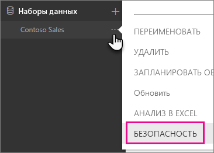
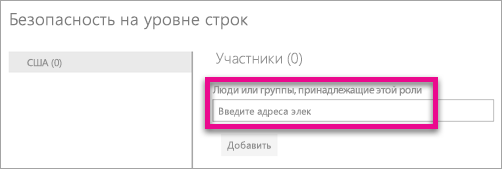
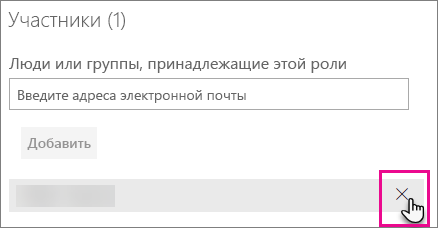
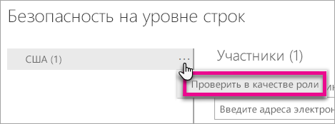
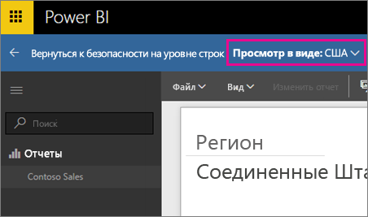
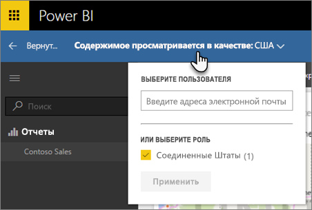

# Безопасность на уровне строк (RLS) в Power BI
Функции безопасности на уровне строк (RLS) в Power BI позволяют ограничивать доступ к данным для определенных пользователей. Фильтры ограничивают доступ к данным на уровне строк; определить их можно в ролях. Обратите внимание, что в службе Power BI участники рабочей области имеют доступ к наборам данных в рабочей области. Безопасность на уровне строк не ограничивает такой доступ. 

Вы можете настроить RLS для моделей данных, импортированных в Power BI с помощью Power BI Desktop. Вы также можете настроить RLS для наборов данных, которые используют DirectQuery, таких как SQL Server. Раньше реализовывать RLS можно было только в локальных моделях служб Analysis Services за пределами Power BI. Для динамических подключений к службам Analysis Services безопасность на уровне строк настраивается в локальной модели. Параметр безопасности не будет отображаться для наборов данных динамического подключения.

[!INCLUDE [include-short-name](./includes/rls-desktop-define-roles.md)]

По умолчанию при фильтрации с обеспечением безопасности на уровне строк используются однонаправленные фильтры, независимо от установленного типа связи (однонаправленной или двунаправленной). Вы можете вручную включить двунаправленный кросс-фильтр с обеспечением безопасности на уровне строк. Для этого выберите связь и установите флажок **Применить фильтр безопасности в обоих направлениях**. Этот флажок следует установить, если реализуется функция [динамической безопасности на уровне строк](https://docs.microsoft.com/sql/analysis-services/supplemental-lesson-implement-dynamic-security-by-using-row-filters). При этом безопасность на уровне строк обеспечивается на основе имени пользователя.

Дополнительные сведения см. в статье [Двунаправленная перекрестная фильтрация при работе с DirectQuery в Power BI Desktop](desktop-bidirectional-filtering.md) и техническом документе по [обеспечению безопасности в табличной семантической модели бизнес-аналитики](http://download.microsoft.com/download/D/2/0/D20E1C5F-72EA-4505-9F26-FEF9550EFD44/Securing%20the%20Tabular%20BI%20Semantic%20Model.docx).

[!INCLUDE [include-short-name](./includes/rls-desktop-view-as-roles.md)]

## Управление безопасностью в модели
Для управления безопасностью в модели данных можно выполнить следующие действия.

1. Нажмите значок **многоточие (...)** для определенного набора данных.
2. Выберите **Безопасность**.
   
   

В результате откроется страница RLS, где можно добавить участников к роли, созданной в Power BI Desktop. Параметр "Безопасность" отображается только владельцам набора данных. Если набор данных передается в составе группы, этот параметр будет доступен только администраторам. 

Создавать и изменять роли можно только в приложении Power BI Desktop.

## Работа с участниками
### Добавление участников
Можно добавить участника в роль, указав адрес электронной почты или имя добавляемого пользователя, группы безопасности или списка рассылки. Этот участник должен быть в пределах вашей организации. Невозможно добавить группы, созданные в Power BI.

Также по числу в скобках рядом с именем роли или рядом с участниками можно определить, сколько участников входит в данную роль.

### Удаление участников
Участников можно удалять, нажимая "X" рядом с их именем. 

## Проверка роли в службе Power BI
Чтобы убедиться в работоспособности роли, которую вы определили, выполните проверку роли. 

1. Щелкните **многоточие (…)** рядом с ролью.
2. Выберите пункт **Проверить данные в качестве роли**.

На экран будут выведены отчеты, доступные для этой роли. В этом представлении панели мониторинга не представлены. На синей панели выше вы увидите применяемые элементы.

Другие роли или комбинации ролей можно проверить, выбрав **Теперь показать как**.

Можно просмотреть данные для определенного пользователя или выбрать комбинацию из доступных ролей, чтобы проверить их работоспособность. 

Чтобы вернуться в обычный режим просмотра, выберите **Вернуться к безопасности на уровне строк**.

[!INCLUDE [include-short-name](./includes/rls-usernames.md)]

## Использование RLS с рабочими областями приложений в Power BI
При публикации отчета Power BI Desktop в рабочей области приложения в службе Power BI роли применяются к участникам с правами только для чтения. Вам потребуется указать, что участники могут только просматривать содержимое Power BI, в параметрах рабочей области приложения.

> [!WARNING]
> Если вы настроили рабочую область приложения таким образом, что ее участники обладают разрешениями на изменение, то роли RLS не будут применяться к этим участникам. Пользователи будут видеть все данные.
> 
> 

[!INCLUDE [include-short-name](./includes/rls-limitations.md)]

[!INCLUDE [include-short-name](./includes/rls-faq.md)]

## Дальнейшие действия
[Безопасность на уровне строк (RLS) в Power BI Desktop](desktop-rls.md)  

Появились дополнительные вопросы? [Попробуйте задать вопрос в сообществе Power BI.](http://community.powerbi.com/)

