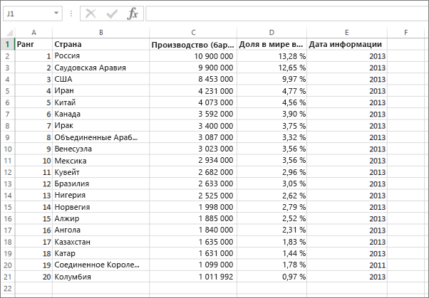
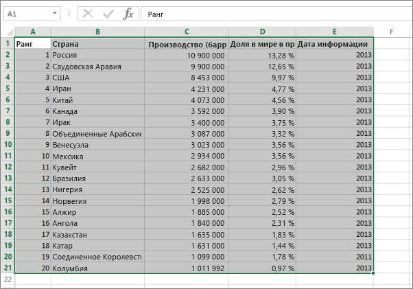
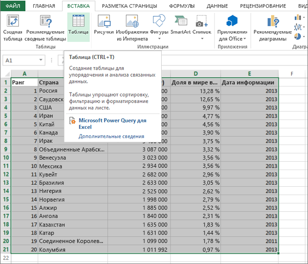
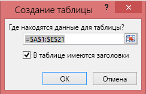
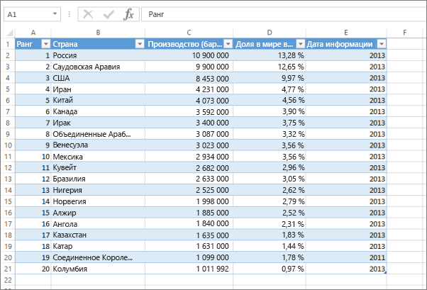

# Ошибка. Не удалось найти данные в книге Excel.

>[!NOTE]
>Эта статья относится к Excel 2007 и более поздних версий.

При импорте книги Excel в Power BI может появиться следующая ошибка:

*Ошибка. Не удалось найти данные в книге Excel. Возможно, данные имеют неправильный формат. Необходимо отредактировать книгу в Excel, а затем повторить импорт.*

## Быстрое решение
1. Отредактируйте книгу в Excel.
2. Выделите диапазон ячеек, содержащих данные. Первая строка должна содержать заголовки столбцов (имена столбцов).
3. Нажмите сочетание клавиш **CTRL + T** , чтобы создать таблицу.
4. Сохраните книгу.
5. Вернитесь в Power BI и повторите импорт книги, если же вы работаете в Excel 2016 и сохранили книгу в OneDrive для бизнеса, в Excel выберите "Файл" > "Опубликовать".

## Сведения
### Причина
В Excel можно создать **таблицу** вне диапазона ячеек, что упрощает сортировку, фильтрацию и форматирование данных.

При импорте книги Excel Power BI ищет эти таблицы и импортирует их в набор данных; если он не находит какие-либо таблицы, появляется следующее сообщение об ошибке.

### Решение
1. Откройте книгу в Excel. 
    >[!NOTE]
    >Рисунки приведены для Excel 2013. При использовании другой версии картинка может отличаться, но действия будут теми же самыми.
    
    
2. Выделите диапазон ячеек, содержащих данные. Первая строка должна содержать заголовки столбцов (имена столбцов):
   
    
3. На вкладке **Вставка** ленты щелкните элемент **Таблица**. (Или используйте сочетание клавиш **CTRL + T**.)
   
    
4. Вы увидите следующее диалоговое окно. Убедитесь, что флажок **Таблица с заголовками** установлен, и нажмите кнопку **ОК**:
   
    
5. Теперь данные форматируются в виде таблицы:
   
    
6. Сохраните книгу.
7. Вернитесь в Power BI. Выберите "Получить данные" в нижней части левой панели навигации.
   
    
8. В поле **Файлы** выберите **Получить**.
   
    
9. Повторите импорт книги Excel. На этот раз импорт должен найти таблицу и выполниться успешно.
   
    Если импорт по-прежнему не удается, свяжитесь с нами, выбрав в меню "Справка" пункт **Сообщество**:
   
    
