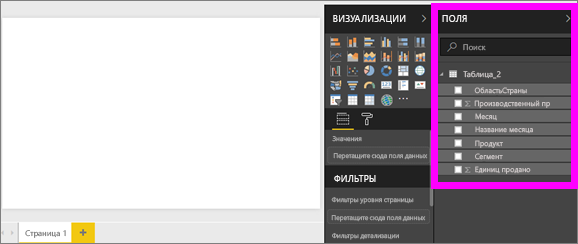
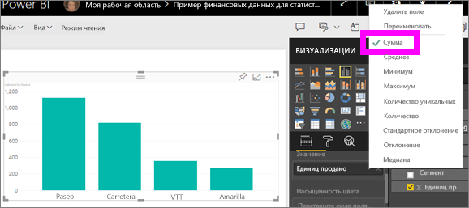
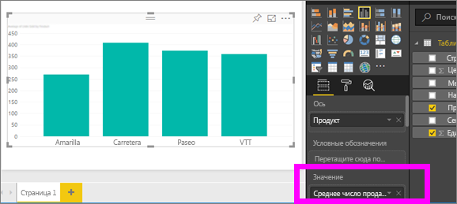
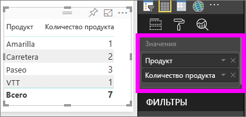

# Статистические выражения в визуализациях Power BI
## Что такое статистическое выражение?
Иногда над данными нужно выполнить математическую операцию с объединением значений. К таким операциям относятся сложение, вычисление среднего или максимального значения, подсчет и др. Объединение значений данных называется *статистическим вычислением*. В результате таких операций появляются *статистические выражения*. 

При создании визуализаций в службе Power BI и приложении Power BI Desktop для данных может выполняться статистическое вычисление. Часто этот вариант подходит, но в некоторых случаях, возможно, потребуется обработать значения по-другому.  Например, для суммирования и получения среднего значения применяются разные подходы. Есть несколько способов управления статистическим вычислением, используемым в визуализации, и его изменения.

Сначала давайте рассмотрим *типы* данных, так как тип данных определяет, как выполнять статистическое вычисление и требуется ли это.

## Типы данных
В большинстве наборов данных содержится более одного типа данных. На самом базовом уровне данные могут быть числовыми или нечисловыми. Для числовых данных можно выполнить статистическое вычисление с помощью выражений "Сумма", "Среднее", "Количество", "Минимум", "Дисперсия" и многих других. Даже для текстовых данных, часто называемых *категориальными*, можно выполнить статистическое вычисление. Если вы пытаетесь выполнить статистическое вычисление для полей с категориальными данными (поместив их в контейнер только числовых значений, такой как **Значения** или **Подсказки**), PowerBI может подсчитать количество экземпляров каждой категории или количество уникальных экземпляров каждой категории. А специальные типы данных, такие как даты, могут иметь несколько собственных статистических параметров, например: самая ранняя, самая поздняя, первая и последняя. 

В следующем примере:
- Столбцы **Units Sold** (Продано единиц) и **Manufacturing Price** (Цена производителя) содержат числовые данные.
-  Столбцы **Segment** (Сегмент), **Country** (Страна), **Product** (Продукт), **Month** (Месяц), и **Month Name** (Название месяца) содержат категориальные данные.

   

При создании визуализации в Power BI статистическое вычисление для числовых полей (по умолчанию *Сумма*) будет выполняться по определенному полю с категориальными данными.  Например, Units Sold ***by Product*** (Продано единиц по продуктам), Units Sold ***by Month*** (Продано единиц по месяцам) и Manufacturing Price ***by Segment*** (Цена производителя по сегментам). Некоторые числовые значения называют **мерами**. Меры в редакторе отчетов Power BI определить очень просто — они отображаются с символом ∑ в списке "Поля". Дополнительные сведения см. в статье [Знакомство с редактором отчетов](service-the-report-editor-take-a-tour.md).

## Почему статистические выражения не работают так, как мне нужно?
Работа статистических выражений в службе Power BI может сбивать с толку. Например, в Power BI может не получиться изменить статистическое выражение для числового поля. Или, например, вы не хотите применять статистическое выражение к полю "год" — вам просто нужно подсчитать количество экземпляров.

Чаще всего источником проблемы является неправильное определение полей в наборе данных. Поле может быть определено как текстовое. В таком случае для него нельзя вычислить сумму или среднее значение. К сожалению, [категорию поля может изменить только владелец набора данных](desktop-measures.md). При наличии разрешений владельца для набора данных, как в приложении Desktop, так и в программе, которая использовалась для создания набора данных (например, Excel), вы можете решить эту проблему. В противном случае потребуется обратиться к владельцу набора данных за помощью.  

См. раздел **Рекомендации и устранение неполадок** в конце этой статьи, чтобы разобраться в работе статистических выражений.  Если вы не нашли ответ на свой вопрос, опубликуйте его на [форуме сообщества Power BI](http://community.powerbi.com), чтобы получить оперативный ответ непосредственно от команды Power BI.

## Изменение вычисления числового поля
Предположим, есть диаграмма, в которой суммируются проданные единицы различных продуктов, но вместо суммы требуется получить среднее значение. 

1. Создайте диаграмму, в которой используются категория и мера. В этом примере мы используем Units Sold by Product (Продано единиц по продукту).  По умолчанию в Power BI создается диаграмма, в которой суммируется число проданных единиц (мера в списке значений) для каждого продукта (категория в списке осей).

   

2. На панели "Визуализации" щелкните правой кнопкой мыши меру и выберите нужный тип вычисления. В этом случае мы выбираем "Среднее". Если нужного статистического выражения нет, см. раздел "Рекомендации и устранение неполадок" ниже.  
   
   
   
   > [!NOTE]
   > Параметры, доступные в раскрывающемся списке, будут зависеть от выбранного поля и способа его категоризации владельцем набора данных.
   > 
3. Теперь для вашей визуализации выполнено статистическое вычисление среднего значения.

   

##    Способы статистического вычисления для данных

Некоторые параметры, которые могут быть доступны для статистической обработки поля:

* **Не суммировать**. Если этот параметр выбран, каждое значение в этом поле обрабатывается отдельно и не суммируется. Это часто используется при наличии числового столбца идентификатора, который не должен суммироваться.
* **Сумма**. Все значения в этом поле суммируются.
* **Среднее**. Вычисляется среднее арифметическое значений.
* **Минимум**. Отображается самое низкое значение.
* **Максимум**. Отображается самое высокое значение.
* **Количество (не пустых).** Подсчитывается количество значений в этом поле, которые не являются пустыми.
* **Количество (уникальных).** Подсчитывается количество уникальных значений в этом поле.
* **Стандартное отклонение.**
* **Отклонение**.
* **Медиана**.  Показывает значение медианы (среднее). Это значение с тем же или меньшим числом элементов.  Если медиан две, Power BI вычисляет среднюю.

Например, эти данные:

| Страна | Объем |
|:--- |:--- |
| США |100 |
| Соединенное Королевство |150 |
| Канада |100 |
| Германия |125 |
| Франция | |
| Япония |125 |
| Австралия |150 |

выдадут следующие результаты:

* **Не суммировать**: каждое значение отображается отдельно
* **Сумма**: 750
* **Среднее**: 125
* **Максимум**: 150
* **Минимум**: 100
* **Количество (не пустых):** 6
* **Количество (уникальных):** 4
* **Стандартное отклонение:** 20.4124145...
* **Отклонение:** 416.666...
* **Медиана:** 125

## Создание статистического вычисления с использованием категориального (текстового) поля
Можно выполнять статистическое вычисление и для нечисловых полей. Например, существующее поле с названия продукта можно добавить в качестве значения и задать для него выражение **Количество**, **Количество уникальных**, **Первый** или **Последний**. 

1. В этом примере мы перетащили поле **Product** (Продукт) в список значений. Список значений обычно используется для числовых полей. Power BI распознает, что это текстовое поле, задает для статистического вычисления параметр **Не суммировать** и выводит таблицу с одним столбцом.
   
   
2. Если изменить статистическую функцию по умолчанию **Не суммировать** на **Количество уникальных**, Power BI подсчитает количество разных продуктов. В нашем случае это 4.
   
   
3. Если мы изменим статистическое выражение на **Количество**, Power BI подсчитает общее количество. В этом случае для элемента **Product** (Продукт) отображается 7 записей. 
   
   

4. Перетащив то же поле (в этом случае **Product** (Продукт)) в список значений и оставив статистическое выражение по умолчанию **Не суммировать**, мы распределим в Power BI количество по продуктам.

   

## Рекомендации и устранение неполадок
Вопрос. Почему не отображается параметр **Не суммировать**?

Ответ. Выбранное поле, скорее всего, является вычисляемой или дополнительной мерой, созданной в Excel или [Power BI Desktop](desktop-measures.md). Каждая вычисляемая мера имеет собственную жестко заданную формулу. Используемое статистическое выражение изменить нельзя.  Например если это выражение "Сумма", выполнять можно только суммирование. В списке полей *вычисляемые меры* отображаются с символом калькулятора.

Вопрос. Мое поле **является** числовым, почему доступны только варианты **Количество** и **Число разных элементов**?

Ответ 1. Вероятно, владелец набора данных случайно или преднамеренно *не* отнес поле к категории числовых. Например, если в наборе данных есть поле **Год**, владелец набора данных может категоризировать его как текст, ведь поле **Год**, скорее всего, будет подсчитано (например, вычислено количество человек, родившихся в 1974 г.), а не суммировано или усреднено. Если вы владелец, откройте набор данных в Power BI Desktop и измените тип данных на вкладке **Моделирование**.  

Ответ 2. Если рядом с полем отображается значок калькулятора, это поле является *вычисляемой мерой*. Каждая вычисляемая мера имеет свою жестко заданную формулу, изменить которую может только владелец набора данных. Используемое вычисление может быть простым статистическим выражением, например средним значением или суммой, но это может быть и более сложная операция, например "процент вклада в родительскую категорию" или "нарастающий итог с начала года". Power BI не суммирует и не находит среднее значение, но вместо этого просто повторно вычисляет значение (с помощью жестко заданной формулы) для каждой точки данных.

Ответ 3. Еще один вариант: вы случайно поместили поле в *контейнер*, который допускает только категориальные значения.  В этом случае единственным доступными параметрами будут "Количество" и "Число разных элементов".

Ответ 4. Третье возможное объяснение: вы используете поле для оси. Например, на оси линейчатой диаграммы Power BI отображает одну панель для каждого уникального значения. Значения полей в этом случае вообще не вычисляются. 

>[!NOTE]
>Исключением из этого правила являются точечные диаграммы, для которых *требуются* вычисленные значения для осей X и Y.

Вопрос. Я использую точечную диаграмму и хочу, чтобы поле *не* вычислялось.  Как это сделать?

Ответ. Добавьте поле в контейнер **Сведения**, но не в контейнеры осей X и Y.

Вопрос. Когда я добавляю числовые поля в визуализацию, большинство полей по умолчанию суммируются, но для некоторых по умолчанию вычисляется среднее значение, количество или выполняется другая операция.  Почему статистическое выражение по умолчанию не всегда одинаковое?

Ответ. Владельцы наборов данных могут назначать суммирование по умолчанию для каждого поля. Если вы владелец набора данных, измените суммирование по умолчанию на вкладке **Моделирование** в Power BI Desktop.

Вопрос. Я владелец набора данных. Я хочу, чтобы в поле никогда не выполнялось статистическое выражение.

Ответ. В Power BI Desktop на вкладке **Моделирование** установите для параметра **Тип данных** значение **Текст**.

Вопрос. В раскрывающемся списке не отображается параметр **Не суммировать**.

Ответ. Попробуйте удалить поле, а затем добавить его снова.

Появились дополнительные вопросы? [Ответы на них см. в сообществе Power BI.](http://community.powerbi.com/)

