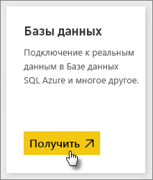
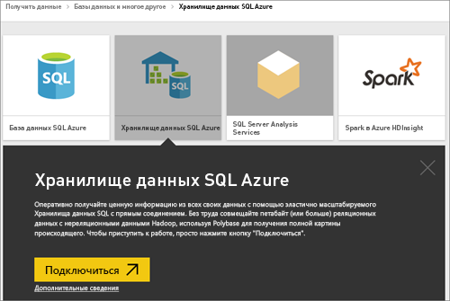
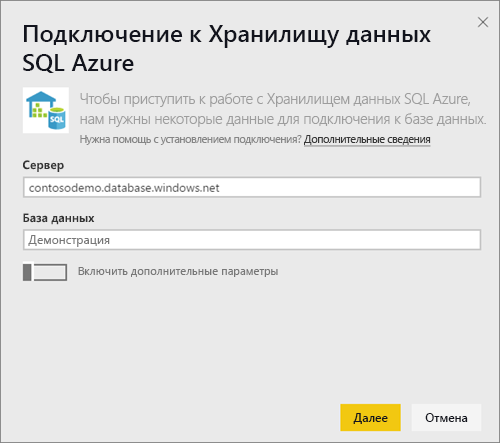
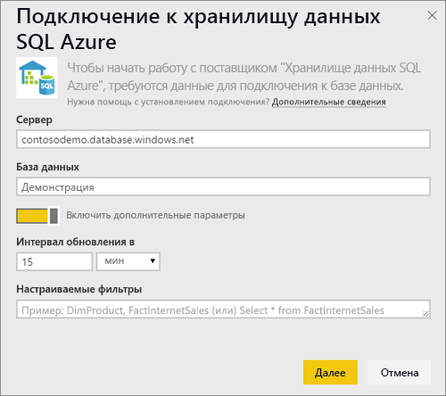
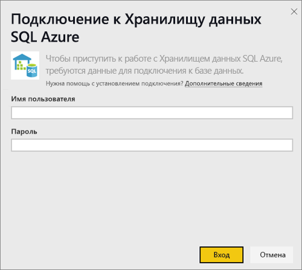
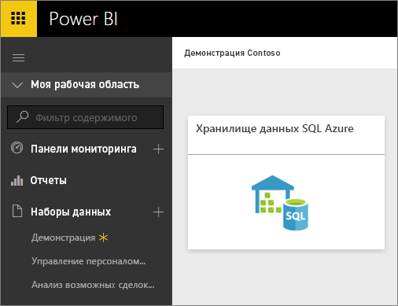
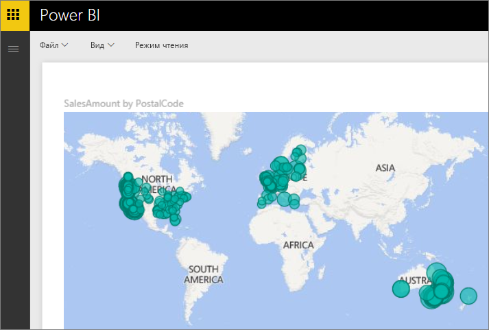

# Хранилище данных SQL Azure с DirectQuery
Хранилище данных SQL Azure с DirectQuery позволяет создавать динамические отчеты на основе данных и метрик, которые уже присутствуют в хранилище данных SQL Azure. Если используется DirectQuery, при просмотре данных запросы отправляются обратно в хранилище данных SQL Azure в режиме реального времени. В сочетании с масштабированием хранилища данных SQL это позволяет пользователям за считанные минуты создавать динамические отчеты из терабайтов данных. Кроме того, добавление кнопки **Открыть в Power BI** позволяет пользователям напрямую подключать Power BI к хранилищу данных SQL без необходимости задавать информацию вручную.

При использовании соединителя с хранилищем данных SQL:

* укажите при подключении полное имя сервера (см. дополнительные сведения ниже);
* убедитесь, что настроены правила брандмауэра "Разрешить доступ к службам Azure";
* каждое действие, например выбор столбца или добавление фильтра, отправляет запрос непосредственно в хранилище данных;
* плитки обновляются примерно раз в 15 минут (обновление не требуется планировать),  его можно настроить в разделе дополнительных параметров при подключении;
* функция вопросов и ответов для наборов данных DirectQuery недоступна;
* изменения схемы не извлекаются автоматически.

Эти ограничения и примечания могут быть изменены по мере улучшения службы. Ниже приведены инструкции по подключению.

## Использование кнопки "Открыть в Power BI"
Самый простой способ перемещения между хранилищем данных SQL и Power BI — с помощью кнопки **Открыть в Power BI** на портале предварительной версии Azure. Эта кнопка позволяет легко начать создание новых панелей мониторинга в Power BI.

1. Чтобы приступить к работе, перейдите в экземпляр хранилища данных SQL на портале предварительной версии Azure. Обратите внимание, что сейчас хранилище данных SQL присутствует на портале предварительной версии Azure в единственном экземпляре.
2. Нажмите кнопку **Открыть в Power BI** .
   
    
3. Если не удается выполнить вход напрямую или у вас нет учетной записи Power BI, необходимо зарегистрироваться.
4. Вы будете перенаправлены на страницу подключения к хранилищу данных SQL; будут использованы регистрационные данные для вашего хранилища данных SQL. Введите свои учетные данные и нажмите кнопку "Подключить" для создания подключения.

## Подключение через Power BI
Хранилище данных SQL также указано на странице получения данных Power BI. 

1. Нажмите кнопку **Получить данные** в нижней части левой панели навигации.  
   
    
2. В области **Базы данных**выберите **Получить**.
   
    
3. Выберите **Хранилище данных SQL** \> **Подключить**.
   
    
4. Введите данные, необходимые для подключения. На рисунке ниже в разделе **Поиск параметров** показано расположение этих данных на портале Azure.
   
    
   
    
   
    
   
   > [!NOTE]
   > Имя пользователя соответствует пользователю, определенному в вашем экземпляре хранилища данных Azure SQL.
   > 
   > 
5. Перейдите к набору данных, щелкнув новую плитку или только что созданный набор данных, указанный звездочкой. Этот набор данных будет иметь имя, совпадающее с именем вашей базы данных.
   
    
6. Вы можете просматривать все таблицы и столбцы. При выборе столбца источнику отправляется запрос, при этом динамически создается визуальный элемент. Фильтры также будут переводиться в запросы к хранилищу данных. Эти визуальные элементы можно сохранить в новом отчете и закрепить на панели мониторинга.
   
    

## Поиск значений параметров
Полное имя сервера и имя базы данных можно найти на портале предварительной версии Azure. Обратите внимание, что сейчас хранилище данных SQL присутствует на портале предварительной версии Azure в единственном экземпляре.

## Дальнейшие действия
[Приступая к работе с Power BI](service-get-started.md)  
[Получение данных для Power BI](service-get-data.md)  
[Хранилище данных SQL Azure](https://azure.microsoft.com/en-us/documentation/services/sql-data-warehouse/)  
Появились дополнительные вопросы? [Ответы на них см. в сообществе Power BI.](http://community.powerbi.com/)

