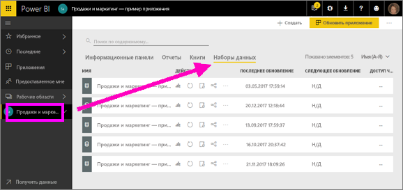
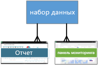
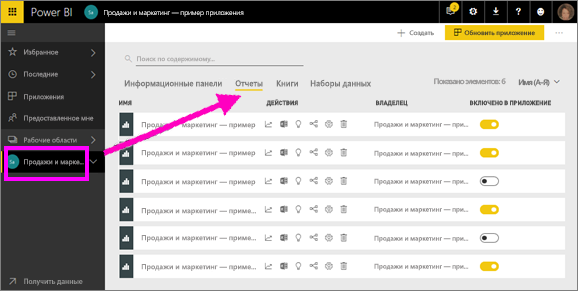
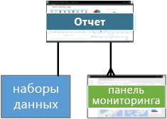
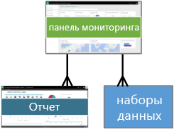
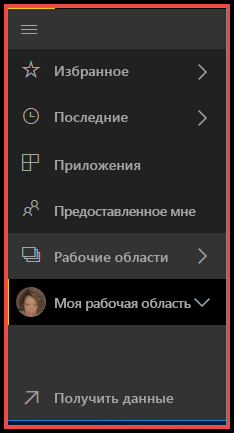

# Power BI — основные понятия, связанные со службой Power BI

В этой статье предполагается, что вы уже [зарегистрировались для использования службы Power BI](service-self-service-signup-for-power-bi.md) и [добавили некоторые данные](service-get-data.md).

При запуске службы Power BI открывается ***панель мониторинга***. Наличие панелей мониторинга отличает службу Power BI от средства Power BI Desktop.

Пользовательский интерфейс службы Power BI содержит следующие элементы:

1. панель навигации (слева);
2. полотно (в нашем примере — панель мониторинга с плитками);
3. окно вопросов и ответов;
4. кнопки со значками, включая кнопки справки и обратной связи;
5. заголовок панели мониторинга (путь или строки навигации);
6. средство запуска приложений Office 365;
7. кнопка домашней страницы Power BI;
8. кнопки со значками и метками.

Мы рассмотрим эти элементы ниже, а сейчас давайте повторим некоторые основные понятия Power BI.

Или вы можете просмотреть это видео, прежде чем читать оставшуюся часть статьи.  В этом видео Уилл рассматривает основные понятия, связанные со службой Power BI.

<iframe width="560" height="315" src="https://www.youtube.com/embed/B2vd4MQrz4M" frameborder="0" allowfullscreen></iframe>

## Основные понятия Power BI
Четыре основных стандартных блока в Power BI: ***панели мониторинга***, ***отчеты***, ***книги*** и ***наборы данных***. Все они организованы в ***рабочие области***. Прежде чем мы рассмотрим эти блоки, нужно разобраться с тем, что представляют собой рабочие области. Поэтому с них мы и начнем. 

## Рабочие области
Рабочие области — это контейнеры для панелей мониторинга, отчетов, книг и наборов данных в Power BI. Есть два типа рабочих областей: **Моя рабочая область* и рабочие области приложений. Что такое *приложение*? *Приложение* Power BI — это совокупность панелей мониторинга и отчетов, используемых для предоставления ключевых метрик в организации. Приложения являются интерактивными, но их невозможно изменить. 

- *Моя рабочая область* — это личная рабочая область любого пользователя Power BI, предназначенная для работы с его содержимым. Только у вас есть доступ к своему разделу "Моя рабочая область". Вот как можно предоставить общий доступ к своему содержимому так: 1) создать рабочую область приложения, где вы объедините содержимое в *приложение* и сделаете его доступным для других пользователей в вашей организации; 2) создать рабочую область приложения и предоставить к ней доступ коллегам для совместного использования и совместной работы.     
-  *Рабочие области приложений* применяются для совместной работы и совместного использования содержимого с коллегами. Именно там вы создаете, публикуете и администрируете приложения для организации. Рассматривайте их как промежуточную область и контейнеры для содержимого, которое будет содержаться в приложении Power BI. В эти рабочие области можно добавить коллег для совместной работы над панелями мониторинга, отчетами, книгами и наборами данных. У всех участников рабочей области приложения должны быть лицензии Power BI Pro. Пользователям приложения (коллеги, которым предоставлен доступ к приложениям) эти лицензии не требуются.  

Дополнительные сведения см. в разделе о **совместной работе** в оглавлении, начиная с раздела [Как предоставить общий доступ к панелям мониторинга, отчетам и плиткам в Power BI?](service-how-to-collaborate-distribute-dashboards-reports.md)

Теперь перейдем к стандартным блокам Power BI. Панели мониторинга и отчеты не могут не содержать данных (они могут быть пустыми, но это не имеет особого смысла, пока в них не появятся значения), поэтому начнем со знакомства с **наборами данных**.

## Наборы данных
*Набор данных* — это коллекция данных, которые вы *импортируете* или к которым *подключаетесь*. С помощью Power BI можно импортировать наборы данных различных типов, подключиться к ним и просматривать информацию по всем наборам данных в одном месте.  

Наборы данных связаны с *рабочими областями*, и один набор данных может быть частью нескольких рабочих областей. При открытии рабочей области связанные наборы данных отображаются на вкладке **Наборы данных**. Каждый указанный набор данных представляет один источник данных, например книгу Excel на OneDrive, локальный набор табличных данных службы SSAS или набор данных Salesforce. Уже поддерживается множество различных источников данных, и мы постоянно добавляем новые. [См. список типов наборов данных, которые могут использоваться с Power BI](service-get-data.md).

В следующем примере выбрана рабочая область приложения "Продажи и маркетинг" и открыта вкладка **Наборы данных**.

**ОДИН** набор данных...

* можно использовать многократно в одной или нескольких рабочих областях;
* можно использовать в различных отчетах;
* визуализации из этого одного набора данных можно отображать на нескольких разных панелях мониторинга.
  
  

Чтобы [подключиться к набору данных или импортировать его](service-get-data.md), щелкните **Получить данные** в нижней части панели навигации слева или выберите **+Создать > Набор данных** в правом верхнем углу. Следуйте инструкциям, чтобы подключиться к определенному источнику или импортировать его и добавить набор данных в активную рабочую область. Новые наборы данных отмечены желтой звездочкой. Работа, выполняемая в Power BI, не приводит к изменению базового набора данных.

Если вы [участвуете в ***рабочей области приложения***](service-collaborate-power-bi-workspace.md), то наборы данных, добавленные одним участником рабочей области, будут доступны другим ее участникам.

Наборы данных можно обновлять, переименовывать, изучать и удалять. Используйте набор данных, чтобы создать отчет с нуля или путем запуска [быстрой аналитики](service-insights.md).  Чтобы просмотреть, в каких отчетах и панелях мониторинга уже используется набор данных, выберите **Просмотреть похожие**. Для просмотра набора данных выберите его. При этом он откроется в редакторе отчетов, где вы сможете приступить к изучению данных и созданию визуализаций. Поэтому сейчас мы перейдем к следующей теме: отчетам.

### Дополнительные сведения
* [Что такое Power BI Premium?](service-premium.md)
* [Получение данных для Power BI](service-get-data.md)
* [Примеры наборов данных для Power BI](sample-datasets.md)

## Отчеты
Отчет в Power BI представлен в виде визуализаций (схем и диаграмм, например графиков, круговых диаграмм, диаграмм "дерево" и т. д.), размещенных на одной или нескольких страницах. Визуализации также называют ***визуальными элементами***. Все визуализации отчета связаны с одним набором данных. Отчеты можно создавать с нуля в Power BI, импортировать с помощью панелей мониторинга, которыми поделились ваши коллеги, или создавать автоматически при подключении к наборам данных из Excel, Power BI Desktop, баз данных, приложений SaaS и [приложений](service-get-data.md).  Например, при подключении к книге Excel, содержащий листы Power View, Power BI создает отчет, основанный на этих таблицах. Когда вы подключаетесь к приложению SaaS, Power BI импортирует готовый отчет.

Просматривать отчеты и взаимодействовать с ними можно в [режиме чтения](service-report-open-in-reading-view.md) и [режиме правки](service-interact-with-a-report-in-editing-view.md).  Функции просмотра, конструирования, разработки и публикации в ***режиме правки*** доступны только его создателю, совладельцам, а также пользователям, которым предоставлены соответствующие разрешения. Пользователи, которым предоставлен доступ к отчету, могут просматривать его и взаимодействовать с ним в ***режиме чтения***.   

При открытии рабочей области связанные отчеты отображаются на вкладке **Отчеты**. Каждый из перечисленных отчетов содержит одну или несколько страниц визуализаций на основе только одного базового набора данных. Чтобы открыть отчет, просто выберите его. 

При открытии приложения отобразится панель мониторинга.  Чтобы открыть базовый отчет, выберите плитку панели мониторинга (см. ниже), закрепленную из отчета. Имейте в виду, что не все плитки можно закрепить из отчетов, поэтому, возможно, потребуется щелкнуть несколько плиток, чтобы найти отчет. 

По умолчанию отчет открывается в режиме чтения.  Чтобы открыть отчет в режиме редактирования (при наличии необходимых разрешений), просто выберите **Изменить отчет**. 

В следующем примере выбрана рабочая область приложения "Продажи и маркетинг" и открыта вкладка **Отчеты**.

**ОДИН** отчет...

* содержится в одной рабочей области;
* может быть связан с несколькими панелями мониторинга в этой рабочей области (плитки из одного отчета могут отображаться на нескольких панелях);
* может быть создан с использованием данных из одного набора (небольшое исключение: приложение Power BI Desktop позволяет объединить в один отчет несколько наборов данных, и этот отчет можно импортировать в Power BI).
  
  

### Дополнительные сведения
* [Отчеты в службе Power BI и Power BI Desktop](service-reports.md)
* [Отчеты в мобильных приложениях Power BI](mobile-reports-in-the-mobile-apps.md)

## Панели мониторинга
*Панель мониторинга* — это то, что вы сами создали в **службе Power BI** или ваш коллега создал в **службе Power BI** и предоставил вам для общего доступа. Это один холст, содержащий ноль или больше плиток и мини-приложений. На каждой плитке, закрепленной из отчета или компонента [Вопросы и ответы](service-q-and-a.md), отображается одна [визуализация](power-bi-report-visualizations.md), созданная на основе набора и закрепленная на панели мониторинга. Все страницы отчета можно закрепить на панели мониторинга в качестве отдельных плиток. Добавить плитку на панель мониторинга можно различными способами, которые невозможно рассмотреть подробно в этой обзорной статье. Дополнительные сведения см. в статье [Плитки панели мониторинга в Power BI](service-dashboard-tiles.md). 

Зачем люди создают панели мониторинга?  Вот лишь некоторые причины:

* чтобы сразу просмотреть все сведения, необходимые для принятия решений;
* чтобы отслеживать наиболее важные сведения о бизнес-процессах;
* чтобы убедиться, что все коллеги просматривают и используют в работе одни и те же сведения;
* для наблюдения за состоянием предприятия, продукта, подразделения, маркетинговой кампании и т. д.;
* чтобы создавать индивидуальные представления большой панели мониторинга со всеми важными метриками.

При открытии рабочей области связанные панели мониторинга отображаются на вкладке **Панели мониторинга**. Чтобы открыть панель мониторинга, просто выберите ее. При открытии приложения отобразится панель мониторинга.  Каждая панель мониторинга содержит настроенное представление определенной группы базовых наборов данных.  Если вы являетесь владельцем панели мониторинга, у вас также есть доступ на изменение всех базовых наборов данных и отчетов.  Если же вам предоставлен общий доступ к панели мониторинга, вы сможете взаимодействовать с панелью мониторинга и всеми базовыми отчетами, но не сможете сохранять изменения.

Вы или ваши коллеги можете [предоставлять общий доступ к панели мониторинга](service-share-dashboards.md) разными способами. Для совместного использования панели мониторинга и просмотра общей панели мониторинга требуется Power BI Pro.

> [!NOTE]
> Плитки и их закрепление подробнее рассмотрены ниже в разделе "Плитки панели мониторинга".
> 

**ОДНА** панель мониторинга...

* связана с одной рабочей областью;
* может отображать визуализации из многих разных наборов данных;
* может отображать визуализации из многих разных отчетов;
* может отображать визуализации, закрепленные с помощью других средств (например, Excel).
  
  

### Дополнительные сведения
* [Создание пустой панели мониторинга и получение некоторых данных](service-dashboard-create.md)
* [Дублирование панели мониторинга](service-dashboard-copy.md) 
* [Создание представления панели мониторинга для телефонов](service-create-dashboard-mobile-phone-view.md)

## Книги
Книги — это особый тип набора данных. Если вы ознакомились с предыдущим разделом о **наборе данных**, вы знаете о книгах почти все, что необходимо. Но у вас может возникнуть вопрос, почему в одних случаях Power BI определяет книги Excel как **набор данных**, а в других — как **книги**. 

При использовании действия **Получить данные** с файлами Excel вы можете выбрать *импорт* или *подключение* к файлу. Если выбрать подключение, ваша книга отобразится в Power BI так же, как в Excel Online. При этом у вас будет несколько удобных функций, не доступных в Excel Online, которые помогут вам закрепить элементы из листов прямо на информационных панелях.

Книгу нельзя редактировать в Power BI. Но если необходимо внести какие-либо изменения, нажмите кнопку "Изменить" и отредактируйте книгу в Excel Online или откройте ее в Excel на своем компьютере. Любые внесенные изменения сохраняются в книге в OneDrive.

### Дополнительные сведения
* [Получение данных из файлов книг Excel](service-excel-workbook-files.md)
* [Публикация в Power BI из Excel](service-publish-from-excel.md)

## Моя рабочая область
Мы рассмотрели рабочие области и стандартные блоки. Теперь давайте рассмотрим интерфейс Power BI и элементы целевой страницы службы Power BI.

### 1. **Панель навигации** (слева)
Используйте панель навигации для поиска рабочих областей и стандартных блоков Power BI (панелей мониторинга, отчетов и наборов данных) и перемещения между ними.  

  

* Щелкните **Получить данные**, чтобы [добавить наборы данных, отчеты и панели мониторинга в Power BI](service-get-data.md).
* Разворачивайте и сворачивайте панель навигации с помощью значка .
* Открывайте избранное содержимое и управляйте им, выбрав **Избранное**.
* Просматривайте и открывайте недавно просмотренное содержимое, выбрав **Недавние**.
* Просматривайте, открывайте или удаляйте приложения, выбрав **Приложения**.
* Коллеги предоставили вам общий доступ к содержимому? Выберите **Мне предоставлен доступ** для поиска и сортировки содержимого, чтобы найти нужную информацию.
* Чтобы отобразить и открыть рабочие области, выберите **Рабочие области**.

Щелкните один раз:

* значок или заголовок, чтобы открыть в представлении содержимого;
* стрелку вправо (>), чтобы открыть всплывающее меню с элементами "Избранное", "Недавние" и "Рабочие области". 
* значок шеврона (»), чтобы отобразился прокручиваемый список панелей мониторинга, отчетов, книг и наборов данных **Моя рабочая область**.
* набор данных, чтобы изучить его.

### 2. **Полотно** 
Так как мы открыли панель мониторинга, в области полотна отображаются плитки визуализаций. Если, например, открыт редактор отчетов, в области полотна будет отображаться страница отчета. 

Панели мониторинга состоят из [плиток](service-dashboard-tiles.md).  Плитки можно создать в представлении редактирования отчетов с помощью компонента "Вопросы и ответы" или других панелей мониторинга, либо закрепить из Excel, SSRS и других источников. Плитка особого типа, называемая [мини-приложением](service-dashboard-add-widget.md), добавляется непосредственно на панель мониторинга. Плитки, которые отображаются на панели мониторинга, были специально помещены туда создателем или владельцем отчета.  Добавление плитки на панель мониторинга называется *закреплением*.

Дополнительные сведения см. выше в разделе **Панели мониторинга**.

### 3. **Окно вопросов и ответов**
Один из способов исследования данных заключается в том, чтобы задать вопрос и позволить вопросам и ответам Power BI дать ответ в форме визуализации. Окно вопросов и ответов можно использовать для добавления содержимого на панель мониторинга или в отчет.

Вопросы и ответы ищут ответ в наборах данных, подключенных к панели мониторинга.  Подключенный набор данных должен иметь по крайней мере одну плитку, закрепленную на этой панели мониторинга.

Как только вы начинаете вводить свой вопрос, вы попадаете на страницу вопросов и ответов. По мере ввода вопросы и ответы помогают вам задать правильный вопрос и найти лучший ответ, используя перефразирование, автозаполнение, предложенные варианты и многое другое. Получив нужную визуализацию (ответ), закрепите ее на панели мониторинга. Дополнительные сведения см. в статье [Вопросы и ответы в Power BI](service-q-and-a.md).

### 4. **Кнопки со значками** 
Значки в верхнем правом углу представляют ресурсы для параметров, уведомлений, скачиваний, получения справки и отправки отзывов команде Power BI. Чтобы развернуть панель мониторинга **во весь экран**, щелкните двойную стрелку.  

### 5. **Заголовок панели мониторинга** (путь навигации, или строки навигации)
Не всегда легко понять, какая рабочая область или панель мониторинга активна, поэтому в Power BI отображается путь навигации.  В этом примере показана рабочая область ("Моя рабочая область") и заголовок панели мониторинга ("Анализ розничной торговли — пример").  Если открыт отчет, в конец пути навигации будет добавлено имя этого отчета.  Каждая часть пути — это активная гиперссылка.  

Обратите внимание на символ "C" после заголовка панели мониторинга. Эта панель мониторинга содержит [тег классификации данных](/service-data-classification.md) — "Конфиденциально" (Сonfidential). Тег указывает на уровень конфиденциальности и безопасности данных. Если администратор включил классификацию данных, по умолчанию этот тег будет указан для каждой панели мониторинга. Владельцы панелей мониторинга должны изменить тег для соответствия уровню безопасности своей панели мониторинга.

### 6. **Средство запуска приложений Office 365**
С помощью средства запуска приложений вы можете легко получить доступ ко всем приложениям Office 365 одним щелчком мыши. В этом средстве можно быстро запустить электронную почту, документы, календарь и многое другое. 

### 7. **Главная страница Power BI**
Если выбрать этот элемент, откроется [основная панель мониторинга](service-dashboard-featured.md) (если она задана) или же последняя просмотренная панель мониторинга.

   

### 8. **Кнопки со значками и метками**
Эта область экрана содержит дополнительные параметры для взаимодействия с содержимым (в этом случае с панелью мониторинга).  Рядом с отображенными значками с метками есть многоточие. Если щелкнуть его, появятся команды для дублирования, печати, обновления панели мониторинга и выполнения других действий.

   

## Дальнейшие действия
[Приступая к работе с Power BI](service-get-started.md)  
[Видео о службе Power BI](videos.md)  
[Знакомство с редактором отчетов](service-the-report-editor-take-a-tour.md)

Появились дополнительные вопросы? [Попробуйте задать вопрос в сообществе Power BI.](http://community.powerbi.com/)

