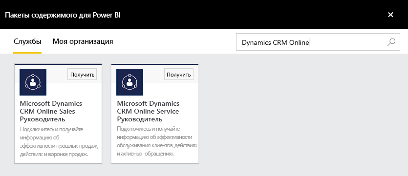
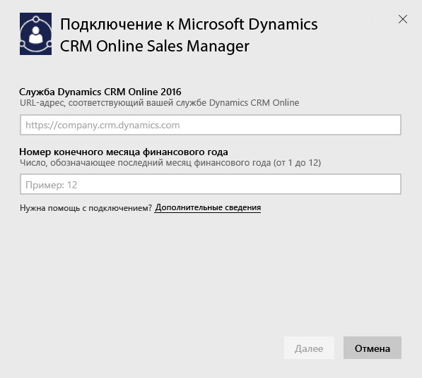
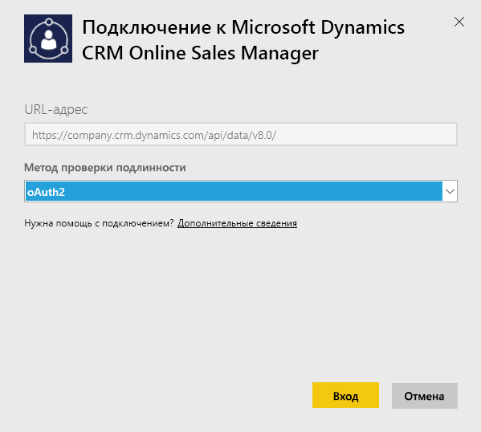
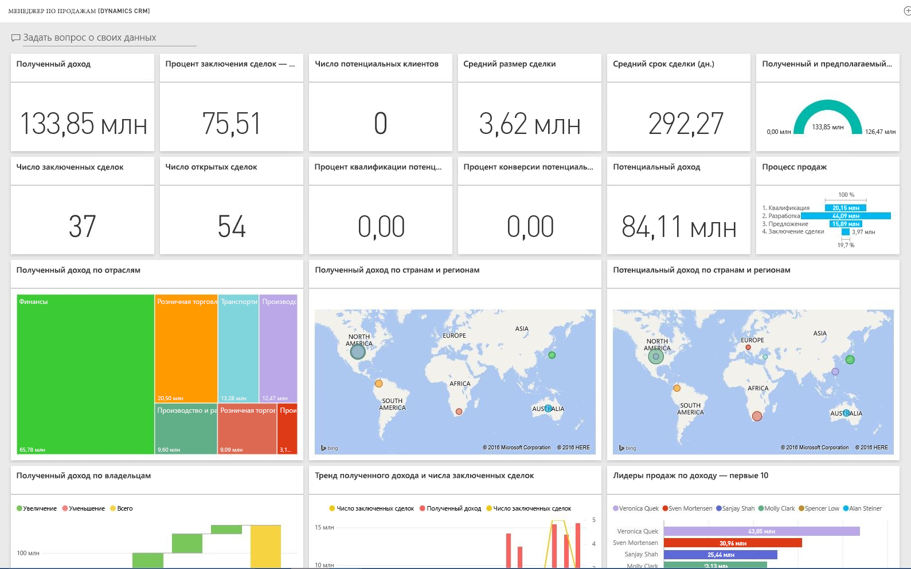

# Подключение к Microsoft Dynamics CRM с помощью Power BI
Microsoft Dynamics CRM Online для Power BI позволяет легко обращаться к данным и анализировать их. Power BI использует канал OData для создания описательной модели с необходимыми сущностями и мерами, такими как учетные записи, действия, возможности, продукты, интересы, пользователи и т. д. Установив приложение, вы можете просматривать панели мониторинга и отчеты в службе Power BI ([https://powerbi.com](https://powerbi.com)) и мобильных приложениях Power BI. 

Подключитесь к Dynamics CRM Online [Sales Manager](https://msit.powerbi.com/groups/me/getdata/services/dynamics-crm-sales-manager) или [Service Manager](https://msit.powerbi.com/groups/me/getdata/services/dynamics-crm-customer-service). См. дополнительные сведения об [интеграции Dynamics CRM Online с Power BI](https://powerbi.microsoft.com/integrations/microsoft-dynamicscrm).

Для этого подключения требуется **Microsoft Dynamics CRM Online 2016 или более поздней версии**. Дополнительные сведения о [требованиях](#Requirements) см. ниже.

## Способы подключения
[!INCLUDE [powerbi-service-apps-get-more-apps](./includes/powerbi-service-apps-get-more-apps.md)]

1. Выберите **Microsoft Dynamics CRM Sales Manager** или **Microsoft Dynamics CRM Service Manager** и нажмите кнопку **Подключиться**.
   
   
2. Укажите URL-адрес службы, связанный с вашей учетной записью.  Это должен быть URL-адрес такого типа: `https://company.crm.dynamics.com`. Дополнительные сведения см. в разделе [ниже](#FindingParams).
   
   
3. При появлении запроса укажите учетные данные (этот шаг можно пропустить, если вы уже выполнили вход в браузере). В качестве метода проверки подлинности введите **oAuth2** и нажмите кнопку **Вход**:
   
   
4. После подключения вы увидите панель мониторинга, настроенную для Sales Manager или Service Manager и заполненную вашими данными:
   
   

## Просмотр панели мониторинга и отчетов Microsoft Dynamics CRM
[!INCLUDE [powerbi-service-apps-open-app](./includes/powerbi-service-apps-open-app.md)]

[!INCLUDE [powerbi-service-apps-open-app](./includes/powerbi-service-apps-what-now.md)]

## Содержимое
В разделах ниже описано, какие функции доступны для пользователей [Sales Manager](#Sales) и [Service Manager](#Service).

Обратите внимание, что возможность доступа к тем или иным данным зависит от роли безопасности, назначенной пользователю Dynamics CRM Online.

Панель мониторинга и отчеты предназначены для формирования отчетов по операционной деятельности на ближайшую перспективу и ориентированы на рабочую группу или отдел. Каждый запрос возвращает до 100 000 записей из службы Dynamics CRM Online. В случае превышения этого ограничения из-за большого объема данных в вашей организации подготовка завершается сбоем, так как обновление данных из среды Dynamics CRM Online прерывается. Если ваша учетная запись содержит слишком много данных, попробуйте подключиться к ней из приложения Power BI Desktop и разработать решение с учетом ваших потребностей.

### Sales Manager
Панель мониторинга и отчеты содержат следующие ключевые метрики:  

* Won Revenue (полученная выручка)   
* Win Rate (коэффициент заключения сделок)   
* Open Revenue (потенциальная выручка)   
* Lost Revenue (потерянная выручка)   
* Expected Revenue (ожидаемая выручка)  
* Average Deal Size (средний размер сделки) и др.  

Кроме того, они содержат такие основные диаграммы:  

* Won and Lost Revenue Trend (тренд полученной и потерянной выручки), Won Revenue Vs Estimated Revenue Trend (тренд полученной выручки в сравнении с ожидаемой)  
* Won Revenue (полученная выручка) по различным измерениям, таким как отрасль, регион и территория   
* Sales Leaders By Revenue, Activities (лидеры продаж по выручке, мероприятиям)   
* Top Accounts (основные клиенты), Top Won/Lost Deals (основные заключенные и незаключенные сделки)    
* New Leads Trend (тренд новых потенциальных клиентов), Sales Pipeline (цепочка продаж) и др.   

Эти метрики и диаграммы помогают оценить показатели организации в области продаж и проанализировать цепочку продаж по всем сотрудникам, которые за них отвечают.

В таблице ниже перечислены сущности CRM, доступные в этой службе, а также подробно описаны фильтры, примененные к записи каждой сущности.

| Объект CRM | Примененные фильтры |
| --- | --- |
| Account |Все клиенты, с которыми связаны возможные сделки и которые были изменены за последние 365 дней. |
| Activity |Все мероприятия, измененные за последние 90 дней.   [modifiedon] > today - 90 days |
| Business Unit |Все подразделения, которые не отключены.   [isdisabled] = false |
| Lead |Все потенциальные клиенты, измененные за последние 180 дней.   [modifiedon] > today - 180 days |
| Opportunity |Все возможные сделки, измененные за последние 365 дней.   [modifiedon] > today - 365 days |
| Opportunity Product |Все связанные с возможными сделками продукты, измененные за последние 365 дней.   [modifiedon] > today - 365 days |
| Product |Все активные продукты.   [statecode] <> 1 |
| Territory |Все территории. |
| User |Все активные пользователи и неделегированные администраторы.    [isdisabled] = false and [accessmode] <> 4 |

### Service Manager
Эта панель мониторинга и отчеты содержат следующие ключевые метрики:  

* CSAT Percentage (доля CSAT)   
* SLA Met percentage (доля соответствия SLA)   
* Escalated Cases Percentage (доля эскалированных обращений)   
* Average Handling Time (среднее время обработки)   
* Total Resolved Cases (всего разрешенных обращений)  
* Total Active Cases (всего активных обращений)  
* Number of Times KB Article Used (число раз обращения к статье базы знаний) и др.    

Кроме того, они содержат такие основные диаграммы:   

* Case Volume Trends for Incoming Cases, Resolved Cases, Escalated Cases (тренды количества поступающих, разрешенных, эскалированных обращений)   
* Case Volume (количество обращений) по различным измерениям, таким как источник, местоположение, важность, тип  
* Leaders by CSAT percentage, SLA met percentage, Activities, Resolved cases (лидеры по доле CSAT, доле соответствия SLA, мероприятиям, разрешенным обращениям)  
* Most Used KB Articles (чаще всего используемые статьи базы знаний), Most viewed KB Articles (чаще всего просматриваемые статьи базы знаний) и др.  
    Эти метрики и диаграммы помогают оценить показатели службы поддержки и проанализировать нагрузку, связанную с обработкой активных обращений, по отделу поддержки и очередям обслуживания.

В таблице ниже перечислены сущности CRM, доступные для этой службы, а также подробно описаны фильтры, примененные к записи каждой сущности.

| Объект CRM | Примененные фильтры |
| --- | --- |
| Account |Все клиенты, с которыми связаны обращения и которые были изменены за последние 90 дней. |
| Activity |Все мероприятия, измененные за последние 90 дней.   [modifiedon] > today - 90 days |
| Case |Все обращения, измененные за последние 90 дней.   [modifiedon] > today - 90 days |
| Case Resolution Activity |Все мероприятия по обработке обращений, измененные за последние 90 дней.   [modifiedon] > today - 90 days |
| Contact |Все контакты, с которыми связаны обращения и которые были изменены за последние 90 дней. |
| Knowledge Article |Все последние версии статей базы знаний.    [islatestversion] = true |
| Knowledge Article Incident |Все инциденты, связанные со статьями базы знаний и измененные за последние 90 дней.   [modifiedon] > today - 90 days |
| Queue |Все активные очереди.    [statecode] = 0 |
| Queue Item |Все связанные с обращениями элементы очереди, созданные за последние 365 дней.    [createdon] > today - 365 days and   [objecttypecode] = 112 |
| User |Все активные пользователи.    [isdisabled] = false |

## Требования к системе
* Действительный экземпляр Dynamics CRM Online 2016 или более поздней версии (Power BI не будет работать с локальной версией CRM). Если у вас нет версии за 2016 г. или более поздней, сделайте следующее:
* Администратор должен включить конечную точку OData в настройках сайта.
* Учетная запись с менее чем 100 000 записей в любой из таблиц. Обратите внимание: если учетная запись имеет доступ к более чем 100 000 записей в любой из таблиц, импорт завершится ошибкой.

## Поиск параметров
Адрес экземпляра можно найти в адресной строке браузера. Обычно он имеет следующий формат: `https://[instance_name].crm.dynamics.com`.

Power BI поддерживает только конечные точки Dynamics CRM 2016. При использовании более ранних версий CRM Online подключение не установится. Используйте Power BI Desktop, чтобы напрямую подключиться к своей учетной записи.

## Устранение неполадок
Если при подключении возникают проблемы, убедитесь, что выполняются следующие условия:  

* указывайте правильный URL-адрес экземпляра (уточните его у администратора);  
* ваш экземпляр относится к версии CRM Online 2016;  
* включена конечная точка OData.  

Попробуйте также установить подключение непосредственно в Power BI Desktop, используя URL-адрес OData `https://[instance_name].crm.dynamics.com/api/data/v8.0/`.

Если вы уверены, что указали экземпляр Dynamics CRM Online 2016, но проблемы с подключением продолжаются, обратитесь к администратору CRM, чтобы убедиться, что у вас установлены все доступные обновления.

Если у вас нет CRM Online 2016 или более поздней версии, используйте Power BI Desktop, чтобы напрямую подключиться к своей учетной записи.

Если появится сообщение об ошибке "Data refresh failed as query exceeded the maximum limit of 100000 records" (Не удалось обновить данные, так как запрос превышает ограничение в 100 000 записей), попробуйте подключиться напрямую из Power BI Desktop или с помощью шаблона решения CRM.

## Дальнейшие действия
* [Что из себя представляют приложения в Power BI?](service-install-use-apps.md)
* [Получение данных в Power BI](service-get-data.md)
* Появились дополнительные вопросы? [Попробуйте задать вопрос в сообществе Power BI.](http://community.powerbi.com/)

