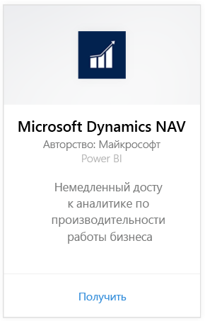
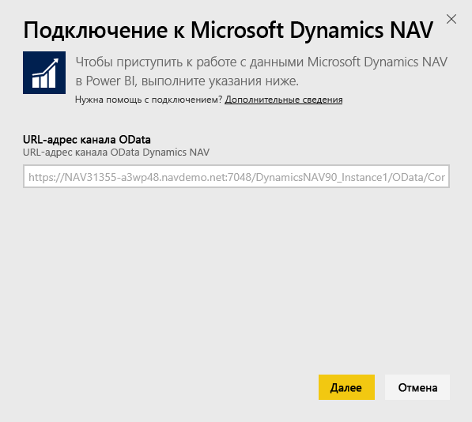
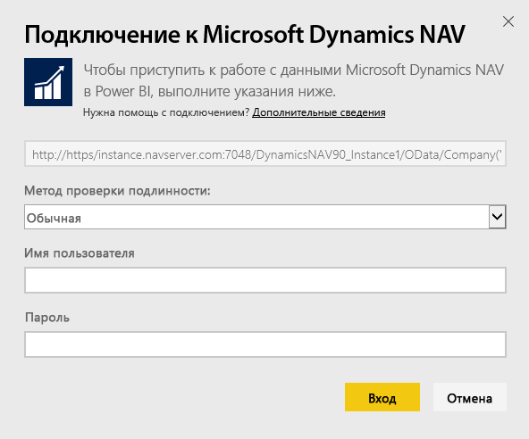
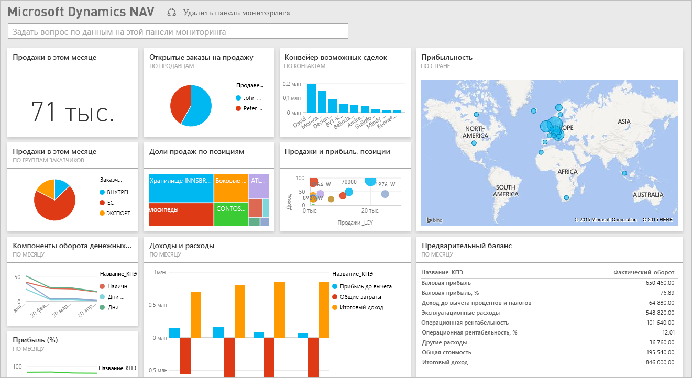

# Подключение к Microsoft Dynamics NAV с помощью Power BI
С помощью Power BI выполнять анализ данных Microsoft Dynamics NAV стало проще. Power BI извлекает данные (по продажам и финансовые), затем создает приложение с панелью мониторинга и создает на основе этих данных отчеты. Для работы Power BI требуются разрешения для таблиц, из которых извлекаются данные (в этом случае — данные о продажах и финансовые данные). Дополнительные сведения о требованиях см. ниже. Установив приложение, вы можете просматривать отчеты и панели мониторинга в службе Power BI ([https://powerbi.com](https://powerbi.com)) и мобильных приложениях Power BI. 

[Подключитесь к Microsoft Dynamics NAV для Power BI](https://app.powerbi.com/getdata/services/microsoft-dynamics-nav) или прочтите дополнительные сведения об [интеграции Dynamics NAV](https://powerbi.microsoft.com/integrations/microsoft-dynamics-nav) с Power BI.

## Способы подключения
[!INCLUDE [powerbi-service-apps-get-more-apps](./includes/powerbi-service-apps-get-more-apps.md)]

1. Выберите **Microsoft Dynamics NAV** и затем **Получить**.  
   
2. При появлении запроса введите URL-адрес OData Microsoft Dynamics NAV. Этот URL-адрес должен соответствовать следующему шаблону:
   
    `https//instance.navserver.com:7048/DynamicsNAV90_Instance1/OData/Company('CRONUS%20International%20Ltd.')`
   
   * "instance.navserver.com" замените на имя вашего сервера NAV.
   * "DynamicsNAV90\_Instance1" замените на имя экземпляра сервера NAV.
   * "Company('CRONUS%20International%20Ltd.')" замените на название вашей компании NAV.
     
     Простой способ получить этот URL-адрес: в Dynamics NAV перейдите к веб-службам, найдите веб-службу powerbifinance и скопируйте URL-адрес OData, оставив "/powerbifinance" в строке URL-адреса.  
     
3. Выберите **Основные** и введите учетные данные Microsoft Dynamics NAV.
   
    Для учетной записи Microsoft Dynamics NAV требуются учетные данные администратора (или по крайней мере разрешения на доступ к данным о продажах и финансовым данным).  В настоящее время поддерживается только обычная проверка подлинности (имя пользователя и пароль).
   
    
4. Power BI извлечет данные Microsoft Dynamics NAV и создаст готовые к использованию информационную панель и отчет.   
   

## Просмотр панели мониторинга и отчетов
[!INCLUDE [powerbi-service-apps-open-app](./includes/powerbi-service-apps-open-app.md)]

[!INCLUDE [powerbi-service-apps-open-app](./includes/powerbi-service-apps-what-now.md)]

## Содержимое
Панели мониторинга и отчеты содержат данные из следующих таблиц (с учетом регистра):  

* ItemSalesAndProfit  
* ItemSalesByCustomer  
* powerbifinance  
* SalesDashboard  
* SalesOpportunities  
* SalesOrdersBySalesPerson  
* TopCustomerOverview  

## Требования к системе
Для импорта данных Microsoft Dynamics NAV в Power BI необходимо иметь разрешения на доступ к таблицам данных о продажах и финансовых данных, из которых извлекаются данные (перечислены выше). Таблицы должны содержать какие-либо данные, так как пустые таблицы в настоящее время не импортируются.

## Устранение неполадок
Power BI использует веб-службы Microsoft Dynamics NAV для извлечения данных. Если экземпляр Microsoft Dynamics NAV содержит много данных, чтобы уменьшить влияние на производительность веб-служб, можно изменить текущую периодичность обновления, указав нужное значение. Кроме того, можно попросить одного из администраторов создать приложение и предоставить общий доступ к нему, чтобы каждый администратор организации не создавал собственный пакет содержимого.

**"Сбой проверки параметров. Убедитесь, что все параметры допустимы"**  
Если данная ошибка возникает после ввода URL-адреса Microsoft Dynamics NAV, убедитесь, что выполнены следующие требования:

* URL-адрес в точности соответствует этому формату:
  
    `https//instance.navserver.com:7048/DynamicsNAV90_Instance1/OData/Company('CRONUS%20International%20Ltd.')`
  
  * "instance.navserver.com" замените на имя вашего сервера NAV.
  * "DynamicsNAV90\_Instance1" замените на имя экземпляра сервера NAV.
  * "Company('CRONUS%20International%20Ltd.')" замените на название вашей компании NAV.
* Убедитесь, что используются только буквы нижнего регистра.  
* Убедитесь, что для URL-адреса указан протокол HTTPS.  
* Убедитесь, что в конце URL-адреса отсутствует завершающая косая черта.

**"Сбой при входе"**  
Если после использования учетных данных Microsoft Dynamics NAV для входа в систему возникает "Ошибка входа", возможно, возникла одна из следующих проблем.

* Используемая вами учетная запись не имеет разрешения на получение данных Microsoft Dynamics NAV из вашей учетной записи. Убедитесь, что это учетная запись администратора, и повторите попытку.
* Экземпляр Dynamics NAV, к которому вы пытаетесь подключиться, не имеет действительного SSL-сертификата. В этом случае вы увидите более подробное сообщение об ошибке (о том, что не удается установить отношение доверия SSL). Обратите внимание на то, что самозаверяющие сертификаты не поддерживаются.

**"Ошибка"**  
Если при использовании диалогового окна аутентификации отображается диалоговое окно "Ошибка", это указывает на проблему при загрузке данных в Power BI.

* Убедитесь, что URL-адрес соответствует приведенному выше шаблону. Распространенной ошибкой будет указать следующее:
  
    `https//instance.navserver.com:7048/DynamicsNAV90\_Instance1/OData`
  
    Хотя вам нужно включить раздел Company('CRONUS%20International%20Ltd.') с именем вашей компании NAV:
  
    `https//instance.navserver.com:7048/DynamicsNAV90\_Instance1/OData/Company('CRONUS%20International%20Ltd.')`

## Дальнейшие действия
* [Что из себя представляют приложения в Power BI?](consumer/end-user-apps.md)
* [Получение данных в Power BI](service-get-data.md)
* Появились дополнительные вопросы? [Попробуйте задать вопрос в сообществе Power BI.](http://community.powerbi.com/)

