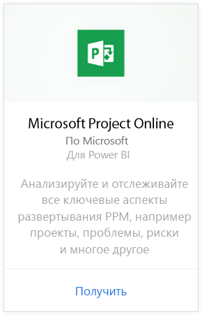
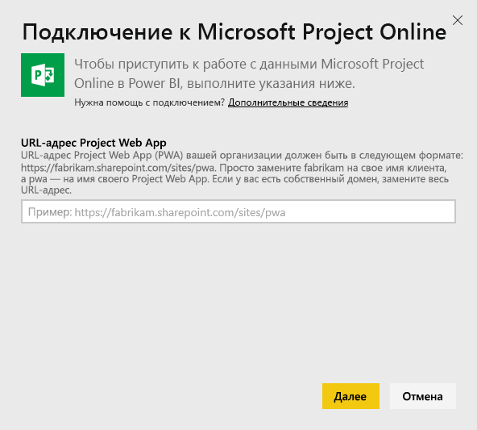
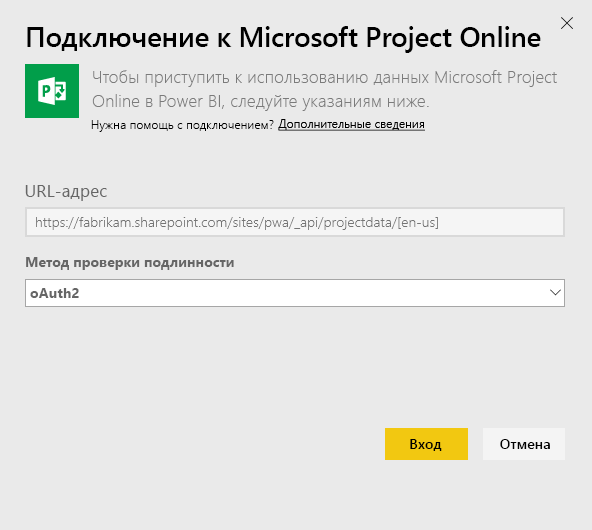
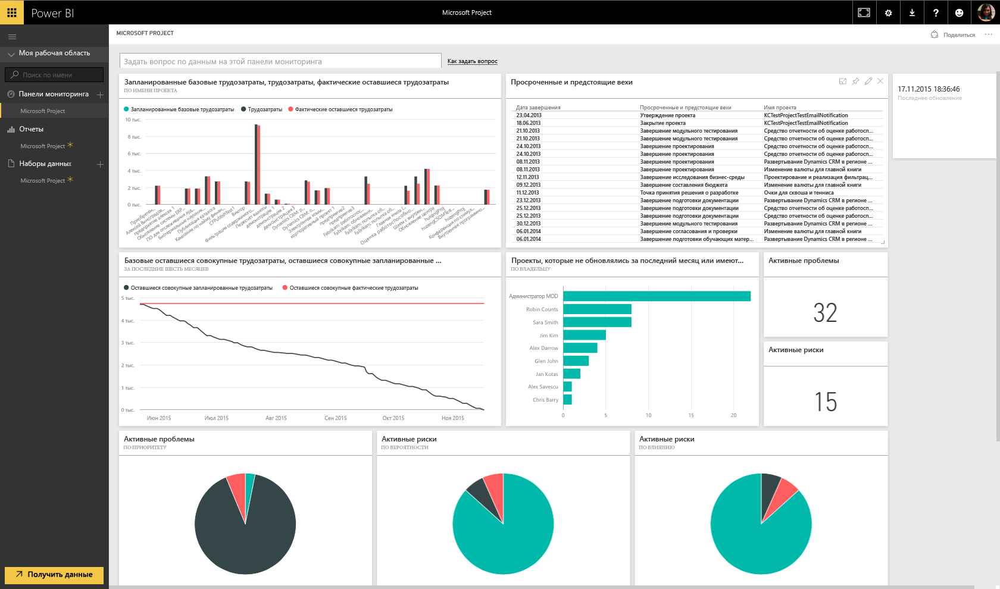

# Подключение к Project Online с помощью Power BI
Microsoft Project Online — это гибкое решение для управления портфелем проекта (PPM) и повседневной работы. Project Online позволяет организациям приступить к работе, расставить приоритеты по инвестициям в портфель проектов, а также добиться запланированного уровня ценности для бизнеса. Пакет содержимого Project Online для Power BI позволяет анализировать данные проекта с помощью готовых метрик, таких как состояние портфеля и соответствие проекта.

Подключитесь к [пакету содержимого Project Online](https://app.powerbi.com/getdata/services/project-online) для Power BI.

## Способы подключения
1. Нажмите кнопку **Получить данные** в нижней части левой панели навигации.
   
    
2. В поле **Службы** выберите **Получить**.
   
   
3. Выберите **Microsoft Project Online** \> **Получить**.
   
   
4. В текстовом поле **URL-адрес Project Web App** введите URL-адрес для Project Web App (PWA), к которому требуется подключиться, и нажмите кнопку **Далее**. Обратите внимание, что в личном домене ситуация может отличаться от приведенной в примере.
   
    
5. В качестве метода проверки подлинности выберите **oAuth2** \> **Войти**. При появлении запроса введите учетные данные Project Online и пройдите процесс проверки подлинности.
   
    
6. Вы увидите уведомление, указывающее на загрузку данных. В зависимости от размера вашей учетной записи это может занять некоторое время. После импорта данных в Power BI в области навигации слева появятся новая панель мониторинга, отчеты и набора данных. Это панель мониторинга по умолчанию, которую Power BI создает для отображения данных. Вы можете изменить эту панель мониторинга для отображения данных любым нужным образом.
   
   

**Дальнейшие действия**

* Попробуйте [задать вопрос в поле "Вопросы и ответы"](power-bi-q-and-a.md) в верхней части информационной панели.
* [Измените плитки](service-dashboard-edit-tile.md) на информационной панели.
* [Выберите плитку](service-dashboard-tiles.md), чтобы открыть соответствующий отчет.
* Хотя набор данных будет обновляться ежедневно по расписанию, вы можете изменить график обновлений или попытаться выполнять обновления по запросу с помощью кнопки **Обновить сейчас**.

## Дальнейшие действия
[Приступая к работе с Power BI](service-get-started.md)

[Получение данных в Power BI](service-get-data.md)

