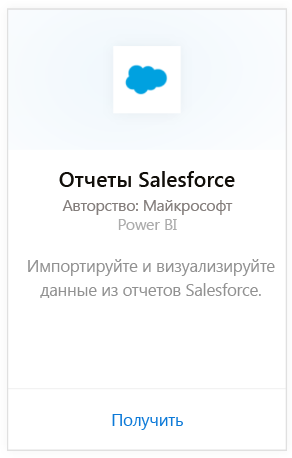
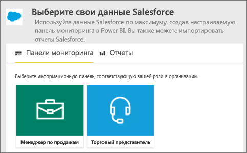
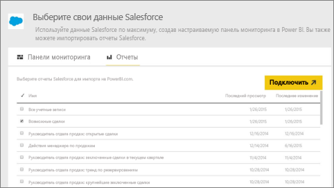
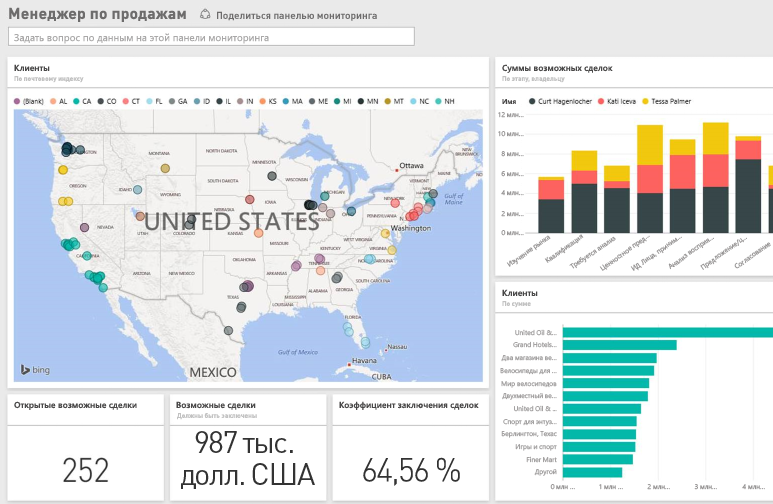

# Подключение к Salesforce с помощью Power BI
С помощью Power BI вы легко можете подключаться к учетной записи Salesforce.com. После создания этого подключения извлекаются ваши данные, на основе которых автоматически создается панель мониторинга и связанные отчеты.

Подключитесь к [пакету содержимого Salesforce](https://app.powerbi.com/getdata/services/salesforce) для Power BI или прочтите дополнительные сведения об [интеграции Salesforce](https://powerbi.microsoft.com/integrations/salesforce) с Power BI.

## Способы подключения
1. Нажмите кнопку **Получить данные** в нижней части левой панели навигации.
   
    
2. В поле **Службы** выберите **Получить**.
   
    
3. Щелкните **Salesforce** и выберите **Получить**.  
   
   
4. Выберите **Вход** для запуска потока операций входа в систему.
   
    
5. При появлении запроса введите учетные данные Salesforce. Щелкните **Разрешить** , чтобы служба Power BI получила доступ к базовым сведениям и данным Salesforce.
   
   
6. Выберите данные, которые вы хотите импортировать в Power BI, из раскрывающегося списка.
   
   * **Панель мониторинга**
     
     Выберите стандартную панель мониторинга в зависимости от пользователя (например, **Менеджер по продажам**). Эти панели мониторинга переносят определенные стандартные данные из Salesforce и не содержат настраиваемые поля.
     
     
   * **Отчеты**
     
     Выберите один или несколько пользовательских отчетов из вашей учетной записи Salesforce. Эти отчеты будут соответствовать вашим представлениям в Salesforce и могут содержать данные из пользовательских полей или объектов.
     
     
     
     Если вы не видите все отчеты, добавьте или создайте их в вашей учетной записи Salesforce и повторите попытку подключения.
7. Нажмите кнопку **Подключить** , чтобы начать импорт. Во время операции появится уведомление о том, что выполняется импорт. После завершения импорта вы увидите панель мониторинга, отчет и набор данных Salesforce на панели навигации слева.
   
   

Вы можете изменить эту панель мониторинга для отображения данных любым нужным образом. Вы можете задавать вопросы в поле "Вопросы и ответы" или щелкнуть плитку, чтобы [открыть соответствующий отчет](consumer/end-user-tiles.md) и [изменить плитки](service-dashboard-edit-tile.md) на информационной панели.

**Дальнейшие действия**

* Попробуйте [задать вопрос в поле "Вопросы и ответы"](consumer/end-user-q-and-a.md) в верхней части информационной панели.
* [Измените плитки](service-dashboard-edit-tile.md) на информационной панели.
* [Выберите плитку](service-dashboard-tiles.md), чтобы открыть соответствующий отчет.
* Хотя набор данных будет обновляться ежедневно по расписанию, вы можете изменить график обновлений или попытаться выполнять обновления по запросу с помощью кнопки **Обновить сейчас**

## Системные требования и рекомендации
- Подключение к рабочей учетной записи Salesforce, для которой включен доступ к API
- Разрешения, предоставляемые приложению Power BI во время входа
- Учетная запись предоставляет достаточно вызовов API для извлечения и обновления данных.
- Для обновления необходим маркер аутентификации. Убедитесь, что вы импортировали не более пяти наборов данных Salesforce, так как Salesforce разрешает использовать не более пяти токенов проверки подлинности для каждого приложения.
- В API отчетов Salesforce есть ограничение на количество строк данных: не более 2000 строк.

## Устранение неполадок
При возникновении ошибок ознакомьтесь с требованиями выше. Также обратите внимание, что возможность входа в пользовательский домен или домен песочницы сейчас не поддерживается.

### Сообщение "Не удалось подключиться к удаленному серверу"

Если при попытке подключиться к учетной записи Salesforce появляется сообщение "Не удалось подключиться к удаленному серверу", см. описание решения на форуме Outsystems: [Сообщение об ошибке входа в соединитель Salesforce: "Не удалось подключиться к удаленному серверу"](https://www.outsystems.com/forums/Forum_TopicView.aspx?TopicId=17674&TopicName=log-in-error-message-unable-to-connect-to-the-remote-server&).

## Дальнейшие действия
[Что такое Power BI?](power-bi-overview.md)

[Получение данных](service-get-data.md)

