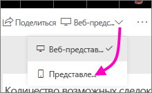
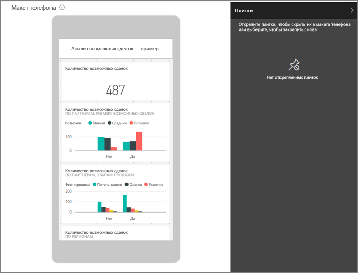
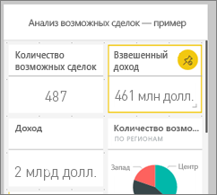
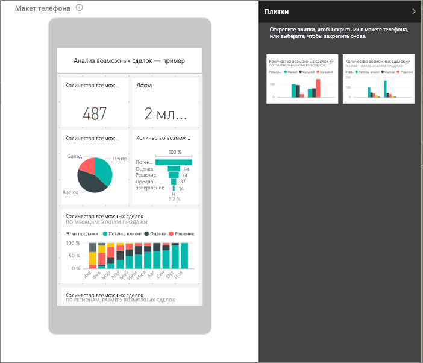

# Создание представления панели мониторинга Power BI, оптимизированного для мобильных телефонов
Когда вы просматриваете панели мониторинга в мобильном приложении Power BI на телефоне, плитки отображаются одна за другой и имеют одинаковый размер. В службе Power BI можно создать настраиваемое представление для любой панели, которая вам принадлежит (в частности, для ее просмотра на телефонах).

Повернув телефон набок, вы можете увидеть панель мониторинга так, как она отображается в службе, а не в представлении для телефона.

> [!NOTE]
> По мере изменения представления для телефона все пользователи, просматривающие вашу панель на своих устройствах, смогут отслеживать ваши изменения в режиме реального времени. Например, если вы открепите все плитки в представлении панели для телефона, они внезапно пропадут при ее просмотре на экране телефона. 
> 
> 

## Создание представления панели мониторинга для телефонов
1. Откройте панель мониторинга в службе Power BI.
2. Нажмите стрелку рядом с элементом **Веб-представление** в правом верхнем углу и выберите параметр **Представление телефона**.

    

    Если вы не являетесь владельцем панели мониторинга, вы не увидите этот параметр.

    

    Откроется редактор представления панели для телефона. В нем вы можете откреплять плитки, менять их размер и порядок так, чтобы панель выглядела оптимальным образом на экране телефона. Веб-версия панели мониторинга при этом не изменится.

1. Чтобы перетащить или открепить плитку либо изменить ее размер, выберите ее. По мере перетаскивания плитки остальные плитки отходят в сторону.
   
    
   
    Открепленные плитки можно найти в области открепленных плиток (они остаются там, пока вы снова не добавите их на панель).
   
    
2. Если вы решите отменить изменения, щелкните **Сбросить плитки**, чтобы восстановить их исходный размер и порядок.
   
    
   
    При запуске редактора представления для телефона в Power BI размер и форма плиток на телефоне немного меняются. Следовательно, чтобы вернуть панель мониторинга в то состояние, в котором она была до запуска редактора, воспользуйтесь командой **Сбросить плитки**.
3. Настроив представление панели для телефона, нажмите стрелку рядом с элементом **Представление телефона** в правом верхнем углу и выберите параметр **Веб-представление**.
   
    Power BI автоматически сохраняет макет телефона.

## Дальнейшие действия
* [Создание отчетов, оптимизированных для мобильных приложений Power BI](desktop-create-phone-report.md)
* [Оптимизация визуальных элементов для любого размера](visuals/desktop-create-responsive-visuals.md)
* Появились дополнительные вопросы? [Попробуйте задать вопрос в сообществе Power BI.](http://community.powerbi.com/)

