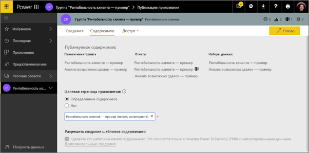
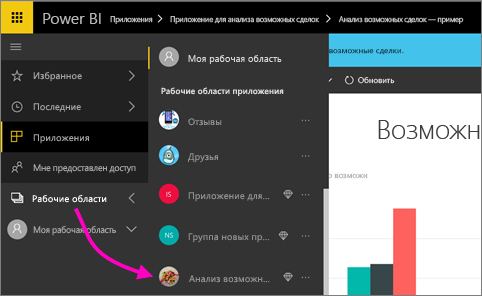
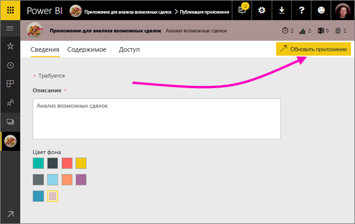
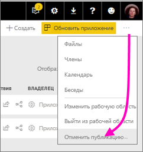

# Публикация приложений с панелями мониторинга и отчетами в Power BI

В Power BI вы можете публиковать *приложения* с коллекциями связанных панелей мониторинга и отчетов. Создавайте приложения в *рабочих областях приложений*, где вы можете вместе с коллегами работать над содержимым Power BI. Затем вы можете опубликовать готовые приложения для больших групп сотрудников в вашей организации. Узнайте больше о создании [рабочих областей приложений](service-create-workspaces.md).

При работе бизнес-пользователям часто требуется несколько панелей мониторинга и отчетов Power BI. С помощью приложений Power BI можно создавать коллекции информационных панелей и отчетов и публиковать эти приложения во всей организации или среди конкретных пользователей и групп. Для администратора или создателя отчетов приложения упрощают управление разрешениями для этих коллекций.

Бизнес-пользователи могут получить ваши приложения несколькими способами. С разрешения администратора Power BI приложения можно установить автоматически в учетных записях Power BI коллег. В противном случае они могут установить ваши приложения из Microsoft AppSource. Кроме того, вы также можете отправить им прямую ссылку. Благодаря централизованному хранению данных в этих приложениях легко находить необходимое содержимое и перемещаться по нему. Пользователи не могут изменять содержимое приложения, но они могут взаимодействовать с ним в службе Power BI или непосредственно в мобильных приложениях, используя параметры фильтрации, выделения и сортировки данных. Кроме того, эти приложения автоматически получают обновления, и вы можете управлять частотой обновления данных. Дополнительные сведения об этом см. в статье [Что из себя представляют приложения в Power BI?](consumer/end-user-apps.md).

**Знаете ли вы?** В Power BI доступна предварительная версия нового интерфейса рабочей области. Ознакомьтесь со статьей [Создание новых рабочих областей (предварительная версия)](service-create-the-new-workspaces.md) и узнайте, как рабочие области изменятся в будущем. 

## Приложения и пакеты содержимого организации
Приложения — усовершенствованные пакеты содержимого организации. Пакеты содержимого недоступны в предварительной версии нового интерфейса рабочей области. Когда новый интерфейс рабочей области появится в общем доступе, вы не сможете использовать пакеты содержимого в только что созданных рабочих областях. Начните переносить пакеты содержимого в приложения.

## Видео. Приложения и рабочие области приложений
<iframe width="640" height="360" src="https://www.youtube.com/embed/Ey5pyrr7Lk8?showinfo=0" frameborder="0" allowfullscreen></iframe>

## Лицензии для приложений
Каждый член рабочей области приложения должен иметь лицензию Power BI Pro. Для пользователей приложения доступны два варианта.

* Вариант 1. Всем бизнес-пользователям требуется лицензия **Power BI Pro** для просмотра вашего приложения. 
* Вариант 2. Пользователи с бесплатной лицензией в организации могут просмотреть содержимое приложения, если ваше приложение находится в емкости Power BI Premium. Дополнительные сведения см. в статье [Что такое Power BI Premium?](service-premium.md)

## Публикация приложения
Когда панели мониторинга и отчеты в рабочей области будут готовы, выберите панели мониторинга и отчеты, которые необходимо опубликовать, а затем опубликуйте их как приложение. Это можно сделать, отправив пользователям прямую ссылку, или они могут найти приложение на вкладке "Приложения", перейдя по ссылке **Download and explore more apps from AppSource** (Найти и скачать другие приложения из AppSource). 

1. В представлении списка рабочей области выберите информационные панели и отчеты, которые требуется добавить в приложение.

     

     Если вы решили не публиковать отчет, рядом с отчетом и связанной информационной панелью может появиться предупреждение. Приложение можно опубликовать, но в связанной информационной панели не будет плиток из отчета.

     

2. Нажмите кнопку **Публикация приложения** в правом верхнем углу, чтобы запустить процесс предоставления совместного доступа ко всему ее содержимому.
   
     

3. На вкладке **Подробности** введите описание, которое поможет пользователям находить приложение. Здесь также можно задать цвет фона.
   
     

4. На вкладке **Содержимое** отображается содержимое, публикуемое как часть приложения. Здесь находится все содержимое рабочей области. На этой вкладке также можно задать целевую страницу приложения, то есть информационную панель или отчет, который сначала увидят пользователи при входе в приложение. Если выбрать значение **Отсутствует**, на целевой странице будет отображаться список всего содержимого в приложении. 
   
     

5. На вкладке **Доступ** укажите, кто имеет доступ к приложению: все сотрудники организации, определенные пользователи или группы безопасности Active Directory. При наличии разрешений можно автоматически установить приложение для получателей. Этот параметр можно включить на портале администрирования Power BI. Дополнительные сведения см. [здесь](#how-to-install-an-app-automatically-for-end-users).

    

6. Если выбрать **Готово**, появится сообщение с подтверждением готовности публикации. В диалоговом окне "Опубликованные" скопируйте ссылку. Это непосредственная ссылка на это приложение. Ее можно отправить пользователям, которым вы хотите предоставить доступ к приложению.
   
     

Дополнительные сведения об этом см. в статье [Что из себя представляют приложения в Power BI?](consumer/end-user-apps.md).

## Изменение опубликованного приложения
Возможно, после публикации приложения вы захотите изменить или обновить его. Администратор или член рабочей области приложения, или участник новой рабочей области приложения могут легко обновить это приложение. 

1. Откройте соответствующую рабочую область приложения. 
   
     
2. Откройте информационную панель или отчет. Здесь вы можете внести все необходимые изменения.
   
     Рабочая область приложения — это промежуточная область хранения, поэтому изменения не применяются до повторной публикации приложения. Это позволяет вносить изменения, не влияя на опубликованные приложения.  
 
3. Вернитесь в список рабочих областей приложений и нажмите кнопку **Обновить приложение**.
   
     

4. При необходимости обновите сведения на вкладке **Details** (Подробные сведения), **Content** (Содержимое) и **Access**, а затем выберите **Обновить приложение**.
   
     

Пользователи, для которых опубликовано приложение, увидят его обновленную версию. 

## Автоматическая установка приложений для конечных пользователей
Приложения доставляют данные, необходимые конечным пользователям для выполнения своей работы. Если администратор предоставил вам разрешение, вы можете автоматически устанавливать приложения для конечных пользователей, что упрощает распространение подходящих приложений среди соответствующих пользователей или групп. Ваше приложение автоматически появится в списке содержимого "Приложения" для конечных пользователей, и им не придется искать их в Microsoft AppSource или использовать ссылку для установки. Это упрощает развертывание стандартного контента Power BI для пользователей.

### Автоматическая установка приложения для конечных пользователей
Когда администратор назначит вам разрешения, у вас будет новый вариант для выбора — **установить приложение автоматически**. Если вы установили этот флажок и нажали **Готово** (или **Обновить приложение** для существующих приложений), то приложение автоматически принудительно отправляется всем пользователям и группам, заданным в разделе **Разрешения** приложения на вкладке **Доступ**.

### Как пользователи получают приложения, которые были им принудительно отправлены
После принудительной отправки приложения оно автоматически отображается в списке приложений. Можно специально отбирать приложения, которые должны быть в распоряжении определенного пользователя или должности в вашей организации.

### Рекомендации по автоматической установке приложений
При принудительной отправке приложений конечным пользователям необходимо учитывать следующие аспекты:

* Автоматическая установка приложения для пользователей может занимать некоторое время. Большинство приложений будет устанавливаться для пользователей немедленно, но на принудительную отправку приложений может потребоваться время.  Это зависит от количества элементов в приложении и количества пользователей, которым предоставляется доступ. Рекомендуется отправлять приложения в нерабочее время, чтобы оставалось достаточно времени до того момента, когда пользователям потребуются эти приложения. Прежде чем отправлять широкое сообщение о доступности приложений, выполните проверку с несколькими пользователями.

* Обновите свой браузер. Пользователю может потребоваться обновить или закрыть и снова открыть свой браузер, прежде чем отправленное приложение появится в списке приложений.

* Если приложение не появилось сразу в списке приложений, пользователь должен обновить или закрыть и снова открыть свой браузер.

* Старайтесь не перегружать пользователей. Будьте внимательны и не отправляйте слишком много приложений, чтобы пользователи успели оценить полезность предварительно установленных приложений. Рекомендуется контролировать, кто может отправлять приложения конечным пользователям, для координации времени. Можно установить контактный пункт для получения в вашей организации приложений, отправленных конечным пользователям.

* У гостевых пользователей, которые не приняли приглашение, приложение не будет устанавливаться автоматически.  

## Отмена публикации приложения
Любой участник рабочей области приложения может отменить публикацию приложения.

* В рабочей области приложения нажмите кнопку с многоточием (**...**) в правом верхнем углу и щелкните **Отменить публикацию приложения**.
  
     

При этом приложение удаляется для всех назначенных пользователей без возможности дальнейшего доступа к нему. Рабочая область приложения или ее содержимое удалены не будут.

## Дальнейшие действия
* [Создание рабочей области приложения](service-create-workspaces.md)
* [Установка и использование приложений с информационными панелями и отчетами в Power BI](consumer/end-user-apps.md)
* [Приложения Power BI для внешних служб](service-connect-to-services.md)
* [Портал администрирования Power BI](https://docs.microsoft.com/power-bi/service-admin-portal)
* У вас появились вопросы? [Попробуйте задать вопрос в сообществе Power BI.](http://community.powerbi.com/)
