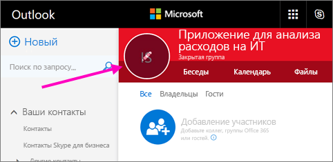
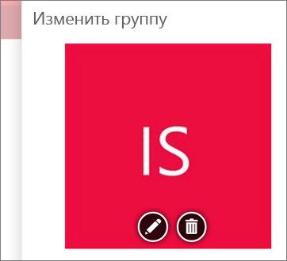
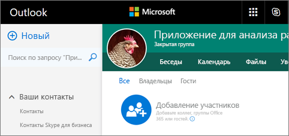
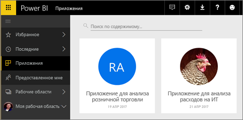
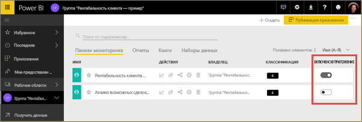
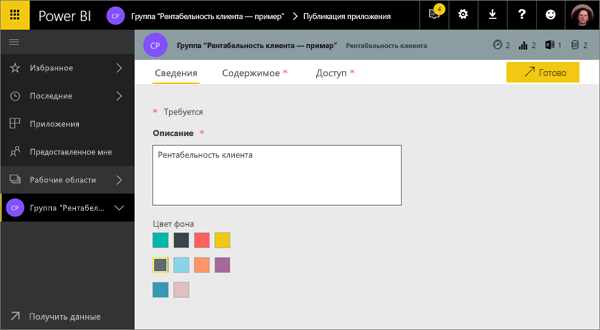
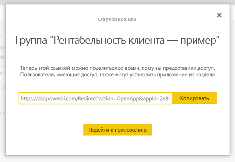
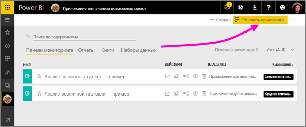

# Создание и публикация приложений с информационными панелями и отчетами в Power BI

В Power BI вы можете создавать *приложения*, которые позволяют объединить связанные информационные панели и отчеты в одном решении, а затем опубликовать эти приложения среди больших групп сотрудников в вашей организации. Также можно подключиться к [приложениям Power BI для таких внешних служб](service-connect-to-services.md), как Google Analytics и Microsoft Dynamics CRM.

При работе бизнес-пользователям часто требуется несколько панелей мониторинга и отчетов Power BI. Приложения объединяют все эти компоненты, поэтому пользователям не нужно запоминать имена и расположение этих информационных панелей.  

С помощью приложений Power BI (в настоящее время находятся на этапе предварительной версии) можно создавать коллекции информационных панелей и отчетов и публиковать эти приложения во всей организации или среди конкретных пользователей и групп. Для администратора или создателя отчетов приложения упрощают управление разрешениями для наборов панелей мониторинга.

Бизнес-пользователи могут получить ваши приложения несколькими способами. С разрешения администратора Power BI их можно установить автоматически в учетных записях Power BI коллег. В противном случае они могут установить ваши приложения из Microsoft AppSource. Кроме того, вы также можете отправить им прямую ссылку. Благодаря централизованному хранению данных в этих приложениях легко находить необходимое содержимое и перемещаться по нему. Кроме того, эти приложения автоматически получают обновления, и вы можете управлять частотой обновления данных. Дополнительные сведения об этом см. в статье [Что из себя представляют приложения в Power BI?](service-install-use-apps.md).

### Лицензии для приложений
Создателю приложения требуется лицензия Power BI Pro. Для пользователей приложения доступны два варианта.

* Вариант 1. Всем бизнес-пользователям требуется лицензия **Power BI Pro** для просмотра вашего приложения. 
* Вариант 2. Пользователи с бесплатной лицензией в организации могут просмотреть содержимое приложения, если ваше приложение находится в емкости Power BI Premium. Дополнительные сведения см. в статье [Что такое Power BI Premium?](service-premium.md)

### Приложения и пакеты содержимого организации
Приложения — усовершенствованные пакеты содержимого организации. Если у вас уже есть пакеты содержимого организации, они будут продолжать работать параллельно с приложениями.

Ознакомившись с общими сведениями о приложениях, давайте поговорим о *рабочих областях*, где вы их создаете. 

## Видео. Приложения и рабочие области приложений
<iframe width="640" height="360" src="https://www.youtube.com/embed/Ey5pyrr7Lk8?showinfo=0" frameborder="0" allowfullscreen></iframe>

## Рабочие области приложений
В *рабочих областях приложений* создаются приложения. Поэтому, чтобы создать приложение, сначала нужно создать рабочую область. Если вы уже работали в рабочей области групп в Power BI, то рабочие области приложений будут вам знакомы. Рабочие области приложений — это усовершенствованные рабочие области групп. Они представляют собой промежуточную область и контейнеры для хранения содержимого приложения. 

В эти рабочие области можно добавить коллег в качестве участников или администраторов. Все участники и администраторы рабочей области приложения должны иметь лицензии Power BI Pro. Рабочая область позволяет вам всем совместно работать над панелями мониторинга, отчетами и прочими статьями, которые вы планируете опубликовать для более широкой аудитории или даже для всей организации. 

Когда содержимое будет готово, выберите панели мониторинга и отчеты для публикации, а затем опубликуйте приложение. Это можно сделать, отправив пользователям прямую ссылку, или они могут найти приложение на вкладке "Приложения", перейдя по ссылке **Download and explore more apps from AppSource** (Найти и скачать другие приложения из AppSource). Эти пользователи не могут изменять содержимое приложения, но они могут обрабатывать его в службе Power BI или непосредственно в мобильных приложениях, используя параметры фильтрации, выделения и сортировки данных. 

## Создание рабочей области приложения
[!INCLUDE [powerbi-service-create-app-workspace](./includes/powerbi-service-create-app-workspace.md)]

Созданная рабочая область пуста, поэтому в нее нужно добавить содержимое. Обратите внимание, что при первом создании для распространения рабочей области в Office 365 понадобится около часа. 

Этот процесс напоминает добавление содержимого в раздел "Моя рабочая область". Разница заключается в том, что другие пользователи рабочей области могут видеть содержимое и работать над ним. Значительное различие заключается в том, что после завершения вы сможете опубликовать содержимое как приложение. В рабочей области приложения вы можете отправлять файлы или подключаться к ним, а также подключаться к сторонним службам точно так же, как и в разделе "Моя рабочая область". Например:

* [Подключайтесь к таким службам](service-connect-to-services.md), как Microsoft Dynamics CRM, Salesforce или Google Analytics.
* [Получайте данные](service-get-data-from-files.md) из файлов Excel, Power BI Desktop (PBIX) и CSV-файлов.

При просмотре содержимого в рабочей области приложения владелец указан как имя рабочей области приложения.

## Добавление изображения в приложение (необязательно)
По умолчанию служба Power BI создает небольшой цветной кружок с кратким названием приложения. Но вы можете добавить изображение. Чтобы добавить изображение, требуется лицензия Exchange Online.

1. Выберите **Рабочие области**, щелкните многоточие (...) рядом с именем рабочей области, а затем выберите **Members** (Элементы). 
   
     
   
    После этого в новом окне браузера откроется учетная запись Office 365 Outlook рабочей области.
2. При наведении указателя мыши на цветной круг в верхнем левом углу появится значок с изображением карандаша. Выберите его.
   
     
3. Щелкните значок с изображением карандаша еще раз и найдите необходимое изображение.
   
     
4. Нажмите кнопку **Сохранить**.
   
     
   
    В окне Office 365 Outlook вместо цветного кружка появится выбранное изображение. 
   
     
   
    Через несколько минут оно также появится в приложении в Power BI.
   
     

## Публикация приложения
Когда информационные панели и отчеты в рабочей области приложения будут готовы, их можно опубликовать как приложение. Помните, что не нужно публиковать все отчеты и информационные панели в рабочей области. Можно опубликовать только готовые. 

1. В представлении списка рабочей области выберите информационные панели и отчеты, которые требуется добавить в приложение.

     

     Если вы решили не публиковать отчет, рядом с отчетом и связанной информационной панелью может появиться предупреждение. Приложение можно опубликовать, но в связанной информационной панели не будет плиток из отчета.

     

1. Нажмите кнопку **Публикация приложения** в правом верхнем углу, чтобы запустить процесс предоставления совместного доступа ко всему ее содержимому.
   
     

2. На вкладке **Подробности** введите описание, которое поможет пользователям находить приложение. Здесь также можно задать цвет фона.
   
     

3. На вкладке **Содержимое** отображается содержимое, публикуемое как часть приложения. Здесь находится все содержимое рабочей области. На этой вкладке также можно задать целевую страницу приложения, то есть информационную панель или отчет, который сначала увидят пользователи при входе в приложение. Если выбрать значение **Отсутствует**, на целевой странице будет отображаться список всего содержимого в приложении. 
   
     

4. На вкладке **Доступ** укажите, кто имеет доступ к приложению: все сотрудники организации, определенные пользователи или группы безопасности Active Directory. При наличии разрешений можно автоматически установить приложение для получателей.

    

5. Если выбрать **Готово**, появится сообщение с подтверждением готовности публикации. В диалоговом окне "Опубликованные" скопируйте ссылку. Это непосредственная ссылка на это приложение. Ее можно отправить пользователям, которым вы хотите предоставить доступ к приложению.
   
     

Бизнес-пользователи, для которых опубликовано приложение, могут найти его разными способами. Если его можно установить автоматически, оно появится в разделе приложений в учетных записях Power BI пользователей. используя прямую ссылку или выполнив поиск в Microsoft AppSource, где отображаются все приложения, к которым у них есть доступ. В любом случае это приложение будет доступно пользователям в разделе "Приложения".

Дополнительные сведения об этом см. в статье [Что из себя представляют приложения в Power BI?](service-install-use-apps.md).

## Изменение опубликованного приложения
Возможно, после публикации приложения вы захотите изменить или обновить его. Администратор или участник рабочей области приложения может легко обновить это приложение. 

1. Откройте соответствующую рабочую область приложения. 
   
     
2. Откройте информационную панель или отчет. Здесь вы можете внести все необходимые изменения.
   
     Рабочая область приложения — это промежуточная область хранения, поэтому изменения не применяются до повторной публикации приложения. Это позволяет вносить изменения, не влияя на опубликованные приложения.  
 
1. Вернитесь в список рабочих областей приложений и нажмите кнопку **Обновить приложение**.
   
     

4. При необходимости обновите сведения на вкладке **Details** (Подробные сведения), **Content** (Содержимое) и **Access**, а затем выберите **Обновить приложение**.
   
     

Пользователи, для которых опубликовано приложение, увидят его обновленную версию. 

## Отмена публикации приложения
Любой участник рабочей области приложения может отменить публикацию приложения.

* В рабочей области приложения нажмите кнопку с многоточием (**...**) в правом верхнем углу и щелкните **Отменить публикацию приложения**.
  
     

При этом приложение удаляется для всех назначенных пользователей без возможности дальнейшего доступа к нему. Рабочая область приложения или ее содержимое удалены не будут.

## Часто задаваемые вопросы о приложениях Power BI
### В чем заключается различие между рабочими областями приложений и групп?
В этом выпуске мы переименовали все рабочие области групп в рабочие области приложений. Приложения можно публиковать из всех этих рабочих областей. В основном функции этих рабочих областей полностью соответствуют. В течение следующих нескольких месяцев мы планируем добавить такие усовершенствования в рабочих областях приложений: 

* При создании рабочих областей приложений соответствующие сущности в Office 365 создаваться не будут, как в случае с рабочими областями групп. Поэтому, создавая рабочие области приложений, вы можете не волноваться о создании разных групп в Office 365 в фоновом режиме (файлы можно по прежнему хранить в групповом хранилище OneDrive для бизнеса в Office 365). 
* Сейчас в список администраторов или участников можно добавлять только отдельных пользователей. Вскоре вы сможете добавлять в эти списки несколько групп безопасности AD или современных групп, чтобы упростить управление.  

### Чем приложения отличаются от пакетов содержимого организации?
Приложения — это усовершенствованные и упрощенные версии пакетов содержимого с несколькими существенными отличиями. 

* После того как бизнес-пользователь установил пакет содержимого, он теряет свое удостоверение группы. Это всего лишь список информационных панелей и отчетов, чередующийся с другими информационными панелями и отчетами. В то же время приложения сохраняют параметры группирования и удостоверение даже после установки. Это упрощает возможность обращаться к ним даже со временем.  
* Из любой рабочей области можно создать несколько пакетов содержимого, но между приложением и его рабочей областью установлена связь "один к одному". Мы считаем, что со временем это упрощает использование и обслуживание приложения. Сведения о будущих улучшениях в этой области см. в разделе стратегических планов в блоге Power BI. 
* Со временем мы планируем отказаться от пакетов содержимого организации, поэтому в дальнейшем мы советуем создавать приложения.  

### А что насчет участников с доступом только для чтения в группах?
В группы можно добавлять участников с доступом только для чтения, которые могут только просматривать содержимое. Основная проблема этого подхода заключалась в том, что вы не могли добавлять группы безопасности как участников. 

В случае с приложениями вы можете опубликовать версию рабочей области приложения с доступом только для чтения и предоставить к ней доступ большому количеству пользователей, в том числе группам безопасности. Вы можете вносить изменения в информационные панели и отчеты приложения, не влияя на пользователей. Мы рекомендуем использовать приложения таким образом в дальнейшем. В долгосрочной перспективе мы также планируем отказаться от участников с доступом только для чтения в рабочих областях.  

## Дальнейшие действия
* [Установка и использование приложений с информационными панелями и отчетами в Power BI](service-install-use-apps.md)
* [Приложения Power BI для внешних служб](service-connect-to-services.md)
* У вас появились вопросы? [Попробуйте задать вопрос в сообществе Power BI.](http://community.powerbi.com/)

