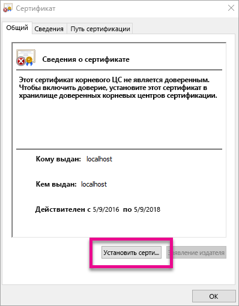
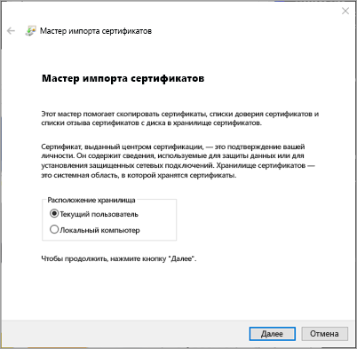
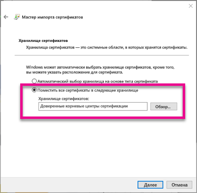
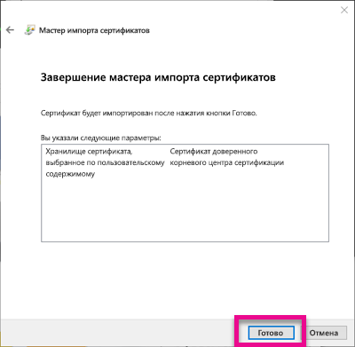
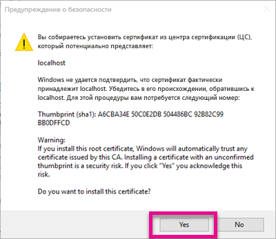
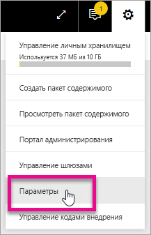
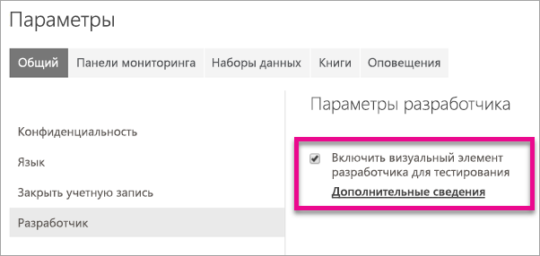
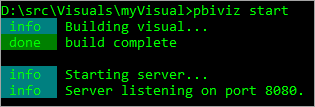

# <a name="use-developer-tools-to-create-custom-visuals"></a>Создание пользовательского визуального элемента с помощью средств разработчика
Пользовательские визуальные элементы отвечают потребностям пользователей, а также соответствуют дизайну вашего приложения. Узнайте, как создать пользовательский визуальный элемент с помощью средств разработчика для Power BI.

> [!NOTE]
> Чтобы приступить к работе, можно использовать этот документ. Дополнительные справочные сведения см. в [репозитории Git визуальных элементов Power BI](https://github.com/Microsoft/PowerBI-visuals).
> 
> 

## <a name="requirements"></a>Требования
* NodeJS версии 4.0 и более поздней (рекомендуется версия 5.0 или более поздняя). [Скачать NodeJS](https://nodejs.org)

## <a name="install-nodejs-and-the-power-bi-tools"></a>Установка NodeJS и средств Power BI
Чтобы создать пользовательский визуальный элемент, необходимо установить NodeJS. NodeJS требуется для запуска программ командной строки.

1. Скачайте и установите [NodeJS](https://nodejs.org). Требуется версия 4.0 или более поздняя, однако рекомендуется использовать версию 5.0 или более позднюю.
2. Установите программы командной строки. Выполните следующую команду в командной строке.
   
        npm install -g powerbi-visuals-tools
3. В установке средств можно убедиться, выполнив следующую команду без параметров.
   
        pbiviz
   
    Будут выведены данные справки.
   
    <pre><code>
         +syyso+/
    oms/+osyhdhyso/
    ym/       /+oshddhys+/
    ym/              /+oyhddhyo+/
    ym/                     /osyhdho
    ym/                           sm+
    ym/               yddy        om+
    ym/         shho /mmmm/       om+
     /    oys/ +mmmm /mmmm/       om+
    oso  ommmh +mmmm /mmmm/       om+
   ymmmy smmmh +mmmm /mmmm/       om+
   ymmmy smmmh +mmmm /mmmm/       om+
   ymmmy smmmh +mmmm /mmmm/       om+
   +dmd+ smmmh +mmmm /mmmm/       om+
         /hmdo +mmmm /mmmm/ /so+//ym/
               /dmmh /mmmm/ /osyhhy/
                 //   dmmd
                       ++
   
       PowerBI Custom Visual Tool
   
    Usage: pbiviz [options] [command]
   
    Commands:
   
    new [name]        Create a new visual
    info              Display info about the current visual
    start             Start the current visual
    package           Package the current visual into a pbiviz file
    update [version]  Updates the api definitions and schemas in the current visual. Changes the version if specified
    help [cmd]        display help for [cmd]
   
    Options:
   
    -h, --help      output usage information
    -V, --version   output the version number
    --install-cert  Install localhost certificate
    </code></pre>

<a name"ssl-setup"></a>

### <a name="server-certificate-setup"></a>Установка сертификата сервера
Чтобы включить динамический просмотр визуального элемента, необходим доверенный сервер HTTPS. Прежде чем начать, необходимо установить SSL-сертификат, позволяющий загрузить визуальные ресурсы в веб-браузере. 

> [!NOTE]
> Для рабочей станции разработчика это однократная установка.
> 
> 

Чтобы *добавить* сертификат, выполните следующую команду.

    pbiviz --install-cert

**ОС Windows**

1. Выберите команду **Установить сертификат**.
   
    
2. Установите переключатель **Текущий пользователь**, а затем нажмите кнопку **Далее**.
   
    
3. Установите переключатель **Place all certificate in the following store** (Разместить все сертификаты в следующем хранилище) и щелкните **Обзор...**.
4. Выберите **доверенных корневых центров сертификации**, а затем нажмите кнопку **ОК**. Нажмите кнопку **Далее**.
   
    
5. Нажмите кнопку **Завершить**.
   
    
6. Нажмите кнопку **Да** в диалоговом окне предупреждения системы безопасности.
   
    
7. Закройте все открытые браузеры.

> [!NOTE]
> Если сертификат не удается распознать, может потребоваться перезагрузить компьютер.
> 
> 

**OSX**

1. Если в верхнем левом углу установлена блокировка, снимите ее. Найдите *localhost* и дважды щелкните сертификат.
   
    
2. Выберите пункт **Always Trust** (Всегда доверять) и закройте окно.
   
    
3. Введите имя пользователя и пароль. Нажмите кнопку **Обновить параметры**.
   
    
4. Закройте все открытые браузеры.

> [!NOTE]
> Если сертификат не удается распознать, может потребоваться перезагрузить компьютер.
> 
> 

## <a name="enable-live-preview-of-developer-visual"></a>Включение динамического просмотра визуального элемента разработчика
Чтобы включить динамический просмотр пользовательского визуального элемента, выполните следующие действия. Таким образом вы сможете использовать визуальный элемент в службе Power BI при изменении отчетов.

1. Зайдите на сайт [app.powerbi.com](https://app.powerbi.com).
2. Нажмите **значок шестеренки**, а затем выберите пункт **Параметры**.
   
    
3. Выберите пункт **Разработчик**, а затем установите флажок **Включить тестирование для визуального элемента разработчика**.
   
    
4. На панели **Визуализации** выберите **визуальный элемент разработчика**.
   
    
   
   > [!NOTE]
   > Для этого требуется запустить `pbiviz start` в папке визуального элемента на компьютере разработчика. Дополнительные сведения см. в этой статье в разделе [Создание визуального элемента](#create-a-new-visual).
   > 
   > 
5. Выберите визуальный элемент на холсте отчета. Данные можно привязать так же, как и другие визуальные элементы.

Теперь можно приступить к разработке визуального элемента.

## <a name="create-a-new-visual"></a>Создание визуального элемента
Проект визуального элемента можно создать, выполнив следующую команду.

```
pbiviz new My Visual name
```

*My Visual Name* можно заменить требуемым именем для визуального элемента. Позже его можно изменить, изменив поля `name` и `displayName` в созданном файле `pbiviz.json`.

Эта команда создаст папку в каталоге, в котором выполнялась команда. Она создаст базовый шаблон для визуального элемента. После выполнения команды вы можете открыть каталог и использовать редактор для начала работы с новым визуальным элементом.

## <a name="testing-your-visual-in-power-bi"></a>Тестирование визуального элемента в Power BI
Вы можете протестировать визуальный элемент в отчетах и информационных панелях службы Power BI.

<a name="running-your-visual"></a>

### <a name="running-your-visual"></a>Запуск визуального элемента
Визуальный элемент можно запустить следующим образом.

1. Откройте командную строку.
2. Измените каталог на папку визуального элемента. Эта папка содержит файл `pbiviz.json`.
3. Выполните следующую команду.
   
    ```
    pbiviz start
    ```
   
    

Если указывается неверный путь, отобразится ошибка наподобие следующей:

```
    error  LOAD ERROR Error: pbiviz.json not found. You must be in the root of a visual project to run this command.
        at e (C:\Users\[user]\AppData\Roaming\npm\node_modules\powerbi-visuals-tools\lib\VisualPackage.js:67:35)
        at Function.loadVisualPackage (C:\Users\[user]\AppData\Roaming\npm\node_modules\powerbi-visuals-tools\lib\VisualPackage.js:62:16)
        at Object.<anonymous> (C:\Users\[user]\AppData\Roaming\npm\node_modules\powerbi-visuals-tools\bin\pbiviz-start.js:43:15)
        at Module._compile (module.js:556:32)
        at Object.Module._extensions..js (module.js:565:10)
        at Module.load (module.js:473:32)
        at tryModuleLoad (module.js:432:12)
        at Function.Module._load (module.js:424:3)
        at Module.runMain (module.js:590:10)
        at run (bootstrap_node.js:394:7)
```

### <a name="viewing-your-visual-in-power-bi"></a>Просмотр визуального элемента в Power BI
Для просмотра визуального элемента в отчете перейдите к этому отчету и выберите визуальный элемент на панели **Визуализации**.

> [!NOTE]
> Прежде чем это сделать, необходимо выполнить команду `pbiviz start`, как описано в разделе [Запуск визуального элемента](#running-your-visual).
> 
> 


Затем отобразится базовый шаблон для визуального элемента.


| Элемент панели инструментов | Описание |
| --- | --- |
| Обновить визуальный элемент |Ручное обновление визуального элемента при отключении автоматической перезагрузки. |
| Включить автоматическую перезагрузку |Если этот параметр включен, визуальный элемент будет автоматически обновляться каждый раз при сохранении файла визуального элемента. |
| Показать представление данных |Показывает базовое представление данных визуального элемента для отладки. |
| Получить справку |Документация на портале GitHub. |
| Отправить отзыв |Отставьте отзыв о том, как мы могли бы улучшить условия работы. (Требуется учетная запись GitHub.) |

## <a name="package-your-visual-for-use-in-power-bi-desktop-and-distribution"></a>Упаковка визуального элемента для использования в Power BI Desktop и распределении
Прежде чем загрузить визуальный элемент в [Power BI Desktop](https://powerbi.microsoft.com/desktop/) или поделиться им с сообществом в [коллекции визуальных элементов Power BI](https://visuals.powerbi.com), вам потребуется создать файл `pbiviz`.

Вы можете запаковать визуальный элемент следующим образом.

1. Откройте командную строку.
2. Измените каталог на папку визуального элемента. Эта папка содержит файл `pbiviz.json`.
3. Выполните следующую команду.
   
    ```
    pbiviz package
    ```

Эта команда создаст файл `pbiviz` в каталоге `dist/` проекта визуального элемента. Если файл `pbiviz` уже имеется, он будет перезаписан.

## <a name="updating-the-visuals-api-version"></a>Обновление версии API визуальных элементов
При создании визуального элемента с помощью `pbiviz new` соответствующие определения типов API и схемы JSON копируются в каталог визуального элемента. Вы можете использовать команду `pbiviz update`, чтобы при необходимости обновить эти файлы. Это полезно при выпуске исправления для более ранней версии API или если необходимо обновить API до последней версии.

### <a name="updating-your-existing-api-version"></a>Обновление имеющейся версии API
При выпуске обновления для имеющейся версии API последнюю версию можно получить следующим образом.

```
#Update your version of pbiviz
npm install -g powerbi-visuals-tools

#Run update from the root of your visual project, where pbiviz.json is located
pbiviz update
```

Таким образом вы сможете скачать новейшие средства из npm, который включает обновленные определения типов и схем. При использовании `pbiviz update` свойство `apiVersion` перезапишется с помощью последней версии в файле *pbiviz.json*.

### <a name="upgrading-to-a-different-api-version"></a>Обновление API до другой версии
Вы можете обновить API до другой версии, используя те же приведенные выше действия. Можно явно указать нужную версию API.

```
#Update your version of pbiviz
npm install -g powerbi-visuals-tools

#Run update from the root of your visual project, where pbiviz.json is located
pbiviz update 1.2.0
```

Таким образом визуальный элемент API будет обновлен до версии 1.2.0. Вы можете заменить `1.2.0` на любую нужную версию.

> [!WARNING]
> Версия API по умолчанию, используемая средствами — это постоянно стабильная версия. В отличие от версии API по умолчанию, любые более поздние версии нестабильны и подлежат изменению. Они могут привести к непредсказуемым последствиям и работают по-разному в службах Power BI и Power BI Desktop. Текущую стабильную версию API см. в статье о [журнале изменений](https://github.com/Microsoft/PowerBI-visuals/blob/master/ChangeLog.md). Дополнительные сведения о предварительных версиях см. в статье о [стратегии](https://github.com/Microsoft/PowerBI-visuals/blob/master/Roadmap/README.md).
> 
> 

## <a name="inside-the-visual-project"></a>Содержимое проекта визуального элемента
Проект визуального элемента — это папка, которая создается при выполнении команды `pbiviz new`. 

### <a name="file-structure"></a>Структура файла
| Элемент | Описание |
| --- | --- |
| assets/ |Используется для хранения ресурсов визуального элемента (значок, снимки экрана и т. д.). |
| dist/ |При выполнении `pbiviz package` создается файл pbiviz. |
| src/ |Код TypeScript визуального элемента. |
| style/ |Стили Less визуального элемента. |
| .gitignore |Сообщает Git о пропуске файлов, которые не должны отслеживаться в репозитории. |
| capabilities.json |Используется для определения [возможностей](https://github.com/Microsoft/PowerBI-visuals/blob/master/Capabilities/Capabilities.md) визуального элемента. |
| package.json |Используется [npm](https://www.npmjs.com/) для управления модулями. |
| pbiviz.json |Основной файл конфигурации. |
| tsconfig.json |Параметры компилятора TypeScript. Дополнительные сведения см. в статье о файле [tsconfig.json](https://www.typescriptlang.org/docs/handbook/tsconfig-json.html) |

### <a name="pbivizjson"></a>pbiviz.json
Это основной файл конфигурации визуального элемента. Он содержит метаданные, а также сведения о файлах, необходимые для создания визуального элемента.

```
{
    "visual": {
        "name": "myVisual", // internal visual name (should not contain spaces)
        "displayName": "My Visual!", // visual name displayed to user (used in gallery)
        "guid": "PBI_CV_xxxxxxx", // a unique id for this visual MUST BE UNIQUE
        "visualClassName": "Visual" // the entry class for your visual
        "version": "1.0.0", // visual version. Should be semantic version (increment if you update the visual)
        "description": "", // description used in gallery
        "supportUrl": "", // url to where users can get support for this visual
        "gitHubUrl": "" // url to the source in github (if applicable)
    },
    "apiVersion": "1.0.0", //API version this visual was created with
    "author": {
        "name": "", // your name
        "email": "" // your e-mail
    },
    "assets": {
        "icon": "assets/icon.png" // relative path to your icon file (20x20 png)
    },
    "style": "style/visual.less", // relative path to your less file
    "capabilities": "capabilities.json" // relative path to your capabilities definition 
}
```

### <a name="visual-source-typescript"></a>Источник визуального элемента (TypeScript)
Код визуального элемента должен быть написан на языке TypeScript (надмножество JavaScript), который поддерживает расширенные возможности и ранний доступ к функциям ES6 или ES7.

Все файлы TypeScript нужно хранить в каталоге `src/`, а также их необходимо добавить к массиву `files` в файле `tsconfig.json`. Таким образом компилятор TypeScript может загрузить их в любом порядке.

При создании визуального элемента все файлы TypeScript компилируются в единый файл JavaScript. Это позволяет ссылаться на экспортированные элементы из других файлов без необходимости выполнения запроса `require` вручную при условии, что оба файла перечислены в файле tsconfig.

Вы можете создать любое количество файлов и классов, требуемое для создания визуального элемента.

Дополнительные сведения см. на странице [TypeScript](http://www.typescriptlang.org/).

### <a name="visual-style-less"></a>Стиль визуального элемента (Less)
Стиль визуального элемента обрабатывается с помощью каскадных таблиц стилей (CSS). Для удобства предварительный компилятор Less используется для поддержки некоторых дополнительных функций, таких как вложения, переменные, примеси, условия, циклы и т. д. Если в использовании любой из этих функций нет необходимости, можно просто записать обычные CSS в файле Less.

Все файлы Less должны храниться в каталоге `style/`. Файл, указанный в поле `style` файла `pbiviz.json`, будет загружен. Дополнительные файлы должны быть загружены с помощью `@import`.

Дополнительные сведения см. на странице [Less](http://lesscss.org/).

## <a name="debugging"></a>Отладка
Советы по отладке настраиваемого визуального элемента см. в [руководстве по отладке](https://github.com/Microsoft/PowerBI-visuals/blob/master/tools/debugging.md).

## <a name="submit-your-visual-to-the-office-store"></a>Отправка визуализации в Магазин Office
Ваши визуализации могут быть опубликованы в Магазине Office. Дополнительные сведения см. в статье [Публикация пользовательских визуализаций в Магазине Office](developer/office-store.md).

## <a name="troubleshooting"></a>Устранение неполадок
**Команда pbiviz не найдена (или похожие ошибки)**

При выполнении `pbiviz` в терминале или командной строке вы увидите экран справки. В противном случае команда установлена неправильно. Убедитесь, что на компьютере установлен NodeJS версии 4.0.

Дополнительные сведения см. в разделе [Установка NodeJS и средств Power BI](#install-nodejs-and-the-power-bi-tools)...

**Не удается найти отладку визуального элемента на вкладке "Визуализации"**

Визуальный элемент отладки выглядит как значок запроса на вкладке **Визуализации**.


Если он не отображается, убедитесь, что он включен в параметрах Power BI. 

> [!NOTE]
> В настоящее время визуальный элемент отладки доступен только в службе Power BI, а не в Power BI Desktop или мобильном приложении. Однако упакованный визуальный элемент можно будет использовать везде.
> 
> 

Дополнительные сведения см. в разделе [Включение динамического просмотра визуального элемента разработчика](#enable-live-preview-of-developer-visual).

**Не удается связаться с сервером визуальных элементов**

Запустите сервер визуальных элементов с помощью команды `pbiviz start` в терминале или командной строке корневого проекта визуальных элементов. Если сервер запущен, вполне вероятно, что SSL-сертификаты неправильно установлены.

Дополнительные сведения см. в разделе [Запуск визуального элемента](#running-your-visual) или [Установка сертификата сервера](#ssl-setup).

## <a name="next-steps"></a>Дальнейшие действия
[Визуализации в Power BI](power-bi-report-visualizations.md)  
[Пользовательские визуализации в Power BI](power-bi-custom-visuals.md)  
[Публикация пользовательских визуализаций в Магазине Office](developer/office-store.md)  
[Скачивание и использование настраиваемых визуализаций из Магазина Office](service-custom-visuals-office-store.md)  
[TypeScript](http://www.typescriptlang.org/)  
[Less CSS](http://lesscss.org/)  

Появились дополнительные вопросы? [Попробуйте задать вопрос в сообществе Power BI.](http://community.powerbi.com/)

