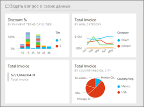
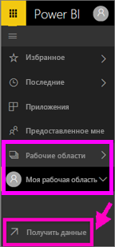
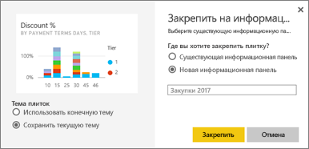
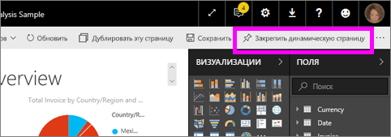
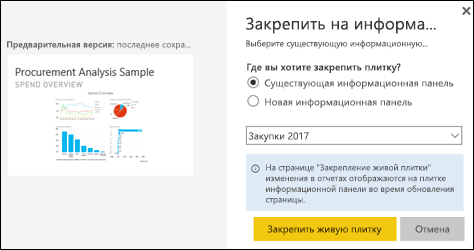
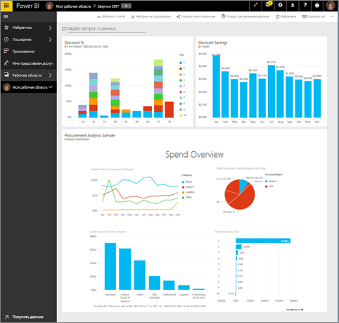

# Создание панели мониторинга Power BI из отчета
Вы прочитали раздел [Панели мониторинга в Power BI](service-dashboards.md) и хотите создать свои собственные информационные панели. Существует много разных способов создавать панели мониторинга, среди которых: создание из отчета, с нуля, из набора данных, с помощью дублирования существующей панели мониторинга и многое другое.  

Сначала это может показаться сложным, поэтому мы начнем с простого и быстрого создания панели мониторинга путем закрепления визуализаций из готового отчета. По завершении работы с этим кратким руководством вы будете понимать, что такое связи между панелями мониторинга и отчетами, как открыть режим правки в редакторе отчетов, как закреплять плитки и переходить между панелями мониторинга и отчетами. Затем воспользуйтесь ссылками в содержании слева или в разделе **Дальнейшие действия** внизу, чтобы перейти к дополнительным статьям.

## Кто может создавать панели мониторинга?
Создавать панель мониторинга может только **автор**. Для этого требуются разрешения на изменение отчета. Такие разрешения доступны авторам отчетов и тем коллегам, которым автор предоставил доступ. Например, если Сергей создает отчет в рабочей области "АБВ" и добавляет вас в нее как участника, то у вас и у Сергея будут разрешения на редактирование. Но если вам предоставили общий доступ к этому отчету напрямую или в рамках [приложения Power BI](service-install-use-apps.md) (вы **используете** отчет), вы не сможете закреплять плитки на панели мониторинга.

> **Примечание**. Панели мониторинга — это компонент службы Power BI, а не Power BI Desktop. Панели мониторинга нельзя создавать в Power BI Mobile, но их можно [просматривать и предоставлять для общего доступа](mobile-apps-view-dashboard.md).
>
> 

## Создание информационной панели путем закрепления визуальных элементов и изображений из отчета (видео)
Посмотрите, как Аманда создает новую панель мониторинга с помощью закрепления визуализаций из отчета. Затем попробуйте сделать это самостоятельно, используя пример анализа закупок и выполняя действия из видео.

<iframe width="560" height="315" src="https://www.youtube.com/embed/lJKgWnvl6bQ" frameborder="0" allowfullscreen></iframe>

### Предварительные требования
Чтобы выполнить эту процедуру, нужно скачать пример книги Excel "Анализ закупок" и открыть ее в службе Power BI (app.powerbi.com).

## Импорт набора данных с помощью отчета
Мы импортируем один из примеров наборов данных Power BI и будем использовать его для создания панели мониторинга. Пример, который мы будем использовать, — это книга Excel с двумя листами PowerView. При импорте книги Power BI добавит в рабочую область набор данных, а также отчет.  Отчет автоматически создается из листов PowerView.

1. [Перейдите по этой ссылке](http://go.microsoft.com/fwlink/?LinkId=529784), чтобы скачать и сохранить файл Excel с примером анализа закупок. Рекомендуется сохранить его в приложении OneDrive для бизнеса.
2. Откройте службу Power BI в браузере (app.powerbi.com).
3. Выберите **Моя рабочая область**.
4. На левой панели навигации выберите **Получить данные**.

    
5. Выберите **Файлы**.

   
6. Перейдите к расположению, в котором вы сохранили файл Excel с примером анализа закупок. Выберите файл и щелкните **Подключить**.

   
7. Для этого упражнения выберите **Импорт**.

    
8. Когда появится сообщение об успешном выполнении, щелкните **x**, чтобы закрыть его.

   

### Открытие отчета и закрепление некоторых плиток на панели мониторинга
1. В той же рабочей области откройте вкладку **Отчеты**. Только что импортированный отчет будет отмечен желтой звездочкой. Щелкните имя отчета, чтобы открыть его.

    
2. Отчет открывается в [режиме чтения](service-reading-view-and-editing-view.md). В нижней части отчета расположены две вкладки: Discount Analysis (Анализ скидок) и Spend Overview (Обзор затрат). Каждая вкладка представляет страницу отчета.
    Выберите пункт **Изменить отчет**, чтобы открыть отчет в режиме правки.

    
3. Наведите указатель мыши на визуализацию, чтобы отобразить доступные параметры. Чтобы добавить визуализацию на панель мониторинга, щелкните значок булавки .

    
4. Так как мы создаем новую панель, выберите параметр **Новая панель мониторинга** и присвойте панели имя.

   
5. Когда вы выберете параметр **Закрепить**, Power BI создаст панель мониторинга в текущей рабочей области. Когда появится сообщение **Закрепление на панели мониторинга**, выберите **Перейти к панели мониторинга**. Если будет предложено сохранить отчет, выберите **Сохранить**.

     
6. Power BI откроет новую панель мониторинга, и вы увидите одну плитку. Это визуализация, которую вы только что закрепили.

   
7. Чтобы вернуться к отчету, щелкните плитку. Закрепите еще несколько плиток на новой панели мониторинга. В этот раз, когда отобразится окно **Закрепление на панели мониторинга**, выберите вариант **Существующая панель мониторинга**.  

   

## Закрепление целой страницы отчета на панели мониторинга
Чтобы не закреплять по одному визуальному элементу, вы можете [закрепить целую страницу отчета в виде *живой плитки*](service-dashboard-pin-live-tile-from-report.md). Попробуем.

1. В редакторе отчетов выберите вкладку **Spend Overview** (Обзор затрат), чтобы открыть вторую страницу отчета.

   

2. Вам нужно, чтобы все эти визуальные элементы отображались на панели мониторинга.  В правом верхнем углу строки меню выберите **Закрепление живой плитки**. На панели мониторинга динамические плитки страниц будут обновляться каждый раз при обновлении страницы.

   

3. Когда отобразится окно **Закрепление на панели мониторинга**, выберите вариант **Существующая панель мониторинга**.

   

4. Когда появится сообщение об успешном выполнении, щелкните **Перейти к панели мониторинга**. Вы увидите плитки, закрепленные из отчета. В приведенном ниже примере мы закрепили две плитки с первой страницы отчета и одну живую плитку, которая представляет собой вторую страницу отчета.

   

Поздравляем с созданием первой панели мониторинга! Теперь, когда у вас есть панель мониторинга, вы можете выполнять разные операции.  Попробуйте выполнить одно из предложенных ниже **действий** или запустите воспроизведение и продолжайте самостоятельное изучение материала.   

## Дальнейшие действия
* [Изменение размеров и перемещение плиток](service-dashboard-edit-tile.md)
* [Все о плитках панелей мониторинга](service-dashboard-tiles.md)
* [Создание и распространение приложения в Power BI](service-create-distribute-apps.md)
* [Power BI — основные понятия](service-basic-concepts.md)
* [Советы по созданию эффективной панели мониторинга Power BI](service-dashboards-design-tips.md)

Появились дополнительные вопросы? [Ответы на них см. в сообществе Power BI.](http://community.powerbi.com/)
