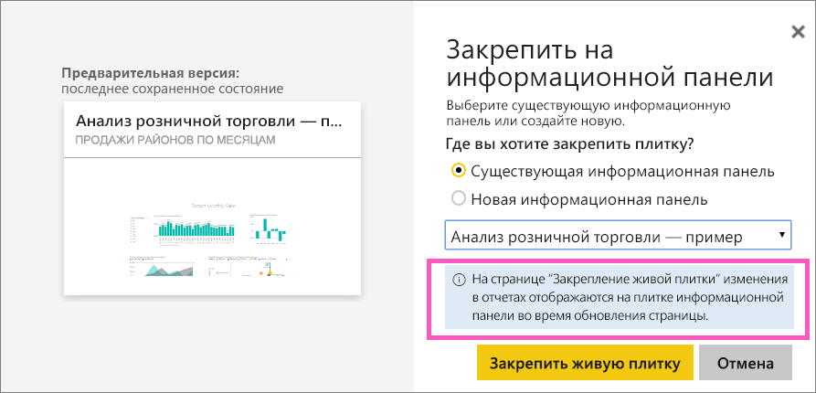
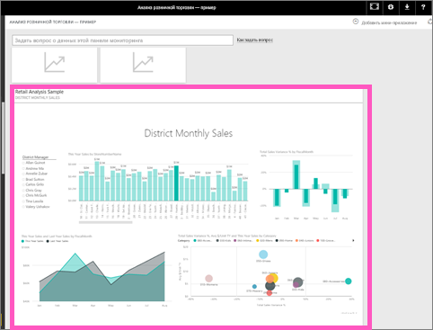

# Закрепление целой страницы отчета в качестве живой плитки на информационной панели Power BI
Другим способом добавления новой [плитки информационной панели](service-dashboard-tiles.md) является закрепление всей страницы отчета. Это простой способ закрепить несколько визуализаций за раз.  Кроме того, при закреплении целой страницы используются *живые* плитки. Вы можете взаимодействовать с ними прямо на информационной панели. А изменения, вносимые в любую из визуализаций в редакторе отчетов, например добавление фильтра или изменение полей, используемых в диаграмме, также отражаются на плитке панели мониторинга.  

Закрепление динамических плиток на панелях мониторинга доступно только в службе Power BI (app.powerbi.com).

> [!NOTE]
> Нельзя закреплять плитки из отчетов, к которым вам был предоставлен общий доступ.
> 
> 

## Закрепление страницы отчета
Посмотрите, как Аманда закрепляет активную страницу отчета на панели мониторинга, а затем попробуйте сделать то же самое, выполнив пошаговые инструкции, которые вы найдете под видео.

<iframe width="560" height="315" src="https://www.youtube.com/embed/EzhfBpPboPA" frameborder="0" allowfullscreen></iframe>

1. Откройте отчет в [режиме редактирования](service-interact-with-a-report-in-editing-view.md).
2. Не выбирая визуализации, в строке меню выберите **Закрепление живой плитки**.
   
    
3. Закрепите плитку на существующей или новой панели мониторинга. Обратите внимание на выделенный текст: *если живая плитка закреплена, при обновлении страницы изменения в отчетах отображаются на плитке информационной панели.*
   
   * Существующая информационная панель: выберите имя панели в раскрывающемся списке. Панели мониторинга, к которым был предоставлен доступ, не появятся в раскрывающемся списке.
   * Новая информационная панель: введите имя новой панели.
     
     
4. Выберите команду **Закрепить живую плитку**. Сообщение об успешном выполнении (рядом с правым верхним углом экрана) позволяет узнать, что страница была добавлена на информационную панель в качестве плитки.

## Открытие информационной панели для просмотра закрепленной живой плитки
1. На панели навигации выберите панель мониторинга с новой живой плиткой. Здесь можно [переименовать закрепленную страницу отчета, изменить ее размер, связать и переместить](service-dashboard-edit-tile.md) ее.  
2. Взаимодействие с живой плиткой.  На снимке экрана ниже панель на гистограмме содержит кроссфильтрацию и перекрестное выделение других визуализаций на плитке.
   
    

## Дальнейшие действия
[Панели мониторинга в Power BI](service-dashboards.md)

Появились дополнительные вопросы? [Ответы на них см. в сообществе Power BI.](http://community.powerbi.com/)

