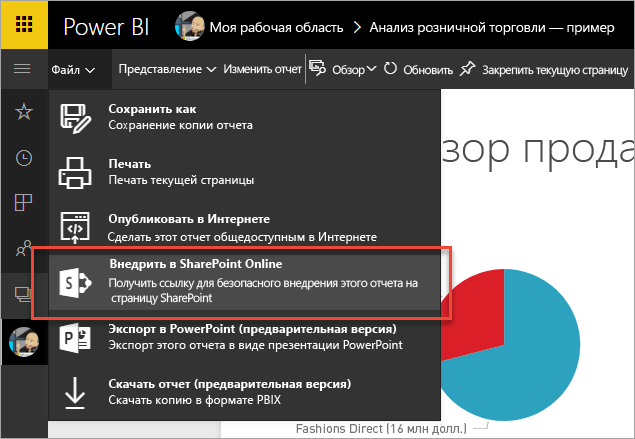
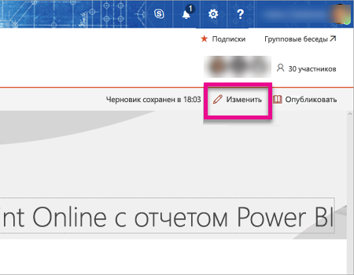
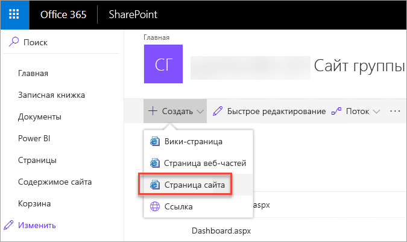
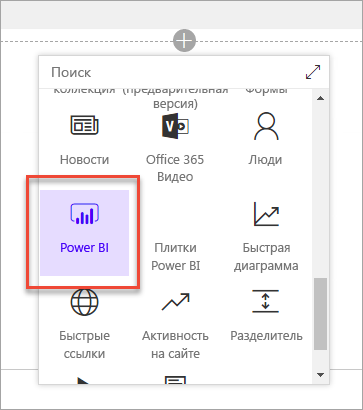
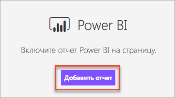
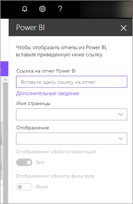
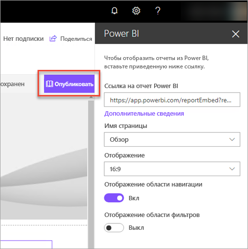
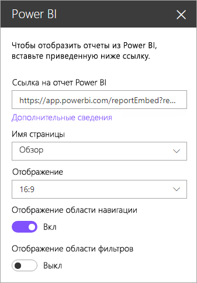
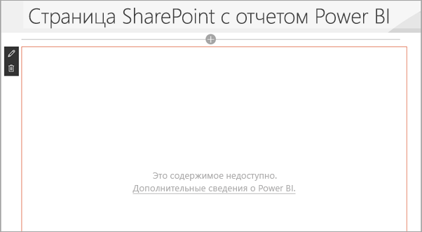

# Внедрение с помощью веб-части отчетов в SharePoint Online

С помощью новой веб-части отчетов Power BI для SharePoint Online вы можете легко внедрять интерактивные отчеты Power BI в страницы SharePoint Online.

Если вы используете новый параметр **Внедрить в SharePoint Online**, внедренные отчеты являются полностью защищенными, поэтому вы можете легко создавать безопасные внутренние порталы.

## Требования

Чтобы отчеты, **внедренные в SharePoint Online**, работали, необходимо соблюсти несколько требований.

* Для веб-части Power BI для SharePoint Online требуются [современные страницы](https://support.office.com/article/Allow-or-prevent-creation-of-modern-site-pages-by-end-users-c41d9cc8-c5c0-46b4-8b87-ea66abc6e63b).

## Внедрение отчета

Чтобы внедрить отчет в SharePoint Online, сначала необходимо получить URL-адрес отчета, а затем использовать этот URL-адрес с новой веб-частью Power BI в SharePoint Online.

### Получение URL-адреса отчета

1. Откройте отчет в службе Power BI.

2. Выберите пункт меню **Файл**.

3. Выберите команду **Внедрить в SharePoint Online**.
   
    

4. Скопируйте URL-адрес из диалогового окна.

    

   > [!NOTE]
   > Вы также можете использовать URL-адрес, который отображается в адресной строке веб-браузера при просмотре отчета. Этот URL-адрес будет содержать страницу отчета, которую вы сейчас просматриваете. Если вы хотите использовать другую страницу, удалите раздел report из URL-адреса.

### Добавление отчета Power BI на страницу SharePoint Online

1. Откройте нужную страницу в SharePoint Online и нажмите кнопку **Изменить**.

    

    Или создайте новую современную страницу сайта, выбрав **+ Создать** в SharePoint Online.

    

2. Щелкните значок **+** и выберите веб-часть **Power BI**.

    

3. Нажмите кнопку **Добавить отчет**.

    

4. Вставьте URL-адрес отчета в область свойств. Это URL-адрес, скопированный на предыдущих этапах. Отчет загрузится автоматически.

    

5. Нажмите кнопку **Опубликовать**, чтобы отчет стал видимым для пользователей SharePoint Online.

    

## Предоставление доступа к отчетам

При внедрении отчета в SharePoint Online разрешение на просмотр отчета не предоставляется пользователям автоматически. Разрешения на просмотр отчета настраиваются в службе Power BI.

> [!IMPORTANT]
> Обязательно проверьте, кто может просматривать отчет в службе Power BI, и предоставьте доступ пользователям, которых нет в списке.

Доступ к отчету в службе Power BI можно предоставить двумя способами. Если вы используете группу Office 365 для создания сайта группы SharePoint Online, укажите пользователя как участника рабочей области приложения в службе Power BI. Теперь эти пользователи могут просматривать содержимое этой группы. Дополнительные сведения см. в статье [Создание и распространение приложения в Power BI](service-create-distribute-apps.md).

Также пользователям можно предоставить доступ к отчету, выполнив следующие действия.

1. Закрепите плитку из отчета на панели мониторинга.

2. Предоставьте доступ к панели мониторинга пользователям, которым требуется доступ к отчету. Дополнительные сведения см. в статье [Предоставление общего доступа к панели мониторинга и отчетам коллегам и другим пользователям](service-share-dashboards.md).

## Настройки веб-части

Ниже приведено описание параметров, которые можно изменять в веб-части Power BI для SharePoint Online.

| Свойство | Описание |
| --- | --- |
| Имя страницы |Задает страницу по умолчанию, которую отображает веб-часть. Выберите значение в раскрывающемся списке. Если ни одна страница не отображается, отчет содержит одну страницу или вставленный URL-адрес содержит имя страницы. Удалите раздел report из URL-адреса, чтобы выбрать определенную страницу. |
| Отображение |Параметр настройки размеров отчета на странице SharePoint Online. |
| Отображение области навигации |Отображение или скрытие области навигации по страницам. |
| Отображение области фильтров |Отображение или скрытие области фильтров. |

## Многофакторная проверка подлинности

Если среда Power BI требует входа с помощью многофакторной идентификации, может появиться запрос на вход с помощью устройства безопасности для проверки вашего удостоверения. Это происходит, если вы не вошли в SharePoint Online с помощью многофакторной идентификации, но среда Power BI требует, чтобы учетная запись была проверена устройством безопасности.

> [!NOTE]
> Многофакторная идентификация еще не поддерживается в Azure Active Directory 2.0. Пользователи будут получать сообщение об *ошибке*. Если пользователь повторно войдет в SharePoint Online с помощью своего устройства безопасности, он сможет просматривать отчет.

## Отчеты, которые не загружаются

Отчет может не загружаться в веб-части Power BI. В этом случае отобразится следующее сообщение.

*Это содержимое недоступно.*

Это сообщение может появиться по двум причинам.

1. У вас нет доступа к отчету.
2. Отчет был удален.

Свяжитесь с владельцем страницы SharePoint Online, чтобы он помог устранить проблему.

## Известные проблемы и ограничения

* **Ошибка. "Произошла ошибка. Попробуйте выйти из системы и войти снова, а затем вернитесь к этой странице. Идентификатор корреляции: не указано, состояние HTTP-ответа: 400, код ошибки сервера: 10001, сообщение: отсутствует маркер обновления"**.
  
  При появлении этой ошибки попробуйте выполнить одно из следующих действий.
  
  1. Выйдите из SharePoint и войдите в службу снова. Перед повторным входом закройте все окна браузера.

  2. Если учетной записи пользователя требуется Многофакторная идентификация (MFA), выполните вход в SharePoint с устройства, поддерживающего Многофакторную идентификацию (мобильное приложение, смарт-карта и т. д.)

* Power BI не поддерживает те же языки с локализацией, что и SharePoint Online. В результате во внедренном отчете требуемая локализация может не отображаться.

* При использовании Internet Explorer 10 могут возникнуть проблемы. См. сведения о [поддерживаемых браузерах для Power BI](service-browser-support.md) и [Office 365](https://products.office.com/office-system-requirements#Browsers-section).

## Дальнейшие действия

[Allow or prevent creation of modern site pages by end users](https://support.office.com/article/Allow-or-prevent-creation-of-modern-site-pages-by-end-users-c41d9cc8-c5c0-46b4-8b87-ea66abc6e63b) (Разрешение или запрет создания современных страниц сайта конечными пользователями)  
[Создание и распространение приложения в Power BI](service-create-distribute-apps.md)  
[Предоставление общего доступа к панели мониторинга и отчетам коллегам и другим пользователям](service-share-dashboards.md)  
[Что такое Power BI Premium?](service-premium.md)  

Появились дополнительные вопросы? [Попробуйте задать вопрос в сообществе Power BI.](http://community.powerbi.com/) 

