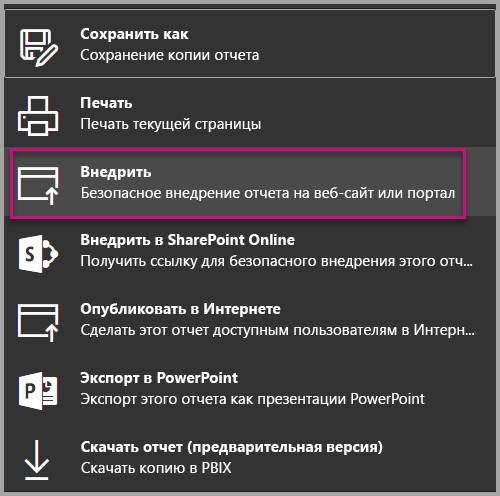
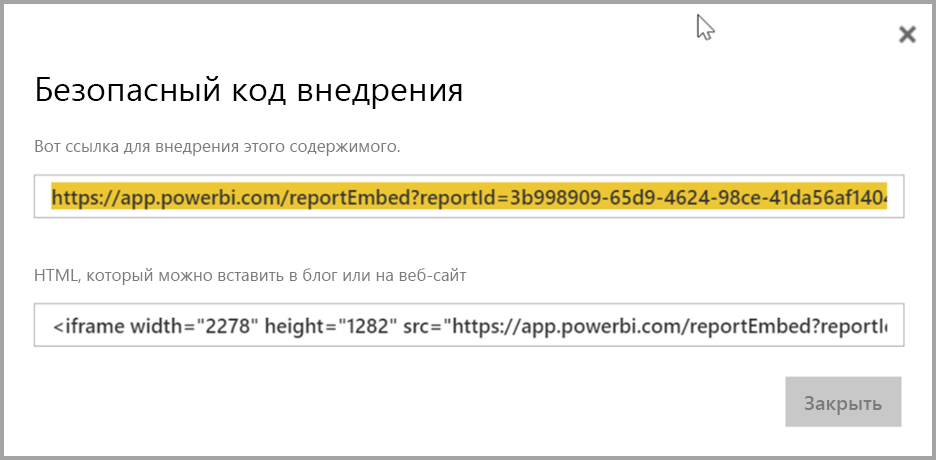

# <a name="embed-a-report-in-a-secure-portal-or-website"></a>Внедрение отчета на защищенный портал или сайт

Новое действие защищенного **внедрения** для отчетов в Power BI позволяет пользователям легко и безопасно внедрять отчеты на внутренние веб-порталы, в том числе **облачные** или **локальные**, такие как SharePoint 2019. Внедренные таким образом отчеты соответствуют всем разрешениям для элементов и политикам защиты данных, которые обеспечиваются с помощью механизма безопасности на уровне строк (RLS). Эта функция позволяет обойтись без написания кода при внедрении содержимого на портал, который поддерживает внедрение по URL-адресу или iFrame.

Действие **Внедрение** также поддерживает [фильтры URL-адресов](service-url-filters.md) и параметры URL-адресов. Действие **Внедрение** позволяет настроить интеграцию с порталами, используя подход с малым объемом кода, который требует базового понимания языков HTML и JavaScript.

## <a name="how-to-embed-power-bi-reports-into-portals"></a>**Внедрение** отчетов Power BI на порталы

1. Новый параметр **Внедрение** доступен через меню **Файл** для отчетов в службе Power BI.

    

2. Выберите параметр "Внедрение", чтобы открыть диалоговое окно со ссылкой и кодом iFrame, который используется для безопасного внедрения отчета.

    

3. После внедрения URL-адреса на веб-портал или при прямом входе по URL-адресу пользователь проходит аутентификацию и получает доступ к отчету. Ниже представлен сеанс браузера, в котором пользователь еще не выполнил вход в Power BI. При нажатии на кнопку **Вход** может открываться новое окно или отдельная вкладка браузера. Если вы не видите запрос на вход, проверьте, не блокируются ли всплывающие окна.

    

4. После того, как пользователь выполнит вход, открывается отчет с данными и средствами для навигации между страницами и настройки фильтров. Отчет отображается только для тех пользователей, у которых есть разрешение на просмотр отчета в Power BI. Применяются также все правила безопасности на уровне строк (RLS). И разумеется, пользователю требуется соответствующая лицензия (Power BI Pro), или отчет должен быть размещен в рабочей области, которая находится в емкости Power BI Premium. Пользователь должен выполнять вход при открытии каждого нового окна браузера, но после входа другие отчеты будут открываться автоматически.

    

5. Если вы используете вариант с iFrame, мы рекомендуем изменить код HTML, чтобы настроить правильную высоту и ширину для размещения на странице портала.

    

## <a name="granting-access-to-reports"></a>Предоставление доступа к отчетам

Параметр "Внедрение" не предоставляет пользователям автоматических прав на просмотр отчета. Разрешения на просмотр отчета настраиваются в службе Power BI.

Чтобы предоставить доступ к отчету в службе Power BI, вы можете настроить для него совместный доступ для тех пользователей, которым потребуется этот внедренный отчет. Если вы используете группу Office 365, включите пользователя в число участников рабочей области приложения в службе Power BI. Дополнительные сведения см. в статье об [управлении рабочей областью приложения](service-manage-app-workspace-in-power-bi-and-office-365.md).

## <a name="licensing"></a>Лицензирование

Пользователям, просматривающим встроенный отчет, нужна лицензия Power BI Pro, если содержимое не размещено в рабочей области [емкости Power BI Premium (номера SKU: EM или P)](service-admin-premium-purchase.md).

## <a name="customize-your-embed-experience-using-url-settings"></a>Настройка внедрения с помощью параметров URL-адреса

URL-адрес внедрения поддерживает несколько входных параметров, которые помогут вам настроить взаимодействие с пользователем. Если вы используете предоставляемый код iFrame, не забудьте обновить URL-адрес в параметрах src этой iFrame.

| Свойство  | Описание  |  |  |  |
|--------------|-----------------------------------------------------------------------------------------------------------------------------------------------------------------------------------------------------------------------|---|---|---|
| pageName  | Параметр строки запроса **pageName** позволяет указать страницу запроса, которая должна открываться. Значение **pageName** размещается в конце URL-адреса отчета при просмотре отчета в службе Power BI, как показано ниже. |  |  |  |
| Фильтры URL-адреса  | Вы можете использовать [фильтры URL-адреса](service-url-filters.md) в URL-адресе внедрения, который вы получили через пользовательский интерфейс Power BI, чтобы фильтровать содержимое внедряемого элемента. Это позволяет создавать интеграции с малым количеством кода, используя только базовые возможности HTML и JavaScript.  |  |  |  |

## <a name="set-which-page-opens-when-the-report-is-embedded"></a>Выбора страницы, которая открывается для внедряемого отчета

Значение параметра *pageName* размещается в конце URL-адреса отчета при просмотре отчета в службе Power BI.

1. Откройте в браузере отчет, размещенный в службе Power BI, и скопируйте URL-адрес из адресной строки.

    

2. Добавьте в URL-адрес параметр *pageName*.

    

## <a name="filter-report-content-using-url-filters"></a>Фильтрация содержимого отчета с помощью фильтров URL-адреса

[Фильтры URL-адреса](service-url-filters.md) позволяют использовать в отчете расширенные функции для создания дополнительных возможностей. Например, представленный ниже URL-адрес фильтрует отчет для отображения данных по энергетической отрасли.

Сочетание **pageName** и [фильтров URL-адреса](service-url-filters.md) позволяет создавать мощные комбинации. Вы сможете создавать интерфейсы, используя простейший код HTML и JavaScript.

Например, так можно добавить кнопку на страницу HTML:

```html
<button class="textLarge" onclick='show("ReportSection", "Energy");' style="display: inline-block;">Show Energy</button>
```

Нажатие этой кнопки вызывает функцию, которая сохраняет в iFrame обновленный URL-адрес с фильтром по энергетической отрасли.

```javascript
function show(pageName, filterValue)

{

var newUrl = baseUrl + "&pageName=" + pageName;

if(null != filterValue && "" != filterValue)

{

newUrl += "&$filter=Industries/Industry eq '" + filterValue + "'";

}

//Assumes there’s an iFrame on the page with id=”iFrame”

var report = document.getElementById("iFrame")

report.src = newUrl;

}
```


Вы можете добавить любое количество кнопок в пользовательский интерфейс с малым количеством кода. 

## <a name="considerations-and-limitations"></a>Рекомендации и ограничения

* Для Azure B2B не поддерживаются внешние пользователи с правами гостя.

* Защищенное внедрение работает только для отчетов, опубликованных в службе Power BI.

* Пользователь должен выполнить вход для просмотра отчета каждый раз, когда открывает новое окно браузера.

* Некоторые браузеры требуют обновить страницу после входа, особенно если используются режимы InPrivate или "аноним".

* Чтобы использовать единый вход, примените параметр "Внедрить в SharePoint Online" или создайте пользовательскую интеграцию на основе шаблона [данные принадлежат пользователю](developer/embed-sample-for-your-organization.md). Дополнительные сведения о шаблоне [данные принадлежат пользователю](developer/embed-sample-for-your-organization.md).

* Возможность автоматической аутентификации, предоставляемая параметром **Внедрение**, не работает с API JavaScript для Power BI. При работе с API JavaScript для Power BI следует использовать подход к внедрению, основанный на концепции [данные принадлежат пользователю](developer/embed-sample-for-your-organization.md). Дополнительные сведения о шаблоне [данные принадлежат пользователю](developer/embed-sample-for-your-organization.md).

## <a name="next-steps"></a>Дальнейшие действия

* [Как совместно работать и предоставлять общий доступ в Power BI?](service-how-to-collaborate-distribute-dashboards-reports.md)

* [Фильтрация отчета с помощью параметров строки запроса в URL-адресе](service-url-filters.md)

* [Внедрение с помощью веб-части отчетов в SharePoint Online](service-embed-report-spo.md)

* [Публикация в Интернете](service-publish-to-web.md)