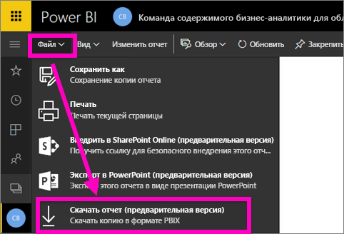
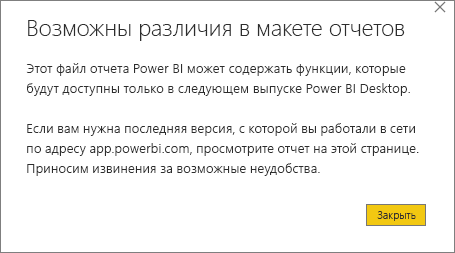

# Экспорт отчета службы Power BI для использования в приложении Power BI Desktop (предварительная версия)
В Power BI Desktop можно экспортировать отчет в службу Power BI, сохранив отчет и выбрав **Опубликовать**. Процедуру экспорта отчета также называют *скачиванием*. Отчет можно экспортировать и в обратном направлении. Кроме того, отчет можно скачать из службы Power BI и использовать в приложении Power BI Desktop. Файлы, экспортируемые в обоих направлениях, имеют расширение *PBIX*.

Существует ряд ограничений и рекомендации, которые мы рассмотри далее в этой статье.

## Загрузка отчета в формате PBIX
Чтобы скачать PBIX-файл, сделайте следующее:

1. В **службе Power BI** откройте отчет, который нужно скачать, в [режиме редактирования](service-reading-view-and-editing-view.md).
2. В строке меню выберите **Файл > Скачать отчет**.
   
   > [!NOTE]
   > Отчет должен быть [создан в Power BI Desktop](guided-learning/publishingandsharing.yml#step-2) или изменен после 23 ноября 2016 г. Только такие отчеты доступны для скачивания. В противном случае команда *Скачать отчет* в меню службы Power BI будет неактивна.
   > 
   > 
3. Во время создания PBIX-файла отображается баннер состояния, показывающий ход выполнения. Когда PBIX-файл будет готов, вам будет предложено открыть или сохранить его. Имя файла будет соответствовать названию отчета.
   
    
   
    Теперь вы можете открыть PBIX-файл в службе Power BI (app.powerbi.com) или в приложении Power BI Desktop.     
4. Чтобы сразу открыть отчет в Power BI Desktop, щелкните **Открыть**.  [Установите Power BI Desktop](desktop-get-the-desktop.md), если вы это еще не сделали.
   
    Когда вы откроете отчет в приложении Power BI Desktop, возможно, отобразится сообщение с предупреждением, что некоторые функции отчета, доступные в службе Power BI, могут быть недоступными в Power BI Desktop.
   
    
5. Чтобы открыть отчет в службе Power BI, щелкните **Сохранить**, а затем — **Получить данные**, чтобы перейти в расположение, где сохранен PBIX- файл.
   
    

## Рекомендации и устранение неполадок
Во время скачивания (экспорта) *PBIX*-файла из службы Power BI следует учесть несколько важных рекомендаций и ограничений.

* Чтобы скачать файл, необходимо обладать правами на редактирование отчета.
* Отчет должен быть получен из **Power BI Desktop** и *опубликован* в **службе Power BI**, или он должен быть *отправлен* в службу как PBIX-файл.
* Отчеты должны быть опубликованы или изменены после 23 ноября 2016 г. Отчеты, опубликованные до этой даты, невозможно скачать.
* Эта функция не будет работать с отчетами, которые изначально были созданы в **службе Power BI**, включая пакеты содержимого.
* Скачанные файлы всегда нужно открывать в последней версии **Power BI Desktop**. Скачанные файлы *.pbix* могут не открываться в более ранних версиях **Power BI Desktop**.
* Если администратор отключил возможность экспорта данных, эта функция будет недоступна в **службе Power BI**.

## Дальнейшие действия
Просмотрите короткий видеоролик от **Guy in a Cube** об этой функции.

<iframe width="560" height="315" src="https://www.youtube.com/embed/ymWqU5jiUl0" frameborder="0" allowfullscreen></iframe>

Кроме того, здесь приведен ряд дополнительных статей, которые помогут вам научиться использовать **службу Power BI**:

* [Отчеты в Power BI](service-reports.md)
* [Power BI — основные понятия](service-basic-concepts.md)

После установки **Power BI Desktop** ознакомьтесь со статьями, которые помогут вам быстро приступить к использованию этого приложения:

* [Начало работы с Power BI Desktop](desktop-getting-started.md)

Появились дополнительные вопросы? [Ответы на них см. в сообществе Power BI.](http://community.powerbi.com/)   

