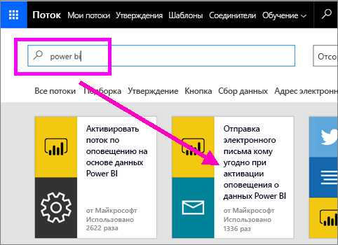
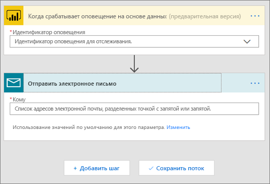
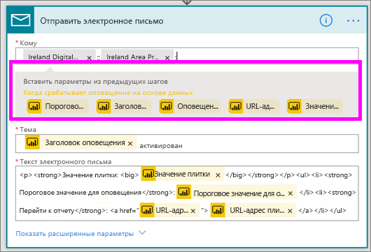
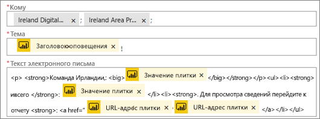
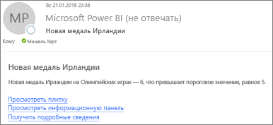
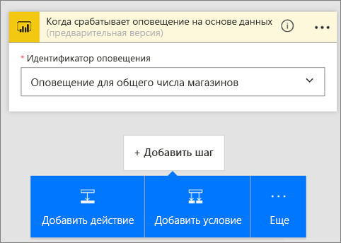
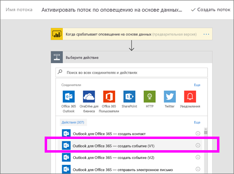
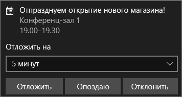

# Microsoft Flow и Power BI

[Microsoft Flow](https://flow.microsoft.com/documentation/getting-started) — это предложение SaaS для автоматизации рабочих процессов в различных приложениях и службах SaaS, которые используют бизнес-пользователи. Microsoft Flow позволяет автоматизировать задачи путем интеграции избранных приложений и служб (включая Power BI) для получения уведомлений, синхронизации файлов, сбора данных и т. п. Выполнение повторяющихся задач существенно упрощается благодаря автоматизации рабочих процессов.

[Начните работу с Microsoft Flow прямо сейчас.](https://flow.microsoft.com/documentation/getting-started)

Посмотрите видео, где Сируи создает приложение Flow, которое отправляет подробное сообщение по электронной почте коллегам при активации оповещения Power BI. Затем сделайте то же самое, выполнив пошаговые инструкции, приведенные под видео.

<iframe width="560" height="315" src="https://www.youtube.com/embed/YhmNstC39Mw" frameborder="0" allowfullscreen></iframe>

## Создание последовательности, которая активируется оповещением о данных Power BI

### Предварительные требования
В этом руководстве показано, как создать две разные последовательности — на основе шаблона и с нуля. Для дальнейшей работы [создайте оповещение о данных в Power BI](service-set-data-alerts.md), создайте бесплатную учетную запись Slack и [зарегистрируйтесь в Microsoft Flow](https://flow.microsoft.com/#home-signup) (это бесплатно).

## Создание последовательности, использующей Power BI, на основе шаблона
В этой задаче мы создадим на основе шаблона простую последовательность, которая активируется с помощью оповещения о данных (уведомления) Power BI.

1. Войдите в Microsoft Flow (flow.microsoft.com).
2. Выберите **Мои потоки**.
   
   
3. Выберите **Создать из шаблона**.
   
    
4. С помощью поля поиска найдите шаблоны Power BI и выберите **Отправка электронного письма кому угодно при активации оповещения о данных Power BI > Продолжить**.
   
    

### Создание последовательности
Этот шаблон содержит один триггер (оповещение о данных Power BI для новых олимпийских медалей сборной Ирландии) и одно действие (отправка сообщения электронной почты). При выборе поля в Microsoft Flow отобразится динамическое содержимое, которое можно использовать.  В этом примере мы включили в текст сообщения значение и URL-адрес плитки.

1. В раскрывающемся списке триггера выберите оповещение о данных Power BI. Выберите **New medal for Ireland** (Новая медаль для Ирландии). Чтобы узнать, как создать оповещение, см. статью [Оповещения о данных в службе Power BI](service-set-data-alerts.md).
   
   
2. Введите один или несколько допустимых адресов электронной почты, а затем выберите **Изменить** (см. ниже) или **Добавить динамическое содержимое**. 
   
   

3. Flow создаст заголовок и сообщение, которые можно сохранить или изменить. Вы можете использовать все значения, заданные при создании оповещения в Power BI: просто поместите курсор и выберите нужный элемент в серой выделенной области. 

   

1.  Например, если в Power BI вы создали заголовок оповещения **We won another medal** (Мы получили еще одну медаль), можно выбрать **Заголовок оповещения**, чтобы добавить этот текст в поле темы своего сообщения электронной почты.

    

    Вы также можете использовать текст сообщения по умолчанию или создать собственный. В примере выше приводится несколько изменений в сообщении.

1. Когда все будет готово, выберите **Создать поток** или **Сохранить поток**.  Последовательность будет создана и проанализирована.  При обнаружении ошибок в Microsoft Flow появятся соответствующие сообщения.
2. Если будут обнаружены ошибки, выберите **Изменить поток** для их исправления. В противном случае выберите **Готово**, чтобы выполнить новую последовательность.
   
   
5. Когда оповещение о данных активируется, на указанные вами адреса будут отправлены сообщения электронной почты.  
   
   

## Создание последовательности, использующей Power BI, с нуля
В этой задаче мы создадим с нуля простую последовательность, которая активируется с помощью оповещения о данных (уведомления) Power BI.

1. Войдите в Microsoft Flow.
2. Выберите **Мои потоки** > **Создать с нуля**.
   
   
3. С помощью поля поиска найдите триггер Power BI и выберите **Power BI — When a data driven alert is triggered** (Power BI — при активации оповещения о данных).

### Создание последовательности
1. В раскрывающемся списке выберите имя оповещения.  Чтобы узнать, как создать оповещение, см. статью [Оповещения о данных в службе Power BI](service-set-data-alerts.md).
   
    
2. Выберите **Новый шаг** > **Добавить действие**.
   
   
3. С помощью поиска найдите **Outlook** и выберите **Создать событие**.
   
   
4. Заполните поля в событии. При выборе поля в Microsoft Flow отобразится динамическое содержимое, которое можно использовать.
   
   
5. Когда все будет готово, выберите **Создать поток**.  Microsoft Flow сохранит и проанализирует последовательность. Если ошибок нет, выберите **Готово**, чтобы выполнить последовательность.  Новая последовательность будет добавлена на страницу **Мои потоки**.
   
   
6. Если последовательность активируется с помощью оповещения о данных Power BI, вы получите в Outlook примерно следующее уведомление о событии:
   
    

## Дальнейшие действия
* [Get started with Microsoft Flow](https://flow.microsoft.com/documentation/getting-started/) (Приступая к работе с Microsoft Flow)
* [Настройка оповещений о данных в службе Power BI](service-set-data-alerts.md)
* [Настройка оповещений о данных на устройстве iPhone](consumer/mobile/mobile-set-data-alerts-in-the-mobile-apps.md)
* [Настройка оповещений о данных в мобильном приложении Power BI для Windows 10](consumer/mobile/mobile-set-data-alerts-in-the-mobile-apps.md)
* Появились дополнительные вопросы? [Ответы на них см. в сообществе Power BI.](http://community.powerbi.com/)

