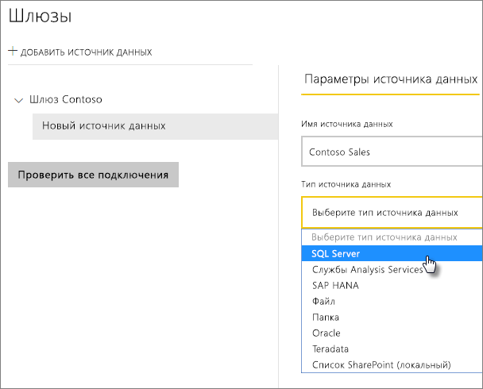
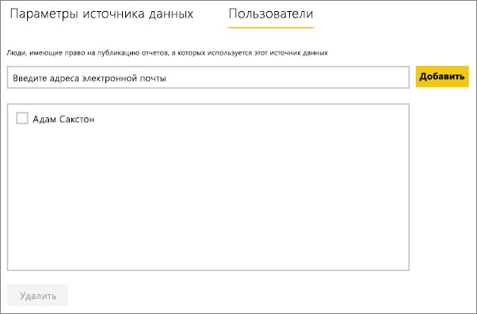

# Управление своим источником данных — SQL Server
После установки локального шлюза данных можно добавить источники, которые можно будет использовать с ним. В этой статье будут рассмотрены способы работы со шлюзами и источниками данных. Источник данных SQL Server можно использовать как для запланированного обновления, так и для DirectQuery.

## Загрузка и установка шлюза
Вы можете скачать шлюз в службе Power BI. Выберите **Загрузки** > **Шлюз данных** или перейдите на [страницу скачивания шлюза](https://go.microsoft.com/fwlink/?LinkId=698861).

## Добавление шлюза
Чтобы добавить шлюз, просто [скачайте](https://go.microsoft.com/fwlink/?LinkId=698861) и установите его на сервере в своей среде. Установленный шлюз появится в списках шлюзов в разделе **Управление шлюзами**.

> [!NOTE]
> Параметр **Управление шлюзами** виден только пользователям, которые являются администраторами хотя бы одного шлюза. Это происходит при добавлении вас в качестве администратора на шлюз или при самостоятельной установке и конфигурации шлюза.
> 
> 

## Удаление шлюза
Удаление шлюза приведет к удалению всех связанных с ним источников данных,  а также отключению панелей мониторинга и отчетов, в которых используются эти источники.

1. Щелкните значок шестеренки  в правом верхнем углу экрана и выберите **Управление шлюзами**.
2. Шлюз > **Удалить**
   
   

## Добавление источника данных
Чтобы добавить источник данных, выберите шлюз и щелкните **Добавить источник данных** или откройте меню "Шлюз" и выберите пункт **Добавить источник данных**.

После этого вы сможете выбрать **тип источника данных** в списке.

> [!NOTE]
> При использовании DirectQuery шлюз поддерживает только **SQL Server 2012 SP1** и последующие версии.
> 
> 

После этого заполните сведения об источнике данных, включая **сервер** и **базу данных**.  

Кроме того нужно выбрать **метод проверки подлинности**.  Можно выбрать параметр **Windows** или **Базовый**.  Если вместо проверки подлинности Windows планируется использовать проверку подлинности SQL, выберите вариант **Базовый** . Затем введите учетные данные, которые будут использоваться для этого источника данных.

> [!NOTE]
> Все запросы к источнику данных будут выполняться с использованием этих учетных данных, если только единый вход Kerberos не настроен и не включен для источника данных. С помощью единого входа при импорте наборов данных используются сохраненные учетные данные, но в наборах данных DirectQuery для выполнения запросов с использованием единого входа используется текущей пользователь Power BI. Дополнительные сведения см. в статье о главном локальном шлюзе данных, чтобы узнать больше о том, как хранятся [учетные данные](service-gateway-onprem.md#credentials), или в статье с данными о том, как [использовать Kerberos для единого входа из Power BI в локальные источники данных](service-gateway-kerberos-for-sso-pbi-to-on-premises-data.md).
> 
> 

Заполнив все данные, нажмите кнопку **Добавить** .  Теперь этот источник данных можно использовать для запланированного обновления или для DirectQuery на сервере SQL Server, расположенном на локальном компьютере. В случае успеха появится сообщение *Подключение установлено* .

### Дополнительные настройки
Для источника данных можно настроить уровень конфиденциальности. Определяет, каким образом можно объединять данные. Используется только для запланированного обновления. Не применяется к DirectQuery. [Дополнительные сведения](https://support.office.com/article/Privacy-levels-Power-Query-CC3EDE4D-359E-4B28-BC72-9BEE7900B540)

## Удаление источника данных
При удалении источника данных отключаются все панели мониторинга и отчеты, в которых он используется.  

Чтобы удалить источник данных, выберите в меню "Источник данных" команду **Удалить**.

## Управление администраторами
На вкладке "Администраторы" для шлюза можно добавлять и удалять пользователей (или группы безопасности), которые могут его администрировать.

## Управление пользователями
На вкладке "Пользователи" для источника данных можно добавлять и удалять пользователей или группы безопасности, которые могут с ним работать.

> [!NOTE]
> Список пользователей определяет только права на публикацию отчетов. Владельцы отчетов могут создавать панели мониторинга или пакеты содержимого и предоставлять доступ к ним другим пользователям.
> 
> 

## Работа с источником данных
После создания источника данных он будет доступен для использования с подключениями DirectQuery или через функцию запланированного обновления.

> [!NOTE]
> Имена сервера и базы данных в Power BI Desktop и источнике данных в конфигурации локального шлюза должны совпадать.
> 
> 

Связь между набором и источником данных в пределах шлюза основана на именах сервера и базы данных. Они должны совпадать. Например, если вы указали IP-адрес в качестве имени сервера в **Power BI Desktop**, необходимо будет использовать IP-адрес и для источника данных в конфигурации шлюза. Если вы используете формат *СЕРВЕР\ЭКЗЕМПЛЯР* в Power BI Desktop, необходимо использовать тот же формат и в источнике данных, настроенном для шлюза.

Это условие справедливо и для DirectQuery, и для запланированного обновления.

### Использование источника данных с подключениями DirectQuery
Имена сервера и базы данных должны совпадать в **Power BI Desktop** и источнике данных для корпоративного шлюза. Кроме того, для публикации наборов данных DirectQuery ваша учетная запись должна быть указана на вкладке **Пользователи** источника данных. Выбор для DirectQuery выполняется в Power BI Desktop при импорте данных. [Дополнительные сведения](desktop-use-directquery.md)

После публикации (из Power BI Desktop или окна **Получение данных**) ваши отчеты должны начать работать. Установка подключения после создания источника данных в рамках шлюза может занять несколько минут.

### Использование источника данных с запланированным обновлением
Если вы указаны на вкладке **Пользователи** источника данных, настроенного в шлюзе, а имена сервера и базы данных совпадают, вы увидите шлюз в списке вариантов, доступных для использования с запланированным обновлением.

## Дальнейшие действия
* [Локальный шлюз данных](service-gateway-onprem.md)  
* [Локальный шлюз данных: подробный обзор](service-gateway-onprem-indepth.md)  
* [Устранение неполадок локального шлюза данных](service-gateway-onprem-tshoot.md)
* [Использование Kerberos для единого входа из Power BI в локальные источники данных](service-gateway-kerberos-for-sso-pbi-to-on-premises-data.md). 
* Появились дополнительные вопросы? [Ответы на них см. в сообществе Power BI.](http://community.powerbi.com/)

