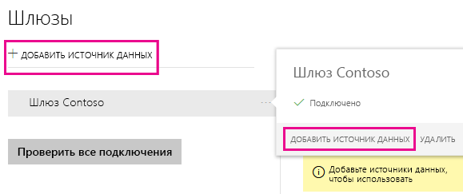
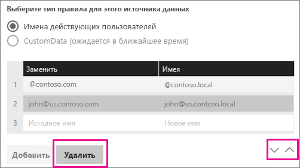
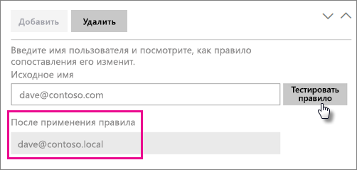
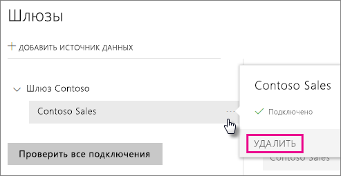
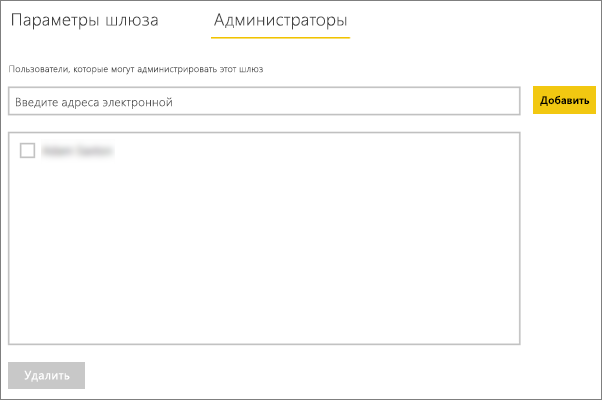
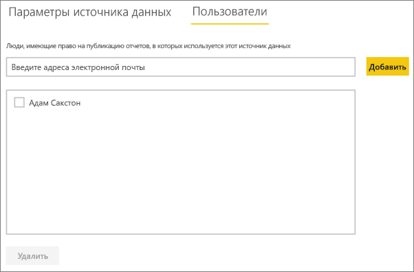

# Управление своим источником данных — службы Analysis Services
После установки локального шлюза данных необходимо добавить источники, которые можно будет с ним использовать. В этой статье будут рассмотрены способы работы со шлюзами и источниками данных. Источник данных служб Analysis Services можно использовать как для запланированного обновления, так и для активных подключений.

<iframe width="560" height="315" src="https://www.youtube.com/embed/ownIGbcRAAU" frameborder="0" allowfullscreen></iframe>

## Загрузка и установка шлюза
Вы можете скачать шлюз в службе Power BI. Выберите **Загрузки** > **Шлюз данных** или перейдите на [страницу скачивания шлюза](https://go.microsoft.com/fwlink/?LinkId=698861).

## Ограничения для динамических подключений к службам Analysis Services
С помощью динамического подключения можно работать с табличными и с многомерными экземплярами.

| **Версия сервера** | **Требуемый номер SKU** |
| --- | --- |
| 2012 SP1 CU4 или более поздняя версия |Бизнес-аналитика и SKU категории "корпоративный" |
| 2014 |Бизнес-аналитика и SKU категории "корпоративный" |
| 2016 |SKU категории "стандартный" или старшая версия |

* Функции форматирования на уровне ячеек и перевода не поддерживаются.
* Из Power BI недоступны действия и именованные наборы, но вы можете подключаться к многомерным кубам, которые их содержат, и создавать визуальные элементы и отчеты.

## Добавление шлюза
Чтобы добавить шлюз, просто [скачайте](https://go.microsoft.com/fwlink/?LinkId=698861) и установите его на сервере в своей среде. Установленный шлюз появится в списках шлюзов в разделе **Управление шлюзами**.

> [!NOTE]
> Параметр **Управление шлюзами** виден только пользователям, которые являются администраторами хотя бы одного шлюза. Для работы с этим параметром нужно, чтобы вас добавили в качестве администратора либо чтобы вы сами установили и настроили шлюз.
> 
> 

## Удаление шлюза
Удаление шлюза приведет к удалению всех связанных с ним источников данных,  а также отключению панелей мониторинга и отчетов, в которых используются эти источники.

1. Щелкните значок шестеренки  в правом верхнем углу экрана и выберите **Управление шлюзами**.
2. Шлюз > **Удалить**
   
   

## Добавление источника данных
Чтобы добавить источник данных, выберите шлюз и щелкните **Добавить источник данных** или откройте меню "Шлюз" и выберите пункт **Добавить источник данных**.

После этого вы сможете выбрать **тип источника данных** в списке. Выберите службы Analysis Services, если подключаетесь к серверу с табличными или многомерными моделями.

После этого заполните сведения об источнике данных, включая **сервер** и **базу данных**.  

Указанные вами **имя пользователя** и **пароль** будут использоваться шлюзом для подключения к экземпляру служб Analysis Services.

> [!NOTE]
> У указанной вами учетной записи Windows должны быть права администратора сервера для экземпляра, к которому вы подключаетесь. Если для пароля задано истечение срока действия и он не был обновлен для источника данных, у пользователей может возникнуть ошибка подключения. См. дополнительные сведения о локальных шлюзах данных и хранении [учетных данных](service-gateway-onprem.md#credentials).
> 
> 

Заполнив все данные, нажмите кнопку **Добавить** .  Теперь этот источник данных можно использовать для запланированного обновления или активных подключений для локального экземпляра служб Analysis Services.  В случае успеха появится сообщение *Подключение установлено* .

### Дополнительные настройки
Для источника данных можно настроить уровень конфиденциальности. Определяет, каким образом можно объединять данные. Используется только для запланированного обновления. Не применяется к активным подключениям. [Дополнительные сведения](https://support.office.com/article/Privacy-levels-Power-Query-CC3EDE4D-359E-4B28-BC72-9BEE7900B540)

## Имена пользователей в службах Analysis Services
Каждый раз, когда пользователь взаимодействует с отчетом, подключенным к службам Analysis Services, действующее имя пользователя передается в шлюз, а затем на локальный сервер служб Analysis Services. В качестве имени пользователя в службы Analysis Services передается адрес электронной почты, с которым вы вошли в Power BI. Для его передачи используется свойство подключения [EffectiveUserName](https://msdn.microsoft.com/library/dn140245.aspx#bkmk_auth). Этот адрес электронной почты должен совпадать с определенным именем участника-пользователя в локальном домене Active Directory. Имя участника-пользователя является свойством учетной записи Active Directory. Соответствующая учетная запись Windows должна присутствовать в роли Analysis Services. Если совпадение в Active Directory не обнаружено, выполнить вход не удается. [Дополнительные сведения](https://msdn.microsoft.com/library/ms677605.aspx)

Также можно сопоставить имя для входа Power BI с именем субъекта-пользователя локального каталога. [Дополнительные сведения](service-gateway-enterprise-manage-ssas.md#map-user-names)

<iframe width="560" height="315" src="https://www.youtube.com/embed/Qb5EEjkHoLg" frameborder="0" allowfullscreen></iframe>

### Как узнать свое имя участника-пользователя?
Вы можете не знать свое имя участника-пользователя и не являться администратором домена. Чтобы узнать имя участника-пользователя для учетной записи, можно использовать следующую команду на рабочей станции.

    whoami /upn

Имя участника-пользователя для учетной записи домена будет похоже на адрес электронной почты. Если для активных подключений используется источник данных служб Analysis Services, но эти данные не соответствуют адресу электронной почты, с помощью которого вы входите в Power BI, ознакомьтесь с [сопоставлением имен пользователей](#map-user-names).

## Сопоставление имен пользователей
<iframe width="560" height="315" src="https://www.youtube.com/embed/eATPS-c7YRU" frameborder="0" allowfullscreen></iframe>

Сопоставить имена пользователей для Analysis Services можно двумя разными способами:

1. Повторное сопоставление имен пользователей вручную. 
2. Поиск свойства в локальном каталоге Active Directory для повторного сопоставления имен участников-пользователей AAD с именами пользователей Active Directory (сопоставление поиска в AD).

Хотя сопоставление можно выполнить вручную на основе второго подхода, но это трудно реализовать и занимает много времени. Это особенно трудно, если сопоставления шаблонов недостаточно, например если имена доменов отличаются в AAD и локальном каталоге AD или если имена учетных записей пользователей разные в AAD и AD. Поэтому мы не советуем выполнять сопоставление вручную на основе второго подхода.

Мы описали эти подходы в следующих двух разделах.

### Повторное сопоставление имен пользователей вручную
Для источников данных служб Analysis Services можно настроить пользовательские правила имени субъекта-пользователя (UPN). Это поможет вам при несоответствии имен входа службы Power BI имени субъекта-пользователя локального каталога. Например, если вход в Power BI выполняется с именем john@contoso.com, а имя субъекта-пользователя локального каталога — john@contoso.local, можно настроить правило сопоставления для передачи john@contoso.local в службы Analysis Services.

Чтобы открыть экран сопоставления имени субъекта-пользователя, выполните приведенные ниже действия.

1. Щелкните значок **шестеренки** и выберите **Управление шлюзами**.
2. Разверните шлюз, содержащий источник данных служб Analysis Services. Если вы еще не создали источник данных служб Analysis Services, это можно сделать на этом этапе.
3. Выберите источник данных и откройте вкладку **Пользователи**.
4. Выберите **Сопоставление имен пользователей**.
   
    

После этого отображаются параметры для добавления правил, а также тестирования для заданного пользователя.

> [!NOTE]
> Вы можете случайно изменить не того пользователя, которого намеревались. Например, если параметр **Replace (original value)** (Заменить: исходное значение) имеет значение *@contoso.com*, а параметр **With (New name)** (На: новое значение) — значение *@contoso.local*, для всех пользователей, имя для входа которых содержит *@contoso.com*, будет выполнена замена на *@contoso.local*. Кроме того, если параметр **Replace (Original name)** (Заменить: исходное имя) имеет значение *dave@contoso.com*, а параметр **With (New name)** (На: новое значение) — значение *dave@contoso.local*, пользователь, имя для входа которых содержит v-dave@contoso.com, будет обработан как v-dave*@contoso.local*.
> 
> 

### Сопоставление поиска в AD
Чтобы выполнить поиск свойства в локальном каталоге AD для повторного сопоставления имен участников-пользователей AAD с именами пользователей Active Directory, выполните действия в этом разделе. Вначале рассмотрим принцип работы.

В **службе Power BI** происходит следующее:

- Вместе з каждым запросом, отправленным пользователем Power BI AAD локальному серверу SSAS, передается также строка имени участника-пользователя, например firstName.lastName@contoso.com

> [!NOTE]
> Все ручные сопоставления имен участника-пользователя, определенные в конфигурации источника данных Power BI, по-прежнему применяются *перед* отправкой строки с именем пользователя в локальный шлюз данных.
> 
> 

В локальном шлюзе данных с настраиваемым сопоставлением имен пользователей сделайте следующее:

1. Найдите каталог Active Directory для поиска (автоматический или настраиваемый).
2. Найдите атрибут пользователя AD, например *электронная почта*, на основе входящей строки имени участника-пользователя (firstName.lastName@contoso.com) из **службы Power BI**.
3. Если поиск в Active Directory завершается сбоем, в качестве имени действующего пользователя SSAS используется переданное имя участника-пользователя.
4. Если поиск в AD происходит успешно, возвращается атрибут *UserPrincipalName* пользователя AD. 
5. Он передает на сервер SSAS адрес электронной почты *UserPrincipalName* в качестве *действующего пользователя*, например *Alias@corp.on-prem.contoso*.

Как настроить шлюз для выполнения поиска в AD

1. Загрузите и установите последнюю версию шлюза.
2. Измените **службу локального шлюза данных**, чтобы поиск выполнялся с помощью учетной записи домена, а не учетной записи локальной службы. Иначе функция поиска в AD не будет правильно работать в среде выполнения. Чтобы изменения вступили в силу, необходимо перезапустить службу шлюза.  Откройте приложение шлюза на компьютере (выполните поиск по фразе "локальный шлюз данных"). Для этого выберите **Параметры службы > Изменить учетную запись службы**. Запишите ключ восстановления этого шлюза, так как вам потребуется восстановить его на том же компьютере, если вы не планируете создать другой шлюз. 
3. Перейдите в папку установки шлюза (*C:\Program Files\On-premises data gateway*) с правами администратора, чтобы иметь разрешения на запись, и измените следующий файл:
   
       Microsoft.PowerBI.DataMovement.Pipeline.GatewayCore.dll.config 
4. Измените два приведенных ниже значения конфигурации в соответствии с *вашей* конфигурацией атрибута Active Directory пользователей AD. Эти значения конфигурации приведены в качестве примера. Их следует указать на основе конфигурации Active Directory. 
   
   
5. Чтобы изменения вступили в силу, перезапустите службу **локального шлюза данных**.

### Работа с правилами сопоставления
Чтобы создать правило сопоставления, введите значение для параметра **Исходное имя** и **Новое имя**, а затем выберите **Добавить**.

| Поле | Описание |
| --- | --- |
| Заменить: исходное имя |Адрес электронной почты, с помощью которого вы вошли в Power BI. |
| With (New Name) (На: новое имя) |Значение, на которое требуется заменить предыдущее. Результат замены заключается в том, что именно будет передаваться в свойство *EffectiveUserName* для соединения служб Analysis Services. |

При выборе элемента в списке можно изменить его порядок, используя **значки со стрелками вверх/вниз** или выбрав элемент **Удалить** для записи.

### Использование подстановочного знака (\*)
Для строки **Replace (Original name)** (Заменить: исходное имя) можно использовать подстановочный знак. Его можно использовать только самостоятельно, а не с какой-либо другой частью строки. Это позволит использовать всех пользователей и передавать единое значение в источник данных. Это полезно, когда необходимо, чтобы все пользователи в организации использовали в локальной среде одного и того же пользователя.

### Проверка правила сопоставления
Можно проверить, на что заменяется исходное имя, введя значение в поле **Исходное имя** и выбрав **Тестировать правило**.

> [!NOTE]
> Когда правила сохранены, потребуется несколько минут, чтобы служба начала их использовать. В браузере правило начнет действовать немедленно.
> 
> 

### Ограничения для правил сопоставления
* Сопоставление предназначено для конкретного настроенного источника данных. Это не глобальные параметры. Если имеется несколько источников данных служб Analysis Services, необходимо сопоставить пользователей с каждым из них.

## Удаление источника данных
При удалении источника данных отключаются все панели мониторинга и отчеты, в которых он используется.  

Чтобы удалить источник данных, выберите в меню "Источник данных" команду **Удалить**.

## Управление администраторами
На вкладке "Администраторы" для шлюза можно добавлять и удалять пользователей (или группы безопасности), которые могут его администрировать.

## Управление пользователями
На вкладке "Пользователи" для источника данных можно добавлять и удалять пользователей или группы безопасности, которые могут с ним работать.

> [!NOTE]
> Список пользователей определяет только права на публикацию отчетов. Владельцы отчетов могут создавать панели мониторинга или пакеты содержимого и предоставлять доступ к ним другим пользователям.
> 
> 

## Работа с источником данных
После создания источника данных он будет доступен для использования с динамическими подключениями или через функцию запланированного обновления.

> [!NOTE]
> Имена сервера и базы данных в Power BI Desktop и источнике данных в конфигурации локального шлюза должны совпадать.
> 
> 

Связь между набором и источником данных в пределах шлюза основана на именах сервера и базы данных. Они должны совпадать. Например, если вы указали IP-адрес в качестве имени сервера в Power BI Desktop, необходимо будет использовать IP-адрес и для источника данных в конфигурации шлюза. Если вы используете формат *СЕРВЕР\ЭКЗЕМПЛЯР* в Power BI Desktop, необходимо использовать тот же формат и в источнике данных, настроенном для шлюза.

Это условие справедливо и для динамических подключений, и для запланированного обновления.

### Использование источника данных с динамическими подключениями
Имена сервера и базы данных должны совпадать в Power BI Desktop и источнике данных для корпоративного шлюза. Кроме того, для публикации наборов данных динамических подключений ваша учетная запись должна быть указана на вкладке **Пользователи** источника данных. Выбор для динамических подключений выполняется в Power BI Desktop при импорте данных.

После публикации (из Power BI Desktop или окна **Получение данных**) ваши отчеты должны начать работать. Установка подключения после создания источника данных в рамках шлюза может занять несколько минут.

### Использование источника данных с запланированным обновлением
Если вы указаны на вкладке **Пользователи** источника данных, настроенного в шлюзе, а имена сервера и базы данных совпадают, вы увидите шлюз в списке вариантов, доступных для использования с запланированным обновлением.

## Дальнейшие действия
[Локальный шлюз данных](service-gateway-onprem.md)  
[Локальный шлюз данных: подробный обзор](service-gateway-onprem-indepth.md)  
[Устранение неполадок локального шлюза данных](service-gateway-onprem-tshoot.md)  
Появились дополнительные вопросы? [Ответы на них см. в сообществе Power BI.](http://community.powerbi.com/)

