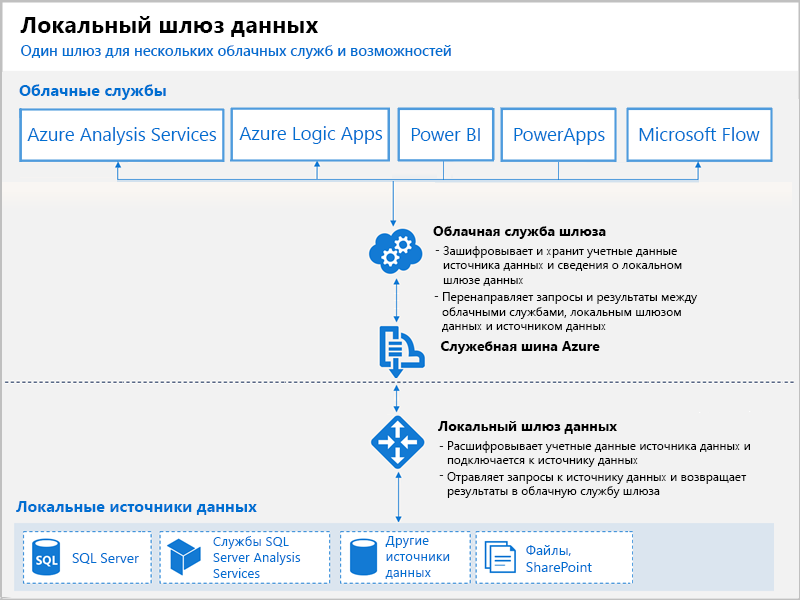

# Что такое локальные шлюзы данных?

Шлюз Power BI — это программное обеспечение, установленное в локальной сети, которое упрощает доступ к данным в этой сети. Он похож на "привратника", который прослушивает запросы пользователей на подключение и выполняет их только при соответствии определенным условиям. Это позволяет организациям хранить базы данных и другие источники данных в локальной сети, сохраняя возможность безопасно использовать эти данные в отчетах и на панелях мониторинга Power BI.

Шлюз можно использовать для одного или нескольких источников данных. Ниже представлена схема развертывания со шлюзом, который обрабатывает запросы из облака к трем локальным компьютерам. Мы рассмотрим ее подробнее далее в этой статье.

## Типы шлюзов

Power BI предлагает два шлюза, предназначенные для разных сценариев.

* **Локальный шлюз данных (персональный режим)** позволяет одному пользователю подключаться к источникам. Его невозможно использовать совместно с другими пользователями. Он используется только в Power BI. Этот шлюз отлично подходит для тех случаев, когда только один автор создает отчеты и ему не нужно предоставлять другим пользователям доступ к локальным источникам данных.

* **Локальный шлюз данных** позволяет нескольким пользователям подключаться к нескольким локальным источникам данных. Его можно использоваться из Power BI, PowerApps, Flow, Azure Analysis Services и Azure Logic Apps через один развернутый шлюз. Этот шлюз отлично подходит для более сложных сценариев, в которых несколько пользователей обращаются к нескольким источникам данных. 

## Использование шлюза

Чтобы использовать шлюз, нужно выполнить четыре основных действия:

1. **установите шлюз** на локальном компьютере, выбрав подходящий режим;
2. **добавьте пользователей к шлюзу**, чтобы они получили доступ к локальным источникам данных;
3. **подключитесь к источникам данных**, которые нужны для отчетов и панелей мониторинга;
4. **обновляйте локальные данных**, чтобы отчеты в Power BI содержали актуальные сведения.

Шлюз можно установить автономно или в *кластер*. Мы рекомендуем второй вариант, так как он обеспечивает высокий уровень доступности.

## Как работают шлюзы

Установленный шлюз работает как служба Windows **On-premises data gateway** (Локальный шлюз данных). Эта локальная служба регистрируется в облачной службе шлюза через Служебную шину Azure. Ниже показана схема потока данных между локальными источниками и облачными службами, которые используют шлюз.

Поток запросов и данных:

1. Облачная служба создает запрос с зашифрованными учетными данными для обращения к локальному источнику данных. Этот запрос отправляется в очередь шлюза для обработки.
2. Облачная служба шлюза анализирует запрос и передает его в Служебную шину Azure. Power BI управляет служебной шиной самостоятельно, поэтому дополнительные затраты или действия по настройке не требуются.
3. Локальный шлюз данных опрашивает Служебную шину Azure на наличие необработанных запросов.
4. шлюз получает запрос, расшифровывает учетные данные и использует их для подключения к источникам данных;
5. Шлюз отправляет запрос в источник данных на исполнение.
6. Результаты возвращаются от источника данных в шлюз и далее в облачную службу и на сервер.

## Дальнейшие действия
[Установка и настройка локального шлюза данных](service-gateway-install.md)

Появились дополнительные вопросы? [Ответы на них см. в сообществе Power BI.](http://community.powerbi.com/)

