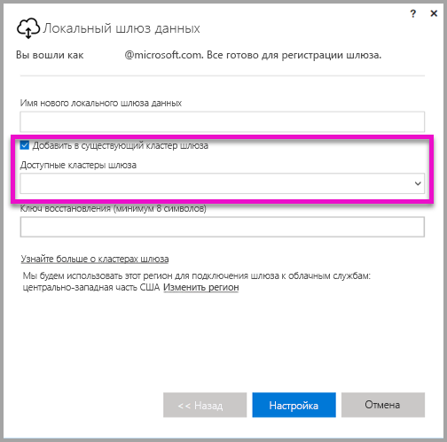
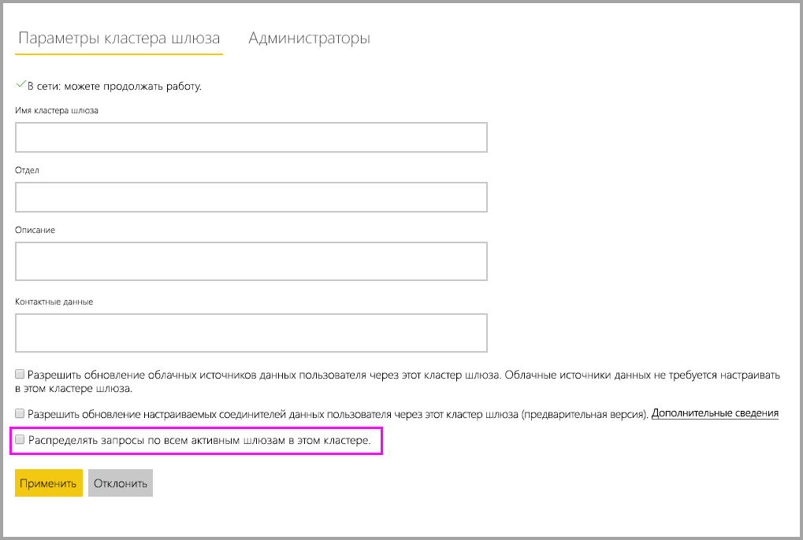

# <a name="high-availability-clusters-for-on-premises-data-gateway"></a>Кластеры с высоким уровнем доступности для локальных шлюзов данных

Вы можете создавать **кластеры с высоким уровнем доступности** для установленных **локальных шлюзов данных**. Так вы обеспечите корпоративный доступ к локальным ресурсам данных, которые используются в отчетах и панелях мониторинга Power BI. Такие кластеры позволяют администраторам шлюзов группировать шлюзы, чтобы не допустить существования единой точки отказа при доступе к локальным ресурсам данных. Служба Power BI всегда использует основной шлюз в кластере, если он доступен. В противном случае она переключается на следующий шлюз в кластере или другой ближайший.

В этой статье описано, как создать и настроить кластер с высоким уровнем доступности для локальных шлюзов данных. Для кластеров с высоким уровнем доступности требуется, чтобы локальный шлюз данных был обновлен до версии за ноябрь 2017 г. или более поздней.

## <a name="setting-up-high-availability-clusters-of-gateways"></a>Настройка кластеров с высоким уровнем доступности для шлюзов

При установке **локального шлюза данных** вы можете выбрать, нужно ли добавить шлюз в существующий кластер шлюза. 



Чтобы добавить шлюз в существующий кластер, предоставьте *Ключ восстановления* для экземпляра основного шлюза кластеру, к которому нужно присоединить новый шлюз. Основной шлюз для кластера должен быть обновлен до версии за ноябрь 2017 г. или более поздней. 

## <a name="managing-a-gateway-cluster"></a>Управление кластером шлюза

Так как кластер содержит два или больше шлюзов, все операции управления шлюзом, например добавление источника данных или предоставление разрешений администратора для шлюза, применяются ко всем шлюзам, находящимся в кластере.

Когда администраторы выбирают пункт меню **Управление шлюзами**, расположенный под значком шестеренки в **службе Power BI**, они видят список зарегистрированных кластеров или отдельные шлюзы, но не видят отдельные экземпляры шлюзов, которые являются элементами кластера.

Все новые запросы **запланированного обновления** и операции DirectQuery автоматически перенаправляются на основной экземпляр определенного кластера шлюза. Если экземпляр основного шлюза не подключен к сети, запрос перенаправляется к другому экземпляру шлюза в кластере.

## <a name="distribute-requests-traffic-across-all-gateways-in-a-cluster"></a>Распределение трафика запросов между всеми шлюзами в кластере

Вы можете разрешить распределение трафика между всеми шлюзами в кластере. На странице **Управление шлюзами** в **службе Power BI** при выборе кластера шлюзов в списке в дереве навигации слева вы можете установить флажок "Распределение запросов по всем активным шлюзам в этом кластере".



## <a name="powershell-support-for-gateway-clusters"></a>Поддержка PowerShell для кластеров шлюзов

Скрипты PowerShell доступны в папке установки локального шлюза данных. По умолчанию папка располагается здесь: *C:\Program Files\On-premises data gateway*. Чтобы скрипты работали правильно, используйте PowerShell версии 5 или более поздней. С помощью скриптов PowerShell пользователи могут выполнять такие операции:

-   получение списка кластеров шлюзов, доступных для пользователя;
-   получение списка экземпляров шлюзов, зарегистрированных в кластере, а также сведения о их статусе ("В сети" или "Вне сети");
-   изменение статуса "Включено" или "Отключено" и других свойств для экземпляра шлюза в кластере;
-   Удаление шлюза

Чтобы запустить команды PowerShell, приведенные в таблице, сначала нужно выполнить следующие шаги:

1. Откройте окно командной строки PowerShell от имени администратора.
2. Затем выполните следующую одноразовую команду PowerShell (предполагается, что вы не выполняли команды PowerShell на этом компьютере):

    ```
    Set-ExecutionPolicy -ExecutionPolicy Unrestricted -Force
    ```

3. После этого перейдите к папке установки локального шлюза данных в окне PowerShell и импортируйте необходимый модуль с помощью следующей команды:

    ```
    Import-Module .\OnPremisesDataGatewayHAMgmt.psm1
    ```

Выполнив эти шаги, вы сможете использовать команды в следующей таблице, чтобы управлять кластерами шлюзов.

| **Команда** | **Описание** | **Параметры** |
| --- | --- | --- |
| *Login-OnPremisesDataGateway* |С помощью этой команды пользователь может войти в систему, чтобы управлять кластерами локальных шлюзов данных.  Вам нужно запустить эту команду и войти в систему, *чтобы* другие команды высокого уровня доступности могли выполняться правильно. Примечание. Маркер проверки подлинности AAD, который требуется для вызова команды Login, действителен только в течение часа. После этого его срок действия истечет. Вы можете повторно выполнить команду Login, чтобы запросить новый маркер.| Имя пользователя и пароль AAD (предоставляются во время выполнения команды, а не при начальном вызове).|
| *Get-OnPremisesDataGatewayClusters* | Позволяет получить список кластеров шлюзов для пользователя, вошедшего в систему. | При необходимости можно передать параметры форматирования в эту команду, чтобы повысить читаемость, например *Format-Table -AutoSize -Wrap*. |
| *Get-OnPremisesDataClusterGateways* | Позволяет получить список шлюзов в определенном кластере, а также дополнительные сведения для каждого шлюза (статус "В сети" или "Вне сети", имя компьютера и т. д.). | *-ClusterObjectID xyz*, где *xyz* заменяется значением идентификатора объекта текущего кластера, которое можно получить с помощью команды *Get-OnPremisesDataGatewayClusters*.|
| *Set-OnPremisesDataGateway* | Позволяет задать значения свойств для определенного шлюза в кластере, включая возможность включить или отключить определенный экземпляр шлюза.  | *-ClusterObjectID xyz*, где *xyz* нужно заменить значением идентификатора объекта текущего кластера, которое можно получить с помощью команды *Get-OnPremisesDataGatewayClusters*. *-GatewayObjectID abc*, где *abc* нужно заменить значением идентификатора объекта текущего кластера, которое можно получить с помощью команды *Get-OnPremisesDataClusterGateways* при наличии идентификатора объекта кластера. |
| *Get-OnPremisesDataGatewayStatus* | Позволяет получить сведения о статусе для определенного экземпляра шлюза в кластере.  | *-ClusterObjectID xyz*, где *xyz* нужно заменить значением идентификатора объекта текущего кластера, которое можно получить с помощью команды *Get-OnPremisesDataGatewayClusters*. *-GatewayObjectID abc*, где *abc* нужно заменить значением идентификатора объекта текущего кластера, которое можно получить с помощью команды *Get-OnPremisesDataClusterGateways* при наличии идентификатора объекта кластера. |
| *Remove-OnPremisesDataGateway*  | Позволяет удалить экземпляр шлюза из кластера. Обратите внимание, что основной шлюз в кластере можно удалить, только когда все остальные шлюзы в кластере будут удалены.| *-ClusterObjectID xyz*, где *xyz* нужно заменить значением идентификатора объекта текущего кластера, которое можно получить с помощью команды *Get-OnPremisesDataGatewayClusters*. *-GatewayObjectID abc*, где *abc* нужно заменить значением идентификатора объекта текущего кластера, которое можно получить с помощью команды *Get-OnPremisesDataClusterGateways* при наличии идентификатора объекта кластера. |

## <a name="next-steps"></a>Дальнейшие действия

-   [Управление своим источником данных — службы Analysis Services](service-gateway-enterprise-manage-ssas.md)  
-   [Управление своим источником данных — SAP HANA](service-gateway-enterprise-manage-sap.md)  
-   [Управление своим источником данных — SQL Server](service-gateway-enterprise-manage-sql.md)  
-   [Управление своим источником данных — Oracle](service-gateway-onprem-manage-oracle.md)  
-   [Управление источником данных — импорт или запланированное обновление](service-gateway-enterprise-manage-scheduled-refresh.md)  
-   [Локальный шлюз данных во всех подробностях](service-gateway-onprem-indepth.md)  
-   [Локальный шлюз данных (персональный режим)](service-gateway-personal-mode.md)
-   [Настройка параметров прокси-сервера для локального шлюза данных](service-gateway-proxy.md)  
-   [Использование Kerberos для единого входа из Power BI в локальные источники данных](service-gateway-sso-kerberos.md)  

Появились дополнительные вопросы? [Ответы на них см. в сообществе Power BI.](http://community.powerbi.com/)
