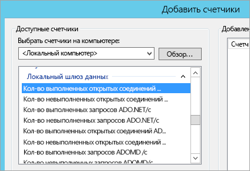
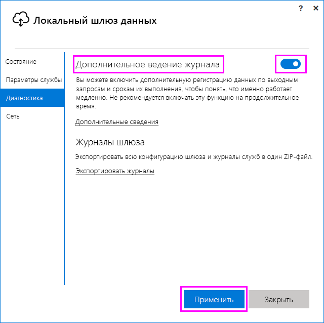
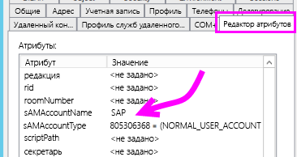
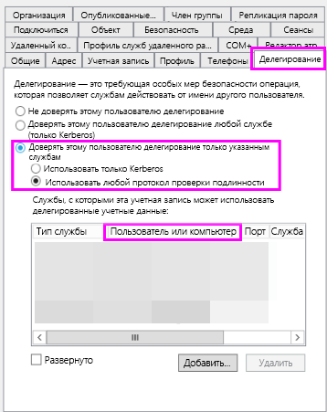
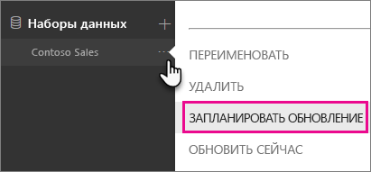

# <a name="troubleshooting-the-on-premises-data-gateway"></a>Устранение неполадок локального шлюза данных
В этой статье описаны распространенные проблемы, которые могут возникнуть при работе с **локальным шлюзом данных**.

<!-- Shared Community & support links Include -->
[!INCLUDE [gateway-onprem-tshoot-support-links-include](./includes/gateway-onprem-tshoot-support-links-include.md)]

<!-- Shared Troubleshooting Install Include -->
[!INCLUDE [gateway-onprem-tshoot-install-include](./includes/gateway-onprem-tshoot-install-include.md)]

## <a name="configuration"></a>Конфигурации
### <a name="how-to-restart-the-gateway"></a>Как перезапустить шлюз
Шлюз работает как служба Windows. Его можно запустить и остановить несколькими способами. Например, вы можете открыть окно командной строки с более высоким уровнем разрешений на компьютере, на котором запущен шлюз, а затем выполнить нужную команду из указанных ниже.

* Чтобы остановить службу, выполните следующую команду.
  
    "   net stop PBIEgwService   "
* Чтобы запустить службу, выполните следующую команду.
  
    "   net start PBIEgwService   "

### <a name="error-failed-to-create-gateway-please-try-again"></a>Ошибка: не удалось создать шлюз. Повторите попытку.
Все данные доступны, но обращение к службе Power BI завершилось ошибкой. Отображается ошибка и идентификатор действия. Это может быть вызвано разными причинами. Вы можете собирать и просматривать журналы указанным ниже образом для получения более полной картины.

Проблема также может быть вызвана неправильной конфигурацией прокси-сервера. Теперь пользовательский интерфейс позволяет настраивать конфигурацию прокси-сервера. Вы можете ознакомиться с дополнительными сведениями о внесении [изменений в конфигурацию прокси-сервера](service-gateway-proxy.md).

### <a name="error-failed-to-update-gateway-details--please-try-again"></a>Ошибка: не удалось обновить сведения о шлюзе.  Повторите попытку.
Сведения были получены в шлюз из службы Power BI. Сведения были переданы в локальную службу Windows, но она не вернулась либо возникла проблема с генерированием симметричного ключа. Внутреннее исключение появится в разделе **Показать подробные сведения**. Вы можете собирать и просматривать журналы указанным ниже образом для получения более полной картины.

### <a name="error-power-bi-service-reported-local-gateway-as-unreachable-please-restart-the-gateway-and-try-again"></a>Ошибка: служба Power BI объявила локальный шлюз недоступным. Перезапустите шлюз и повторите попытку.
После завершения настройки конфигурации служба Power BI будет вызвана снова, чтобы проверить шлюз. Служба Power BI не объявляет шлюз *активным*. Обеспечить подключение может перезапуск службы Windows. Вы можете собирать и просматривать журналы указанным ниже образом для получения более полной картины.

### <a name="script-error-during-sign-into-power-bi"></a>Ошибка сценария при входе в Power BI
При входе в Power BI может отобразиться сообщение об ошибке в скрипте, которая возникла при настройке локального шлюза данных. Установка следующих обновлений безопасности поможет решить данную проблему. Это можно сделать с помощью Центра обновления Windows.

[MS16-051: обновление для системы безопасности Internet Explorer: 10 мая 2016 г. (3154070 КБ)](https://support.microsoft.com/kb/3154070)

### <a name="gateway-configuration-failed-with-a-null-reference-exception"></a>Сбой настройки шлюза с исключением пустой ссылки
При работе вы можете столкнуться с ошибкой наподобие следующей:

        Failed to update gateway details.  Please try again.
        Error updating gateway configuration.

При этом выполняется трассировка стека, результаты которой могут содержать следующий фрагмент:

        Microsoft.PowerBI.DataMovement.Pipeline.Diagnostics.CouldNotUpdateGatewayConfigurationException: Error updating gateway configuration. ----> System.ArgumentNullException: Value cannot be null.
        Parameter name: serviceSection

Если вы выполняете обновление с более старой версии шлюза, мы сохраняем конфигурационный файл. В нем может отсутствовать определенный раздел. Когда шлюз пытается прочитать его, возникает указанное выше исключение пустой ссылки.

Чтобы исправить эту ошибку, выполните указанные ниже действия.

1. Удалите шлюз.
2. Удалите следующую папку:
   
        c:\Program Files\On-premises data gateway
3. Установите шлюз снова.
4. При необходимости восстановите существующий шлюз с помощью ключа восстановления.

### <a name="support-for-tls-1112"></a>Поддержка протокола TLS 1.1 и 1.2
Начиная с обновления за август 2017 г. локальный шлюз данных по умолчанию использует протокол TLS 1.1 или 1.2 для обмена данными со **службой Power BI**. В предыдущих версиях локального шлюза данных по умолчанию используется TLS 1.0. После 1 ноября 2017 г. поддержка TLS 1.0 прекратится. К этому времени необходимо обновить локальные шлюзы данных до версии за август 2017 г. или более поздней, чтобы обеспечить их работоспособность.

Обратите внимание, что до 1 ноября локальный шлюз данных будет поддерживать протокол TLS 1.0, используя его как резервный механизм. Чтобы при передаче всего трафика шлюза использовался протокол TLS 1.1 или 1.2 (и чтобы прекратить использование шлюзом TLS 1.0), необходимо добавить или изменить следующие разделы реестра на компьютере, где запущена служба шлюза.

        [HKEY_LOCAL_MACHINE\SOFTWARE\Microsoft\.NETFramework\v4.0.30319]"SchUseStrongCrypto"=dword:00000001
        [HKEY_LOCAL_MACHINE\SOFTWARE\Wow6432Node\Microsoft\.NETFramework\v4.0.30319]"SchUseStrongCrypto"=dword:00000001

> [!NOTE]
> При добавлении или изменении этих разделов реестра обновления распространяются на все приложения .NET. Сведения об изменениях реестра, которые влияют на использование TLS в других приложениях, см. в описании [параметров реестра для протокола TLS](https://docs.microsoft.com/windows-server/security/tls/tls-registry-settings).
> 
> 

## <a name="data-sources"></a>Источники данных
### <a name="error-unable-to-connect-details-invalid-connection-credentials"></a>Ошибка: невозможно подключиться. Подробные сведения: "Недопустимые учетные данные подключения".
В разделе **Показать подробные сведения**должно появиться сообщение об ошибке, полученное от источника данных. В случае SQL Server оно будет выглядеть следующим образом:

    Login failed for user 'username'.

Убедитесь, что имя пользователя и пароль указаны правильно. Также убедитесь, что эти учетные данные позволяют подключиться к источнику данных. Убедитесь, что учетная запись соответствует **методу проверки подлинности**.

### <a name="error-unable-to-connect-details-cannot-connect-to-the-database"></a>Ошибка: невозможно подключиться. Подробные сведения: "Невозможно подключиться к базе данных".
Удалось подключиться к серверу, но не к указанной базе данных. Проверьте имя базы данных и убедитесь, что учетные данные пользователя позволяют получить доступ к базе данных.

В разделе **Показать подробные сведения**должно появиться сообщение об ошибке, полученное от источника данных. В случае SQL Server оно будет выглядеть следующим образом:

    Cannot open database "AdventureWorks" requested by the login. The login failed. Login failed for user 'username'.

### <a name="error-unable-to-connect-details-unknown-error-in-data-gateway"></a>Ошибка: невозможно подключиться. Подробные сведения: "Неизвестная ошибка в шлюзе данных".
Эта ошибка может возникнуть по разным причинам. Не забудьте проверить подключение к источнику данных с компьютера, на котором находится шлюз. Это может быть связано с недоступностью сервера.

В разделе **Показать подробные сведения**появится код ошибки **DM_GWPipeline_UnknownError**.

Чтобы получить дополнительные сведения, выберите "Журналы событий" > **Журналы приложений и служб** > **Служба локального шлюза данных**.

### <a name="error-we-encountered-an-error-while-trying-to-connect-to-server-details-we-reached-the-data-gateway-but-the-gateway-cant-access-the-on-premises-data-source"></a>Ошибка: возникла ошибка при попытке подключения к <server>. Подробные сведения: "Выполнено подключение к шлюзу данных, но шлюз не может получить доступ к локальному источнику данных".
Не удалось подключиться к указанному источнику данных. Не забудьте проверить сведения, указанные для этого источника данных.

В разделе **Показать подробные сведения**вы увидите код ошибки **DM_GWPipeline_Gateway_DataSourceAccessError**.

Если базовое сообщение об ошибке аналогично следующему, это означает, что учетная запись, которую вы используете для источника данных, не имеет прав администратора сервера для этого экземпляра служб Analysis Services. [Дополнительные сведения](https://docs.microsoft.com/sql/analysis-services/instances/grant-server-admin-rights-to-an-analysis-services-instance)

    The 'CONTOSO\account' value of the 'EffectiveUserName' XML for Analysis property is not valid.

Если базовое сообщение об ошибке аналогично следующему, это может означать, что в учетной записи службы для Analysis Services отсутствует атрибут каталога [token-groups-global-and-universal](https://msdn.microsoft.com/library/windows/desktop/ms680300.aspx) (TGGAU):

    The user name or password is incorrect.

В доменах с поддержкой доступа на базе технологий, предшествующих версии Windows 2000, атрибут TGGAU включен. Однако в большинстве доменов он по умолчанию отключен. Дополнительные сведения об этом можно найти [здесь](https://support.microsoft.com/kb/331951).

Чтобы уточнить, включен ли этот атрибут, выполните указанные ниже действия.

1. Подключитесь к компьютеру со службами Analysis Services из приложения SQL Server Management Studio. В дополнительных свойствах соединения укажите параметр EffectiveUserName для соответствующего пользователя и посмотрите, повторится ли ошибка.
2. Проверить, указан ли этот атрибут, можно с помощью программы dsacls для Active Directory. Как правило, она есть на контроллере домена. Вам потребуется передать этой программе различающееся имя домена для учетной записи.
   
        dsacls "CN=John Doe,CN=UserAccounts,DC=contoso,DC=com"
   
    Результаты должны содержать что-то наподобие этого:
   
            Allow BUILTIN\Windows Authorization Access Group
                                          SPECIAL ACCESS for tokenGroupsGlobalAndUniversal
                                          READ PROPERTY

Чтобы устранить эту проблему, потребуется включить атрибут TGGAU в учетной записи, которую использует служба Windows Analysis Services.

**Другой вариант, связанный с неправильным именем пользователя или паролем**

Эта ошибка также может возникнуть, если сервер Analysis Services и пользователи находятся в разных доменах, и для них не установлено двустороннее доверие.

Чтобы установить отношения доверия между доменами, вам потребуется обратиться к их администраторам.

**Источники данных шлюза данных в интерфейсе "Получить данные" для служб Analysis Services недоступны из службы Power BI**

Убедитесь, что ваша учетная запись указана на вкладке **Пользователи** источника данных в конфигурации шлюза. Если у вас нет доступа к шлюзу, свяжитесь с его администратором и попросите его проверить это для вас. Только учетным записям в списке **Пользователи** доступен источник данных, указанный в списке служб Analysis Services.

### <a name="error-you-dont-have-any-gateway-installed-or-configured-for-the-data-sources-in-this-dataset"></a>Ошибка. Не установлен или не настроен шлюз для источников данных в этом наборе
Обязательно добавьте в шлюз источники данных, как описано в разделе [Добавление источника данных](service-gateway-manage.md#add-a-data-source). Если шлюз не отображается в разделе **Управление шлюзами** на портале администрирования, попробуйте очистить кэш браузера или выйти из службы, а затем войти в нее заново.

## <a name="datasets"></a>Наборы данных
### <a name="error-there-is-not-enough-space-for-this-row"></a>Ошибка. Недостаточно места для этой строки.
Это происходит, если размер одной строки превышает 4 МБ. Необходимо будет найти эту строку в источнике данных и попытаться отфильтровать ее или уменьшить ее размер.

### <a name="error-the-server-name-provided-doesnt-match-the-server-name-on-the-sql-server-ssl-certificate"></a>Ошибка: указанное имя сервера не соответствует имени сервера в SSL-сертификате сервера SQL Server.
Это может произойти, если общее имя сертификата предназначено для полного доменного имени сервера (FQDN), а пользователь указал только NetBIOS-имя для сервера. Это вызовет несоответствие сертификата. Для устранения проблемы необходимо, чтобы для имени сервера в источнике данных шлюза и PBIX-файле использовалось полное доменное имя сервера.

### <a name="i-dont-see-the-on-premises-data-gateway-persent-when-configuring-scheduled-refresh"></a>Локальный шлюз данных не отображается при настройке запланированного обновления.
Это может быть из-за нескольких причин.

1. Имена сервера и базы данных не совпадают со значениями, указанными в Power BI Desktop и источнике данных, настроенном для шлюза. Эти значения должны быть одинаковыми. Для них регистр не учитывается.
2. Ваша учетная запись не указана на вкладке **Пользователи** источника данных в конфигурации шлюза. Необходимо, чтобы администратор шлюза добавил вашу учетную запись в этот список.
3. Файл Power BI Desktop содержит несколько источников данных, но шлюз настроен не для всех. Необходимо определить для каждого источника данных шлюз, чтобы он отображался в запланированном обновлении.

### <a name="error-the-received-uncompressed-data-on-the-gateway-client-has-exceeded-limit"></a>Ошибка: превышен допустимый объем полученных несжатых данных в клиенте шлюза.
Точное ограничение составляет 10 ГБ несжатых данных для каждой таблицы. Есть несколько эффективных вариантов оптимизации и предотвращения этой проблемы. В частности, для этого можно уменьшить использование часто повторяющихся значений длинных строк, а вместо них применять нормализованный ключ или удалять неиспользуемые столбцы.

## <a name="reports"></a>Отчеты
### <a name="report-could-not-access-the-data-source-because-you-do-not-have-access-to-our-data-source-via-an-on-premises-data-gateway"></a>Отчету не удалось получить доступ к источнику данных, так как у вас нет доступа к нашему источнику данных в локальном шлюзе данных.
Это обычно происходит из-за одной из следующих проблем.

1. Сведения об источнике данных не совпадают со сведениями в базовом наборе данных. Имена сервера и базы данных в источнике данных, заданном для локального шлюза, должны совпадать с теми, что вы указали в Power BI Desktop. Если вы используете IP-адрес в Power BI Desktop, источник данных локального шлюза должен также использовать IP-адрес.
2. В шлюзах вашей организации нет ни одного доступного источника данных. Вы можете настроить источник данных в новом или существующем локальном шлюзе.

### <a name="error-data-source-access-error-please-contact-the-gateway-administrator"></a>Ошибка: ошибка доступа к источнику данных Обратитесь к администратору шлюза.
Если в этом отчете используется подключение к службам Analysis Services, возможно, ошибка связана с передачей недействительного значения EffectiveUserName или отсутствием разрешений на компьютере с Analysis Services. Как правило, проблемы с проверкой подлинности возникают в ситуации, когда передаваемое значение EffectiveUserName не совпадает с локальным именем участника-пользователя.

Чтобы выяснить, так ли это, выполните указанные ниже действия.

1. Найдите действующее имя пользователя в [журналах шлюза](#logs).
2. Обнаружив значение, которое передается, проверьте его правильность. Если это ваш пользователь вы можете уточнить его имя участника-пользователя с помощью следующей команды в командной строке: Имя участника-пользователя выглядит как адрес электронной почты.
   
        whoami /upn

Вы также можете посмотреть, что именно Power BI получает из каталога Azure Active Directory.

1. Перейдите к [https://graphexplorer.cloudapp.net](https://graphexplorer.cloudapp.net).
2. Выберите **Войти** в правом верхнем углу.
3. Выполните следующий запрос: Вы увидите должно большой ответ в формате JSON.
   
        https://graph.windows.net/me?api-version=1.5
4. Найдите атрибут **userPrincipalName**.

Если имя участника-пользователя Azure Active Directory не совпадает с аналогичным значением в локальном каталоге Active Directory, вы можете заменить его действительным значением с помощью функции [сопоставления имен пользователей](service-gateway-enterprise-manage-ssas.md#map-user-names). Вы также можете попросить администратора своего клиента или локального каталога Active Directory изменить имя участника-пользователя.

<!-- Shared Troubleshooting Firewall/Proxy Include -->
[!INCLUDE [gateway-onprem-tshoot-firewall-include](./includes/gateway-onprem-tshoot-firewall-include.md)]

Чтобы определить регион своего центра данных, выполните указанные ниже действия.

1. Нажмите кнопку **?** в правом верхнем углу окна службы Power BI.
2. Выберите **О Power BI**.
3. Регион, в котором хранятся ваши данные, будет указан в строке **Ваши данные сохранены в**.
   
    

Если это все равно не помогает, вы можете попытаться выполнить сетевую трассировку с помощью такого инструмента, как [fiddler](#fiddler) или netsh, хотя это уже более сложные способы сбора информации, и вам может потребоваться помощью в анализе полученных данных. Вы можете обратиться за помощью в [службу поддержки](https://support.microsoft.com).

## <a name="performance"></a>Производительность
<iframe width="560" height="315" src="https://www.youtube.com/embed/IJ_DJ30VNk4?showinfo=0" frameborder="0" allowfullscreen></iframe>

### <a name="performance-counters"></a>Счетчики производительности
Существует ряд счетчиков производительности, используемых для оценки действий шлюза. Благодаря им можно определить большой объем действий и необходимость в создании шлюза. Эти счетчики не будут отображать продолжительность действий.

К ним можно получить доступ с помощью средства "Монитор производительности Windows".



Эти счетчики разделены на общие группы.

| Тип счетчика | Описание |
| --- | --- |
| ADO.NET |Используется для любого подключения DirectQuery. |
| ADOMD |Используется для служб Analysis Services 2014 и более ранних версий. |
| OLEDB |Используется определенными источниками данных. Например, SAP HANA и служба Analysis Service 2016 или более поздних версий. |
| Гибридное веб-приложение |Включает в себя любые источники импортируемых данных. При планировании обновления или выполнении обновления по требованию задействована подсистема гибридного веб-приложения. |

Ниже приведен список доступных счетчиков производительности.

| Счетчик | Описание |
| --- | --- |
| # of ADO.NET open connection executed / sec |Количество открытых действий подключения ADO.NET, выполненных в секунду (завершившихся успешно или с ошибкой). |
| # of ADO.NET open connection failed / sec |Количество открытых действий подключения ADO.NET в секунду, завершившихся с ошибкой. |
| # of ADO.NET queries executed / sec |Количество запросов ADO.NET, выполненных в секунду (завершившихся успешно или с ошибкой). |
| # of ADO.NET queries failed / sec |Количество выполненных в секунду запросов ADO.NET, завершившихся с ошибкой. |
| # of ADOMD open connection executed / sec |Количество открытых действий подключения ADOMD, выполненных в секунду (завершившихся успешно или с ошибкой). |
| # of ADOMD open connection failed / sec |Количество открытых действий подключения ADOMD в секунду, завершившихся с ошибкой. |
| # of ADOMD queries executed / sec |Количество запросов ADOMD, выполненных в секунду (завершившихся успешно или с ошибкой). |
| # of ADOMD queries failed / sec |Количество выполненных в секунду запросов ADOMD, завершившихся с ошибкой. |
| # of all open connection executed / sec |Количество открытых действий подключения, выполненных в секунду (завершившихся успешно или с ошибкой). |
| # of all open connection failed / sec |Количество выполненных в секунду открытых действий подключения, завершившихся с ошибкой. |
| # of all queries executed / sec |Количество запросов, выполненных в секунду (завершившихся успешно или с ошибкой). |
| # of items in the ADO.NET connection pool |Количество элементов в пуле подключений ADO.NET. |
| # of items in the OLEDB connection pool |Количество элементов в пуле подключений OLEDB. |
| # of items in the Service Bus pool |Количество элементов в пуле служебной шины. |
| # of Mashup open connection executed / sec |Количество действий открытых подключений гибридных приложений, выполненных в секунду (завершившихся успешно или с ошибкой). |
| # of Mashup open connection failed / sec |Количество выполненных в секунду действий открытых подключений гибридных приложений, завершившихся с ошибкой. |
| # of Mashup queries executed / sec |Количество запросов гибридных приложений, выполненных в секунду (завершившихся успешно или с ошибкой). |
| # of Mashup queries failed / sec |Количество выполненных в секунду запросов гибридных приложений, завершившихся с ошибкой. |
| # of multiple result set OLEDB queries failed / sec |Количество выполненных в секунду запросов нескольких результирующих наборов OLEDB, завершившихся с ошибкой. |
| # of OLEDB multiple resultset queries executed / sec |Количество запросов нескольких результирующих наборов OLEDB, выполненных в секунду (завершившихся успешно или с ошибкой). |
| # of OLEDB open connection executed / sec |Количество действий открытых подключений OLEDB, выполненных в секунду (завершившихся успешно или с ошибкой). |
| # of OLEDB open connection failed / sec |Количество выполненных в секунду действий открытых подключений OLEDB, завершившихся с ошибкой. |
| # of OLEDB queries executed / sec |Количество запросов нескольких результирующих наборов OLEDB, выполненных в секунду (завершившихся успешно или с ошибкой). |
| # of OLEDB queries failed / sec |Количество выполненных в секунду запросов нескольких результирующих наборов OLEDB, завершившихся с ошибкой. |
| # of OLEDB single resultset queries executed / sec |Количество запросов одного результирующего набора OLEDB, выполненных в секунду (завершившихся успешно или с ошибкой). |
| # of queries failed / sec |Количество выполненных в секунду запросов, завершившихся с ошибкой. |
| # of single result set OLEDB queries failed / sec |Количество выполненных в секунду запросов одного результирующего набора OLEDB, завершившихся с ошибкой. |

## <a name="reviewing-slow-performing-queries"></a>Анализ медленной производительности запросов
Время от времени вы можете сталкиваться с проблемой медленного отклика через шлюз. Такое случается при обработке запросов DirectQuery или при обновлении импортированного набора данных. Вы можете включить дополнительную регистрацию данных по выходным запросам и срокам их выполнения, чтобы понять, что именно работает медленно. При обнаружении длительно выполняющегося запроса может потребоваться внести дополнительные изменения в источник данных для настройки производительности запросов. Например, можно настроить индексы запросов SQL Server.

Необходимо изменить два файла конфигурации, чтобы определить продолжительность выполнения запроса.

### <a name="microsoftpowerbidatamovementpipelinegatewaycoredllconfig"></a>Microsoft.PowerBI.DataMovement.Pipeline.GatewayCore.dll.config
В файле *Microsoft.PowerBI.DataMovement.Pipeline.GatewayCore.dll.config* измените значение параметра `EmitQueryTraces` с `False` на `True`. По умолчанию этот файл находится в каталоге *C:\Program Files\On-premises data gateway*. Если включить параметр `EmitQueryTraces`, начнется запись запросов в журнал, отправленных из шлюза к источнику данных.

> [!IMPORTANT]
> Включение параметра EmitQueryTraces может существенно увеличить размер журнала в зависимости от режима использования шлюза. После завершения проверки журналов необходимо задать параметру EmitQueryTraces значение False. Не рекомендуется включать эту функцию на продолжительное время.
> 
> 

```
<setting name="EmitQueryTraces" serializeAs="String">
    <value>True</value>
</setting>
```

**Пример ввода запроса**

```
DM.EnterpriseGateway Information: 0 : 2016-09-15T16:09:27.2664967Z DM.EnterpriseGateway    4af2c279-1f91-4c33-ae5e-b3c863946c41    d1c77e9e-3858-4b21-3e62-1b6eaf28b176    MGEQ    c32f15e3-699c-4360-9e61-2cc03e8c8f4c    FF59BC20 [DM.GatewayCore] Executing query (timeout=224) "<pi>
SELECT
TOP (1000001) [t0].[ProductCategoryName],[t0].[FiscalYear],SUM([t0].[Amount])
 AS [a0]
FROM
(
(select [$Table].[ProductCategoryName] as [ProductCategoryName],
    [$Table].[ProductSubcategory] as [ProductSubcategory],
    [$Table].[Product] as [Product],
    [$Table].[CustomerKey] as [CustomerKey],
    [$Table].[Region] as [Region],
    [$Table].[Age] as [Age],
    [$Table].[IncomeGroup] as [IncomeGroup],
    [$Table].[CalendarYear] as [CalendarYear],
    [$Table].[FiscalYear] as [FiscalYear],
    [$Table].[Month] as [Month],
    [$Table].[OrderNumber] as [OrderNumber],
    [$Table].[LineNumber] as [LineNumber],
    [$Table].[Quantity] as [Quantity],
    [$Table].[Amount] as [Amount]
from [dbo].[V_CustomerOrders] as [$Table])
)
 AS [t0]
GROUP BY [t0].[ProductCategoryName],[t0].[FiscalYear] </pi>"
```

### <a name="microsoftpowerbidatamovementpipelinediagnosticsdllconfig"></a>Microsoft.PowerBI.DataMovement.Pipeline.Diagnostics.dll.config
В файле *Microsoft.PowerBI.DataMovement.Pipeline.Diagnostics.dll.config* измените значение параметра `TracingVerbosity` с `4` на `5`. По умолчанию этот файл находится в каталоге *C:\Program Files\On-premises data gateway*. С изменением этого параметра в журнале шлюза будут регистрироваться подробные данные. Это касается и записей, содержащих сведения о продолжительности. Можно также включить ведение подробных записей, щелкнув переключатель "Дополнительное ведение журнала" в приложении локального шлюза.

   

> [!IMPORTANT]
> Если задать для параметра TracingVerbosity значение `5`, размер журнала может существенно увеличиться в зависимости от использования шлюза. Проверив журналы, установите для параметра TraceVerbosity значение `4`. Не рекомендуется включать эту функцию на продолжительное время.
> 
> 

```
<setting name="TracingVerbosity" serializeAs="String">
    <value>5</value>
</setting>
```

<a name="activities"></a>

### <a name="activity-types"></a>Типы действий
| Тип действия | Описание |
| --- | --- |
| MGEQ |Запросы, выполняемые через ADO.NET. К этому типу действий относятся источники данных DirectQuery. |
| MGEO |Запросы, выполняемые через OLEDB. К этому типу действий относятся SAP HANA и Analysis Services 2016. |
| MGEM |Запросы, выполняемые с помощью подсистемы гибридного веб-приложения. Они используются для импортированных наборов данных с запланированным обновлением или обновлением по требованию. |

### <a name="determine-the-duration-of-a-query"></a>Определение продолжительности выполнения запроса
Чтобы определить время, потраченное на выполнение запроса к источнику данных, сделайте следующее:

1. Откройте журнал шлюза.
2. Найдите запрос по [типу действия](#activities). Например, MGEQ.
3. Запишите второй GUID, так как он является идентификатором запроса.
4. Продолжите поиск MGEQ, пока не найдете запись FireActivityCompletedSuccessfullyEvent со сведениями о продолжительности. Можете проверить запись на наличие аналогичного идентификатора запроса. Продолжительность будет отображена в миллисекундах.
   
        DM.EnterpriseGateway Verbose: 0 : 2016-09-26T23:08:56.7940067Z DM.EnterpriseGateway    baf40f21-2eb4-4af1-9c59-0950ef11ec4a    5f99f566-106d-c8ac-c864-c0808c41a606    MGEQ    21f96cc4-7496-bfdd-748c-b4915cb4b70c    B8DFCF12 [DM.Pipeline.Common.TracingTelemetryService] Event: FireActivityCompletedSuccessfullyEvent (duration=5004)
   
   > [!NOTE]
   > FireActivityCompletedSuccessfullyEvent считается подробной записью. Эта запись не будет зарегистрирована, если TraceVerbosity не находится на уровне 5.
   > 
   > 

## <a name="kerberos"></a>Kerberos

Если основной сервер базы данных и локальный шлюз данных неправильно настроены для [ограниченного делегирования Kerberos](service-gateway-kerberos-for-sso-pbi-to-on-premises-data.md), включите [подробное ведение журнала](#microsoftpowerbidatamovementpipelinediagnosticsdllconfig) на шлюзе и проанализируйте ошибки или трассировки в файлах журналов шлюза, чтобы начать устранение неполадок.

### <a name="impersonationlevel"></a>ImpersonationLevel

Значение ImpersonationLevel связано с настройкой имени субъекта-службы или параметрами локальной политики.

```
[DataMovement.PipeLine.GatewayDataAccess] About to impersonate user DOMAIN\User (IsAuthenticated: True, ImpersonationLevel: Identification)
```

**Решение**

Чтобы устранить проблему, выполните следующие действия:
1. Настройте имя субъекта-службы для локального шлюза.
2. Настройте ограниченное делегирование в Active Directory (AD).

### <a name="failedtoimpersonateuserexception-failed-to-create-windows-identity-for-user-userid"></a>FailedToImpersonateUserException. Failed to create windows identity for user userid (Не удалось создать удостоверение Windows для идентификатора пользователя)

Исключение FailedToImpersonateUserException может возникнуть, если не удалось олицетворить другого пользователя. Это также может произойти, если вы пытаетесь олицетворить учетную запись из другого домена, отличного от того, в котором включена служба шлюза (ограничение).

**Решение**
* Проверьте правильность конфигурации согласно инструкциям в предыдущем разделе ImpersonationLevel.
* Убедитесь, что идентификатор пользователя, который используется для олицетворения, представляет действительную учетную запись AD.

### <a name="general-error-1033-error-while-parsing-protocol"></a>Общая ошибка. Ошибка (1033) при анализе протокола

Ошибка 1033 может произойти, если внешний идентификатор, настроенный в SAP HANA, не соответствует имени пользователя при олицетворении с помощью имени участника-пользователя (alias@domain.com). В верхней части журналов ошибок будет отображаться сообщение Original UPN 'alias@domain.com' replaced with a new UPN 'alias@domain.com' (Исходное имя участника-пользователя alias@domain.com заменено новым alias@domain.com), как показано ниже.

```
[DM.GatewayCore] SingleSignOn Required. Original UPN 'alias@domain.com' replaced with new UPN 'alias@domain.com'.
```

**Решение**
* Для SAP HANA требуется, чтобы олицетворенный пользователь применил атрибут sAMAccountName в AD (псевдоним пользователя). В противном случае появится ошибка 1033.

    

* В журналах будет отображаться не имя участника-пользователя, а sAMAccountName (псевдоним), после которого указан домен (alias@doimain.com).

    

```
      <setting name="ADUserNameReplacementProperty" serializeAs="String">
        <value>sAMAccount</value>
      </setting>
      <setting name="ADServerPath" serializeAs="String">
        <value />
      </setting>
      <setting name="CustomASDataSource" serializeAs="String">
        <value />
      </setting>
      <setting name="ADUserNameLookupProperty" serializeAs="String">
        <value>AADEmail</value>
```

### <a name="sap-aglibodbchdb-dllhdbodbc-communication-link-failure-10709-connection-failed-rte-1-kerberos-error-major-miscellaneous-failure-851968-minor-no-credentials-are-available-in-the-security-package"></a>[SAP AG] [LIBODBCHDB DLL] [HDBODBC] Ошибка связи. -10709 Не удалось установить подключение (RTE:[-1] Ошибка Kerberos. Major: "Общий сбой [851968]", minor: "В пакете безопасности отсутствуют учетные данные"

Сообщение о сбое подключения -10709 появится, если делегирование неправильно настроено в AD.

**Решение**
* Убедитесь, что вы указали сервер SAP HANA на вкладке делегирования в AD для учетной записи службы шлюза.

   

<!-- Shared Troubleshooting tools Include -->
[!INCLUDE [gateway-onprem-tshoot-tools-include](./includes/gateway-onprem-tshoot-tools-include.md)]

### <a name="refresh-history"></a>Журнал обновления
При использовании шлюза для запланированного обновления **журнал обновлений** может помочь выявить возникшие ошибки, а также предоставляет полезные данные, если понадобится создать запрос на техническую поддержку. Можно просматривать как запланированные обновления, так и обновления по запросу. Ниже описано, как можно открыть **журнал обновления**.

1. В области навигации Power BI в разделе **Наборы данных** выберите набор данных, затем &gt; меню "Открыть" &gt; **Запланировать обновление**.
   
    
2. В **Параметры для...** &gt; **Запланировать обновление** выберите **Журнал обновления**.
   
    
   
    

См. дополнительные сведения об [устранении неполадок в сценариях обновления](refresh-troubleshooting-refresh-scenarios.md).

## <a name="next-steps"></a>Дальнейшие действия
[Настройка параметров прокси-сервера для шлюзов Power BI](service-gateway-proxy.md)  
[Локальный шлюз данных](service-gateway-onprem.md)  
[Локальный шлюз данных: подробный обзор](service-gateway-onprem-indepth.md)  
[Управление своим источником данных — службы Analysis Services](service-gateway-enterprise-manage-ssas.md)  
[Управление своим источником данных — SAP HANA](service-gateway-enterprise-manage-sap.md)  
[Управление своим источником данных — SQL Server](service-gateway-enterprise-manage-sql.md)  
[Управление источником данных — импорт или запланированное обновление](service-gateway-enterprise-manage-scheduled-refresh.md)  
Появились дополнительные вопросы? [Ответы на них см. в сообществе Power BI.](http://community.powerbi.com/)
