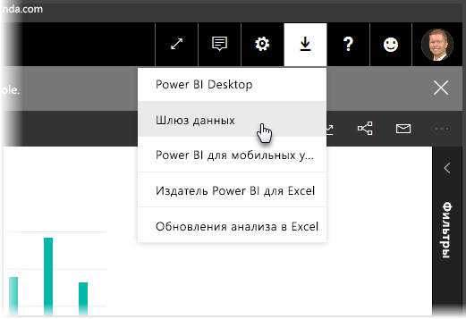
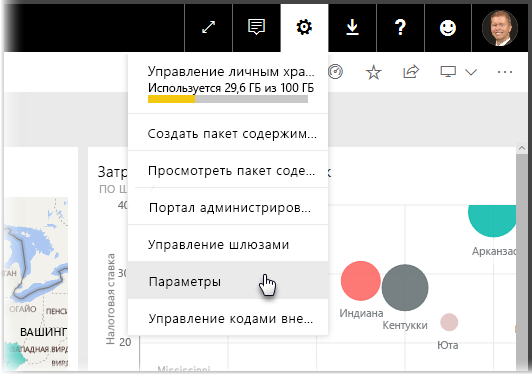
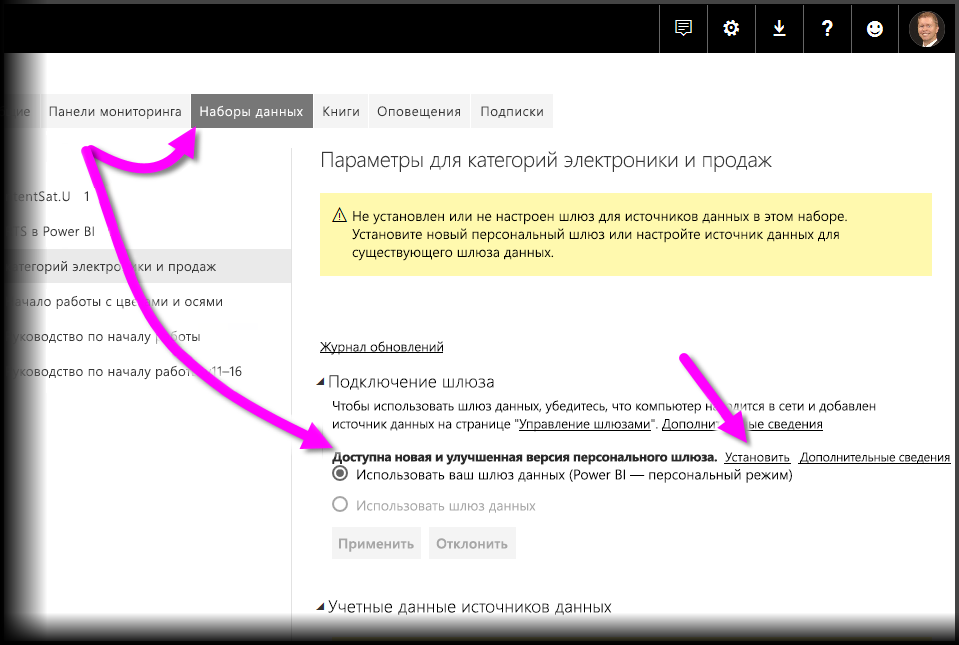
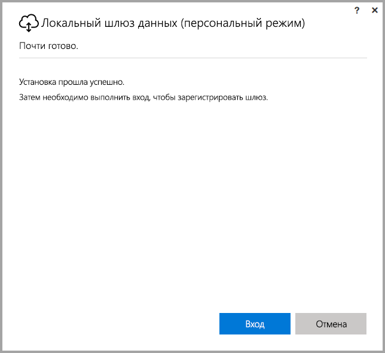
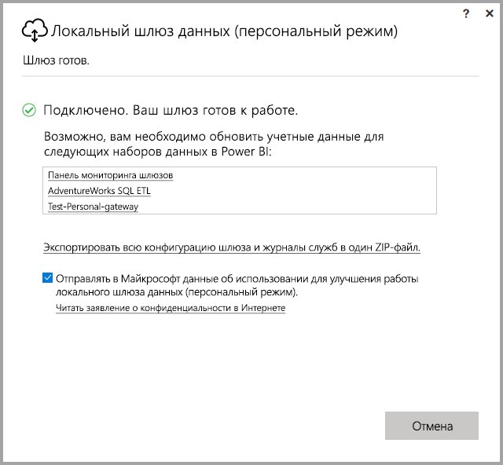

# <a name="on-premises-data-gateway-personal-mode"></a>Локальный шлюз данных (персональный режим)
Вы можете использовать локальные источники данных и создавать отчеты и панели мониторинга Power BI с помощью шлюза. **Шлюз** — это программное обеспечение, облегчающее доступ к данным, которые хранятся в частной локальной сети для последующего использования их в веб-службах, таких как **Power BI**. **Локальный шлюз данных (персональный режим)** — это недавно выпущенное обновление для шлюза Power BI, которое позволяет пользователям установить шлюз на своем компьютере и получить доступ к локальным данным.


> [!NOTE]
> **Локальный шлюз данных (персональный режим)** заменяет поддерживаемую ранее версию личного шлюза, который называется **Power BI Gateway - Personal**. Предыдущая версия личного шлюза будет работать только до 31 июля 2017 г. Ознакомьтесь с указанными ниже разделами, чтобы узнать, как получить новую версию.
> 
> 

## <a name="features-of-the-on-premises-data-gateway-personal-mode"></a>Функции локального шлюза данных (персональный режим)
С выпуском **локального шлюза данных (персональный режим)** становится доступной коллекция функций и улучшений. Внедрение предыдущей версии личного шлюза (который называется **Power BI Personal Gateway**) накладывало некоторые ограничения. Как и для других продуктов Power BI, мы проанализировали потребности и запросы клиентов, а также сведения о том, как они используют продукт. В результате **локальный шлюз данных (персональный режим)** был полностью переработан и теперь содержит следующие функции и улучшения:

* **Повышенная надежность** — из-за улучшения кода и структурного программного обеспечения новая версия личного шлюза имеет более высокую надежность, чем предыдущая.
* **Усовершенствованная расширяемость** — в рамках улучшения структурного программного обеспечения дополнительные функции можно легко добавить в личный шлюз, когда они станут доступными.
* **Удаление личного шлюза из службы Power BI** — в новой версии вы сможете удалить личный шлюз из **службы Power BI**.
* **Конфигурация и журналы служб** — в новой версии вы легко сможете экспортировать конфигурацию и журналы служб в ZIP-файл одним щелчком.

## <a name="installing-on-premises-data-gateway-personal-mode"></a>Установка локального шлюза данных (персональный режим)
Чтобы установить **локальный шлюз данных (персональный режим)**, не устанавливая предыдущую версию шлюза, выберите значок шестеренки в **службе Power BI**, а затем — **Data Gateway**.



Вы также можете скачать шлюз из [этого расположения](https://go.microsoft.com/fwlink/?LinkId=820925&clcid=0x409). Выполните действия по установке, и так как процесс установки позволяет установить любую версию шлюза (стандартный шлюз, который можно совместно использовать с другими пользователями, или шлюз в персональном режиме), обязательно выберите **On-premises data gateway (personal mode)** (Локальный шлюз данных (персональный режим)), когда будет предложено выбрать версию шлюза для установки.

### <a name="updating-from-the-previous-personal-gateway"></a>Обновление предыдущей версии личного шлюза
Если у вас установлен шлюз **Power BI Personal Gateway**, вам будет предложено установить новую улучшенную версию личного шлюза при открытии **наборов данных** в разделе **Параметры** **службы Power BI**.



Выберите набор данных, а затем — **Подключение шлюза**, чтобы получить уведомление, что новая улучшенная версия личного шлюза доступна. После этого выберите **Установить**.



> [!NOTE]
> Если вы используете предыдущую версию **Power BI Gateway — Personal** как процесс с повышенными правами, убедитесь, что вы также запускаете процесс установки нового шлюза с повышенными правами, чтобы учетные данные набора данных можно было обновить автоматически. В противном случае вам придется обновить их вручную.
> 
> 

Завершите процесс обновления, после чего вы увидите, что установка успешно завершена. Не закрывайте окно, необходимо выполнить еще одно действие.



Вот что необходимо сделать. После установки нового личного шлюза (последний снимок экрана установки по прежнему отображается) войдите в **службу Power BI** и дождитесь, пока шлюз будет готов к работе, как показано на следующем рисунке.



Если вы обновили личный шлюз на том же компьютере, на котором была установлена предыдущая версия шлюза, ваши учетные данные будут обновлены автоматически и все действия обновления будут проходить через новый шлюз. Если предыдущая версия шлюза была установлена на другом компьютере, вам будет предложено обновить учетные данные для определенных наборов данных. На указанном выше изображении обратите внимание на список наборов данных в окне. В списке будут показаны наборы данных, для которых необходимо обновить учетные данные. Каждый указанный набор данных содержит прямую ссылку. Просто щелкните эту ссылку, чтобы с легкостью обновить учетные данные.

Это практически все. Если у вас установлен новый шлюз, вам больше не понадобится использовать его предыдущую версию, поэтому ее необходимо удалить. Для этого найдите шлюз **Power BI Personal Gateway** на компьютере, а затем удалите его.

### <a name="determining-which-version-of-the-personal-gateway-you-have-installed"></a>Определение установленной версии личного шлюза
Чтобы определить, какая версия личного шлюза сейчас установлена, сделайте следующее:

* Предыдущая версия личного шлюза называется **Power BI Personal Gateway** и использует значок Power BI в диалоговом окне установки.
* Новая версия личного шлюза называется **Локальный шлюз данных (персональный режим)**. В ней используется значок шлюза (облако со стрелкой вверх и вниз в нижней части).

Вы можете выбрать **Установка и удаление программ**, чтобы просмотреть, появился ли шлюз **Power BI Personal Gateway** в списке программ, и если да, у вас установлена предыдущая версия шлюза.

## <a name="using-fast-combine-with-the-personal-gateway"></a>Использование функции быстрого объединения с личным шлюзом
Если вы использовали **быстрое объединение** с предыдущей версией шлюза, выполните указанные ниже действия, чтобы снова включить функцию **быстрого объединения** для работы с **локальным шлюзом данных (персональный режим)**.

1. Используйте проводник, чтобы открыть следующий файл:
   
   ```
   %localappdata%\Microsoft\On-premises data gateway (personal mode)\Microsoft.PowerBI.DataMovement.Pipeline.GatewayCore.dll.config
   ```
2. В нижней части файла добавьте следующий текст:
   
       ```
       <setting name="EnableFastCombine" serializeAs="String">```
       <value>true</value>
       </setting>
       ```
3. После этого параметры вступят в силу примерно через 1 минуту. Чтобы проверить, работают ли они правильно, выполните обновление по требованию в **службе Power BI**, чтобы убедиться, что функция **быстрого объединения** включена.

## <a name="limitations-and-considerations"></a>Рекомендации и ограничения
При работе с **локальным шлюзом данных (персональный режим)** следует помнить о ряде моментов, которые представлены ниже.

* Если вы используете **Windows Hello** или ПИН-код для входа в Windows, может возникнуть следующая ошибка: 
  * *Выбранная учетная запись пользователя не соответствует требованиям приложения. Используйте другую учетную запись.*
  * Чтобы устранить ошибку, выберите *Использовать другую учетную запись* и войдите снова. 

Следующие источники данных сейчас не поддерживаются для **локального шлюза данных (персональный режим)**:

* ADO.NET 
* CurrentWorkbook
* FTP
* HDFS
* SAP BusinessObjects         
* Spark;

Поддержку Spark планируется реализовать во второй половине календарного 2017 года.

## <a name="frequently-asked-questions-faq"></a>Часто задаваемые вопросы
* Можно ли запустить **локальный шлюз данных (персональный режим)** параллельно с **локальным шлюзом данных** (ранее известным как корпоративный шлюз)?
  
  * **Ответ.** Да, в новой версии оба шлюза могут быть запущены одновременно.
* Можно ли запустить **локальный шлюз данных (персональный режим)** в качестве службы?
  
  * **Ответ.** Нет. **Локальный шлюз данных (персональный режим)** можно запустить только как приложение. Если требуется запустить шлюз в качестве службы и/или в режиме администратора, вам необходимо будет учитывать [**локальный шлюз данных**](service-gateway-onprem.md) (ранее известный как корпоративный шлюз).
* Как часто обновляется **локальный шлюз данных (персональный режим)**?
  
  * **Ответ.** Личный шлюз планируется обновлять каждый месяц.
* Почему отображается сообщение о необходимости обновить учетные данные?
  
  * **Ответ.** Это сообщение может отобразиться по нескольким причинам. Чаще всего это связано с тем, что вы повторно установили **локальный шлюз данных (персональный режим)** и шлюз **Power BI Personal** на разных компьютерах. Кроме того, возможно, возникла системная ошибка или ошибка в источнике данных, и Power BI не удалось выполнить проверку подключения или время ожидания подключения истекло. Чтобы обновить учетные данные в **службе Power BI**, щелкните **значок шестеренки**, выберите **Параметры**, а затем **Наборы данных**, после чего выберите соответствующий набор данных и щелкните *Обновить учетные данные*.
* Сколько времени предыдущая версия личного шлюза будет не в сети во время обновления?
  
  * **Ответ.** Обновление личного шлюза займет несколько минут. 
* Что произойдет, если я не установлю новую версию личного шлюза до 31 июля 2017 г.?
  
  * **Ответ.** Вы не сможете обновлять отчеты с помощью текущего шлюза. Единственный способ настроить новое расписание обновления — это установить и настроить новый шлюз.
* Я использую сценарий R. Он поддерживается?
  
  * **Ответ.** Мы планируем добавить поддержку сценариев R в ближайшее время.
* Почему не отображается сообщение об обновлении шлюза в **службе Power BI**?
  
  * **Ответ.** Скорее всего, у вас есть один или несколько наборов данных с источником данных, который сейчас не поддерживается.

## <a name="next-steps"></a>Дальнейшие действия
[Настройка параметров прокси-сервера для локального шлюза данных](service-gateway-proxy.md)  
Появились дополнительные вопросы? [Ответы на них см. в сообществе Power BI.](http://community.powerbi.com/)

