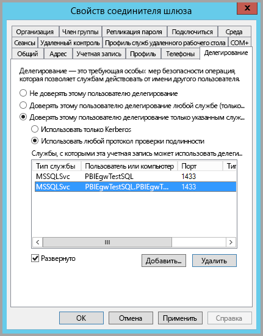
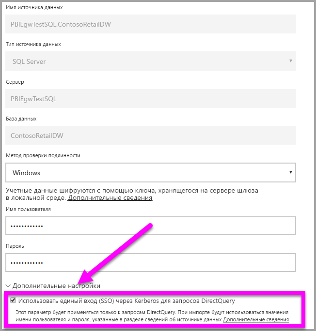
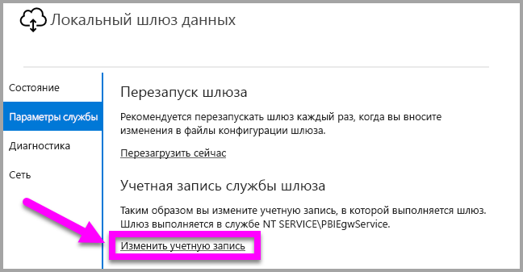
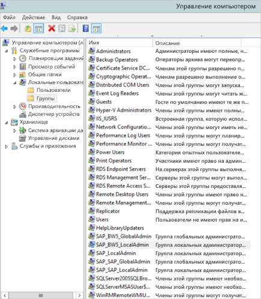
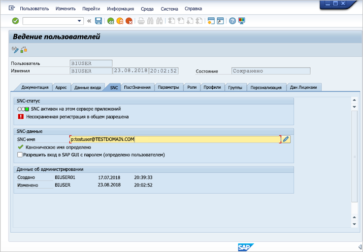
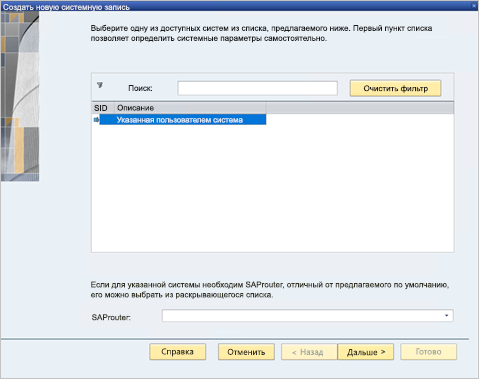
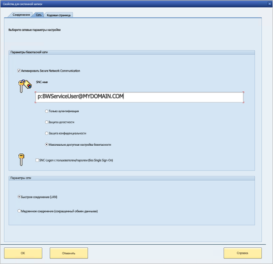
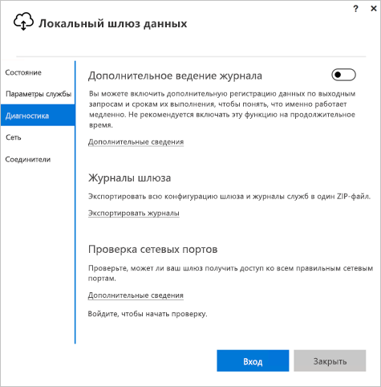

# <a name="use-kerberos-for-single-sign-on-sso-from-power-bi-to-on-premises-data-sources"></a>Использование Kerberos для единого входа из Power BI в локальные источники данных

Используйте [ограниченное делегирование Kerberos](https://technet.microsoft.com/library/jj553400.aspx), чтобы включить простой единый вход. Включение единого входа позволяет отчетам и панелям мониторинга Power BI легко обновлять данные из локальных источников.

## <a name="supported-data-sources"></a>Поддерживаемые источники данных

В настоящее время поддерживаются следующие источники данных:

* SQL Server
* SAP HANA
* Teradata
* Spark;

Мы также поддерживаем SAP HANA с [языком разметки заявлений системы безопасности (SAML)](service-gateway-sso-saml.md).

### <a name="sap-hana"></a>SAP HANA

Чтобы включить единый вход для SAP HANA, сначала выполните следующие действия:

* Убедитесь, что для сервера SAP HANA используется минимально допустимая версия, которая зависит от уровня платформы сервера SAP HANA:
  * [HANA 2 SPS 01 Rev 012.03](https://launchpad.support.sap.com/#/notes/2557386)
  * [HANA 2 SPS 02 Rev 22](https://launchpad.support.sap.com/#/notes/2547324)
  * [HANA 1 SP 12 Rev 122.13](https://launchpad.support.sap.com/#/notes/2528439)
* На компьютере шлюза установите последнюю версию драйвера ODBC для HANA от SAP.  Минимальная версия драйвера ODBC для HANA — 2.00.020.00, выпущенная в августе 2017 г.

См. дополнительные сведения о [настройке единого входа для SAP HANA с помощью Kerberos](https://help.sap.com/viewer/b3ee5778bc2e4a089d3299b82ec762a7/2.0.03/en-US/1885fad82df943c2a1974f5da0eed66d.html) в руководстве по безопасности SAP HANA. На этой странице приведены ссылки, в частности ссылка SAP Note 1837331 – HOWTO HANA DBSSO Kerberos/Active Directory].

## <a name="preparing-for-kerberos-constrained-delegation"></a>Подготовка к ограниченному делегированию Kerberos

Чтобы ограниченное делегирование Kerberos правильно работало, необходимо настроить несколько элементов, в том числе *имена субъектов-служб* и параметры делегирования в учетных записях служб.

### <a name="prerequisite-1-install--configure-the-on-premises-data-gateway"></a>Предварительное требование 1. Установка и настройка локального шлюза данных

Этот выпуск локального шлюза данных поддерживает обновление на месте, а также подхват параметров из существующих шлюзов.

### <a name="prerequisite-2-run-the-gateway-windows-service-as-a-domain-account"></a>Предварительное требование 2. Запуск службы Windows для шлюза в качестве учетной записи домена

В стандартной установке шлюз выполняет роль учетной записи службы для локального компьютера (например, *NT Service\PBIEgwService*). Пример представлен на следующем изображении:


Чтобы включить **ограниченное делегирование Kerberos**, шлюз необходимо запускать как учетную запись домена, если служба Azure AD уже синхронизирована с локальным каталогом Active Directory (с помощью Azure AD DirSync или Connect). Если вам нужно переключиться на учетную запись домена, см. раздел [Переключение шлюза на учетную запись домена](#switching-the-gateway-to-a-domain-account) далее в этой статье.

> [!NOTE]
> Если настроены Azure AD DirSync или Connect и учетные записи синхронизированы, службе шлюза не требуется выполнять поиск в локальной службе AD на этапе выполнения. Для службы шлюза также можно использовать идентификатор безопасности локальной службы (вместо учетной записи домена). Этапы настройки ограниченного делегирования Kerberos, описанные в этой статье, будут аналогичными для такой конфигурации (они просто применяются к идентификатору безопасности службы, а не учетной записи домена).

### <a name="prerequisite-3-have-domain-admin-rights-to-configure-spns-setspn-and-kerberos-constrained-delegation-settings"></a>Предварительное требование 3. Получение прав администратора домена для настройки параметров ограниченного делегирования Kerberos и имен субъектов-служб (SetSPN)

Технически администратор домена может на временной или постоянной основе разрешить любому пользователю настраивать делегирование Kerberos и имена субъектов-служб. Но это не рекомендуется делать для пользователей без прав администратора. В следующем разделе подробно описаны этапы настройки для выполнения **предварительного требования 3**.

## <a name="configuring-kerberos-constrained-delegation-for-the-gateway-and-data-source"></a>Настройка ограниченного делегирования Kerberos для шлюза и источника данных

Чтобы правильно настроить систему, необходимо настроить или проверить два следующих элемента:

1. При необходимости настройте имя субъекта-службы для учетной записи домена службы шлюза.

2. Настройте параметры делегирования для учетной записи домена в службе шлюза.

Обратите внимание, что эти шаги может выполнять только администратор домена.

В следующих разделах описаны действия по настройке.

### <a name="configure-an-spn-for-the-gateway-service-account"></a>Настройка имени субъекта-службы для учетной записи службы шлюза

Сначала определите, создано ли имя субъекта-службы для учетной записи домена, используемой в качестве учетной записи службы шлюза. Для этого выполните следующие действия:

1. Войдите как администратор домена и запустите средство **Пользователи и компьютеры Active Directory**.

2. Щелкните правой кнопкой мыши домен, выберите **Найти** и введите имя учетной записи службы шлюза.

3. В результатах поиска щелкните правой кнопкой мыши учетную запись службы шлюза и выберите **Свойства**.

4. Если в диалоговом окне **Свойства** отображается вкладка **Делегирование**, значит, имя субъекта-службы уже создано и вы можете перейти к следующему подразделу для настройки параметров делегирования.

    Если в диалоговом окне **Свойства** не отображается вкладка **Делегирование**, можно создать имя субъекта-службы для учетной записи. После этого будет добавлена вкладка **Делегирование**. Это самый простой способ настройки параметров делегирования. Имя субъекта-службы можно создать с помощью [средства setspn](https://technet.microsoft.com/library/cc731241.aspx), доступного в Windows. Для создания имени субъекта-службы требуются права администратора домена.

    Предположим, что учетная запись службы шлюза — PBIEgwTest\GatewaySvc, а компьютер, на котором работает шлюз, называется **Machine1**. Чтобы задать имя субъекта-службы для учетной записи службы шлюза для этого компьютера, выполните следующую команду:

    

    После этого можно перейти к настройке параметров делегирования.

### <a name="configure-delegation-settings-on-the-gateway-service-account"></a>Настройка параметров делегирования в учетной записи домена службы шлюза

Второе требование конфигурации — это параметры делегирования в учетной записи службы шлюза. Для этого можно использовать разные средства. В этом примере мы будем использовать средство **Пользователи и компьютеры Active Directory**, которое является оснасткой консоли управления (MMC). Это средство используется для администрирования и публикации данных в каталоге. По умолчанию оно доступно в контроллерах домена. На других компьютерах можно использовать средство **установки компонентов Windows**.

Необходимо настроить **ограниченное делегирование Kerberos** с транзитом протокола. При использовании ограниченного делегирования необходимо явно указать службы, для которых настраивается делегирование. Например, только SQL Server либо сервер SAP HANA будет принимать вызовы делегирования от учетной записи службы шлюза.

В этом разделе предполагается, что вы уже настроили имена субъектов-служб для ваших базовых источников данных (таких как SQL Server, SAP HANA, Teradata, Spark и т. д.). Чтобы узнать, как настроить имена субъектов-служб сервера источника данных, см. техническую документацию соответствующего сервера базы данных. Также см. запись блога, в которой объясняется, [*какое имя субъекта-службы требуется вашему приложению*](https://blogs.msdn.microsoft.com/psssql/2010/06/23/my-kerberos-checklist/).

В следующих шагах предполагается использование локальной среды с двумя компьютерами: компьютер шлюза и сервер баз данных с SQL Server. Для примера мы также предположим следующие параметры и имена:

* Имя компьютера шлюза: **PBIEgwTestGW**.
* Учетная запись службы шлюза: **PBIEgwTest\GatewaySvc** (отображаемое имя учетной записи: соединитель шлюза).
* Имя компьютера источника данных SQL Server: **PBIEgwTestSQL**.
* Учетная запись для службы источника данных SQL Server: **PBIEgwTest\SQLService**.

Учитывая эти примеры имен и параметров, этапы настройки будут следующими:

1. Войдите как администратор домена и запустите средство **Пользователи и компьютеры Active Directory**.

2. Щелкните правой кнопкой мыши учетную запись службы шлюза (**PBIEgwTest\GatewaySvc**) и выберите **Свойства**.

3. Выберите вкладку **Делегирование**.

4. Выберите параметр **Доверять компьютеру делегирование указанных служб**.

5. Выберите **Использовать любой протокол проверки подлинности**.

6. В разделе **Службы, с которыми эта учетная запись может использовать делегированные учетные данные:** нажмите кнопку **Добавить**.

7. В открывшемся диалоговом окне выберите **Пользователи или компьютеры**.

8. Введите данные учетной записи для службы базы данных SQL Server (**PBIEgwTest\SQLService**) и нажмите кнопку **ОК**.

9. Выберите имя субъекта-службы, созданное для сервера базы данных. В этом примере имя субъекта-службы будет начинаться с **MSSQLSvc**. Если вы добавили полное доменное имя и имя субъекта-службы NetBIOS для службы базы данных, выберите оба имени. Вы можете увидеть только одно имя.

10. Нажмите кнопку **ОК**. Вы должны увидеть имя субъекта-службы в списке.

11. При необходимости выберите **Развернуто**, чтобы отображалось имя NetBIOS и полное доменное имя субъекта-службы.

12. Если установлен флажок **Развернуто**, диалоговое окно должно выглядеть так: Нажмите кнопку **ОК**.

    

Теперь на компьютере со службой шлюза (**PBIEgwTestGW** в нашем примере), назначьте учетной записи службы шлюза локальную политику "Имитация клиента после проверки подлинности". Это можно выполнить или проверить с помощью редактора локальных групповых политик (**gpedit**).

1. На компьютере шлюза выполните команду *gpedit.msc*.

1. Последовательно выберите элементы **Политика локального компьютера > Конфигурация компьютера > Параметры Windows > Параметры безопасности > Локальные политики > Назначение прав пользователя**, как показано на следующем изображении:

    

1. В списке политик в разделе **Назначение прав пользователя** выберите **Имитация клиента после проверки подлинности**.

    

    Щелкнув правой кнопкой мыши, откройте **Свойства** параметра **Имитация клиента после проверки подлинности** и проверьте список учетных записей. В нем должна быть указана учетная запись службы шлюза (**PBIEgwTest\GatewaySvc**).

1. В списке политик в разделе **Назначение прав пользователя** выберите **Act as part of the operating system (SeTcbPrivilege)** (Работа в режиме операционной системы (SeTcbPrivilege)). Убедитесь, что учетная запись службы шлюза также входит в список учетных записей.

18. Перезапустите процесс службы **локального шлюза данных**.

Если вы используете SAP HANA, мы рекомендуем следующие дополнительные действия, которые позволят обеспечить небольшое повышение производительности.

1. В каталоге установки шлюза найдите и откройте этот файл конфигурации: *Microsoft.PowerBI.DataMovement.Pipeline.GatewayCore.dll.config*.

1. Найдите свойство *FullDomainResolutionEnabled* и измените его значение на *True*.

    ```xml
    <setting name=" FullDomainResolutionEnabled " serializeAs="String">
          <value>True</value>
    </setting>
    ```

## <a name="running-a-power-bi-report"></a>Запуск отчета Power BI

Выполнив все инструкции, приведенные ранее в этой статье, на странице **Управление шлюза** в Power BI можно настроить источник данных. Затем можно включить единый вход в подразделе **Дополнительные параметры**, а затем публиковать отчеты и наборы данных, которые привязаны к источнику данных



Эта конфигурация применима для большинства случаев. Но при использовании Kerberos в разных средах могут применяться разные конфигурации. Если отчет по-прежнему не загружается, обратитесь к администратору домена для дальнейшего изучения проблемы.

## <a name="switching-the-gateway-to-a-domain-account"></a>Переключение шлюза на учетную запись домена

Ранее в этой статье мы упоминали о переключении шлюза с учетной записи локальной службы на учетную запись домена с помощью пользовательского интерфейса **локального шлюза данных**. Ниже объясняется, как это сделать.

1. Запустите средство настройки **локального шлюза данных**.

   

2. На главной странице нажмите кнопку **Войти** и войдите в учетную запись Power BI.

3. После входа выберите вкладку **Параметры службы**.

4. Выберите команду **Изменить учетную запись**, чтобы запустить интерактивное пошаговое руководство, как показано на следующем изображении:

   

## <a name="configuring-sap-bw-for-sso"></a>Настройка единого входа для SAP BW

Теперь, когда вы знаете, как Kerberos работает через шлюз, можно настроить единый вход для SAP Business Warehouse (SAP BW). В следующих шагах предполагается, что вы уже [подготовили ограниченное делегирование Kerberos](#preparing-for-kerberos-constrained-delegation), как описано ранее в этой статье.

### <a name="install-sap-bw-components"></a>Установите компоненты SAP BW

Если вы еще не настроили SAP gsskrb5 и gx64krb5 на клиентских компьютерах и сервере приложений SAP BW, выполните шаги в этом разделе. Если вы уже выполнили установку (создали учетную запись пользователя службы для сервера BW и сопоставили с ним имя субъекта-службы), можно пропустить некоторые части этого раздела.

1. Скачайте gsskrb5/gx64krb5 из статьи [Примечание SAP 2115486](https://launchpad.support.sap.com/) (требуется s-пользователь SAP). Убедитесь в наличии библиотек gsskrb5.dll и gx64krb5.dll версии не ниже 1.0.11.x.

1. Поместите библиотеку в расположение на компьютере шлюза, доступное с вашего экземпляра шлюза (а также для графического интерфейса SAP GUI, если вы хотите протестировать подключение единого входа с помощью графического интерфейса SAP GUI SAP или Logon).

1. Поместите другую копию на серверном компьютере BW в расположении, доступном для сервера BW.

1. На компьютерах клиента и сервера задайте переменные среды SNC\_LIB и SNC\_LIB\_64 для указания расположения gsskrb5.dll и gx64krb5.dll соответственно.

### <a name="complete-the-gateway-configuration-for-sap-bw"></a>Проведите настройку шлюза для SAP BW

В дополнение к конфигурации шлюза, с которой вы уже знакомы, есть несколько дополнительных действий, связанных с SAP BW. Раздел документации [**Настройка параметров делегирования в учетной записи службы шлюза**](#configure-delegation-settings-on-the-gateway-service-account) предполагает, что вы уже настроили имена субъектов-служб для ваших базовых источников данных. Чтобы провести настройку шлюза для SAP BW, выполните следующие действия.

1. На контроллере домена Active Directory создайте пользователя службы (изначально это обычный пользователь Active Directory) для сервера приложений BW в среде Active Directory. Назначьте ему имя SPN.

    Назначенное SPN **должно** начинаться с SAP/. Что следует за SAP/, выбираете вы; один из вариантов — имя пользователя службы сервера BW. Например, если вы создаете BWServiceUser@\<DOMAIN\> в качестве пользователя службы, можно использовать имя субъекта-службы SAP/BWServiceUser. Один из способов установить сопоставление имени субъекта-службы — команда setspn. Например, чтобы задать имя субъекта-службы для пользователя службы, которого мы только что создали, следовало бы выполнить следующую команду из окна командной строки на компьютере контроллера домена: `setspn -s SAP/ BWServiceUser DOMAIN\ BWServiceUser`.

1. Предоставьте пользователю службы доступ к экземпляру сервера приложений BW:

    1. На сервере BW добавьте пользователя службы в группу локальных администраторов сервера BW: откройте программу "Управление компьютером" и дважды щелкните группу локальных администраторов вашего сервера.

        

    1. Дважды щелкните группу локальных администраторов, а затем выберите команду **Добавить** для добавления пользователя службы BW в группу. Используйте кнопку **Проверить имена**, чтобы убедиться, правильно ли вы ввели имя. Нажмите кнопку **ОК**.

1. Задайте пользователя службы сервера BW в качестве пользователя, который запускает службу сервера BW на компьютере сервера BW.

    1. Откройте око "Выполнить" и введите "Services.msc". Найдите службу, соответствующую экземпляру сервера приложений BW. Щелкните ее правой кнопкой мыши и выберите **Свойства**.

        

    1. Переключитесь на вкладку **Вход** и измените пользователя на пользователя службы BW, как указано выше. Введите пароль пользователя и нажмите **ОК**.

1. Войдите на сервер через графический пользовательский интерфейс SAP GUI / Logon и задайте следующие параметры профиля с помощью транзакции RZ10:

    1. Задайте значение параметра профиля snc/identity/as как p:\<имя пользователя службы BW, только что созданного вами\>, например p:BWServiceUser@MYDOMAIN.COM. Обратите внимание на символы "p:", которые предшествуют имени субъекта-пользователя службы.

    1. Задайте параметр профиля snc/gssapi\_lib как \<путь к gsskrb5.dll или gx64krb5.dll на сервере (библиотека, которую вы будете использовать, зависит от разрядности операционной системы)\>. Не забудьте поместить библиотеку в расположение, доступное серверу приложений BW.

    1. Также задайте следующие дополнительные параметры профиля, изменив значения по необходимости. Обратите внимание, что последние пять параметров дают клиентам возможность подключения к серверу BW через SAP Logon / GUI без необходимости настройки SNC.

        | **Параметр** | **Значение** |
        | --- | --- |
        | snc/data\_protection/max | 3 |
        | snc/data\_protection/min | 1 |
        | snc/data\_protection/use | 9 |
        | snc/accept\_insecure\_cpic | 1 |
        | snc/accept\_insecure\_gui | 1 |
        | snc/accept\_insecure\_r3int\_rfc | 1 |
        | snc/accept\_insecure\_rfc | 1 |
        | snc/permit\_insecure\_start | 1 |

    1. Установите свойство snc/enable равным 1.

1. Задав эти параметры профиля, откройте консоль управления SAP на сервере и перезапустите экземпляр BW. Если сервер не запускается, убедитесь, что вы правильно задали параметры профиля. Дополнительные сведения о настройке параметров профиля см. в [документации по SAP](https://help.sap.com/saphelp_nw70ehp1/helpdata/en/e6/56f466e99a11d1a5b00000e835363f/frameset.htm). Можно также обратиться к нашим сведениям об устранении неполадок далее в этом разделе, если у вас возникли проблемы.

### <a name="map-azure-ad-users-to-sap-bw-users"></a>Сопоставьте пользователей Azure AD и пользователей SAP BW

Сопоставьте пользователя Active Directory с пользователем сервера приложений SAP BW и проверьте подключение единого входа в SAP GUI / Logon.

1. Войдите на сервер BW с помощью графического интерфейса SAP GUI / Logon. Выполните транзакцию SU01.

1. В поле **Пользователь** введите имя пользователя BW, для которого вы хотите включить единый вход (на снимке экрана выше мы задаем разрешения для BIUSER). Выберите значок **Изменить** рядом с левой верхней частью окна входа в систему SAP (изображение пера).

    

1. Выберите вкладку **SNC**. В поле ввода имени SNC введите p:\<имя пользователя active directory\>@\<домен\>. Обратите внимание на обязательные символы "p:", которые должны предшествовать имени субъекта-пользователя Active Directory. Учетная запись пользователя Active Directory, указанный вами, должна принадлежать лицу или организации, у которых вы хотите включить единый вход для доступа к серверу приложений BW. Например, если вы хотите включить единый вход для пользователя [testuser@TESTDOMAIN.COM](mailto:testuser@TESTDOMAIN.COM), введите p:testuser@TESTDOMAIN.COM.

    

1. Выберите значок сохранения (гибкий диск в левом верхнем углу экрана).

### <a name="verify-sign-in-using-sso"></a>Проверьте единый вход в систему

Убедитесь, что можно войти на сервер через SAP Logon / SAP GUI с помощью единого входа от имени пользователя Active Directory, для которого вы только что включили доступ с единым входом.

1. Войдите в систему на компьютере, на котором установлен SAP Logon, *от имени пользователя Active Directory, для которого вы только что включили доступ с единым входом*, и запустите SAP GUI/Logon. Создайте новое подключение.

1. В окне **Создать новую системную запись** выберите пункт **Указанная пользователем система** и нажмите кнопку **Далее**.

    

1. Введите соответствующие сведения на следующей странице, включая сервер приложений, номер экземпляра и идентификатор системы, а затем нажмите кнопку **Готово**.

1. Щелкните правой кнопкой мыши новое подключение и выберите **Свойства**. Откройте вкладку **Сеть**. В окне **Имя SNC** введите p:\<имя субъекта-пользователя службы BW\>, например p:BWServiceUser@MYDOMAIN.COM.

    

1. Нажмите кнопку **ОК**. Теперь дважды щелкните только что созданное подключение для проверки единого входа в службу. Если подключение будет установлено успешно, переходите к следующему шагу. В противном случае просмотрите шаги ранее в этом документе, чтобы убедиться в том, что они были завершены правильно, или обратитесь к разделу по устранению неполадок. Обратите внимание, что если не удается подключиться к серверу BW с помощью единого входа в этом контексте, вы не сможете подключиться к серверу BW с помощью единого входа в контексте шлюза.

### <a name="troubleshoot-installation-and-connections"></a>Устранение неполадок установки и подключений

Если возникнут проблемы, выполните следующие действия для устранения неполадок установки gsskrb5 и подключения единого входа из SAP GUI / Logon.

1. Просмотр журналов сервера (...work\dev\_w0 на сервере) может быть полезен для устранения ошибок, которые возникают на шагах установки gsskrb5, особенно в том случае, если сервер BW не запускается после изменения параметров профиля.

1. Если вам не удается запустить службу BW из-за ошибки входа в систему, вы могли указать неправильный пароль при вводе имени пользователя запуска от имени для BW. Проверьте пароль, войдя на компьютер в среде Active Directory в качестве пользователя службы BW.

1. Если возникают сообщения о том, что учетные данные SQL не позволяют запустить сервер, убедитесь, что вы предоставили пользователю службы доступ к базе данных BW.

1. Сообщение "(GSS-API) указанная цель неизвестна или недоступна": обычно это означает, что у вас указано неверное имя SNC. Используйте в клиентском приложении только "p:", но не "p:CN =" или что-нибудь еще, отличное от имени субъекта-пользователя службы.

1. Сообщение "(GSS-API) указано недопустимое имя": убедитесь, что символы "p:" есть в начале параметра профиля удостоверения SNC на сервере.

1. Сообщение "(Ошибка SNC) указанный модуль не найден": обычно это происходит, если поместить gsskrb5.dll или gx64krb5.dll где-нибудь, где для доступа требуются повышенные права (права администратора).

### <a name="add-registry-entries"></a>Добавление записей реестра

Добавьте необходимые записи в реестр компьютера, на котором установлен шлюз. Затем укажите требуемые параметры конфигурации шлюза.

1. Выполните следующие команды в окне командной строки:

    1. REG ADD HKLM\SOFTWARE\Wow6432Node\SAP\gsskrb5 /v ForceIniCredOK /t REG\_DWORD /d 1 /f

    1. REG ADD HKLM\SOFTWARE\SAP\gsskrb5 /v ForceIniCredOK /t REG\_DWORD /d 1 /f

1. Откройте главный файл конфигурации шлюза, Microsoft.PowerBI.DataMovement.Pipeline.GatewayCore.dll. По умолчанию этот файл находится в каталоге C:\Program Files\On-premises data gateway.

1. Задайте **ADUserNameLookupProperty** как msDS-cloudExtensionAttribute1, а **ADUserNameReplacementProperty** как SAMAccountName. Сохраните файл конфигурации.

1. Перезапустите службу шлюза на вкладке **Службы** диспетчера задач (щелкните ее правой кнопкой мыши и выберите команду **Перезапустить**).

    

### <a name="set-azure-ad-properties"></a>Задайте свойства Azure AD

Укажите в свойстве msDS-cloudExtensionAttribute1 пользователя Active Directory, которой был сопоставлен пользователю BW на шаге сопоставления пользователей Azure AD и SAP BW, пользователя службы Power BI, для которого вы хотите включить единый вход Kerberos. Один из способов установить свойство msDS-cloudExtensionAttribute1 — с помощью оснастки Active Directory "Пользователи и компьютеры" (можно также использовать другие методы).

1. Войдите на компьютер контроллера домена с правами администратора.

1. Откройте папку **Пользователи** в окне оснастки и дважды щелкните учетную запись пользователя Active Directory, сопоставленного с пользователем BW.

1. Выберите вкладку **Редактор атрибутов**. Если вы не видите ее, найдите инструкции о том, как ее включить, или используйте другой метод, чтобы задать свойство msDS-cloudExtensionAttribute1. Выберите один из атрибутов и затем используйте клавишу M для перехода к свойствам Active Directory, которые начинаются с этой буквы. Найдите свойство msDS-cloudExtensionAttribute1 и дважды щелкните его. Задайте в нем имя пользователя, которое вы используете для входа в службу Power BI. Нажмите кнопку **ОК**.

    

1. Нажмите кнопку **Применить**. Проверьте, правильно ли установлено значение в столбце.

### <a name="add-a-new-bw-application-server-data-source-to-the-power-bi-service"></a>Добавьте новый источник данных сервера приложений BW в службе Power BI

Добавление источника данных BW на шлюзе: следуйте предыдущим инструкциям этой статьи, касающимся [запуска отчета](#running-a-power-bi-report).

1. Введите в окне настройки источника данных **имя узла** сервера приложений, **номер системы** и **идентификатор клиента**, как и в случае входа на сервер BW из Power BI Desktop. Выберите **проверку подлинности** **Windows**.

1. В поле **Имя партнера SNC** введите значение, хранящееся в параметре профиля сервера snc/identity/as, *добавив SAP/ между p: и остальной частью удостоверения*. Например, если удостоверение snc сервера — p:BWServiceUser@MYDOMAIN.COM, следует ввести p:SAP/BWServiceUser@MYDOMAIN.COM в поле ввода "Имя партнера SNC".

1. В качестве библиотеки SNC выберите SNC\_LIB или SNC\_LIB\_64.

1. В полях **Имя пользователя** и **пароль** задайте имя и пароль пользователя, имеющего разрешение входить на сервер BW с помощью единого входа (пользователя Active Directory, соотнесенного с пользователем BW с помощью транзакции SU01). Эти учетные данные будут использоваться, только если флажок **Использовать единый вход через Kerberos для запросов DirectQuery** *не* установлен.

1. Установите флажок **Использовать единый вход через Kerberos для запросов DirectQuery** и нажмите кнопку **Применить**. Если проверка подключения не была успешной, убедитесь, что предыдущие шаги установки и настройки были выполнены правильно.

### <a name="test-your-setup"></a>Проверьте установку

Опубликуйте для проверки отчет DirectQuery из Power BI Desktop в службе Power BI. Убедитесь, что вы вошли в службу Power BI от имени пользователя, указанного в свойстве msDS-cloudExtensionAttribute1. Если установка выполнена успешно, вы сможете создать отчет на основе опубликованного набора данных в службе Power BI и извлекать данные с помощью визуальных элементов в отчете.

### <a name="troubleshooting-gateway-connectivity-issues"></a>Устранение проблем с подключением шлюза

1. Проверьте журналы шлюза. Откройте приложение конфигурации шлюза, выберите пункт **Диагностика** и команду **Экспортировать журналы**. В конце файла журнала будут указаны последние ошибки.

    

1. Включите трассировку BW и просмотрите созданные файлы журналов. Существует несколько различных типов трассировки BW. Дополнительные сведения см. в документации по SAP.

## <a name="errors-from-an-insufficient-kerberos-configuration"></a>Ошибки из-за неполной конфигурации Kerberos

Если основной сервер базы данных и шлюз неправильно настроены для **ограниченного делегирования Kerberos**, может поступить следующее сообщение об ошибке:


Технические сведения, связанные с сообщением об ошибке (DM_GWPipeline_Gateway_ServerUnreachable), могут выглядеть так:


Эта ошибка возникает из-за того, что шлюз не может правильно олицетворить исходного пользователя, поэтому не удается подключиться к базе данных.

## <a name="next-steps"></a>Дальнейшие действия

Дополнительные сведения о **локальном шлюзе данных** и **DirectQuery** см. в следующих ресурсах:

* [Локальный шлюз данных](service-gateway-onprem.md)
* [Power BI и DirectQuery](desktop-directquery-about.md)
* [Источники данных, поддерживаемые DirectQuery](desktop-directquery-data-sources.md)
* [Использование DirectQuery и SAP Business Warehouse (BW)](desktop-directquery-sap-bw.md)
* [DirectQuery и SAP HANA](desktop-directquery-sap-hana.md)