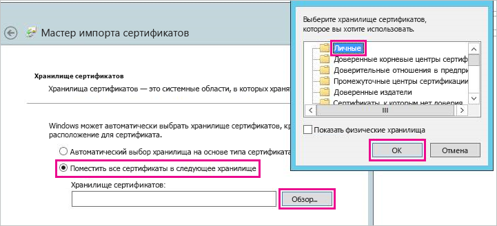
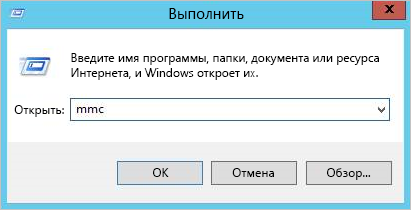
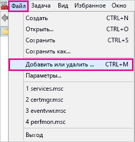

# <a name="use-security-assertion-markup-language-saml-for-single-sign-on-sso-from-power-bi-to-on-premises-data-sources"></a>Используйте SAML для единого входа (SSO) из Power BI в локальные источники данных

Используйте [язык разметки заявлений системы безопасности (SAML)](https://www.onelogin.com/pages/saml), чтобы включить простой единый вход. Включение единого входа позволяет отчетам и панелям мониторинга Power BI легко обновлять данные из локальных источников.

## <a name="supported-data-sources"></a>Поддерживаемые источники данных

Сейчас мы поддерживаем SAP HANA с SAML. Дополнительные сведения об установке и настройке единого входа для SAP HANA с помощью SAML см. в разделе [Единый вход через SAML для платформы бизнес-аналитики в HANA](https://wiki.scn.sap.com/wiki/display/SAPHANA/SAML+SSO+for+BI+Platform+to+HANA) в документации по SAP HANA.

Мы поддерживаем набор дополнительных источников данных с помощью [Kerberos](service-gateway-sso-kerberos.md).

## <a name="configuring-the-gateway-and-data-source"></a>Настройка шлюза и источника данных

Чтобы использовать SAML, сначала вам нужно создать сертификат для поставщика удостоверений SAML, а затем сопоставить с ним удостоверение пользователя Power BI.

1. Создайте сертификат. Убедитесь, что в поле *Общее имя* используется полное доменное имя сервера SAP HANA. Срок действия сертификата — 365 дней.

    ```
    openssl req -newkey rsa:2048 -nodes -keyout samltest.key -x509 -days 365 -out samltest.crt
    ```

1. В SAP HANA Studio щелкните правой кнопкой мыши сервер SAP HANA, а затем перейдите к разделу **Безопасность** > **Открыть консоль безопасности** > **Поставщик удостоверений SAML** > **Криптографическая библиотека OpenSSL**.

1. Выберите команду **Импортировать** , перейдите к файлу samltest.crt и импортируйте его.

    

1. В SAP HANA Studio выберите папку **Безопасность**.

    

1. Разверните раздел **Пользователи**, затем выберите нужного пользователя, с которым необходимо сопоставить пользователя Power BI.

1. Выберите **SAML**, затем команду **Настроить**.

    

1. Выберите поставщик удостоверений, который вы создали на шаге 2. В поле **Внешнее удостоверение** введите имя участника-пользователя Power BI, а затем выберите команду **Добавить**.

    

Теперь, когда у вас есть настроенные сертификат и удостоверение, преобразуйте сертификат в формат PFX и настройте его использование на компьютере шлюза.

1. Преобразуйте сертификат в формат PFX, выполнив следующую команду.

    ```
    openssl pkcs12 -inkey samltest.key -in samltest.crt -export -out samltest.pfx
    ```

1. Скопируйте PFX-файл на компьютер шлюза:

    1. Дважды щелкните samltest.pfx, а затем выберите пункты **Локальный компьютер** > **Далее**.

    1. Введите пароль, а затем нажмите кнопку **Далее**.

    1. Установите переключатель **Разместить все сертификаты в следующем хранилище** и щелкните **Обзор** > **Личные** > **ОК**.

    1. Выберите **Далее**, затем **Готово**.

    

1. Предоставьте учетной записи службы шлюза доступ к закрытому ключу сертификата:

    1. На компьютере шлюза запустите консоль управления (MMC).

        

    1. В меню **Файл** выберите команду **Добавить или удалить оснастку**.

        

    1. Выберите пункты **Сертификаты** > **Добавить**, а затем — **Учетная запись компьютера** > **Далее**.

    1. Выберите пункты **Локальный компьютер** > **Готово** > **ОК**.

    1. Разверните узел **Сертификаты** > **Личные** > **Сертификаты** и найдите сертификат.

    1. Щелкните сертификат правой кнопкой мыши и перейдите к разделу **Все задачи** > **Управление закрытыми ключами**.

        

    1. Добавьте учетную запись службы шлюза в список. По умолчанию учетная запись — это **NT SERVICE\PBIEgwService**. Можно выяснить, какую учетную запись служба шлюза использует для работы, выполнив **services.msc** и найдя **локальную службу шлюза данных**.

        

Наконец, выполните следующие действия для добавления отпечатка сертификата в конфигурацию шлюза.

1. Выполните следующую команду PowerShell, чтобы получить список сертификатов на вашем компьютере.

    ```powershell
    Get-ChildItem -path cert:\LocalMachine\My
    ```
1. Скопируйте отпечаток сертификата, который вы создали.

1. Перейдите в каталог шлюза; значение по умолчанию — C:\Program Files\On-premises data gateway.

1. Откройте файл PowerBI.DataMovement.Pipeline.GatewayCore.dll.config и найдите раздел \*SapHanaSAMLCertThumbprint\*. Вставьте скопированный отпечаток.

1. Перезапустите службу шлюза.

## <a name="running-a-power-bi-report"></a>Запуск отчета Power BI

Теперь вы можете использовать страницу **Управление шлюзом** в Power BI, чтобы настроить источник данных и в списке **Дополнительные параметры** включить функцию единого входа. Затем можно будет публиковать отчеты и наборы данных с привязкой к этому источнику данных.


## <a name="next-steps"></a>Дальнейшие действия

Дополнительные сведения о **локальном шлюзе данных** и **DirectQuery** см. в следующих ресурсах:

* [Локальный шлюз данных](service-gateway-onprem.md)
* [Power BI и DirectQuery](desktop-directquery-about.md)
* [Источники данных, поддерживаемые DirectQuery](desktop-directquery-data-sources.md)
* [Использование DirectQuery и SAP Business Warehouse (BW)](desktop-directquery-sap-bw.md)
* [DirectQuery и SAP HANA](desktop-directquery-sap-hana.md)
