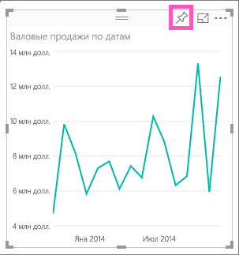
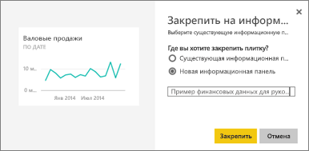

# Приступая к работе с Power BI
В этом руководстве содержатся сведения, которые помогут вам приступить к работе со ***службой Power BI***. Чтобы иметь представление о соответствии службы Power BI другим предложениям Power BI, мы советуем ознакомиться со статьей [Интерактивное обучение Power BI](guided-learning/gettingstarted.yml#step-1).

Вы можете использовать бесплатную версию Power BI или версию Power BI Pro. Чтобы приступить к работе, откройте браузер и введите www.powerbi.com, независимо от того, какую версию вы используете. Если вы уже зарегистрировались, щелкните в правом верхнем углу ссылку **Войти**. Или щелкните ссылку **Sign up free** (Бесплатная регистрация), если вы еще не зарегистрированы в службе Power BI.

Если вам нужна помощь в работе с Power BI Desktop, см. статью [Приступая к работе с Desktop](desktop-getting-started.md). Сведения о мобильном приложении Power BI см. в статье [Приложения Power BI для мобильных устройств](mobile-apps-for-mobile-devices.md).

> [!TIP]
> Предпочитаете бесплатные курсы для самостоятельного обучения? [Запишитесь на наш курс по анализу и визуализации данных на сайте EdX](http://aka.ms/edxpbi).

Посетите наш [список воспроизведения на YouTube](https://www.youtube.com/playlist?list=PL1N57mwBHtN0JFoKSR0n-tBkUJHeMP2cP). Для начала просмотрите вводное видео о службе Power BI:
> 
> <iframe width="560" height="315" src="https://www.youtube.com/embed/B2vd4MQrz4M" frameborder="0" allowfullscreen></iframe>
> 
> 
> 

Microsoft Power BI помогает поддерживать актуальность важных данных.  ***Информационные панели*** службы Power BI позволяют быть в курсе событий в вашей компании.  В панелях мониторинга отображаются ***плитки***, которые можно щелкнуть для дальнейшего изучения данных в ***отчетах***.  Подключитесь к нескольким ***наборам данных***, чтобы объединить все необходимые данные вместе в одном месте. Нужна помощь со стандартными блоками Power BI?  См. раздел [Power BI — основные понятия](service-basic-concepts.md).

Если важные данные хранятся в файлах Excel или CSV, вы можете создать панель мониторинга Power BI, чтобы быть в курсе последних сведений в любом месте и делиться важными данными с другими.  Есть ли у вас подписка на приложение SaaS, такое как Salesforce?  Начните с [подключения к Salesforce](service-connect-to-salesforce.md), чтобы автоматически создать панель мониторинга на основе этих данных, или [ознакомьтесь с другими приложениями SaaS](service-get-data.md), к которым можно подключиться. Если вы работаете в организации, проверьте, не опубликованы ли для вас какие-либо [приложения](service-create-distribute-apps.md).

Ознакомьтесь со всеми другими способами [получения данных для Power BI](service-get-data.md).

## Шаг 1. Получение данных
Ниже приведен пример получения данных из CSV-файла. Хотите изучить это руководство? [Скачайте этот образец CSV-файла](http://go.microsoft.com/fwlink/?LinkID=521962).

1. [Войдите в Power BI](http://www.powerbi.com/). Нет учетной записи? Не волнуйтесь, вы можете зарегистрироваться совершенно бесплатно.
2. Power BI откроется в браузере. Нажмите кнопку **Получить данные** в нижней части левой панели навигации.
   
   
3. Выберите **Файлы**. 
   
   
4. Выберите **Локальный файл**, перейдите к файлу на компьютере и выберите **Открыть**.
   
   
5. В этом руководстве мы выберем **Импорт** для добавления файла Excel как набора данных, который затем можно использовать для создания отчетов и информационных панелей.  
   
   > [!NOTE]
   > Если выбрать **Загрузить**, то в Power BI будет загружена вся рабочая книга Excel, которую можно открыть и редактировать в Excel в интерактивном режиме.
   > 
   > 
   
   
6. Подготовив набор данных, нажмите кнопку **Просмотреть набор данных**, чтобы открыть его в редакторе отчетов. .
   
   > [!TIP]
   > Чтобы лучше ознакомиться с редактором отчетов, см. [эту статью](service-the-report-editor-take-a-tour.md).
   > 
   > 

## Шаг 2. Начало изучения набора данных
После подключения к данным вы можете исследовать их для получения полезных сведений.  Если вы нашли то, что требуется отслеживать, можно создать информационную панель, чтобы быть в курсе изменений.

1. Выберите изображение набора данных на панели мониторинга, чтобы исследовать данные, к которым вы подключились, либо в разделе **Наборы данных** щелкните имя набора, чтобы открыть его. Набор данных будет открыт как пустой отчет.
   
   
   
   > [!NOTE]
> Еще один способ исследовать данные — **быстрый анализ данных**.  Дополнительные сведения см. в статье [Общие сведения о быстром анализе данных](service-insights.md).
   > 
   > 
2. В списке **Поля** в правой части страницы выберите поля для создания визуализации.  Установите флажки рядом с элементами **Валовые продажи** и **Дата**.
   
   
3. Power BI анализирует эти данные и создает визуальный элемент.  Если вы сначала выбрали элемент **Дата** , отображается таблица.  Если вы сначала выбрали элемент **Валовая выручка** , отображается диаграмма. Переключитесь в другой режим отображения данных. Попробуйте перейти к графику, щелкнув соответствующий параметр.
   
   
4. Если вы хотите добавить на панель мониторинга визуализацию, наведите на нее указатель и выберите значок **Закрепить**.  После закрепления визуализации она будет храниться на панели мониторинга, поэтому вы сможете быстро отслеживать последние значения.
   
   
5. Поскольку это новый отчет, вам необходимо сохранить его, прежде чем закрепить визуализацию на панели мониторинга. Присвойте имя отчету (например, *Продажи за период времени*) и выберите **Сохранить и продолжить**. 
   
   
   
   Новый отчет отображается в панели навигации под заголовком **Отчеты** .
6. Закрепите плитку на существующей или новой панели мониторинга. 
   
   
   
   * **Существующая панель мониторинга**: выберите имя панели мониторинга в раскрывающемся списке.
   * **Новая панель мониторинга**: введите имя новой панели мониторинга.
7. Выберите **Закрепить**.
   
   Сообщение об успешном выполнении (рядом с правым верхним углом экрана) позволяет узнать, что визуализация была добавлена на панель мониторинга в качестве плитки.
   
   
8. Выберите **Перейти к информационной панели** для просмотра новой панели мониторинга с закрепленной плиткой. График закреплен на панели мониторинга в виде плитки. Сделать панель мониторинга поиска еще лучше можно за счет [переименования, изменения размера и положения, а также связывания плиток](service-dashboard-edit-tile.md).
   
   
   
   Чтобы в любой момент вернуться к отчету, выберите новую плитку на панели мониторинга.

## Шаг 3. Дальнейшее знакомство с функцией "Вопросы и ответы" (запросы на естественном языке)
1. Для быстрого исследования данных попробуйте задать вопрос в поле "Вопросы и ответы". Окно "Вопросы и ответы" находится в верхней части панели мониторинга. Например, попробуйте ввести "**в каком сегменте наибольший доход**".
   
   
2. Щелкните значок закрепления , чтобы показать эту визуализацию на панели мониторинга.
3. Закрепите визуализацию на панели мониторинга финансового образца.
   
    
4. Выберите стрелку назад элемента **Exit Q&A** (Выйти из раздела "Вопросы и ответы") , чтобы вернуться к информационной панели, где вы увидите новую плитку.

## Дальнейшие действия
Готовы узнать больше?  Вот некоторые замечательные возможности для более детального изучения Power BI.

* [Подключитесь к другому набору данных](service-get-data.md).
* [Предоставьте общий доступ к панели мониторинга](service-share-dashboards.md) коллегам.
* Прочитайте [советы по созданию панелей мониторинга](service-dashboards-design-tips.md).
* Просматривайте панели мониторинга с помощью [приложения Power BI на мобильном устройстве](mobile-apps-for-mobile-devices.md).

Еще не готовы перейти дальше? Начните с этих разделов, которые помогут вам изучить все возможности Power BI.

* [Узнайте, как взаимодействуют отчеты, наборы данных, панели мониторинга и плитки](service-basic-concepts.md)
* [Видео о службе Power BI](videos.md)
* [Узнайте, какие примеры можно использовать](sample-datasets.md)

### Будьте в курсе с помощью Power BI
* Подпишитесь на страницу [@MSPowerBI в Twitter](https://twitter.com/mspowerbi)
* Подпишитесь на [наш видеоканал в YouTube](https://www.youtube.com/channel/UCy--PYvwBwAeuYaR8JLmrfg)
* Посмотрите [вебинары о начале работы с Power BI](webinars.md) по запросу
* Не знаете, куда обратиться за помощью? Дополнительные сведения см. на странице [10 советов по получению справки](service-tips-for-finding-help.md)

Появились дополнительные вопросы? [Попробуйте задать вопрос в сообществе Power BI.](http://community.powerbi.com/)

