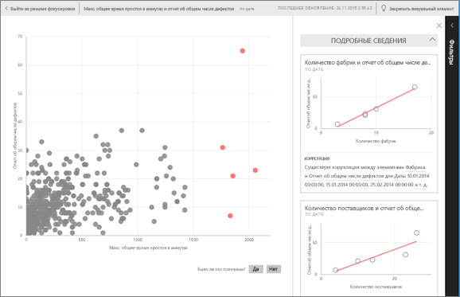

# Быстрый анализ данных в Power BI
Вы получили новый набор данных и не знаете, с чего начать?  Вам нужно быстро создать панель мониторинга?  Хотите быстро найти полезные данные, которые вы могли пропустить?

Быстрый анализ данных позволяет получить интересные интерактивные визуализации на основе имеющихся данных. Краткую аналитику можно выполнить для всего набора данных (краткая аналитика) или для отдельной плитки информационной панели (аналитика с заданной областью). Вы даже можете выполнить быструю аналитику результата анализа!

> **Примечание.** Краткая аналитика не работает с DirectQuery — только с данными, отправленными в Power BI.
> 
> 

Функция краткой аналитики основана на постоянно пополняемом [наборе усовершенствованных аналитических алгоритмов](service-insight-types.md), разработанных при сотрудничестве с Microsoft Research, которые мы продолжим использовать, чтобы все больше людей могло получать ценные сведения о данных в новой и понятной форме.

## Выполнение быстрого анализа в наборе данных
Узнайте, как Аманда выполняет краткую аналитику для набора данных, открывает анализ в режиме фокусировки, закрепляет один из результатов в качестве плитки на своей панели мониторинга, а затем получает результат краткой аналитики для использования в визуальном элементе.

<iframe width="560" height="315" src="https://www.youtube.com/embed/et_MLSL2sA8" frameborder="0" allowfullscreen></iframe>

Теперь ваша очередь. Изучите краткую аналитику, используя пример [Анализ качества поставщика](sample-supplier-quality.md).

1. На вкладке **Наборы данных** щелкните многоточие (...) и выберите **Получить аналитику**.
   
    
   
    
2. Для поиска тенденций в наборе данных Power BI использует [различные алгоритмы](service-insight-types.md).
   
    
3. Анализ занимает несколько секунд.  Выберите **Показать результаты анализа** , чтобы вывести на экран визуализации.
   
    
   
   > **Примечание.** Для некоторых данных краткую аналитику нельзя выполнить, так как информация не является статистически значимой.  Дополнительные сведения см. в разделе [Оптимизация данных для быстрого анализа](service-insights-optimize.md).
   > 
   > 
4. Визуализация отображается на специальном холсте **краткой аналитики**, который может вмещать до 32 отдельных карт анализа. Каждая карта имеет диаграмму или график, а также краткое описание.
   
    

## Работа с картами быстрого анализа
  

1. Наведите указатель мыши на карту и выберите значок булавки, чтобы добавить визуализацию на панель мониторинга.
2. Наведите указатель мыши и выберите значок режима фокусировки, чтобы карта отображалась в полноэкранном режиме.
   
    
3. В режиме фокусировки можно выполнять следующие задачи.
   
   * [Фильтровать](service-interact-with-a-report-in-reading-view.md) визуализации.  Чтобы отобразить фильтры, в правом верхнем углу экрана выберите стрелку для развертывания панели "Фильтры".
     
        
   * Закрепите карту анализа на информационной панели, выбрав значок закрепления  или **Закрепить визуальный элемент**.
   * Запустить быстрый анализ для самой карты. Это называется **краткой аналитикой с заданной областью**. В правом верхнем углу щелкните значок лампочки  или **Получить аналитику**.
     
       
     
     Результат краткой аналитики отображается слева, а справа отображаются новые карты, основанные только на данных этого анализа.
     
       
4. Чтобы вернуться к первоначальному холсту быстрого анализа, щелкните в верхнем левом углу **Выйти из режима фокусировки**.

## Запуск краткой аналитики для плитки панели мониторинга
Вместо поиск аналитических данных по всему набору данных сузьте область поиска до данных, используемых для создания отдельной плитки панели мониторинга. Это называется **краткой аналитикой с заданной областью**.

1. Откройте панель мониторинга.
2. Выберите плитку и [откройте ее в режиме фокусировки](service-focus-mode.md).
3. В правом верхнем углу выберите **Получить аналитику**.
   
    
4. Power BI отображает карты анализа с правой стороны плитки.
   
    
5. Вас заинтересовали эти сведения? Выберите карту анализа, чтобы ознакомиться с ними детально. Выбранный результат краткой аналитики отображается слева, а справа отображаются новые карты анализа, основанные только на данных этого анализа.
6. Продолжайте детализировать данные. Найдя интересные результаты краткой аналитики, вы можете закрепить соответствующий визуальный элемент на панели мониторинга, выбрав **Закрепить визуальный элемент** в правом верхнем углу. Кроме того, можно отправить отзыв владельцу набора данных о том, оказались ли определенный результат краткой аналитики информативным и полезным.
   
    

## Дальнейшие действия
Если у вас есть набор данных, [оптимизируйте его для краткой аналитики](service-insights-optimize.md).

См. дополнительные сведения о доступных [типах краткой аналитики](service-insight-types.md).

Появились дополнительные вопросы? [Ответы на них см. в сообществе Power BI.](http://community.powerbi.com/)

